# Intoduction to Web-App Back-End Development

This is my guide for web-app backend development, based on the [Meta Back-End Developer Professional Certificate](https://www.coursera.org/programs/deutsche-telekom-learning-program-ddjuh/professional-certificates/meta-back-end-developer) specialization on Coursera. From that specializatuon, I have selected these topics/courses:

1. [Introduction to Back-End Development](https://www.coursera.org/programs/deutsche-telekom-learning-program-ddjuh/learn/introduction-to-back-end-development)
2. [Introduction to Databases & Back-End Development](https://www.coursera.org/programs/deutsche-telekom-learning-program-ddjuh/learn/intro-to-databases-back-end-development)
3. [Django Web Framework](https://www.coursera.org/programs/deutsche-telekom-learning-program-ddjuh/learn/django-web-framework?authProvider)
4. [APIs](https://www.coursera.org/programs/deutsche-telekom-learning-program-ddjuh/learn/apis)
5. [The Full Stack](https://www.coursera.org/programs/deutsche-telekom-learning-program-ddjuh/learn/the-full-stack?authProvider=deutschetelekom)
6. [Back-End Developer Capstone Project](https://www.coursera.org/programs/deutsche-telekom-learning-program-ddjuh/learn/back-end-developer-capstone)

This module deals with the first topic/course: **Introduction to Back-End Development**.

Table of Contents:

- [Intoduction to Web-App Back-End Development](#intoduction-to-web-app-back-end-development)
  - [Intoduction](#intoduction)
    - [How the web works](#how-the-web-works)
    - [Core Internet Technologies](#core-internet-technologies)
      - [Internet Protocols](#internet-protocols)
      - [Introduction to HTTP](#introduction-to-http)
      - [HTTP Examples: Request and Response](#http-examples-request-and-response)
      - [Intro to HTML, CSS, and JavaScript](#intro-to-html-css-and-javascript)
      - [Other Internet Protocols](#other-internet-protocols)
      - [Webpages, Websites and Web Apps](#webpages-websites-and-web-apps)
      - [Browser Developer Tools](#browser-developer-tools)
      - [Exercise: Web is Inspected](#exercise-web-is-inspected)
      - [Libraries and Frameworks](#libraries-and-frameworks)
      - [APIs and Services](#apis-and-services)
      - [Additional Resources](#additional-resources)
  - [Introduction to HTML and CSS](#introduction-to-html-and-css)
    - [Getting started with HTML](#getting-started-with-html)
      - [What is HTML?](#what-is-html)
      - [Exercise: Create a simple HTML page](#exercise-create-a-simple-html-page)
      - [Basic HTML Tags](#basic-html-tags)
      - [Forms](#forms)
      - [The DOM: Document Object Model](#the-dom-document-object-model)
      - [Web Accessibility](#web-accessibility)
      - [Additional Resources](#additional-resources-1)
    - [CSS Basics](#css-basics)
      - [Selecting and Styling](#selecting-and-styling)
      - [Basic Types of Selectors](#basic-types-of-selectors)
      - [Text and Color in CSS](#text-and-color-in-css)
        - [Colors in CSS](#colors-in-css)
        - [Text Formatting in CSS](#text-formatting-in-css)
      - [Box Model](#box-model)
      - [Document Flow: Block and Inline HTML Elements](#document-flow-block-and-inline-html-elements)
      - [Alignment Basics](#alignment-basics)
      - [Additional Resources](#additional-resources-2)
      - [Assignment: Styling a Page](#assignment-styling-a-page)
    - [Assignment: Creating a web page](#assignment-creating-a-web-page)
  - [UI Frameworks](#ui-frameworks)
    - [Intro to UI frameworks and libraries](#intro-to-ui-frameworks-and-libraries)
      - [Working with Libraries](#working-with-libraries)
    - [Summary](#summary)
      - [Responsive Design](#responsive-design)
      - [What Is Bootstrap?](#what-is-bootstrap)
      - [Getting Started with Bootstrap](#getting-started-with-bootstrap)
      - [Using Bootstrap Styles](#using-bootstrap-styles)
        - [Infixes (Responsive Design)](#infixes-responsive-design)
        - [Modifiers (Styling Variations)](#modifiers-styling-variations)
        - [Example](#example)
      - [Bootstrap Grid System](#bootstrap-grid-system)
      - [Exercise: Working with Bootstrap Grid](#exercise-working-with-bootstrap-grid)
      - [Bootstrap Components](#bootstrap-components)
      - [Exercise: Working with Bootstrap Components](#exercise-working-with-bootstrap-components)
      - [Bootstrap Documentation](#bootstrap-documentation)
        - [Common Bootstrap Form Elements](#common-bootstrap-form-elements)
        - [Example: Basic Form Styling](#example-basic-form-styling)
        - [Example: Switch](#example-switch)
        - [Example: Input Group](#example-input-group)
        - [Example: Floating Label](#example-floating-label)
        - [Example: Responsive Image](#example-responsive-image)
        - [Example: Grid Layout](#example-grid-layout)
      - [Other CSS Frameworks and Libraries](#other-css-frameworks-and-libraries)
      - [Additional Resources](#additional-resources-3)
    - [Introduction to React](#introduction-to-react)
    - [Static and Dynamic Content](#static-and-dynamic-content)
      - [Web Server vs Application Server](#web-server-vs-application-server)
      - [Caching (Performance Optimization)](#caching-performance-optimization)
    - [Single Page Applications (SPAs)](#single-page-applications-spas)
    - [What is React?](#what-is-react)
    - [How React Works](#how-react-works)
    - [The Virtual DOM](#the-virtual-dom)
    - [Component Hierarchy](#component-hierarchy)
    - [React and Complimentary Libraries](#react-and-complimentary-libraries)
    - [Additional Resources](#additional-resources-4)
  - [End-of-Course Graded Assessment](#end-of-course-graded-assessment)
    - [Bio Page](#bio-page)

## Intoduction

### How the web works

Internet:

- Devices connect and communicate through wired or wireless connections, forming a network.
- As more devices join, direct connections become complex; this is solved using network switches.
- Network switches connect multiple devices and can also connect to other switches.
- Many interconnected networks together form the Internet.
- Online services (websites, streaming, etc.) are hosted on servers, while user devices act as clients (client-server model).

Web servers:

- Server = computer providing services to clients (e.g., websites, messaging).
- Usually hosted in data centers with power, cooling, and connectivity redundancy.
- Data centers are geographically distributed --> faster access via proximity.
- Hardware vs software:
  - Hardware = physical resources (CPU, RAM, storage)
  - Software = code/services running on the machine
- Servers are specialized by purpose (storage-heavy vs compute-heavy).
- A web server is software that:
  - Stores and serves website content
  - Handles HTTP request–response cycle
- Core role: respond to client requests at scale (thousands/sec).

Websites and webpages:

- Webpage vs website:
  - Webpage = single document
  - Website = collection of linked webpages
- Webpages are just text documents sent from server --> browser
- Core stack (always the same):
  - HTML --> structure/content
  - CSS --> styling/layout
  - JavaScript --> behavior/interactivity
- Browser pipeline:
  - Receives HTML/CSS/JS
  - Parses sequentially
  - Builds visual output --> rendering
- JS is the dynamic layer: validation, updates, real-time UI
- Links form the web graph: pages can link across sites
- Scale insight: massive, continuously growing system, but built on same 3 primitives
- Key mental model: --> webpage = code --> browser interprets --> UI rendered

Web browsers:

- Browser = client app that requests and displays web content
- Core flow (always the same):
  1. User enters URL
  2. Browser sends request (HTTP)
  3. Server processes it (may query DB)
  4. Server returns response
  5. Browser renders page
- URL structure: protocol (HTTP), domain, path
- Request–response cycle = fundamental abstraction of the web
- Dynamic requests: user actions (e.g., search) --> new requests with parameters
- Server side: logic + database lookup --> builds response
- Browser side: renders returned code into UI
- Same pattern applies to search, chat, streaming, etc.

Web hosting:

- Web hosting = service where you place your website/files on a hosting company's web server (renting space for stable, secure storage).
- No need to own a datacenter; individuals and developers can rent space.
- Hosting types:
  - Shared hosting:
    - Cheapest option; multiple accounts share the same server, CPU, memory, and bandwidth.
    - Performance can be affected by other sites on the same server.
    - Best for small sites with low traffic; also used as a low-cost sandbox for practice.
    - Some providers offer free shared hosting with limitations and ads.
  - Virtual Private Server (VPS):
    - Virtual server with dedicated CPU, memory, and bandwidth resources.
    - Runs on shared hardware but resources are fixed per instance --> other VPS instances don't impact your performance.
    - More expensive than shared hosting.
  - Dedicated hosting:
    - Entire physical server reserved for you only.
    - Full control over all hardware resources (CPU, memory, bandwidth).
    - Generally more expensive than VPS.
  - Cloud hosting:
    - Website runs across multiple physical and virtual servers (Cloud environment).
    - If one server fails, another takes over --> high availability.
    - No hardware resource limits; scales on demand.
    - Pay-per-use model (e.g., bandwidth charged per MB transferred).
    - Cost scales with popularity/traffic --> used by most major web applications.

Additional resources:

- [What is a Web Server? (NGINX)](https://www.nginx.com/resources/glossary/web-server/)
- [What is a Web Browser? (Mozilla)](https://www.mozilla.org/en-US/firefox/browsers/what-is-a-browser/)
- [Who invented the Internet? And why? (Kurzgesagt)](https://youtu.be/21eFwbb48sE)
- [What is Cloud Computing? (Amazon)](https://youtu.be/mxT233EdY5c)
- [Browser Engines (Wikipedia)](https://en.wikipedia.org/wiki/Browser_engine)

### Core Internet Technologies

#### Internet Protocols

* IP addresses = unique identifiers for devices (like postal addresses)
* Internet Protocol (IPv4, IPv6) defines addressing and routing
  * IP4: `192.168.0.1` (32-bit, 4 octets of integers)
  * IP6: `2000:0db8:85a3:0000:0000:8a2e:0370:7334` (128-bit, 8 groups of hexadecimal digits)
* Data is sent as packets (datagrams) over the IP network/protocol; a packet is a unit of data transmission and contains:
  * header --> source + destination IP + metadata
  * payload --> actual data
  * each packet has sender (source) + receiver (destination) IP addresses
* Networks = routes; computers = endpoints
* Packets can fail because of
  * being out of order
  * being lost/dropped
  * being corrupted
* Transport protocols handle reliability, present in the payload of IP packets:
  * TCP --> it solves the failure issues: it guarantees ordered, reliable delivery -- but slower
  * UDP --> it solves the corrupt packet issue, but allows loss/out-of-order -- it's faster, used for real-time applications (e.g., video streaming, gaming)
* Stack model: IP packet --> contains TCP/UDP --> contains higher-level data
* Key idea: Internet aprox postal system for data delivery

#### Introduction to HTTP

* HTTP = core web protocol for client–server communication (transfer of HTML, images, etc.)
* Model: request–response cycle (browser sends request, server returns response)
* HTTP request structure:
  * method --> action
    * GET to retrieve data/resource from the server
    * POST to send
    * PUT to update/replace a resource on the server
    * DELETE to remove
    * PATCH to partially update
  * path --> location of resource on server
  * version --> protocol version (commonly 1.1, 2.0)
  * headers --> metadata about client/request
  * optional body --> data sent to server
* HTTP response structure:
  * status code --> result of request
  * headers --> metadata
  * optional body --> actual content (HTML, JSON, images, etc.)
* Status codes grouped by category:
  * 100–199 --> informational
    * 100 == continue
    * 101 == switching protocols: the client has requested the server to switch protocols and the server has agreed to do so.
  * 200–299 --> success (e.g., 200 OK)
    * 200 == OK (success): found for GET, transmitted for POST/PUT, deleted for DELETE
    * 201 == created (resource created successfully)
    * 202 == accepted (request accepted but not yet processed)
    * 204 == no content (success but no body to return)
  * 300–399 --> redirection (e.g., 301, 302)
    * 301 == moved permanently
    * 302 == found (temporary redirect); we automatically follow the new location or request the resource again if the redirect address is missing
  * 400–499 --> client errors (e.g., 400, 401, 403, 404)
    * 400 == bad request (malformed syntax)
    * 401 == unauthorized (authentication required)
    * 403 == forbidden (authenticated but no permission)
    * 404 == not found (resource doesn't exist)
    * 405 == method not allowed (e.g., POST on a GET-only resource)
  * 500–599 --> server errors (e.g., 500)
    * 500 == internal server error (unexpected condition)
    * 502 == bad gateway (invalid response from upstream server)
    * 503 == service unavailable (server overloaded or down)
* Meaning depends on method (e.g., 200 OK = resource returned for GET, success for POST/PUT/DELETE)
* HTTPS = secure version of HTTP
  * same protocol semantics
  * adds encryption --> data unreadable in transit
  * visible as lock icon in browser
* Key idea: HTTP defines how data is exchanged; HTTPS adds security without changing the model


#### HTTP Examples: Request and Response

Every HTTP request starts with a **request line**

    GET /home.html HTTP/1.1

Here:

- `GET` is the method
- `/home.html` is the path to the resource on the server
- `HTTP/1.1` is the version

After the request line, we have the **request header**:

```
Host: example.com
User-Agent: Mozilla/5.0 (Macintosh; Intel Mac OS X 10.9; rv:50.0) Gecko/20100101 Firefox/50.0
Accept: */*
Accept-Language: en
Content-type: text/json
```

And finally, the **optional request body** (only for POST/PUT/PATCH):

```json
{
  "username": "john_doe",
  "password": "s3cr3t"
}
```

After the server processes the request, it sends back an **HTTP response**. The response starts with a **status line**:

    HTTP/1.1 200 OK

The code `200` indicates success, and `OK` is the reason phrase. Then we have the **response headers**:

```
Date: Fri, 11 Feb 2022 15:00:00 GMT+2
Server: Apache/2.2.14 (Linux)
Content-Length: 84
Content-Type: text/html
```

And finally, the **optional response body** (the actual content):

```html
<html>
  <head><title>Test</title></head>
  <body>Test HTML page.</body>
</html>
```

#### Intro to HTML, CSS, and JavaScript

* Web pages built on 3 core technologies: HTML, CSS, JavaScript
* Separation of concerns:
  * HTML --> structure/content
  * CSS --> styling/layout
  * JavaScript --> logic/interactivity
* Files are linked: HTML references CSS and JS; browser loads and processes all
* Example 1 (digital clock):
  * HTML --> defines time elements (static content)
  * CSS --> styles layout, fonts, colors
  * JavaScript --> updates time every second (dynamic behavior)
* Example 2 (video player):
  * HTML --> video + button elements
  * CSS --> visual styling
  * JavaScript --> interaction logic (play/pause toggle)
* JavaScript capabilities:
  * DOM updates (dynamic content)
  * event handling (e.g., button clicks)
  * state-based logic (play vs pause)
* Browser pipeline:
  * load HTML --> fetch CSS/JS --> apply styles --> execute JS
* Key idea: combining structure + style + behavior --> fully functional web apps


#### Other Internet Protocols

* HTTP runs on top of TCP --> used to transfer web content
* Dynamic Host Configuration Protocol: DHCP --> assigns IP address to devices when they join a network
  * uses UDP
  * DHCP server manages IP allocation
* Domain Name System: DNS --> resolves domain names to IP addresses
  * enables human-readable URLs (e.g., meta.com --> IP)
* Email protocols:
  * Internet Message Access Protocol: IMAP --> sync/download emails, keeps them on server
  * Simple Mail Transfer Protocol: SMTP --> sends emails via mail server
  * Post Office Protocol: POP --> downloads emails and deletes them from server (older, simpler)
* File transfer:
  * File Transfer Protocol: FTP --> transfer/manage files on server (insecure)
  * Secure File Transfer Protocol: SFTP --> secure file transfer over SSH (encrypted)
* Remote access:
  * Secure Shell: SSH --> secure remote login and command execution (encrypted)
* Key idea: Internet = stack of specialized protocols
  * addressing (DHCP, DNS)
  * communication (HTTP, TCP/UDP)
  * application services (email, file transfer, remote access)

#### Webpages, Websites and Web Apps

* Web page --> single document (HTML, CSS, JS) displayed in browser
* Website --> collection of linked web pages under one domain
* Hyperlinks --> connect pages (within same site or across different sites)
* Web application --> interactive, dynamic system built on web technologies
* Key distinction:
  * website --> mostly static, informational content (same for all users)
  * web application --> dynamic, user-specific content based on input
* Example:
  * company site --> informational website
  * food ordering system --> web application (user interaction, personalization)
* Reality: boundaries blur; many modern sites mix both
* Key idea: difference driven by level of interactivity and dynamic behavior

#### Browser Developer Tools

* Browser dev tools = built-in debugging/inspection toolkit
* Access: F12 / right-click --> inspect
* Core capabilities:
  * inspect HTML, CSS, JavaScript
  * trace HTTP requests/responses
  * analyze performance and memory
  * check security aspects
* Key tabs:
  * Elements --> inspect/edit DOM and CSS
  * Console --> logs, errors, JS execution
  * Sources --> loaded files (HTML, CSS, JS, assets)
  * Network --> request/response timeline and details
  * Performance --> runtime profiling (slow functions)
  * Memory --> resource usage
* Elements tab:
  * hover highlights elements in UI
  * shows applied CSS and properties
  * allows live editing of HTML/CSS
* Edits are local only --> do not affect server
* Key idea: dev tools = “open the hood” for frontend debugging

#### Exercise: Web is Inspected

Website: [`lab/01_examine_the_page/index.html`](./lab/01_examine_the_page/index.html).

Task:

- Log for logo id
- Edit title locally

Note:

- Chrome and Firefox have developer tools enabled by default.
- Safari: Settings / Preferences > Advanced > Show Develop menu in menu bar (then right-click --> inspect)

#### Libraries and Frameworks

* Frameworks and libraries = reusable tools to speed up development
* Libraries:
  * reusable code for specific tasks
  * developer calls them when needed
  * example --> email validation
* Frameworks:
  * provide structure and flow for applications
  * handle common concerns (e.g., HTTP requests/responses)
  * developer plugs code into framework
* Key difference:
  * library --> you control flow
  * framework --> framework controls flow
* Opinionatedness:
  * frameworks --> more opinionated (less freedom, more structure)
  * libraries --> less opinionated (more flexibility)
* Relationship:
  * frameworks often use multiple libraries internally
  * apps can also use additional libraries
* Trade-offs:
  * frameworks --> faster dev, built-in best practices, but less flexible
  * libraries only --> more control, but more setup and integration work
* Maintainability:
  * replacing a library is easier than replacing a framework
* Key idea: reuse existing solutions --> faster development, fewer errors, focus on core features

#### APIs and Services

* API (Application Programming Interface) = interface to access data or functionality of another system
* Role: bridge between components (client <-> server, app <-> service)
* APIs are also known as gateways or middleware because they act as a bridge between systems.
* Common types:
  * Browser APIs --> built into browser (DOM, Fetch, Geolocation, Storage)
    * DOM API turns HTML into a tree of nodes that JS can manipulate
  * REST APIs --> web servers providing data to apps; MOST COMMON!
  * Sensor-based APIs --> interact with physical devices (IoT)
* REST APIs:
  * based on principles for scalable systems
  * central role --> send/receive data from backend/database
  * accessed via endpoints (URLs)
* Core operations (CRUD):
  * GET --> retrieve data
  * POST --> create data
  * PUT --> update data
  * DELETE --> remove data
* Request flow:
  * client calls endpoint (URL ending `/my-endpoint`) --> server processes --> returns response (e.g., JSON data)
* Responses:
  * data (commonly JSON)
  * or full web content
* Browser APIs extend capabilities without external services
* Key idea: APIs enable communication and reuse of functionality across systems, forming the backbone of modern web apps

#### Additional Resources

* [HTTP Overview (Mozilla)](https://developer.mozilla.org/en-US/docs/Web/HTTP/Overview)
* [Introduction to Networking by Dr. Charles R Severance](https://www.amazon.com/Introduction-Networking-How-Internet-Works/dp/1511654945/)
* [Chrome Developer Tools Overview (Google)](https://developer.chrome.com/docs/devtools/overview/)
* [Firefox Developer Tools User Docs (Mozilla)](https://firefox-source-docs.mozilla.org/devtools-user/index.html)
* [Getting Started with Visual Studio Code (Microsoft)](https://code.visualstudio.com/docs)

## Introduction to HTML and CSS

### Getting started with HTML

#### What is HTML?

* HTML = core structure of a web page (like a building frame)
* Created by Tim Berners-Lee at CERN
  * first version released in 1991
* HTML = Hypertext Markup Language
  * hypertext --> links between documents
  * markup --> tags/elements defining structure
* HTML document:
  * plain text file (.html)
  * built from elements and tags
* Tags vs elements:
  * tag --> syntax (<p>, </p>)
  * element --> tag + content
* Most elements:
  * opening tag + closing tag
  * contain content
* Elements can:
  * be nested inside others
  * be self-closing (e.g., line break <br>)
* HTML specification:
  * defines rules/structure
  * maintained by World Wide Web Consortium
  * current standard --> HTML5
* Browser role:
  * reads HTML --> builds basic page structure
  * styling requires CSS
* Key idea: HTML defines structure and content; browser interprets it into a visible page

Basic HTML structure:

```html
<!DOCTYPE html>
<html>
    <head>
        <title>Little Lemon Restaurant</title>
    </head>
    <body>
        <h1>Our Menu</h1>
        <h2>Falafel</h2>
        <p>Delicious falafel made with fresh ingredients.</p>
        <h2>Pasta salad</h2>
        <p>Refreshing pasta salad with a tangy dressing.</p>
    </body>
</html>
```

#### Exercise: Create a simple HTML page

Website: [`lab/02_create_html_document/index.html`](./lab/02_create_html_document/index.html).

Task:

- Create an HTML document and visualize it in the browser.

Note:

- Install VSCode extension *Live Preview* if working locally

`index.html`:

```html
<!DOCTYPE html>
<html>
<head>
  <title>My First HTML Document</title>
</head>
<body>
  I successfully created my first document
</body>
</html>
```

#### Basic HTML Tags

```html
<!-- This is a comment in HTML -->

<!-- Headings -->
<body>
  <h1>Heading 1</h1>
  <h2>Heading 2</h2>
  <h3>Heading 3</h3>
  <h4>Heading 4</h4>
  <h5>Heading 5</h5>
  <h6>Heading 6</h6>
</body>


<!-- Paragraphs: contain text -->
<p>
   This paragraph
   contains a lot of lines
   but they are ignored.
</p>


<!-- Line break: forces a new line, no closing tag needed -->
<p>
   This paragraph<br>
   contains a lot of lines<br>
   and they are displayed.
</p>

<!-- Strong, bold, italic/emphasis -->
<p>
  No matter how much the dog barks: <strong>don't feed him chocolate</strong>.
  The primary colors are <b>red</b>, <b>yellow</b> and <b>blue</b>.
  Wake up <em>now</em>!
  The term <i>HTML</i> stands for HyperText Markup Language.
</p>

<!-- Lists: unordered and ordered -->
<ul>
  <li>Item 1</li>
  <li>Item 2</li>
  <li>Item 3</li>
</ul>
<ol>
   <li>Rocky</li>
   <li>Rocky II</li>
   <li>Rocky III</li>
</ol>

<!-- Divs: content division, no effect on the content unless it is styled by CSS -->
<div>
   <p>This is a paragraph inside a div</p>
</div>
<div>
   <div>
      <p>This is a paragraph inside a div that's inside another div</p>
   </div>
</div>

<!-- Example of divs styled by CSS -->
<style>
   div {
      border: 1px solid black;
      padding: 2px;
   }
</style>
<div>
   <div>
      <p>This is a paragraph inside stylized divs</p>
   </div>
</div>

<!-- Links or Anchor Tags: we can use URLs or filenames/filepaths -->
<a href="https://www.example.com">Visit Example</a>
<a href="location.html">Our Location</a>

<!-- Images: self-closing tag, src = source URL or filepath, alt = alternative text -->


<!-- Tables: structured data in rows and columns: tr = table row, th = table header, td = table data -->
<style>
    table, th, td {
        border: 1px solid black;
        border-collapse: collapse;
    }
</style>
<table>
<tr>
   <th>Name</th>
   <th>Age</th>
</tr>
<tr>
   <td>John</td>
   <td>25</td>
</tr>
<tr>
   <td>Jane</td>
   <td>30</td>
</tr>
</table>
```

#### Forms

* HTML forms collect user input and submit it to a server
* Main container --> form tag
* Key form attributes:
  * action --> URL/path where form data is sent
  * method --> HTTP method used to submit data
* Common methods:
  * GET --> retrieves information
  * POST --> sends data to server
* Basic text inputs use the input tag
* Labels improve usability by describing each field
* Example inputs in the HTML:
  * text --> user name
  * password --> hidden user input
  * submit --> sends form data
  * checkbox --> multiple selections allowed
  * radio --> only one option in a group
  * number --> numeric input
  * email --> email-specific input
  * file --> upload a file
* Some form controls use different tags:
  * textarea --> multi-line text
  * select + option --> drop-down list
* name and value attributes help define how data is sent to the server
* Key idea: good forms use appropriate input types for better usability and clearer data handling

```html
<form action="/submit-form" method="post">
  <fieldset>
    <legend>Login information</legend>

    <label for="username">User name</label>
    <input type="text" id="username" name="username" placeholder="Enter your user name" />

    <label for="password">Password</label>
    <input type="password" id="password" name="password" placeholder="Enter your password" />
  </fieldset>

  <fieldset>
    <legend>Preferences</legend>

    <p>Checkbox example:</p>
    <div class="inline-group">
      <label><input type="checkbox" name="interests" value="books" /> Books</label>
      <label><input type="checkbox" name="interests" value="music" /> Music</label>
      <label><input type="checkbox" name="interests" value="sports" /> Sports</label>
    </div>

    <p>Radio button example:</p>
    <div class="inline-group">
      <label><input type="radio" name="plan" value="basic" /> Basic</label>
      <label><input type="radio" name="plan" value="pro" /> Pro</label>
      <label><input type="radio" name="plan" value="premium" /> Premium</label>
    </div>
  </fieldset>

  <fieldset>
    <legend>Other input types</legend>

    <label for="age">Number</label>
    <input type="number" id="age" name="age" min="1" max="120" />

    <label for="email">Email</label>
    <input type="email" id="email" name="email" placeholder="name@example.com" />

    <label for="resume">File upload</label>
    <input type="file" id="resume" name="resume" />

    <label for="comments">Multi-line text</label>
    <textarea id="comments" name="comments" rows="5" placeholder="Write your message here"></textarea>

    <label for="country">Drop-down list</label>
    <select id="country" name="country">
      <option value="">Select a country</option>
      <option value="spain">Spain</option>
      <option value="germany">Germany</option>
      <option value="france">France</option>
    </select>
  </fieldset>

  <input type="submit" value="Submit form" />
</form>
```

#### The DOM: Document Object Model

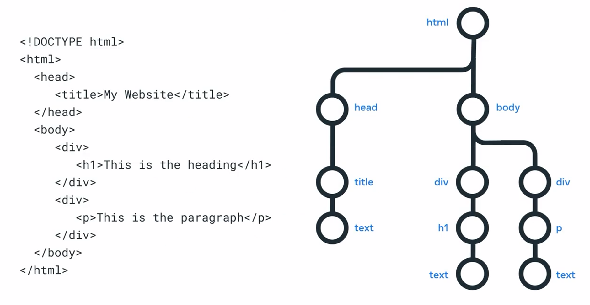

* DOM (Document Object Model) = representation of HTML as a tree of objects
* Browser builds the DOM from HTML automatically
* Structure:
  * root --> html
  * children --> head, body
  * nested elements --> tags become objects with content
* Purpose: enable JavaScript to read and modify the page
* Without DOM --> pages would be static (no interaction)
* JavaScript + DOM enables:
  * updating content (e.g., clock)
  * handling user events (click, hover, scroll)
  * enabling/disabling UI elements (e.g., login button)
* Dynamic manipulation:
  * add elements --> show new content (e.g., error messages)
  * remove elements --> update UI (e.g., delete todo item)
* Supports animations and interactive behavior
* Modern frameworks (e.g., React) rely on DOM
* Key idea: DOM = bridge between HTML and JavaScript for dynamic, interactive web pages

#### Web Accessibility

* Web accessibility = designing sites usable by everyone, including people with disabilities
* Promoted by Web Accessibility Initiative and World Wide Web Consortium
* Emphasized by Tim Berners-Lee as a core principle of the web
* Covers multiple disabilities:
  * visual, auditory
  * cognitive, neurological
  * physical, speech
* Legal/industry importance:
  * accessibility required in many sectors
  * e.g., EU Web Accessibility Directive
* Assistive technologies:
  * screen readers --> read page content
  * speech recognition --> voice input/control
  * subtitles/transcripts --> support audio/visual access
* Development best practices:
  * consider accessibility from the start
  * use proper HTML structure and semantic elements
  * avoid hacks (e.g., excessive line breaks for layout)
* Advanced support:
  * ARIA (Accessible Rich Internet Applications) --> improves accessibility for complex UIs
* Key idea: accessibility = inclusive design + correct structure + support for assistive technologies

#### Additional Resources

* [HTML Elements Reference (Mozilla)](https://developer.mozilla.org/en-US/docs/Web/HTML/Element)
* [The Form Element (Mozilla)](https://developer.mozilla.org/en-US/docs/Web/HTML/Element/form)
* [What is the Document Object Model? (W3C)](https://www.w3.org/TR/WD-DOM/introduction.html)
* [ARIA in HTML (W3C via Github)](https://w3c.github.io/html-aria/)
* [ARIA Authoring Practices (W3C)](https://www.w3.org/TR/wai-aria-practices-1.2/)

### CSS Basics

#### Selecting and Styling

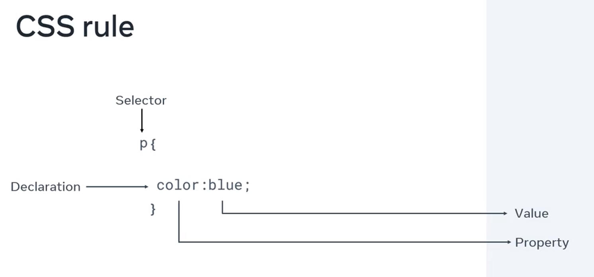

* CSS = defines how HTML is displayed (style, layout, colors)
* Analogy:
  * HTML --> structure (building frame)
  * CSS --> appearance (paint, decoration)
* CSS rule structure:
  * selector --> which elements to style
  * declaration block --> { ... }
  * declaration --> property + value
* Example:
  * selector: h1
  * property: color
  * value: purple
* Multiple properties can be applied in one block
* Linking CSS:
  * done via `<link rel="stylesheet" href="style.css">` in HTML
* Selectors:
  * element selector (e.g., h1) --> applies to all elements
  * id selector (e.g., #header1) --> applies to specific element
* Specificity:
  * more specific rules override general ones
  * id selector overrides element selector
* Key idea: CSS rules = selector + declaration block --> control visual output

`index.html`:

```html
<!DOCTYPE html>
<html>
<head>
  <link rel="stylesheet" href="style.css">
</head>
<body>
  <h1 id="header1">Chapter One</h1>
  <p>The first chapter</p>
  <h1>Chapter Two</h1>
  <p>The second chapter</p>
  <h1>Chapter Three</h1>
  <p>The third chapter</p>
</body>
</html>
```

`style.css`:

```css
/* Element selector: applies to ALL h1 */
h1 {
  color: purple;
}

/* ID selector: applies only to one element */
#header1 {
  color: green;
}
```

#### Basic Types of Selectors

- Element selectors: select HTML elements based on their element type (e.g., p, h1, div)
- ID selectors: select a single element based on its unique id attribute (e.g., #header1)
- Class selectors: select elements based on their class attribute, which can be shared by multiple elements (e.g., .navigation)
- Element with class selector: select elements that match both an element type and a class (e.g., p.introduction)
- Descendant selectors: select elements that are descendants of a specified element (e.g., #blog h1)
- Child selectors: select elements that are direct children of a specified element (e.g., #blog > h1)
- Pseudo-class selectors: select elements based on their state or user interaction (e.g., a:hover)
- Hover selector: select elements when the user hovers over them with a pointing device (e.g., mouse) (e.g., a:hover)

```html
<!-- Element Selectors: select HTML elements based on their element type -->
<!-- p is a paragraph element in HTML and the p selector in CSS targets all paragraph elements -->
<p>Once upon a time...</p>
<p>In a hidden land...</p>
```

```css
p { 
  color: blue; 
}
```

```html
<!-- ID Selectors: select a single element based on its unique id attribute -->
<!-- We define an id attribute in HTML and use the #id selector in CSS to target that specific element -->
<span id="latest">New!</span>

```

```css
#latest { 
  background-color: purple; 
}
```

```html
<!-- Class Selectors: select elements based on their class attribute, which can be shared by multiple elements -->
<!-- We define a class attribute in HTML and use the .class selector in CSS to target all elements with that class -->
<a class="navigation">Go Back</a>
<p class="navigation">Go Forward</p>
```

```css
.navigation { 
  margin: 2px;
}
```

```html
<!-- Element with class selector -->
<p class="introduction"></p>
```

```css
p.introduction { 
  margin: 2px;
}
```

```html
<!-- Descendant selectors: select elements that are descendants of a specified element -->
<!-- Example: we want to format all h1 elements in the #blog div -->
<div id="blog">
  <h1>Latest News</h1>
  <div>
    <h1>Today's Weather</h1>
    <p>The weather will be sunny</p>
  </div>
  <p>Subscribe for more news</p>
</div>
<div>
  <h1>Archives</h1>
</div>
```

```css
#blog h1 {
  color: blue;
}
```

```html
<!-- Child selectors: select elements that are direct children of a specified element -->
<!-- Child selectors only select elements that are immediate descendants (children) of a selector (the parent) -->
<!-- Example: the CSS rule will be applied to "Latest News" but not to "Today's Weather" -->
<div id="blog">
  <h1>Latest News</h1>
  <div>
    <h1>Today's Weather</h1>
    <p>The weather will be sunny</p>
  </div>
  <p>Subscribe for more news</p>
</div>
```

```css
#blog > h1 {
  color: blue;
}
```


```html
<!-- :hover Pseudo-Class -->
<!-- The :hover pseudo-class applies a style to an element when the user hovers over it with a pointing device (e.g., mouse) -->
<!-- Example: we want to change the color of links when the user hovers over them -->
<a href="https://www.example.com">Visit Example</a>
```

```css
a:hover {
  color: orange;
}
```

#### Text and Color in CSS

##### Colors in CSS

From CSS Version 3, there are five main ways to reference a color.

- By RGB value,
- By RGBA value,
- By HSL value (Hue-Saturation-Lightness),
- By hex value and
- By predefined color names.

```css
/* RGB */
p { 
  color: rgb(255, 0, 0); 
}

/* RGBA: Alpha channel added for transparency */
p { 
  color: rgba(255, 0, 0, 0.8); 
}

/* HSL: Hue-Saturation-Lightness */
p { 
  color: hsl(0, 100%, 50%);
}

/* Hexadecimal: Hex value, preceeded by # and followed by six hexadecimal digits (0-9, A-F) */
p { 
  color: #ff0000;
}

/* Predefined color names */
p { 
  color: red;
}
/*
Common color names:
  black
  silver
  gray
  white
  maroon
  red
  purple
  fuchsia
  green
  lime
  olive
  yellow
  navy
  blue
  teal
  aqua
*/
```

##### Text Formatting in CSS

```css
/* Text color */
p { 
  color: red;
}

/* Text font and size */
p { 
  font-family: "Courier New", monospace;
}
/* It is recommended to include several fonts when using the font-family property, as fallback options */
p { 
  font-family: "Courier New", monospace;
  font-size: 12px;
}

/* Text transformation: uppercase, lowercase, capitalize, none */
p { 
  text-transform: uppercase;
}

/* Text decoration: none, underline, overline, line-through */
p { 
  text-decoration: none;
}
/* Text decoration with color, style, and thickness */
p { 
  text-decoration: underline red solid 5px;
}
/* Text decoration with individual properties */
p { 
  text-decoration-line: underline;
  text-decoration-color: red;
  text-decoration-style: solid;  /* solid (default), double, dotted, dashed, wavy */
  text-decoration-thickness: 5px;
}
```

#### Box Model

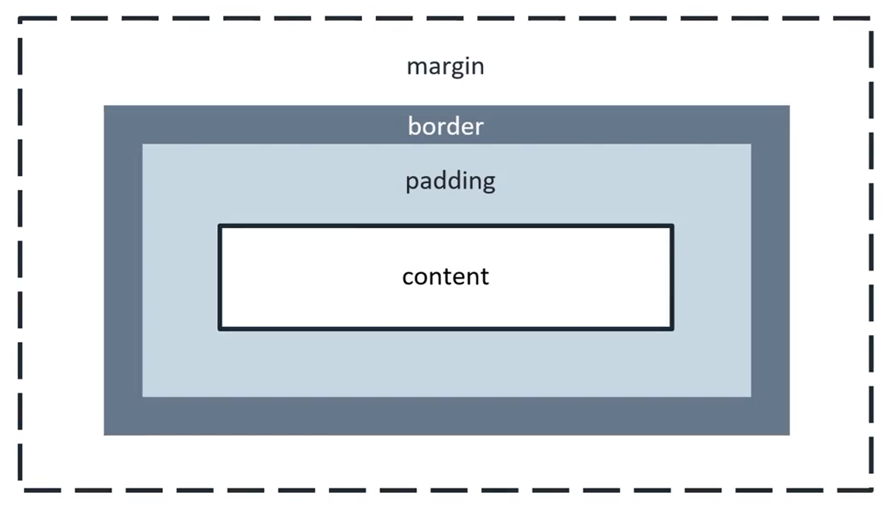

* Every HTML element is rendered as a rectangular box (CSS box model).
* The box model has four layers: content, padding, border, and margin.
* Content is the actual text or image and defines the base size.
* Padding adds space inside the element, around the content.
* Border wraps the padding and content and defines the visible outline.
* Margin adds space outside the element, separating it from others.
* Total element size is calculated by combining these layers.
* Developers control layout using width, height, padding, border, and margin.
* Shorthand properties can simplify CSS definitions.

Parts in the box model:

| Layer   | Description                  |
| ------- | ---------------------------- |
| Content | Inner content (text, image)  |
| Padding | Space inside, around content |
| Border  | Outline around padding       |
| Margin  | Outer space between elements |

Formulas for width (height is analogous):

* Padding box width = content width + padding left + padding right
* Border box width = padding box width + border left + border right
* Margin box width = border box width + margin left + margin right


```css
/* Content (size control) */
.box {
  width: 200px;
  height: 100px;
  min-width: 150px;
  max-width: 300px;
}

/* Padding */
.box {
  padding-top: 10px;
  padding-right: 15px;
  padding-bottom: 10px;
  padding-left: 15px;
}

/* Border */
.box {
  border-width: medium;
  border-style: solid;
}

/* Margin */
.box {
  margin-top: 20px;
  margin-right: 10px;
  margin-bottom: 20px;
  margin-left: 10px;
}

```

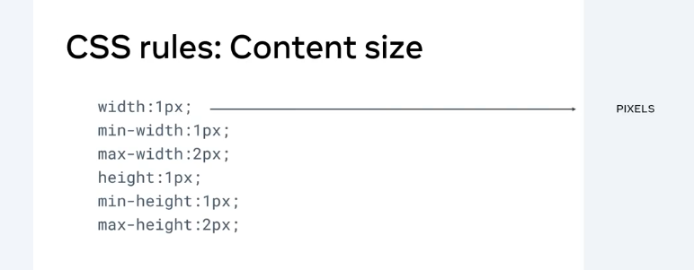

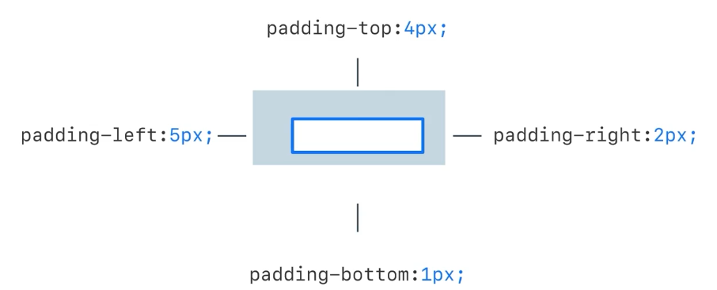

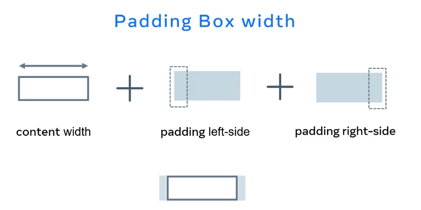

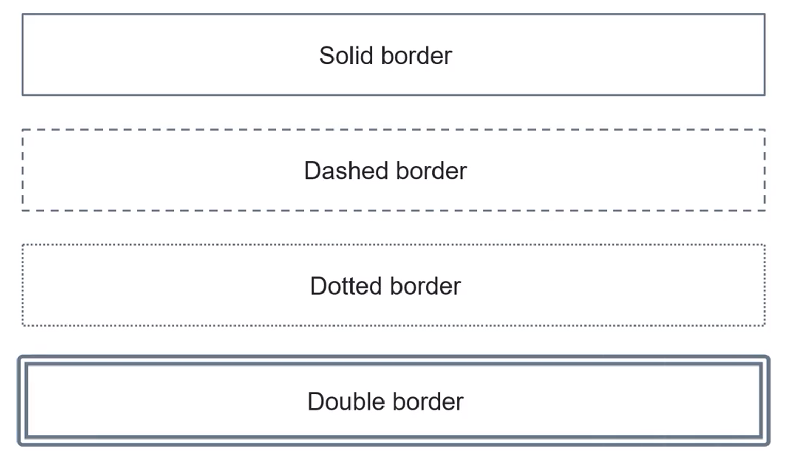

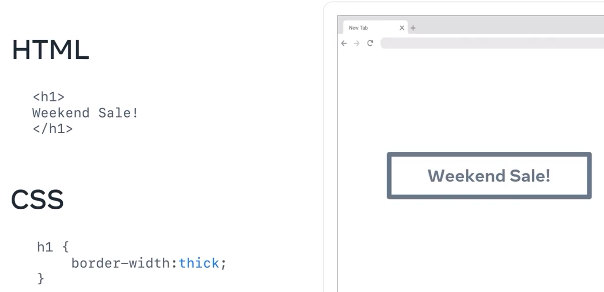

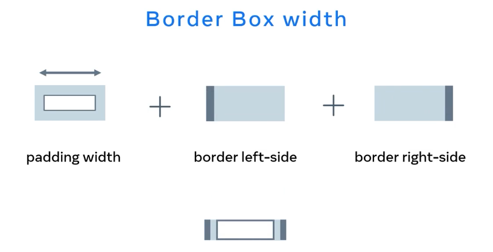

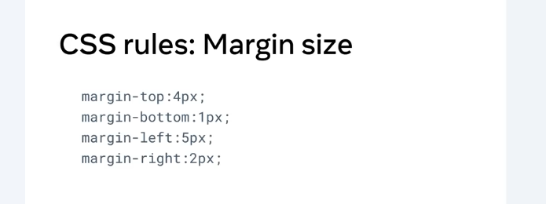

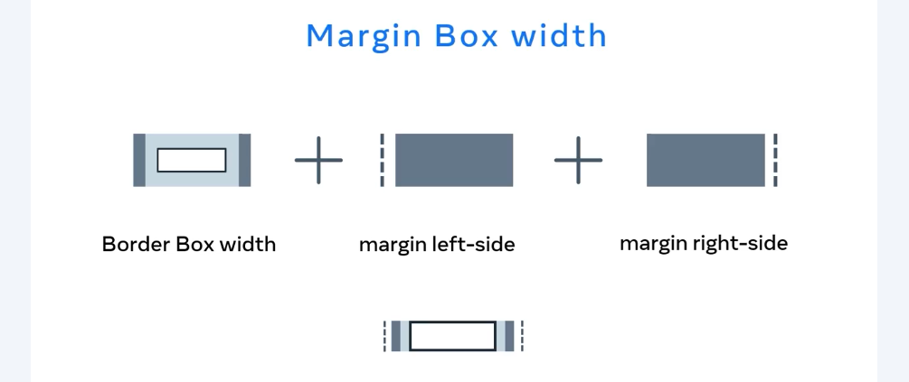

#### Document Flow: Block and Inline HTML Elements

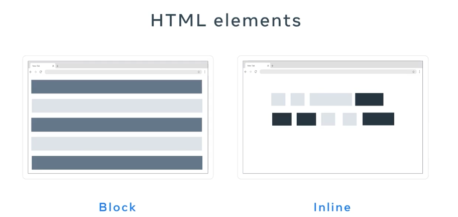

* Browsers position HTML elements using the document flow.
* Elements are categorized as block or inline by default.
* Block elements take full width and start on a new line.
* Multiple block elements stack vertically.
* Inline elements only take the space of their content.
* Inline elements stay on the same line and form horizontal flows.
* **Examples of block elements (by default): div, form, headings.**
* **Examples of inline elements (by default): span, a, img, input, label.**
* The display property in CSS can change an element's behavior (block ↔ inline).

Example:

```html
<div>
  <span>First sentence.</span>
  <span id="middle">Second sentence.</span>
  <span>Third sentence.</span>
</div>
```

Default Behavior: All span elements are inline -> appear in one line.

But, we can change the behavior of the middle span element using CSS.

```css
#middle {
  display: block;
}
```

Result:

* The middle element moves to a new line.
* It takes full width like a block element.

Similarly, we can change the behavior of the middle span element back to inline.

```css
#middle {
  display: inline;
}
```

#### Alignment Basics

Text aligment is easy:

```css
/* Text Alignment */
p {
    text-align: center;  /* left (default), right, center, justify */
}
```

To align HTML elements, we must consider the box model and document flow (block vs inline).

```html
<div class="parent">
  <div class="child">
  </div>
</div>
```

```css
.parent {
  border: 4px solid red;
}

.child {
  width: 50%;  /* 50% of the parent element's width */
  padding: 20px;  /* all sides to 20px each */
  border: 4px solid green;
  margin: auto;  /* margin: auto centers the element horizontally within its parent */
}
```

Result:

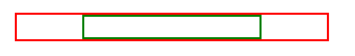

If we want to align an inline element like `img`, we need to change it to a block-level element. Similar to the `div` example, we add the `img` to a parent element:

```html
<div class="parent">
  
</div>
```

```css
.child {
  display: block;
  width: 50%;
  margin-left: auto;
  margin-right: auto;
}
```

The two most common ways to align left/right HTML elements are to use the `float` property and the `position` property.

```html
<div class="parent">
   Lorem ipsum dolor sit amet, consectetur adipiscing elit. Curabitur eu odio eget leo auctor porta sit amet sit amet justo. Donec fermentum quam in diam volutpat, at lacinia diam placerat. Aenean quis feugiat sem. Suspendisse a dui massa. Phasellus scelerisque, mi vestibulum iaculis tristique, orci tellus gravida nisi, in pellentesque elit massa ut lorem. Sed elementum ornare nunc vel cursus. Duis sed enim in nulla efficitur convallis sed eget dolor. Curabitur scelerisque eros erat, in vulputate dolor consequat vel. Praesent ac sapien condimentum, ultricies libero at, auctor orci. Curabitur ut augue ac massa convallis faucibus sed in magna. Phasellus scelerisque auctor est a auctor. Nam laoreet sem sapien, porta imperdiet urna laoreet eu. Morbi dolor turpis, congue id bibendum eget, viverra et risus. Quisque vitae erat id tortor ullamcorper maximus.
</div>
```

```css
.child {
  float: right;
}
```

Result:

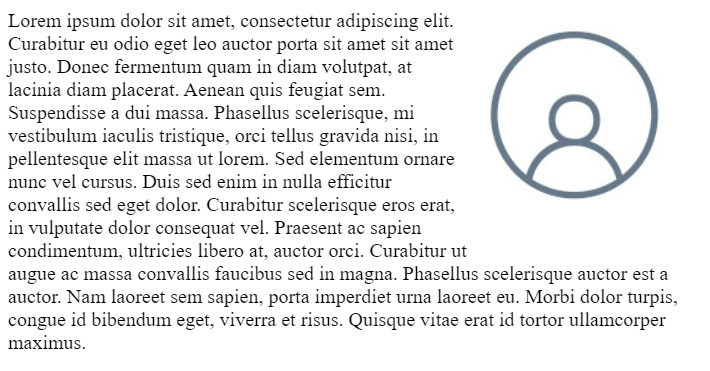

#### Additional Resources

* [CSS Reference (Mozilla)](https://developer.mozilla.org/en-US/docs/Web/CSS/Reference)
* [HTML and CSS: Design and Build Websites by Jon Duckett](https://www.amazon.com/HTML-CSS-Design-Build-Websites/dp/1118008189/)
* [CSS Definitive Guide by Eric Meyer](https://www.amazon.com/CSS-Definitive-Guide-Visual-Presentation/dp/1449393195/)

#### Assignment: Styling a Page

Exercise: [`lab/03_styling_a_page/index.html`](./lab/03_styling_a_page/index.html).

Task: Apply the styling specified in the task description in the `style.css` file.

Result:

[`lab/03_styling_a_page/index.html`](./lab/03_styling_a_page/index.html):

```html
<!DOCTYPE html>
<html>
<head>
    <title>Little Lemon</title>
    <link rel="stylesheet" href="styles.css">
</head>
<body>
    <div>
        
    </div>
    <div class="center-text">
        <h1>Our Menu</h1>
        <h2>Falafel <span>NEW</span></h2>
        <p>Chickpea, herbs, spices.</p>
        <h2>Pasta Salad</h2>
        <p>Pasta, vegetables, mozzarella.</p>
        <h2>Fried Calamari</h2>
        <p>Squid, buttermilk.</p>
    </div>
    <div class="center-text">
        <p id="copyright">
            Copyright Little Lemon
        </p>
    </div>
</body>
</html>
```

[`lab/03_styling_a_page/styles.css`](./lab/03_styling_a_page/styles.css):

```css
body {
  background-color: #E0E0E2;
}

h1 {
  color: #721817;
}

h2 {
  color: #721817;
}

.center-text {
  text-align: center;
}

#logo {
  display: block;
  margin-left: auto;
  margin-right: auto;
}

h2 > span {
  color: #FA9F42;
  font-size: 0.75em;
}

#copyright {
  padding-top: 12px;
  font-size: 0.75em;
}
```

### Assignment: Creating a web page

Assignment: [`lab/04_create_a_web_page`](./lab/04_create_a_web_page).

Tasks:

- Build the webpage structure in `index.html`: add the page title, your name as an `h1`, the `photo.jpg` image with `id="photo"`, a list of five favorite music artists, a list of five favorite films, and a `My Profile` link to `https://www.meta.com/`.

- Style the webpage in `styles.css`: add a `2px solid blue` border to the image, make the `h1` text blue, make all `h2` headings grey, and apply `4px` margin to each `div`.

Result:

- [`lab/04_create_a_web_page/index.html`](./lab/04_create_a_web_page/index.html)
- [`lab/04_create_a_web_page/styles.css`](./lab/04_create_a_web_page/styles.css)

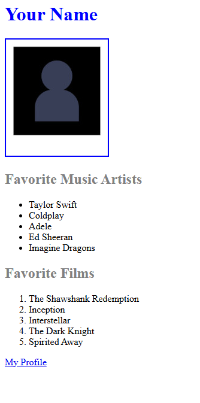

## UI Frameworks

### Intro to UI frameworks and libraries

#### Working with Libraries

### Summary

* Developers can either build everything from scratch or reuse existing libraries and frameworks.
* Libraries and frameworks provide reusable functionality via APIs.
* These external resources are called dependencies because the application relies on them.
* Dependencies must be included in the project (e.g., via HTML) for the app to work.
* CSS libraries are added using the `<link>` tag in the `<head>`.
* JavaScript libraries are added using the `<script>` tag, usually in the `<body>`.
* Example: Bootstrap provides ready-made styles and interactive components.
* Real-world projects often have many dependencies forming a dependency tree.
* Managing dependencies manually is complex and error-prone.
* Package managers (e.g., npm) automate installation and version control of dependencies.
* Bundlers (e.g., Webpack, Gulp) combine multiple files into optimized bundles, i.e., single CSS and JS files for production.
* Bundling improves performance and simplifies inclusion in HTML.

Example of including Bootstrap CSS and JS in HTML:

```html
<head>
  <!-- Required meta tags -->
  <meta charset="UTF-8">
  <meta name="viewport" content="width=device-width, initial-scale=1.0">

  <!-- Bootstrap CSS -->
  <link
    href="https://cdn.jsdelivr.net/npm/bootstrap@5.3.0/dist/css/bootstrap.min.css"
    rel="stylesheet"
  >
</head>

<body>

  <!-- Example Bootstrap button -->
  <button class="btn btn-primary">Click this button</button>

  <!-- Bootstrap JS (with Popper) -->
  <script
    src="https://cdn.jsdelivr.net/npm/bootstrap@5.3.0/dist/js/bootstrap.bundle.min.js">
  </script>

</body>
```

#### Responsive Design

* Responsive design allows websites to adapt automatically to different screen sizes (mobile, tablet, desktop).
  * It ensures a good user experience across devices with varying resolutions.
* Screen resolution refers to the number of pixels (e.g., 1920 × 1080).
* Modern devices may use logical pixels (grouped physical pixels) for smoother visuals.
* Breakpoints: Screen sizes where layout changes occur.
* Responsive design combines grids, images, and media queries to adapt layouts dynamically.
* We use percentages instead of pixels for flexible layouts.
* We ensure images scale properly within containers.

Core Techniques of Responsive Design:

| Technique      | Description                                                    |
| -------------- | -------------------------------------------------------------- |
| Flexible grids | Layouts use percentages instead of fixed pixels                |
| Fluid images   | Images scale within their containers (e.g., `max-width: 100%`) |
| Media queries  | CSS rules applied based on screen size or device properties    |

Media Queries Example:

```css
@media (max-width: 700px) {
  body {
    background-color: blue;
  }
}
```

Grid Types:

| Grid Type   | Description                            |
| ----------- | -------------------------------------- |
| Fixed grid  | Fixed content width, flexible margins  |
| Fluid grid  | Flexible width, expands to full screen |
| Hybrid grid | Mix of fixed and fluid elements        |

#### What Is Bootstrap?

* Bootstrap is a library of CSS and JavaScript used to build websites quickly.
* It is often called a front-end framework, CSS framework, or CSS library.
* It provides pre-written styles and components for rapid development.
* Components are reusable pieces of code (e.g., buttons, forms, layouts).
* Bootstrap includes a responsive grid system for adapting layouts to different devices.
* It enables fast prototyping and iteration of website designs.
* Developers can create visually appealing sites without deep CSS expertise.
* It promotes consistency through a shared design system across teams.
* Its popularity makes it widely used and valuable to learn in industry.
* Once understood, developers can customize and extend its default styles.

| Advantage      | Description                                             |
| -------------- | ------------------------------------------------------- |
| Speed          | Pre-built styles and components reduce development time |
| Responsiveness | Built-in grid system adapts to all devices              |
| Reusability    | Component-based approach simplifies development         |
| Consistency    | Shared design system across teams                       |
| Accessibility  | Lower barrier to building good-looking websites         |

#### Getting Started with Bootstrap

* Bootstrap helps developers build websites faster by providing pre-written CSS and JavaScript.
* It is especially useful for layout, positioning, and common UI elements.
* A Bootstrap page usually starts with a container, which is required to use the grid system.
* Inside the container, content is organized into rows.
* Inside rows, content is split into columns using Bootstrap column classes.
* This grid system makes it easy to place related content side by side.
* Images can be made responsive with the `img-fluid` class, which scales them to fit their parent column.
* Tables can be styled quickly using Bootstrap's `table` class.
* By combining containers, rows, columns, images, and tables, you can build a clean and responsive page with little code.

Example:

```html
<!DOCTYPE html>
<html lang="en">
<head>
  <meta charset="UTF-8">
  <meta name="viewport" content="width=device-width, initial-scale=1.0">
  <title>Bootstrap Menu Example</title>
  <link
    href="https://cdn.jsdelivr.net/npm/bootstrap@5.3.0/dist/css/bootstrap.min.css"
    rel="stylesheet"
  >
</head>
<body>
  <div class="container">
    <div class="row">
      <div class="col">
        <h1>Our Menu</h1>

        <h2>Falafel</h2>
        <p>Chickpea, herbs, and spices.</p>
        

        <h2>Pasta Salad</h2>
        <p>Lettuce, vegetables, and mozzarella.</p>
        
      </div>

      <div class="col">
        <h1>Prices</h1>
        <table class="table">
          <tr>
            <td>Falafel</td>
            <td>$12.00</td>
          </tr>
          <tr>
            <td>Pasta Salad</td>
            <td>$10.00</td>
          </tr>
        </table>
      </div>
    </div>
  </div>

  <script src="https://cdn.jsdelivr.net/npm/bootstrap@5.3.0/dist/js/bootstrap.bundle.min.js"></script>
</body>
</html>
```

#### Using Bootstrap Styles

* Bootstrap provides a large set of pre-built CSS classes to speed up development.
* It uses **infixes** and **modifiers** to create flexible and reusable styles.
  * Both help reuse code and avoid writing custom CSS.
* Bootstrap components (e.g., alerts) combine base classes + modifiers.

##### Infixes (Responsive Design)

* Infixes are used for **responsive breakpoints** in the grid system.
* They define how layouts change across screen sizes.
* Bootstrap is **mobile-first**, so extra small (default) has no infix.

| Breakpoint        | Screen Size | Infix  |
| ----------------- | ----------- | ------ |
| Extra small       | < 576px     | (none) |
| Small             | ≥ 576px     | sm     |
| Medium            | ≥ 768px     | md     |
| Large             | ≥ 992px     | lg     |
| Extra large       | ≥ 1200px    | xl     |
| Extra extra large | ≥ 1400px    | xxl    |

Example:

`col-lg-6` --> column takes half width on large screens

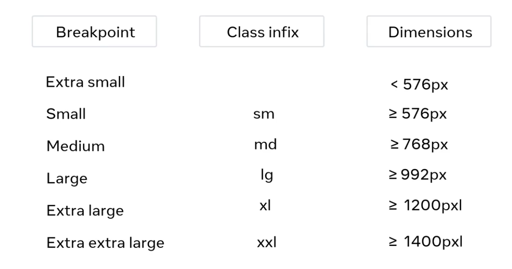

##### Modifiers (Styling Variations)

* Modifiers change the **appearance or meaning** of components.
* They are added as suffixes to class names.

| Modifier  | Purpose           |
| --------- | ----------------- |
| primary   | Main color (blue) |
| secondary | Neutral           |
| success   | Positive (green)  |
| info      | Informational     |
| warning   | Caution (yellow)  |
| danger    | Error (red)       |
| light     | Light theme       |
| dark      | Dark theme        |

Examples:

* `alert-primary` --> blue alert
* `alert-danger` --> red alert

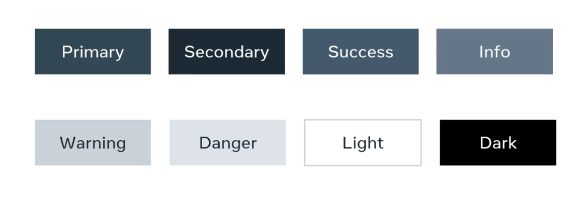

##### Example

```html
<!DOCTYPE html>
<html lang="en">
<head>
  <meta charset="UTF-8">
  <meta name="viewport" content="width=device-width, initial-scale=1.0">
  <title>Bootstrap Infixes and Modifiers Example</title>
  <link
    href="https://cdn.jsdelivr.net/npm/bootstrap@5.3.0/dist/css/bootstrap.min.css"
    rel="stylesheet"
  >
</head>
<body>
  <div class="container mt-4">
    <div class="row">
      <div class="col-lg-6">
        <h1>Little Lemon Restaurant</h1>
        <p>
          This column uses the class <code>col-lg-6</code>, which means it
          takes half the row width on large screens and above.
        </p>
      </div>

      <div class="col-lg-6">
        <h2>Responsive Layout</h2>
        <p>
          On smaller screens, these columns will stack vertically. On large
          screens, they will appear side by side.
        </p>
      </div>
    </div>

    <div class="alert alert-primary mt-4" role="alert">
      A message
    </div>

    <div class="alert alert-danger mt-3" role="alert">
      Error: Please check your reservation details.
    </div>
  </div>

  <script src="https://cdn.jsdelivr.net/npm/bootstrap@5.3.0/dist/js/bootstrap.bundle.min.js"></script>
</body>
</html>
```

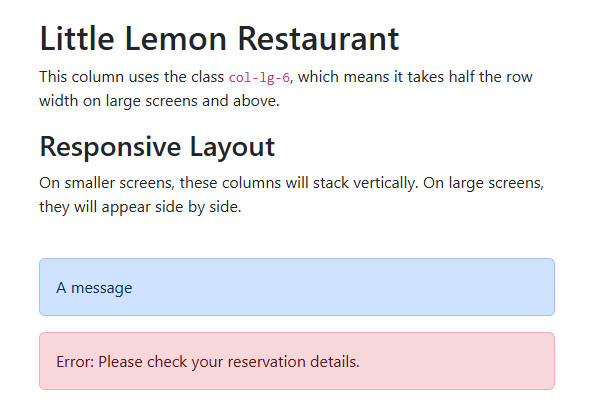

#### Bootstrap Grid System

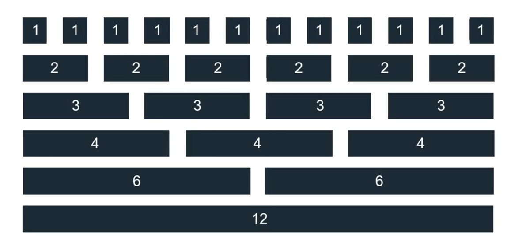

* Bootstrap includes a responsive grid system with containers, rows, and columns.
* The grid is based on 12 columns.
* A container is the root element and aligns the page content.
* Rows are placed inside containers.
* Columns are placed inside rows.
* If no size is specified, Bootstrap automatically divides the available space equally.
* You can control column width by adding numeric suffixes such as `col-4` or `col-8`.
* Bootstrap also supports breakpoint-specific classes, such as `col-lg-6`.
* This allows layouts to change depending on screen size.
* A common pattern is to stack content vertically on mobile and place it side by side on desktop.
* For example, `col-12 col-lg-6` makes a column full width on small screens and half width on large screens.
* If columns exceed 12 total units, they wrap onto a new line.
* Bootstrap's grid system saves time by avoiding separate layouts for each device.


```html
<!DOCTYPE html>
<html lang="en">
<head>
  <meta charset="UTF-8">
  <meta name="viewport" content="width=device-width, initial-scale=1.0">
  <title>Bootstrap Grid Example</title>
  <link
    href="https://cdn.jsdelivr.net/npm/bootstrap@5.3.0/dist/css/bootstrap.min.css"
    rel="stylesheet"
  >
</head>
<body>
  <div class="container mt-4">
    <div class="row">
      <div class="col-12 col-lg-6">
        <h1>Our Menu</h1>

        <h2>Falafel</h2>
        <p>Chickpea, herbs, and spices.</p>

        <h2>Pasta Salad</h2>
        <p>Lettuce, vegetables, and mozzarella.</p>
      </div>

      <div class="col-12 col-lg-6">
        <h1>Prices</h1>
        <table class="table">
          <tr>
            <td>Falafel</td>
            <td>$12</td>
          </tr>
          <tr>
            <td>Pasta Salad</td>
            <td>$10</td>
          </tr>
        </table>
      </div>
    </div>
  </div>

  <script src="https://cdn.jsdelivr.net/npm/bootstrap@5.3.0/dist/js/bootstrap.bundle.min.js"></script>
</body>
</html>
```

#### Exercise: Working with Bootstrap Grid

Exercise: [`lab/05_bootstrap_example`](./lab/05_bootstrap_example).

Task:

- Create a Bootstrap `container` with three `row` sections:
  - the first row centers the Little Lemon logo,
  - the second row centers the `Our Menu` heading,
  - the third row displays the menu content.
- Build a responsive two-column menu using `col-12 col-lg-6`:
  - left column: `Falafel` and `Fried Calamari`
  - right column: `Pasta Salad` and `Greek Salad`
- Use Bootstrap utility classes:
  - `text-center` to center the logo and heading
  - `img-fluid` to make the logo responsive
- Keep the structure aligned with the lab requirements so it stacks on smaller screens and becomes two columns on large screens.

Result: [`lab/05_bootstrap_example/index.html`](./lab/05_bootstrap_example/index.html):

```html
<!DOCTYPE html>
<html>
<head>
    <title>Little Lemon</title>
    <link href="bootstrap.min.css" rel="stylesheet">
</head>
<body>
    <div class="container">
        <div class="row">
            <div class="col-12">
                <div class="text-center">
                    
                </div>
            </div>
        </div>
        <div class="row">
            <div class="col-12">
                <div class="text-center">
                    <h1>Our Menu</h1>
                </div>
            </div>
        </div>
        <div class="row">
            <div class="col-12 col-lg-6">
                <h2>Falafel</h2>
                <p>Chickpea, herbs, spices.</p>
                <h2>Fried Calamari</h2>
                <p>Squid, buttermilk.</p>
            </div>
            <div class="col-12 col-lg-6">
                <h2>Pasta Salad</h2>
                <p>Lettuce, vegetables, mozzarella.</p>
                <h2>Greek Salad</h2>
                <p>Cucumbers, onion, feta cheese.</p>
            </div>
        </div>
    </div>
    <script src="bootstrap.bundle.min.js"></script>
</body>
</html>

```

#### Bootstrap Components

* Bootstrap provides **pre-built UI components** (e.g., badges, cards, alerts, tables).
* These components improve visual design and speed up development.
* A **badge** highlights important info (e.g., “New”).
* A **card** organizes content (image, title, text) in a clean layout.
* Cards can be arranged responsively using the grid system.
* Images inside cards use `card-img-top` for better styling.
* Text inside cards uses `card-body`, `card-title`, and `card-text`.
* Tables can be extended easily to include new items.
* **Alerts** display important messages to users (e.g., promotions).
* Combining components improves both usability and appearance.

Example:

```html
<!DOCTYPE html>
<html lang="en">
<head>
  <meta charset="UTF-8">
  <meta name="viewport" content="width=device-width, initial-scale=1.0">
  <title>Little Lemon Menu</title>
  <link
    href="https://cdn.jsdelivr.net/npm/bootstrap@5.3.0/dist/css/bootstrap.min.css"
    rel="stylesheet"
  >
</head>
<body>
  <div class="container mt-4">

    <!-- Alert -->
    <div class="alert alert-info" role="alert">
      Try our new fried calamari!
    </div>

    <div class="row">
      
      <!-- Menu Column -->
      <div class="col-12 col-lg-8">
        <h1>Our Menu</h1>

        <div class="row">

          <!-- Falafel Card -->
          <div class="col-12 col-lg-6">
            <div class="card mb-4">
              
              <div class="card-body">
                <h5 class="card-title">Falafel</h5>
                <p class="card-text">Chickpea, herbs, and spices.</p>
              </div>
            </div>
          </div>

          <!-- Pasta Salad Card -->
          <div class="col-12 col-lg-6">
            <div class="card mb-4">
              
              <div class="card-body">
                <h5 class="card-title">Pasta Salad</h5>
                <p class="card-text">Lettuce, vegetables, and mozzarella.</p>
              </div>
            </div>
          </div>

          <!-- Fried Calamari Card -->
          <div class="col-12 col-lg-6">
            <div class="card mb-4">
              
              <div class="card-body">
                <h5 class="card-title">
                  Fried Calamari 
                  <span class="badge bg-primary">New</span>
                </h5>
                <p class="card-text">Squid and buttermilk.</p>
              </div>
            </div>
          </div>

        </div>
      </div>

      <!-- Prices Column -->
      <div class="col-12 col-lg-4">
        <h1>Prices</h1>
        <table class="table">
          <tr>
            <td>Falafel</td>
            <td>$12</td>
          </tr>
          <tr>
            <td>Pasta Salad</td>
            <td>$10</td>
          </tr>
          <tr>
            <td>Fried Calamari</td>
            <td>$12</td>
          </tr>
        </table>
      </div>

    </div>
  </div>

  <script src="https://cdn.jsdelivr.net/npm/bootstrap@5.3.0/dist/js/bootstrap.bundle.min.js"></script>
</body>
</html>
```

#### Exercise: Working with Bootstrap Components

Exercise: [`lab/06_bootstrap_components`](./lab/06_bootstrap_components).

Task:

- **Goal:** Extend the Little Lemon menu page with three Bootstrap UI components.
- **Alert** – A `<div class="alert alert-info" role="alert">` was added directly below the *Our Menu* heading to inform customers the restaurant is closed on New Year's Day.
- **Badge** – A `<span class="badge bg-secondary">New</span>` was inserted inside the *Falafel* `<h2>` to highlight it as a new dish.
- **Button** – A new `.row > .col-12 > .text-center` block was appended at the bottom of the container, containing a `<button type="button" class="btn btn-primary">Order Online</button>`.
- **Bootstrap layout** – All additions follow the existing 12-column grid pattern (`container --> row --> col-*`).
- **Files changed:**
  - index.html – updated with the three components.
  - README.md – created with step-by-step instructions and expected results. 

Final Result: [`lab/06_bootstrap_components/index.html`](./lab/06_bootstrap_components/index.html)

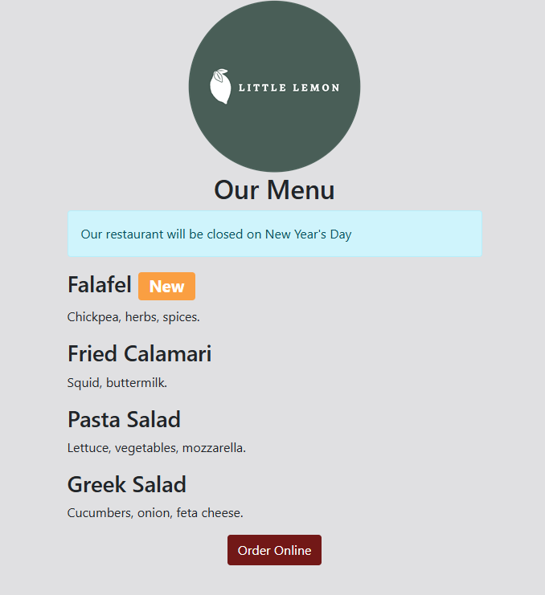

```html
<!DOCTYPE html>
<html>
<head>
    <title>Little Lemon</title>
    <link href="bootstrap.min.css" rel="stylesheet">
</head>
<body>
    <div class="container">
        <div class="row">
            <div class="col-12">
                <div class="text-center">
                    
                </div>
            </div>
        </div>
        <div class="row">
            <div class="col-12">
                <div class="text-center">
                    <h1>Our Menu</h1>
                </div>
                <div class="alert alert-info" role="alert">
                    Our restaurant will be closed on New Year's Day
                </div>
            </div>
        </div>
        <div class="row">
            <div class="col-12 col-lg-6">
                <h2>Falafel <span class="badge bg-secondary">New</span></h2>
                <p>Chickpea, herbs, spices.</p>
                <h2>Fried Calamari</h2>
                <p>Squid, buttermilk.</p>
            </div>
            <div class="col-12 col-lg-6">
                <h2>Pasta Salad</h2>
                <p>Lettuce, vegetables, mozzarella.</p>
                <h2>Greek Salad</h2>
                <p>Cucumbers, onion, feta cheese.</p>
            </div>
        </div>
        <div class="row">
            <div class="col-12">
                <div class="text-center">
                    <button type="button" class="btn btn-primary">Order Online</button>
                </div>
            </div>
        </div>
    </div>
    <script src="bootstrap.bundle.min.js"></script>
</body>
</html>
```

#### Bootstrap Documentation

Bootstrap Documentation: [https://getbootstrap.com/docs](https://getbootstrap.com/docs)

* Bootstrap provides extensive documentation to help developers use its features effectively.
  * Use documentation as the primary reference when working with Bootstrap.
* Apply predefined classes instead of writing custom CSS!
* The documentation includes navigation via sidebar and search for quick access.
* Key sections include Layout, Content, Forms, and Components.
* The Layout section explains the grid system and advanced layout techniques.
* The Content section covers text styling, images, and tables.
* The Forms section provides styled inputs and enhanced user experience features.
* The Components section includes reusable UI elements (some require JavaScript).
* Documentation includes many examples, making it easy to learn and apply.

##### Common Bootstrap Form Elements

| Element          | Class            |
| ---------------- | ---------------- |
| input            | form-control     |
| checkbox / radio | form-check-input |
| range            | form-range       |
| select           | form-select      |

##### Example: Basic Form Styling

```html
<div class="mb-3">
  <label class="form-label">Email</label>
  <input type="email" class="form-control" placeholder="Enter email">
</div>
```

##### Example: Switch

```html
<div class="form-check form-switch">
  <input class="form-check-input" type="checkbox">
  <label class="form-check-label">Enable notifications</label>
</div>
```

##### Example: Input Group

```html
<div class="input-group mb-3">
  <span class="input-group-text">$</span>
  <input type="text" class="form-control" placeholder="Amount">
  <span class="input-group-text">.00</span>
</div>
```

##### Example: Floating Label

```html
<div class="form-floating mb-3">
  <input type="email" class="form-control" id="emailInput" placeholder="name@example.com">
  <label for="emailInput">Email address</label>
</div>
```

##### Example: Responsive Image

```html

```

##### Example: Grid Layout

```html
<div class="container">
  <div class="row">
    <div class="col-6">Left</div>
    <div class="col-6">Right</div>
  </div>
</div>
```

#### Other CSS Frameworks and Libraries

* Developers should be familiar with multiple CSS frameworks, not just Bootstrap.
* Different frameworks offer trade-offs in size, flexibility, features, and design approach.
* Choosing the right framework depends on project needs (performance, customization, simplicity).

Popular CSS Frameworks:

| Framework                                    | Description                                                                | When to Use                  |
| -------------------------------------------- | -------------------------------------------------------------------------- | ---------------------------- |
| [Foundation](https://get.foundation/)        | Full-featured UI framework used by large companies; supports email styling | Large, professional projects |
| [Pure.css](https://purecss.io/)              | Minimal, lightweight library with small file size                          | Performance-critical sites   |
| [Tailwind CSS](https://tailwindcss.com/)     | Utility-first framework with single-purpose classes                        | Highly customizable designs  |
| [UIKit](https://getuikit.com/)               | Lightweight framework with simple responsive components                    | Easy customization           |
| [MVP.css](https://andybrewer.github.io/mvp/) | Automatically styles HTML without classes                                  | Fast prototyping             |

Key Differences:

* **Feature-rich vs minimal**:

  * Bootstrap, Foundation --> many components
  * Pure.css, MVP.css --> lightweight

* **Styling approach**:

  * Tailwind --> utility-based (fine control)
  * MVP.css --> automatic styling (no classes needed)

* **Flexibility vs consistency**:

  * Tailwind --> very flexible but can become inconsistent in teams
  * Component frameworks --> more consistent design systems

#### Additional Resources

- [Bootstrap Official Website](https://getbootstrap.com/)
- [Bootstrap Themes](https://themes.getbootstrap.com/)

### Introduction to React

### Static and Dynamic Content

* Websites deliver **static or dynamic content**.
* **Static content**:
  * Sent exactly as stored on the web server
  * Examples: images, videos, HTML files
  * Fast to deliver
* **Dynamic content**:
  * Generated at request time
  * Depends on user data, inputs, or context (e.g., recommendations, login content)
  * Slower due to processing

#### Web Server vs Application Server

We have the web server and the application server (backend) working together to deliver content.

| Component          | Role                                                            |
| ------------------ | --------------------------------------------------------------- |
| Web server         | Handles HTTP requests and serves content to the browser         |
| Application server (Backend) | Generates dynamic content, runs logic, interacts with databases |

* Web server communicates with the application server for dynamic content.
* Application server performs complex tasks like authentication, personalization, and data retrieval.

Example:

* Static: Clicking “Play” --> server sends a video file directly
* Dynamic: Logging in --> server generates personalized content

#### Caching (Performance Optimization)

* Dynamic content is slower and resource-intensive.
* Web servers use **caching** to store generated content and serve it faster on subsequent requests (i.e., it reduces the load on the application server).

**Process:**

1. First request --> fetch from application server + store in cache
2. Next requests --> serve cached content instantly
3. Cache updates periodically

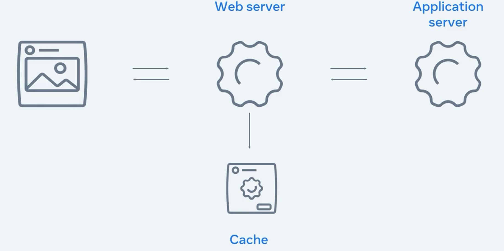

### Single Page Applications (SPAs)

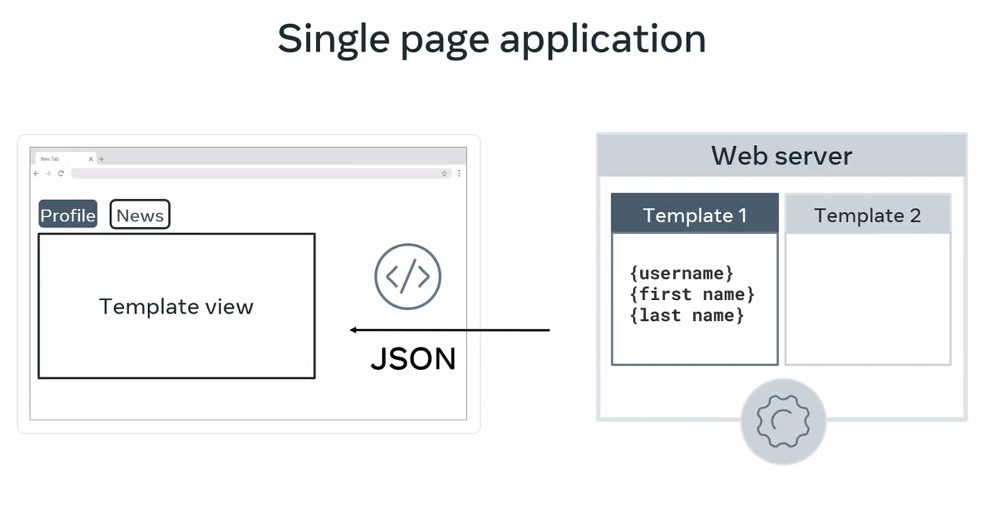

* Single Page Applications (SPAs) provide fast, responsive user experiences by updating content dynamically without reloading full pages.
* Traditional multi-page applications reload the entire HTML page on each request, consuming more bandwidth and server resources.
* SPAs send one initial HTML page and update it as users interact, improving performance.
* Resource loading strategies in SPAs:
  * Bundling: load all HTML, CSS, and JS upfront.
  * Lazy loading: load minimal resources first, fetch more as needed.
  * Large bundles can slow initial load for complex apps.
* In traditional apps, user actions return full HTML pages.
* In SPAs, user actions return JSON data, and the page updates dynamically.
* For navigation between sections (e.g., we have a site with 2 pages: news page vs profile page):
  * Traditional apps reload entire pages from the server.
  * SPAs use templates (views) and update them with data from JSON responses.
  * Only the required data (e.g., username, first name, last name) is transferred, reducing payload size.
* SPAs may preload all views or load them dynamically and cache them.
* Choice between SPA and traditional apps depends on complexity and performance needs.

```javascript
// Traditional approach: full page reload
POST /random-movie

// Server response (HTML)
<html>
  <body>
    <button>What to watch next</button>
    <p>Inception</p>
  </body>
</html>


// SPA approach: fetch data and update UI
POST /random-movie

// Server response (JSON)
{
  "movie": "Inception"
}

// Update UI dynamically
document.querySelector("#movie").innerText = data.movie


// SPA navigation example
GET /profile

// Server response (JSON)
{
  "username": "mikel",
  "firstName": "Mikel",
  "lastName": "Sagardia"
}

// Update view
document.querySelector("#username").innerText = data.username
document.querySelector("#firstName").innerText = data.firstName
document.querySelector("#lastName").innerText = data.lastName
```

### What is React?

* [React](https://react.dev/) is an open-source JavaScript library (since 2013) used to build user interfaces, especially for 
  * single-page applications 
  * and mobile apps via React Native.
* React focuses on a component-based approach, allowing developers to build UIs from reusable, modular pieces.
  * Components represent small parts of the UI (e.g., a user profile picture, music player, or gallery).
  * This approach reduces code duplication, improves maintainability, and simplifies testing by enabling development in isolation.
* React is only responsible for the UI layer; additional libraries are needed for routing, data fetching, and full application functionality.
* Components can be reused across different parts of an application (e.g., a user icon used in navigation, search results, and notifications).
* A large ecosystem of tools and libraries supports React, including pre-built components (e.g., video players, maps).
* Developer tools help inspect behavior and optimize performance.
* The React community contributes improvements, making it a central technology in modern frontend development.

```javascript
// Example: reusable React component for a user profile picture

function UserIcon({ imageUrl }) {
  return (
    
  );
}

// Reusing the component in different parts of the app

function Navbar() {
  return <UserIcon imageUrl="/user.png" />;
}

function SearchResult() {
  return <UserIcon imageUrl="/user.png" />;
}

function Notifications() {
  return <UserIcon imageUrl="/user.png" />;
}
```

### How React Works

* Updating the browser DOM is expensive because it requires recomputing the page.
* React improves performance by using a virtual DOM, an in-memory representation of the real DOM.
* Each React component corresponds to an HTML element in the browser.
* React builds a virtual DOM tree from components and uses it to track changes.
* React compares the virtual DOM with the browser DOM and updates only when necessary.
* This comparison process is called reconciliation.
* When a component updates:
  * The virtual DOM is updated.
  * React compares the new virtual DOM with the previous version.
  * Only the changed elements are applied to the real DOM.
* This selective updating makes applications faster and more responsive.

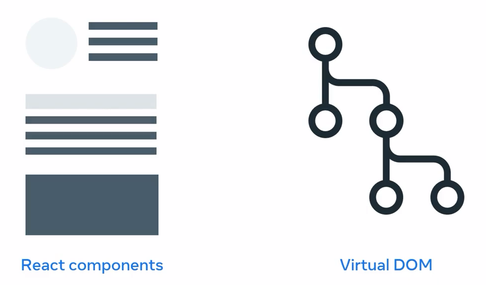

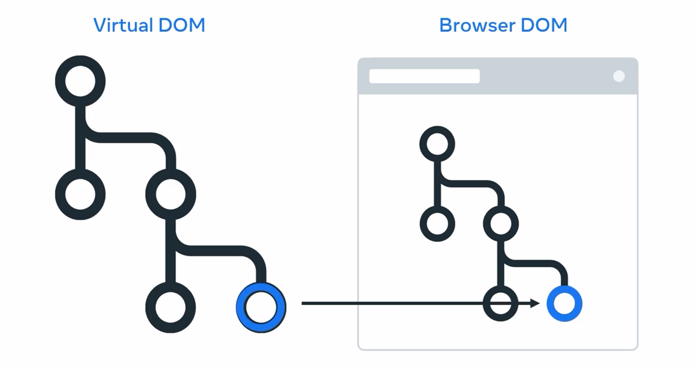

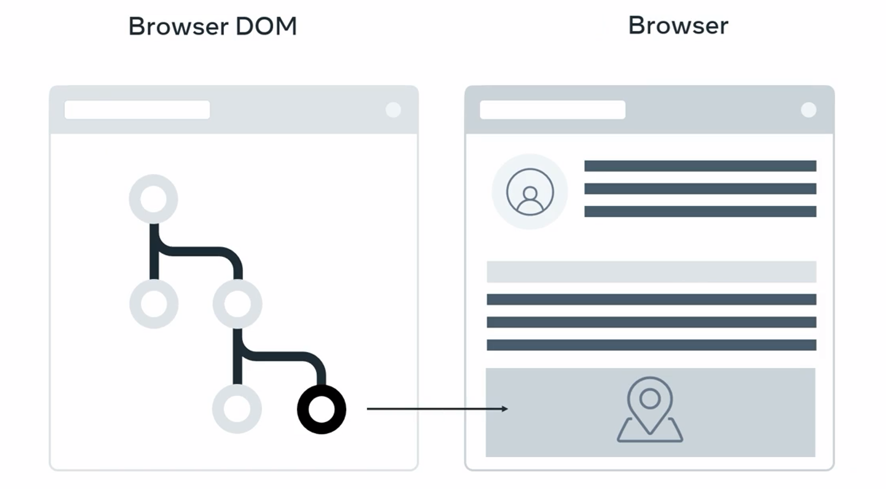

### The Virtual DOM

* React uses a virtual DOM to track changes and minimize expensive updates to the browser DOM.
* Reconciliation process:
  * Virtual DOM is updated.
  * Compared with previous virtual DOM.
  * Only changed elements are identified.
  * Changes are applied to the browser DOM, updating the page.
* This reduces unnecessary DOM updates and improves performance.
* However, updating many elements at once can still be costly.
* React Fiber Architecture improves this by enabling incremental rendering.
  * Updates are spread over time instead of applied all at once.
  * React prioritizes updates based on visibility and importance.
  * Visible elements are updated first; non-visible elements are deferred.
* This priority-based scheduling improves responsiveness and user experience.
* Developers typically do not interact directly with virtual DOM or Fiber but should understand them for debugging.
* React Developer Tools help inspect rendering behavior and performance.

### Component Hierarchy

* React applications are built as a hierarchy (tree) of components starting from a root component (App).
* Components are nested to form parent-child relationships that represent the structure of the UI.
* Breaking an application into components can be challenging initially but becomes easier with practice.
* Components enable reuse of UI logic and structure across different parts of the application.
* Example (shopping list):
  * App component contains NewItemBar and ShoppingList components.
  * ShoppingList contains multiple ShoppingItem components.
  * ShoppingItem is reused for each list element.
  * When items are removed, corresponding components are removed from the tree.
* Example (blog website):
  * App component contains Navbar and Page components.
  * Navbar includes title, navigation links, and Search component.
  * Page contains MainFeature and multiple SmallFeature components.
  * SmallFeature components reuse the same structure with different data (props).
* Component reuse allows efficient development and consistent UI design.

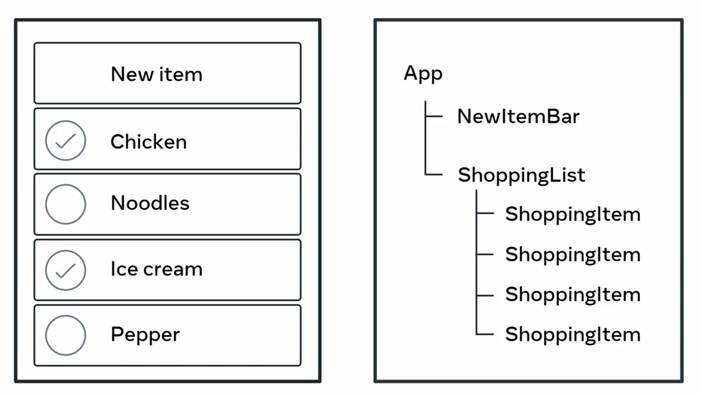
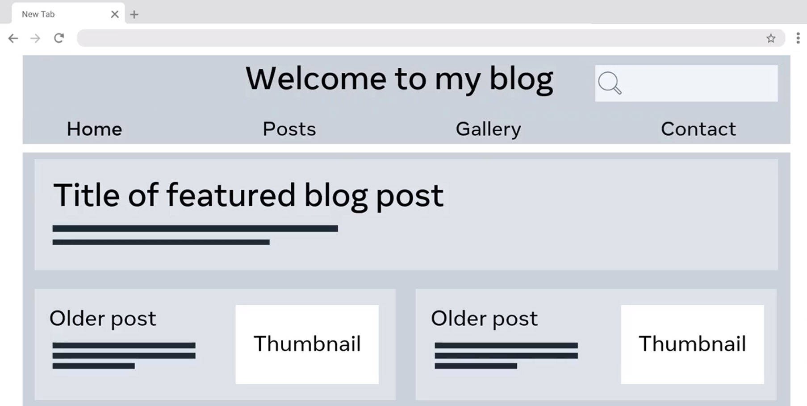

```javascript
// Example: component hierarchy (simplified)

// Root component
function App() {
  return (
    <>
      <Navbar />
      <Page />
    </>
  );
}

// Navbar with child components
function Navbar() {
  return (
    <>
      <Title />
      <NavLinks />
      <Search />
    </>
  );
}

// Page with reusable components
function Page() {
  return (
    <>
      <MainFeature />
      <SmallFeature title="Post 1" />
      <SmallFeature title="Post 2" />
    </>
  );
}

// Reusable component with props
function SmallFeature({ title }) {
  return (
    <div>
      <h2>{title}</h2>
      <Thumbnail />
    </div>
  );
}
```

### React and Complimentary Libraries

React is a library, not a framework.

That's why we need complimentary libraries to build full applications.

* Lodash
  * [https://lodash.com](https://lodash.com)
  * Provides utility functions for common programming tasks such as sorting, filtering, and number manipulation, reducing repetitive code.

* Luxon
  * [https://moment.github.io/luxon/](https://moment.github.io/luxon/)
  * Simplifies working with dates and times, including formatting, parsing, and handling different locales and time zones.

* Redux
  * [https://redux.js.org](https://redux.js.org)
  * Manages application state in a predictable way, useful for handling shared data (e.g., shopping cart) and supporting features like undo/redo.

* Axios
  * [https://axios-http.com](https://axios-http.com)
  * Simplifies HTTP requests to APIs, with features like request cancellation and response transformation.

* Jest
  * [https://jestjs.io](https://jestjs.io)
  * Enables automated testing of code, including unit tests and coverage reporting to measure how much code is tested.

### Additional Resources

* React Official Website: [https://reactjs.org/](https://reactjs.org/)

* Choosing between Traditional Web Apps and Single Page Apps (Microsoft): [https://docs.microsoft.com/en-us/dotnet/architecture/modern-web-apps-azure/choose-between-traditional-web-and-single-page-apps](https://docs.microsoft.com/en-us/dotnet/architecture/modern-web-apps-azure/choose-between-traditional-web-and-single-page-apps)

* React Source Code (GitHub): [https://github.com/facebook/react](https://github.com/facebook/react)

* Introduction to React.js (2013 talk at Facebook): [https://youtu.be/XxVg_s8xAms](https://youtu.be/XxVg_s8xAms)


## End-of-Course Graded Assessment

### Bio Page

Lab: [`lab/07_bio_page`](./lab/07_bio_page)

In `index.html`, build a biographical page about yourself using Bootstrap. Result:

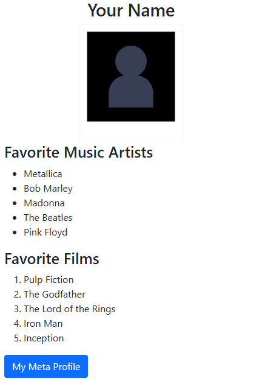


