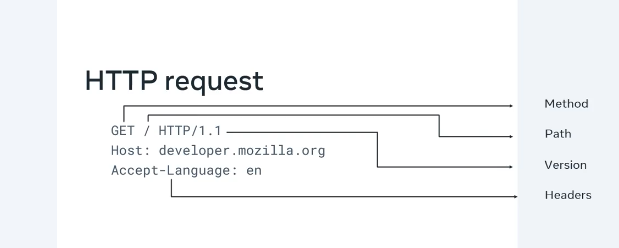
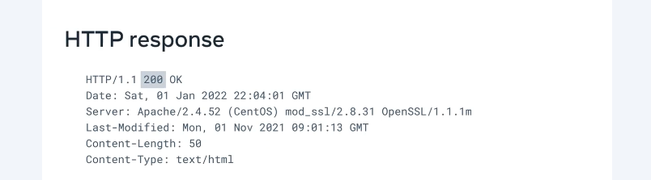
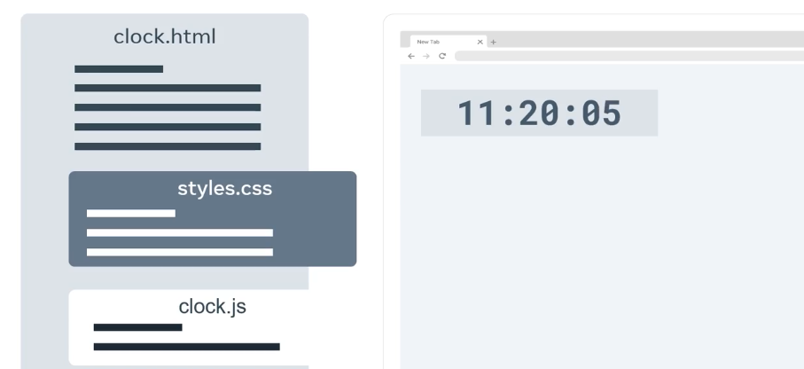

# Intoduction to Web-App Back-End Development

This is my guide for web-app backend development, based on the [Meta Back-End Developer Professional Certificate](https://www.coursera.org/programs/deutsche-telekom-learning-program-ddjuh/professional-certificates/meta-back-end-developer) specialization on Coursera. From that specializatuon, I have selected these topics/courses:

1. [Introduction to Back-End Development](https://www.coursera.org/programs/deutsche-telekom-learning-program-ddjuh/learn/introduction-to-back-end-development)
2. [Introduction to Databases & Back-End Development](https://www.coursera.org/programs/deutsche-telekom-learning-program-ddjuh/learn/intro-to-databases-back-end-development)
3. [Django Web Framework](https://www.coursera.org/programs/deutsche-telekom-learning-program-ddjuh/learn/django-web-framework?authProvider)
4. [APIs](https://www.coursera.org/programs/deutsche-telekom-learning-program-ddjuh/learn/apis)
5. [The Full Stack](https://www.coursera.org/programs/deutsche-telekom-learning-program-ddjuh/learn/the-full-stack?authProvider=deutschetelekom)
6. [Back-End Developer Capstone Project](https://www.coursera.org/programs/deutsche-telekom-learning-program-ddjuh/learn/back-end-developer-capstone)

This module deals with the first topic/course: **Introduction to Back-End Development**.

Table of Contents:

- [Intoduction to Web-App Back-End Development](#intoduction-to-web-app-back-end-development)
  - [Intoduction](#intoduction)
    - [How the web works](#how-the-web-works)
    - [Core Internet Technologies](#core-internet-technologies)
      - [Internet Protocols](#internet-protocols)
      - [Introduction to HTTP](#introduction-to-http)
      - [HTTP Examples: Request and Response](#http-examples-request-and-response)
      - [Intro to HTML, CSS, and JavaScript](#intro-to-html-css-and-javascript)
      - [Other Internet Protocols](#other-internet-protocols)
      - [Webpages, Websites and Web Apps](#webpages-websites-and-web-apps)
      - [Browser Developer Tools](#browser-developer-tools)
      - [Exercise: Web is Inspected](#exercise-web-is-inspected)
      - [Libraries and Frameworks](#libraries-and-frameworks)
      - [APIs and Services](#apis-and-services)
      - [Additional Resources](#additional-resources)
  - [Introduction to HTML and CSS](#introduction-to-html-and-css)
    - [Getting started with HTML](#getting-started-with-html)
      - [What is HTML?](#what-is-html)
      - [Exercise: Create a simple HTML page](#exercise-create-a-simple-html-page)
    - [CSS Basics](#css-basics)
    - [Creating a web page](#creating-a-web-page)
  - [UI Frameworks](#ui-frameworks)
    - [Intro to UI frameworks and libraries](#intro-to-ui-frameworks-and-libraries)
    - [Introduction to React](#introduction-to-react)
  - [Assessment](#assessment)

## Intoduction

### How the web works

Internet:

- Devices connect and communicate through wired or wireless connections, forming a network.
- As more devices join, direct connections become complex; this is solved using network switches.
- Network switches connect multiple devices and can also connect to other switches.
- Many interconnected networks together form the Internet.
- Online services (websites, streaming, etc.) are hosted on servers, while user devices act as clients (client-server model).

Web servers:

- Server = computer providing services to clients (e.g., websites, messaging).
- Usually hosted in data centers with power, cooling, and connectivity redundancy.
- Data centers are geographically distributed --> faster access via proximity.
- Hardware vs software:
  - Hardware = physical resources (CPU, RAM, storage)
  - Software = code/services running on the machine
- Servers are specialized by purpose (storage-heavy vs compute-heavy).
- A web server is software that:
  - Stores and serves website content
  - Handles HTTP request–response cycle
- Core role: respond to client requests at scale (thousands/sec).

Websites and webpages:

- Webpage vs website:
  - Webpage = single document
  - Website = collection of linked webpages
- Webpages are just text documents sent from server --> browser
- Core stack (always the same):
  - HTML --> structure/content
  - CSS --> styling/layout
  - JavaScript --> behavior/interactivity
- Browser pipeline:
  - Receives HTML/CSS/JS
  - Parses sequentially
  - Builds visual output --> rendering
- JS is the dynamic layer: validation, updates, real-time UI
- Links form the web graph: pages can link across sites
- Scale insight: massive, continuously growing system, but built on same 3 primitives
- Key mental model: --> webpage = code --> browser interprets --> UI rendered

Web browsers:

- Browser = client app that requests and displays web content
- Core flow (always the same):
  1. User enters URL
  2. Browser sends request (HTTP)
  3. Server processes it (may query DB)
  4. Server returns response
  5. Browser renders page
- URL structure: protocol (HTTP), domain, path
- Request–response cycle = fundamental abstraction of the web
- Dynamic requests: user actions (e.g., search) → new requests with parameters
- Server side: logic + database lookup → builds response
- Browser side: renders returned code into UI
- Same pattern applies to search, chat, streaming, etc.

Web hosting:

- Web hosting = service where you place your website/files on a hosting company's web server (renting space for stable, secure storage).
- No need to own a datacenter; individuals and developers can rent space.
- Hosting types:
  - Shared hosting:
    - Cheapest option; multiple accounts share the same server, CPU, memory, and bandwidth.
    - Performance can be affected by other sites on the same server.
    - Best for small sites with low traffic; also used as a low-cost sandbox for practice.
    - Some providers offer free shared hosting with limitations and ads.
  - Virtual Private Server (VPS):
    - Virtual server with dedicated CPU, memory, and bandwidth resources.
    - Runs on shared hardware but resources are fixed per instance --> other VPS instances don't impact your performance.
    - More expensive than shared hosting.
  - Dedicated hosting:
    - Entire physical server reserved for you only.
    - Full control over all hardware resources (CPU, memory, bandwidth).
    - Generally more expensive than VPS.
  - Cloud hosting:
    - Website runs across multiple physical and virtual servers (Cloud environment).
    - If one server fails, another takes over --> high availability.
    - No hardware resource limits; scales on demand.
    - Pay-per-use model (e.g., bandwidth charged per MB transferred).
    - Cost scales with popularity/traffic --> used by most major web applications.

Additional resources:

- [What is a Web Server? (NGINX)](https://www.nginx.com/resources/glossary/web-server/)
- [What is a Web Browser? (Mozilla)](https://www.mozilla.org/en-US/firefox/browsers/what-is-a-browser/)
- [Who invented the Internet? And why? (Kurzgesagt)](https://youtu.be/21eFwbb48sE)
- [What is Cloud Computing? (Amazon)](https://youtu.be/mxT233EdY5c)
- [Browser Engines (Wikipedia)](https://en.wikipedia.org/wiki/Browser_engine)

### Core Internet Technologies

#### Internet Protocols

* IP addresses = unique identifiers for devices (like postal addresses)
* Internet Protocol (IPv4, IPv6) defines addressing and routing
  * IP4: `192.168.0.1` (32-bit, 4 octets of integers)
  * IP6: `2000:0db8:85a3:0000:0000:8a2e:0370:7334` (128-bit, 8 groups of hexadecimal digits)
* Data is sent as packets (datagrams) over the IP network/protocol; a packet is a unit of data transmission and contains:
  * header --> source + destination IP + metadata
  * payload --> actual data
  * each packet has sender (source) + receiver (destination) IP addresses
* Networks = routes; computers = endpoints
* Packets can fail because of
  * being out of order
  * being lost/dropped
  * being corrupted
* Transport protocols handle reliability, present in the payload of IP packets:
  * TCP --> it solves the failure issues: it guarantees ordered, reliable delivery -- but slower
  * UDP --> it solves the corrupt packet issue, but allows loss/out-of-order -- it's faster, used for real-time applications (e.g., video streaming, gaming)
* Stack model: IP packet --> contains TCP/UDP --> contains higher-level data
* Key idea: Internet aprox postal system for data delivery

#### Introduction to HTTP

* HTTP = core web protocol for client–server communication (transfer of HTML, images, etc.)
* Model: request–response cycle (browser sends request, server returns response)
* HTTP request structure:
  * method --> action
    * GET to retrieve data/resource from the server
    * POST to send
    * PUT to update/replace a resource on the server
    * DELETE to remove
    * PATCH to partially update
  * path --> location of resource on server
  * version --> protocol version (commonly 1.1, 2.0)
  * headers --> metadata about client/request
  * optional body --> data sent to server
* HTTP response structure:
  * status code --> result of request
  * headers --> metadata
  * optional body --> actual content (HTML, JSON, images, etc.)
* Status codes grouped by category:
  * 100–199 --> informational
    * 100 == continue
    * 101 == switching protocols: the client has requested the server to switch protocols and the server has agreed to do so.
  * 200–299 --> success (e.g., 200 OK)
    * 200 == OK (success): found for GET, transmitted for POST/PUT, deleted for DELETE
    * 201 == created (resource created successfully)
    * 202 == accepted (request accepted but not yet processed)
    * 204 == no content (success but no body to return)
  * 300–399 --> redirection (e.g., 301, 302)
    * 301 == moved permanently
    * 302 == found (temporary redirect); we automatically follow the new location or request the resource again if the redirect address is missing
  * 400–499 --> client errors (e.g., 400, 401, 403, 404)
    * 400 == bad request (malformed syntax)
    * 401 == unauthorized (authentication required)
    * 403 == forbidden (authenticated but no permission)
    * 404 == not found (resource doesn't exist)
    * 405 == method not allowed (e.g., POST on a GET-only resource)
  * 500–599 --> server errors (e.g., 500)
    * 500 == internal server error (unexpected condition)
    * 502 == bad gateway (invalid response from upstream server)
    * 503 == service unavailable (server overloaded or down)
* Meaning depends on method (e.g., 200 OK = resource returned for GET, success for POST/PUT/DELETE)
* HTTPS = secure version of HTTP
  * same protocol semantics
  * adds encryption --> data unreadable in transit
  * visible as lock icon in browser
* Key idea: HTTP defines how data is exchanged; HTTPS adds security without changing the model





#### HTTP Examples: Request and Response

Every HTTP request starts with a **request line**

    GET /home.html HTTP/1.1

Here:

- `GET` is the method
- `/home.html` is the path to the resource on the server
- `HTTP/1.1` is the version

After the request line, we have the **request header**:

```
Host: example.com
User-Agent: Mozilla/5.0 (Macintosh; Intel Mac OS X 10.9; rv:50.0) Gecko/20100101 Firefox/50.0
Accept: */*
Accept-Language: en
Content-type: text/json
```

And finally, the **optional request body** (only for POST/PUT/PATCH):

```json
{
  "username": "john_doe",
  "password": "s3cr3t"
}
```

After the server processes the request, it sends back an **HTTP response**. The response starts with a **status line**:

    HTTP/1.1 200 OK

The code `200` indicates success, and `OK` is the reason phrase. Then we have the **response headers**:

```
Date: Fri, 11 Feb 2022 15:00:00 GMT+2
Server: Apache/2.2.14 (Linux)
Content-Length: 84
Content-Type: text/html
```

And finally, the **optional response body** (the actual content):

```html
<html>
  <head><title>Test</title></head>
  <body>Test HTML page.</body>
</html>
```

#### Intro to HTML, CSS, and JavaScript

* Web pages built on 3 core technologies: HTML, CSS, JavaScript
* Separation of concerns:
  * HTML --> structure/content
  * CSS --> styling/layout
  * JavaScript --> logic/interactivity
* Files are linked: HTML references CSS and JS; browser loads and processes all
* Example 1 (digital clock):
  * HTML --> defines time elements (static content)
  * CSS --> styles layout, fonts, colors
  * JavaScript --> updates time every second (dynamic behavior)
* Example 2 (video player):
  * HTML --> video + button elements
  * CSS --> visual styling
  * JavaScript --> interaction logic (play/pause toggle)
* JavaScript capabilities:
  * DOM updates (dynamic content)
  * event handling (e.g., button clicks)
  * state-based logic (play vs pause)
* Browser pipeline:
  * load HTML --> fetch CSS/JS --> apply styles --> execute JS
* Key idea: combining structure + style + behavior --> fully functional web apps



#### Other Internet Protocols

* HTTP runs on top of TCP --> used to transfer web content
* Dynamic Host Configuration Protocol: DHCP --> assigns IP address to devices when they join a network
  * uses UDP
  * DHCP server manages IP allocation
* Domain Name System: DNS --> resolves domain names to IP addresses
  * enables human-readable URLs (e.g., meta.com --> IP)
* Email protocols:
  * Internet Message Access Protocol: IMAP --> sync/download emails, keeps them on server
  * Simple Mail Transfer Protocol: SMTP --> sends emails via mail server
  * Post Office Protocol: POP --> downloads emails and deletes them from server (older, simpler)
* File transfer:
  * File Transfer Protocol: FTP --> transfer/manage files on server (insecure)
  * Secure File Transfer Protocol: SFTP --> secure file transfer over SSH (encrypted)
* Remote access:
  * Secure Shell: SSH --> secure remote login and command execution (encrypted)
* Key idea: Internet = stack of specialized protocols
  * addressing (DHCP, DNS)
  * communication (HTTP, TCP/UDP)
  * application services (email, file transfer, remote access)

#### Webpages, Websites and Web Apps

* Web page --> single document (HTML, CSS, JS) displayed in browser
* Website --> collection of linked web pages under one domain
* Hyperlinks --> connect pages (within same site or across different sites)
* Web application --> interactive, dynamic system built on web technologies
* Key distinction:
  * website --> mostly static, informational content (same for all users)
  * web application --> dynamic, user-specific content based on input
* Example:
  * company site --> informational website
  * food ordering system --> web application (user interaction, personalization)
* Reality: boundaries blur; many modern sites mix both
* Key idea: difference driven by level of interactivity and dynamic behavior

#### Browser Developer Tools

* Browser dev tools = built-in debugging/inspection toolkit
* Access: F12 / right-click --> inspect
* Core capabilities:
  * inspect HTML, CSS, JavaScript
  * trace HTTP requests/responses
  * analyze performance and memory
  * check security aspects
* Key tabs:
  * Elements --> inspect/edit DOM and CSS
  * Console --> logs, errors, JS execution
  * Sources --> loaded files (HTML, CSS, JS, assets)
  * Network --> request/response timeline and details
  * Performance --> runtime profiling (slow functions)
  * Memory --> resource usage
* Elements tab:
  * hover highlights elements in UI
  * shows applied CSS and properties
  * allows live editing of HTML/CSS
* Edits are local only --> do not affect server
* Key idea: dev tools = “open the hood” for frontend debugging

#### Exercise: Web is Inspected

  Website: [`lab/01_examine_the_page/index.html`](./lab/01_examine_the_page/index.html).

Task:

- Log for logo id
- Edit title locally

Note:

- Chrome and Firefox have developer tools enabled by default.
- Safari: Settings / Preferences > Advanced > Show Develop menu in menu bar (then right-click --> inspect)

#### Libraries and Frameworks

* Frameworks and libraries = reusable tools to speed up development
* Libraries:
  * reusable code for specific tasks
  * developer calls them when needed
  * example --> email validation
* Frameworks:
  * provide structure and flow for applications
  * handle common concerns (e.g., HTTP requests/responses)
  * developer plugs code into framework
* Key difference:
  * library --> you control flow
  * framework --> framework controls flow
* Opinionatedness:
  * frameworks --> more opinionated (less freedom, more structure)
  * libraries --> less opinionated (more flexibility)
* Relationship:
  * frameworks often use multiple libraries internally
  * apps can also use additional libraries
* Trade-offs:
  * frameworks --> faster dev, built-in best practices, but less flexible
  * libraries only --> more control, but more setup and integration work
* Maintainability:
  * replacing a library is easier than replacing a framework
* Key idea: reuse existing solutions --> faster development, fewer errors, focus on core features

#### APIs and Services

* API (Application Programming Interface) = interface to access data or functionality of another system
* Role: bridge between components (client <-> server, app <-> service)
* APIs are also known as gateways or middleware because they act as a bridge between systems.
* Common types:
  * Browser APIs --> built into browser (DOM, Fetch, Geolocation, Storage)
    * DOM API turns HTML into a tree of nodes that JS can manipulate
  * REST APIs --> web servers providing data to apps; MOST COMMON!
  * Sensor-based APIs --> interact with physical devices (IoT)
* REST APIs:
  * based on principles for scalable systems
  * central role --> send/receive data from backend/database
  * accessed via endpoints (URLs)
* Core operations (CRUD):
  * GET --> retrieve data
  * POST --> create data
  * PUT --> update data
  * DELETE --> remove data
* Request flow:
  * client calls endpoint (URL ending `/my-endpoint`) --> server processes --> returns response (e.g., JSON data)
* Responses:
  * data (commonly JSON)
  * or full web content
* Browser APIs extend capabilities without external services
* Key idea: APIs enable communication and reuse of functionality across systems, forming the backbone of modern web apps

#### Additional Resources

* [HTTP Overview (Mozilla)](https://developer.mozilla.org/en-US/docs/Web/HTTP/Overview)
* [Introduction to Networking by Dr. Charles R Severance](https://www.amazon.com/Introduction-Networking-How-Internet-Works/dp/1511654945/)
* [Chrome Developer Tools Overview (Google)](https://developer.chrome.com/docs/devtools/overview/)
* [Firefox Developer Tools User Docs (Mozilla)](https://firefox-source-docs.mozilla.org/devtools-user/index.html)
* [Getting Started with Visual Studio Code (Microsoft)](https://code.visualstudio.com/docs)

## Introduction to HTML and CSS

### Getting started with HTML

#### What is HTML?

* HTML = core structure of a web page (like a building frame)
* Created by Tim Berners-Lee at CERN
  * first version released in 1991
* HTML = Hypertext Markup Language
  * hypertext --> links between documents
  * markup --> tags/elements defining structure
* HTML document:
  * plain text file (.html)
  * built from elements and tags
* Tags vs elements:
  * tag --> syntax (<p>, </p>)
  * element --> tag + content
* Most elements:
  * opening tag + closing tag
  * contain content
* Elements can:
  * be nested inside others
  * be self-closing (e.g., line break <br>)
* HTML specification:
  * defines rules/structure
  * maintained by World Wide Web Consortium
  * current standard --> HTML5
* Browser role:
  * reads HTML --> builds basic page structure
  * styling requires CSS
* Key idea: HTML defines structure and content; browser interprets it into a visible page

Basic HTML structure:

```html
<!DOCTYPE html>
<html>
    <head>
        <title>Little Lemon Restaurant</title>
    </head>
    <body>
        <h1>Our Menu</h1>
        <h2>Falafel</h2>
        <p>Delicious falafel made with fresh ingredients.</p>
        <h2>Pasta salad</h2>
        <p>Refreshing pasta salad with a tangy dressing.</p>
    </body>
</html>
```

#### Exercise: Create a simple HTML page


### CSS Basics

### Creating a web page

## UI Frameworks

### Intro to UI frameworks and libraries

### Introduction to React

## Assessment

