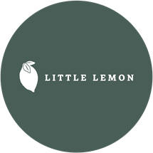

# Bootstrap Components – Little Lemon

## Introduction

In this exercise you will practice adding Bootstrap components to a webpage by updating the Little Lemon restaurant site.

## Objectives

- Add a **Badge** component to notify customers of the new Falafel dish.
- Add an **Alert** component to notify customers that the restaurant will be closed on New Year's Day.
- Add a **Button** component with the text *Order Online*.

## Steps

### Step 1 – Open `index.html`

Open the file `01_Introduction/lab/06_bootstrap_components/index.html` in your editor.

### Step 2 – Add the Alert component

Below the `<div class="text-center">` that contains `<h1>Our Menu</h1>`, add a new `div` element:

```html
<div class="alert alert-info" role="alert">
    Our restaurant will be closed on New Year's Day
</div>
```

- `alert alert-info` — Bootstrap classes that style the element as an informational alert box.
- `role="alert"` — ARIA role that improves accessibility for screen readers.

### Step 3 – Add the Badge component

Inside the `<h2>Falafel</h2>` heading, add a `<span>` before the closing `</h2>` tag:

```html
<h2>Falafel <span class="badge bg-secondary">New</span></h2>
```

- `badge bg-secondary` — Bootstrap classes that render a small secondary-coloured badge.

### Step 4 – Add the Button component

After the last existing `.row` div, add a new row containing a centred button:

```html
<div class="row">
    <div class="col-12">
        <div class="text-center">
            <button type="button" class="btn btn-primary">Order Online</button>
        </div>
    </div>
</div>
```

- `btn btn-primary` — Bootstrap classes that render a solid primary-colour button.

### Step 5 – Save and preview

1. Save `index.html`.
2. Click **Go Live** (bottom-right of VS Code) to start a local server.
3. Open the browser preview and navigate to `http://localhost:<port>`.

## Expected Result

| Feature | What to verify |
|---|---|
| Alert | Blue info box reading *"Our restaurant will be closed on New Year's Day"* appears below the **Our Menu** heading. |
| Badge | A grey **New** badge appears next to the **Falafel** heading. |
| Button | A blue **Order Online** button appears at the bottom of the page. |

## Final `index.html`

```html
<!DOCTYPE html>
<html>
<head>
    <title>Little Lemon</title>
    <link href="bootstrap.min.css" rel="stylesheet">
</head>
<body>
    <div class="container">
        <div class="row">
            <div class="col-12">
                <div class="text-center">
                    
                </div>
            </div>
        </div>
        <div class="row">
            <div class="col-12">
                <div class="text-center">
                    <h1>Our Menu</h1>
                </div>
                <div class="alert alert-info" role="alert">
                    Our restaurant will be closed on New Year's Day
                </div>
            </div>
        </div>
        <div class="row">
            <div class="col-12 col-lg-6">
                <h2>Falafel <span class="badge bg-secondary">New</span></h2>
                <p>Chickpea, herbs, spices.</p>
                <h2>Fried Calamari</h2>
                <p>Squid, buttermilk.</p>
            </div>
            <div class="col-12 col-lg-6">
                <h2>Pasta Salad</h2>
                <p>Lettuce, vegetables, mozzarella.</p>
                <h2>Greek Salad</h2>
                <p>Cucumbers, onion, feta cheese.</p>
            </div>
        </div>
        <div class="row">
            <div class="col-12">
                <div class="text-center">
                    <button type="button" class="btn btn-primary">Order Online</button>
                </div>
            </div>
        </div>
    </div>
    <script src="bootstrap.bundle.min.js"></script>
</body>
</html>
```
