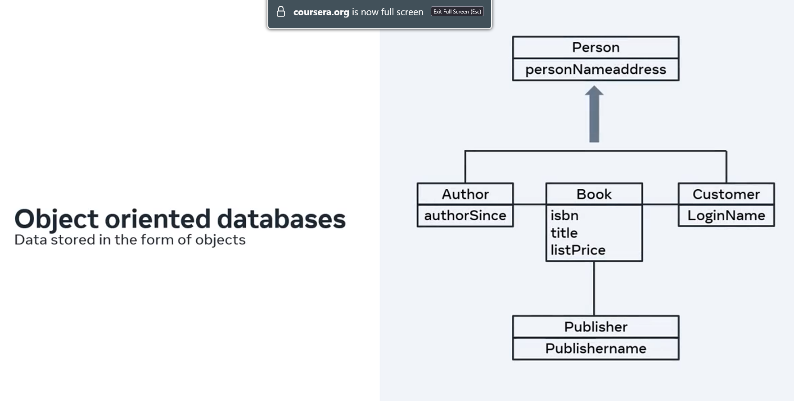
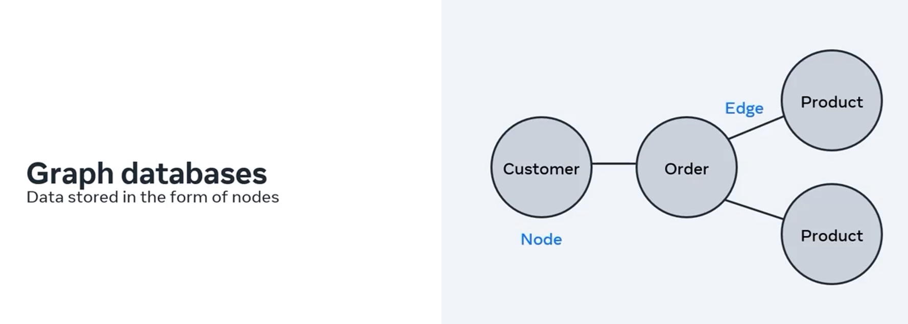
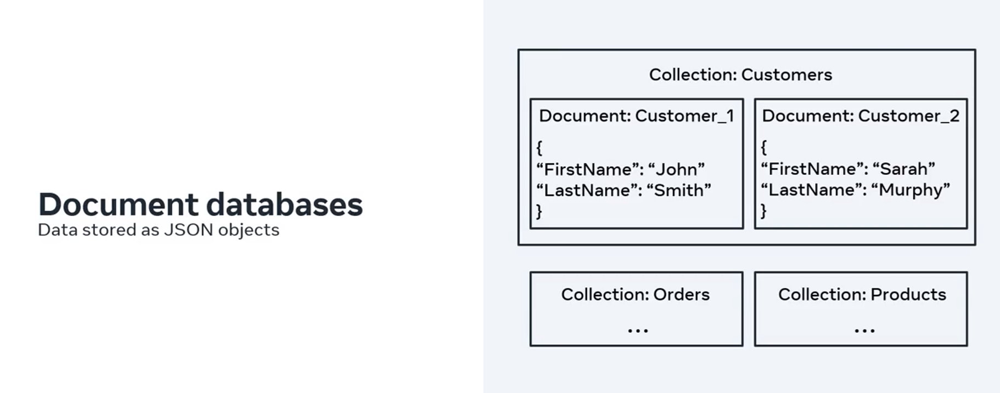
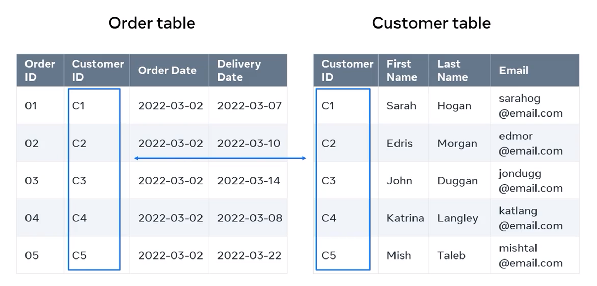
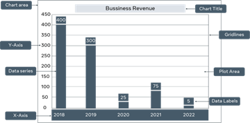
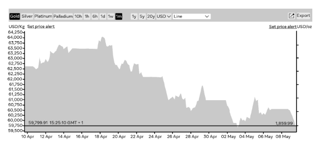
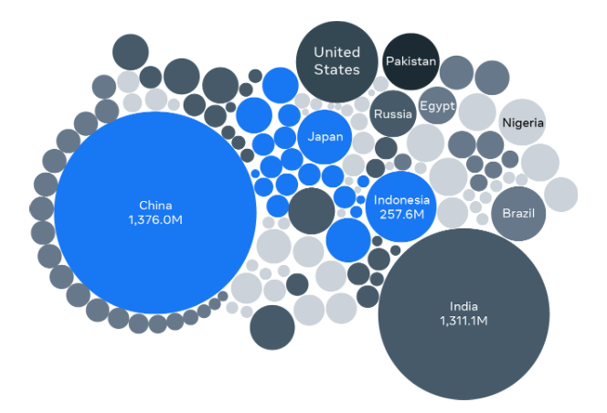
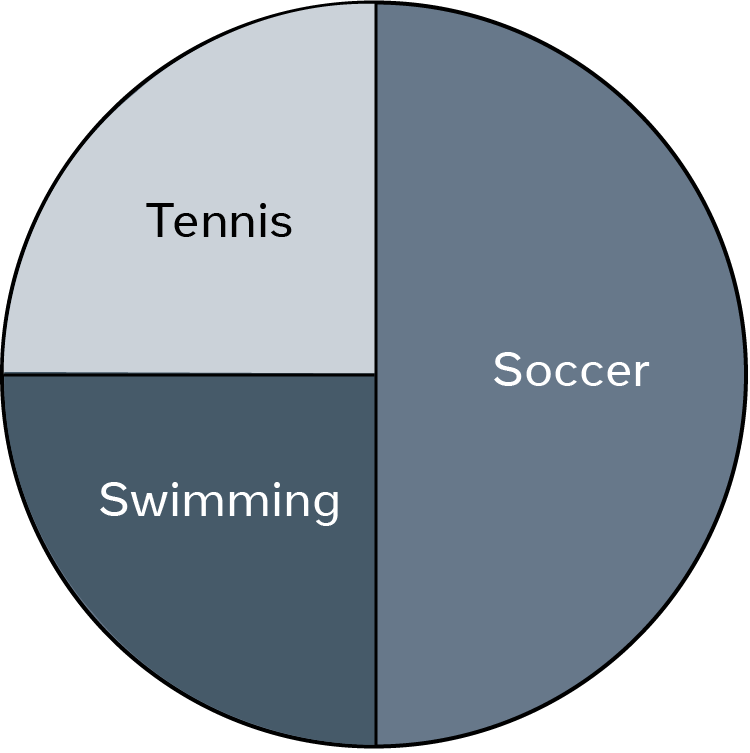

# Intoduction to Web-App Back-End Development

This is my guide for web-app backend development, based on the [Meta Back-End Developer Professional Certificate](https://www.coursera.org/programs/deutsche-telekom-learning-program-ddjuh/professional-certificates/meta-back-end-developer) specialization on Coursera. From that specializatuon, I have selected these topics/courses:

1. [Introduction to Back-End Development](https://www.coursera.org/programs/deutsche-telekom-learning-program-ddjuh/learn/introduction-to-back-end-development)
2. [Introduction to Databases for Back-End Development](https://www.coursera.org/programs/deutsche-telekom-learning-program-ddjuh/learn/intro-to-databases-back-end-development)
3. [Django Web Framework](https://www.coursera.org/programs/deutsche-telekom-learning-program-ddjuh/learn/django-web-framework?authProvider)
4. [APIs](https://www.coursera.org/programs/deutsche-telekom-learning-program-ddjuh/learn/apis)
5. [The Full Stack](https://www.coursera.org/programs/deutsche-telekom-learning-program-ddjuh/learn/the-full-stack?authProvider=deutschetelekom)
6. [Back-End Developer Capstone Project](https://www.coursera.org/programs/deutsche-telekom-learning-program-ddjuh/learn/back-end-developer-capstone)

This module deals with the second topic/course: **Introduction to Databases for Back-End Development**.

Table of Contents:

- [Intoduction to Web-App Back-End Development](#intoduction-to-web-app-back-end-development)
  - [1. Introduction to Databases](#1-introduction-to-databases)
    - [Databases and Data](#databases-and-data)
      - [What is a Database?](#what-is-a-database)
      - [How Is Data Related?](#how-is-data-related)
      - [Charts for Relational Data](#charts-for-relational-data)
      - [Other Types of Databases](#other-types-of-databases)
    - [Introduction to SQL](#introduction-to-sql)
    - [Basic Database Structure](#basic-database-structure)
  - [2. CRUD Operations: Create, Read, Update, Delete](#2-crud-operations-create-read-update-delete)
    - [SQL Data Types](#sql-data-types)
    - [Create and Read](#create-and-read)
    - [Update and Delete](#update-and-delete)
  - [3. SQL Operators and Sorting and Filtering Data](#3-sql-operators-and-sorting-and-filtering-data)
    - [SQL Operators](#sql-operators)
    - [Sorting and Filtering Data](#sorting-and-filtering-data)
  - [4. Database Design](#4-database-design)
    - [Designing Database Schema](#designing-database-schema)
    - [Relational Database Design](#relational-database-design)
    - [Database Normalization](#database-normalization)
  - [5. Assessment](#5-assessment)

## 1. Introduction to Databases

My guide on SQL: [`mxagar/sql_guide`](https://github.com/mxagar/sql_guide).

### Databases and Data

#### What is a Database?

* Data consists of facts and figures about entities, such as personal details or transaction records, and is essential for individuals and organizations.
* A database is an electronic system that stores and organizes data systematically to enable efficient management and retrieval.
* Databases are widely used in real-world applications, such as banking systems and hospital records.
* Data is organized in a structured way, typically in table-like formats with identifiable attributes.
* Data is grouped into entities representing real or conceptual objects (e.g., customer, product, order).
  * In relational databases, entities are tables, attributes are columns, and rows represent instances.
* Relationships between entities allow combining data (e.g., customer + product → order table).
* There are multiple database types: 
  * relational (tables),
  * object-oriented (objects/classes),
  * graph (nodes/edges),
  * document (JSON collections).
* Databases can be hosted on-premises or in the cloud, with cloud solutions being more scalable and cost-effective.

#### How Is Data Related?

* Data in a database must be related to other data to produce meaningful information and enable useful queries.
* Relationships are established by linking tables, such as connecting a customer table with an order table using shared identifiers.
* Tables consist of fields (columns) and records (rows), which together represent an entity (e.g., customers or orders).
* Each record must be uniquely identifiable using a **primary key**, which contains unique values (e.g., customer ID).
* To connect tables, a field from one table is reused in another.
  * This field becomes a **foreign key**, linking to the primary key of the original table.
* For example, customer ID is the primary key in the customer table and a foreign key in the order table, enabling retrieval of customer-order relationships.
* These key relationships allow databases to combine and query data across multiple tables effectively.

#### Charts for Relational Data

#### Other Types of Databases

* Databases have evolved significantly due to the growth of the internet and the need to handle large volumes of data, especially unstructured data.
* Traditional relational databases are limited because they mainly store structured data, which does not scale well for modern data needs.
* NoSQL databases were introduced to address this limitation by supporting flexible data formats and easier scalability.
  * Common types include document, key-value, and graph databases.
  * They are widely used in social media, IoT, and AI applications that generate large amounts of unstructured data.
* Big data refers to complex datasets that grow rapidly in volume and come from sources like social media, online platforms, and connected devices.
  * It includes structured, semi-structured, and unstructured data.
  * It enables advanced analytics, better decision-making, and solving complex business problems.
* Big data is applied across industries.
  * Manufacturing uses it for predictive maintenance and process optimization.
  * Retail uses it to understand customer behavior and improve pricing.
  * Telecommunications uses it for network planning and customer retention.
* Cloud databases have become popular because they remove the need to manage physical infrastructure and reduce costs.
  * They allow storing and accessing data over the internet (e.g., cloud storage services).
* Business intelligence (BI) represents a shift from just storing data to analyzing it for insights and decision-making.
* Database technologies continue to evolve with trends like NoSQL, big data, cloud computing, and BI shaping modern data systems.

### Introduction to SQL

### Basic Database Structure

## 2. CRUD Operations: Create, Read, Update, Delete

### SQL Data Types

### Create and Read

### Update and Delete

## 3. SQL Operators and Sorting and Filtering Data

### SQL Operators

### Sorting and Filtering Data

## 4. Database Design

### Designing Database Schema

### Relational Database Design

### Database Normalization

## 5. Assessment
