# Intoduction to Web-App Back-End Development

This is my guide for web-app backend development, based on selected courses from:
- the [Meta Back-End Developer Professional Certificate](https://www.coursera.org/programs/deutsche-telekom-learning-program-ddjuh/professional-certificates/meta-back-end-developer) specialization on Coursera
- and the [Backend Developer with Python](https://www.udacity.com/course/backend-developer-with-python--nd0044) nanodegree on Udacity.

From these specializations, I have selected the following topics/courses:

1. [Introduction to Back-End Development](https://www.coursera.org/programs/deutsche-telekom-learning-program-ddjuh/learn/introduction-to-back-end-development)
2. [Introduction to Databases for Back-End Development](https://www.coursera.org/programs/deutsche-telekom-learning-program-ddjuh/learn/intro-to-databases-back-end-development)
3. [Django Web Framework](https://www.coursera.org/programs/deutsche-telekom-learning-program-ddjuh/learn/django-web-framework?authProvider)
4. [APIs](https://www.coursera.org/programs/deutsche-telekom-learning-program-ddjuh/learn/apis)
5. [The Full Stack](https://www.coursera.org/programs/deutsche-telekom-learning-program-ddjuh/learn/the-full-stack?authProvider=deutschetelekom)
6. [SQL & Python Data Modeling for the Web](https://www.udacity.com/course/sql-and-data-modeling-for-the-web--cd0046)
7. [Software Architecture Patterns](https://www.udacity.com/course/software-architecture-patterns--cd14601)
8. [Identity and Access Management](https://www.udacity.com/course/identity-access-management--cd0039)

This module deals with the second topic/course: **Introduction to Databases for Back-End Development**.

Table of Contents:

- [Intoduction to Web-App Back-End Development](#intoduction-to-web-app-back-end-development)
  - [0. Setup](#0-setup)
    - [Chinook Database](#chinook-database)
  - [1. Introduction to Databases](#1-introduction-to-databases)
    - [Databases and Data](#databases-and-data)
      - [What is a Database?](#what-is-a-database)
      - [How Is Data Related?](#how-is-data-related)
      - [Charts for Relational Data](#charts-for-relational-data)
      - [Other Types of Databases](#other-types-of-databases)
    - [Introduction to SQL](#introduction-to-sql)
      - [SQL Syntax Introduction](#sql-syntax-introduction)
      - [Common SQL (DQL) Commands](#common-sql-dql-commands)
    - [Basic Database Structure](#basic-database-structure)
      - [Tables in Databases](#tables-in-databases)
      - [Database Structure](#database-structure)
      - [Type of Keys in a Database Table](#type-of-keys-in-a-database-table)
  - [2. CRUD Operations: Create, Read, Update, Delete](#2-crud-operations-create-read-update-delete)
    - [MySQL Setup](#mysql-setup)
    - [SQL Data Types](#sql-data-types)
      - [Numeric Data Types](#numeric-data-types)
      - [Exercise: Working with Numbers](#exercise-working-with-numbers)
      - [String Data Types](#string-data-types)
      - [Exercise: Working with Strings](#exercise-working-with-strings)
      - [Default Values](#default-values)
      - [Exercise: Working with Default Values](#exercise-working-with-default-values)
      - [Exercise: Choosing Types](#exercise-choosing-types)
    - [Create and Read](#create-and-read)
      - [CREATE and DROP Database](#create-and-drop-database)
      - [CREATE TABLE](#create-table)
      - [ALTER TABLE](#alter-table)
      - [INSERT](#insert)
      - [Exercise: Create and Populate a Table](#exercise-create-and-populate-a-table)
      - [SELECT](#select)
      - [INSERT INTO SELECT](#insert-into-select)
      - [Exercise: Practicing Table Creation](#exercise-practicing-table-creation)
    - [Update and Delete](#update-and-delete)
      - [Updating Data](#updating-data)
      - [DELETE](#delete)
      - [Exercise: Record Deletion](#exercise-record-deletion)
  - [3. SQL Operators and Sorting and Filtering Data](#3-sql-operators-and-sorting-and-filtering-data)
    - [SQL Operators](#sql-operators)
      - [SQL Arithmetic Operators](#sql-arithmetic-operators)
      - [SQL Comparison Operators](#sql-comparison-operators)
    - [Sorting and Filtering Data](#sorting-and-filtering-data)
      - [ORDER BY](#order-by)
      - [WHERE and Comparison \& Logical Operators](#where-and-comparison--logical-operators)
      - [Exercise: ORDER BY and WHERE](#exercise-order-by-and-where)
      - [SELECT DISTINCT](#select-distinct)
  - [4. Database Design](#4-database-design)
    - [Designing Database Schema](#designing-database-schema)
      - [Database Schema](#database-schema)
      - [Three-Schema Architecture](#three-schema-architecture)
        - [1. Conceptual / Logical Schema](#1-conceptual--logical-schema)
        - [2. Internal / Physical Schema](#2-internal--physical-schema)
        - [3. External / View Schema](#3-external--view-schema)
      - [Schemas in Use](#schemas-in-use)
      - [Types of Database Schemas](#types-of-database-schemas)
      - [Example: Database Schema Design](#example-database-schema-design)
    - [Relational Database Design](#relational-database-design)
      - [Table Relationships](#table-relationships)
        - [Types of Relationships](#types-of-relationships)
        - [ER Diagrams (ERD)](#er-diagrams-erd)
      - [Relational Model](#relational-model)
      - [Primary Key](#primary-key)
      - [Foreign Key](#foreign-key)
      - [Example: Keys in Depth](#example-keys-in-depth)
      - [Entities and Attributes](#entities-and-attributes)
    - [Database Normalization](#database-normalization)
      - [What is Database Normalization?](#what-is-database-normalization)
      - [Normalization Example](#normalization-example)
        - [Unnormalized Form (UNF)](#unnormalized-form-unf)
        - [First Normal Form (1NF)](#first-normal-form-1nf)
        - [Second Normal Form (2NF)](#second-normal-form-2nf)
        - [Third Normal Form (3NF)](#third-normal-form-3nf)
  - [5. Assessment](#5-assessment)
  - [6. Extra: Database Migrations and Backups](#6-extra-database-migrations-and-backups)
  - [7. Extra: Other Topics](#7-extra-other-topics)

## 0. Setup

My guide on SQL: [`mxagar/sql_guide`](https://github.com/mxagar/sql_guide).

The course uses [MySQL](https://www.mysql.com/).

Here's a guide on how to use MySQL with Python on our local machine (installation, connection, and basic operations):

[`mxagar/sql_guide/SQL_Guide.md/MySQL-with-Python`](https://github.com/mxagar/sql_guide/blob/main/SQL_Guide.md#11-mysql-with-python)

After setting up MySQL, we can start using it as follows:

```bash
# On local Windows machine (we need root PW)
mysql -u root -p
```

In the MySQL CLI, we can execute SQL commands to create databases, tables, and manipulate data:

```sql
-- Create database if needed
CREATE DATABASE my_database;
-- ...
```

### Chinook Database

Even though it is not heavily used in the course, a popular sample database is the [Chinook Database](https://github.com/lerocha/chinook-database). It is a sample database that contains data about a digital media store, including tables for artists, albums, customers, invoices, and more. It is often used for learning and practicing SQL queries.

We can download the SQL setup files from the [Chinook Database Releases](https://github.com/lerocha/chinook-database/releases):

- [`Chinook_MySql.sql`](https://github.com/lerocha/chinook-database/releases/download/v1.4.5/Chinook_MySql.sql)
- [`Chinook_PostgreSql.sql`](https://github.com/lerocha/chinook-database/releases/download/v1.4.5/Chinook_PostgreSql.sql)
- [`Chinook_Sqlite.sql`](https://github.com/lerocha/chinook-database/releases/download/v1.4.5/Chinook_Sqlite.sql)

Then, each file can be executed in the corresponding database system to set up the Chinook database.

PostgreSQL:

```bash
psql -U postgres -d chinook -f Chinook_PostgreSql.sql
```

MySQL:

```bash
mysql -u root -p chinook < Chinook_MySql.sql
```

SQLite:

```bash
sqlite3 chinook.db < Chinook_Sqlite.sql
```

## 1. Introduction to Databases

My guide on SQL: [`mxagar/sql_guide`](https://github.com/mxagar/sql_guide).

### Databases and Data

#### What is a Database?

* Data consists of facts and figures about entities, such as personal details or transaction records, and is essential for individuals and organizations.
* A database is an electronic system that stores and organizes data systematically to enable efficient management and retrieval.
* Databases are widely used in real-world applications, such as banking systems and hospital records.
* Data is organized in a structured way, typically in table-like formats with identifiable attributes.
* Data is grouped into entities representing real or conceptual objects (e.g., customer, product, order).
  * In relational databases, entities are tables, attributes are columns, and rows represent instances.
* Relationships between entities allow combining data (e.g., customer + product --> order table).
* There are multiple database types: 
  * relational (tables),
  * object-oriented (objects/classes),
  * graph (nodes/edges),
  * document (JSON collections).
* Databases can be hosted on-premises or in the cloud, with cloud solutions being more scalable and cost-effective.


#### How Is Data Related?

* Data in a database must be related to other data to produce meaningful information and enable useful queries.
* Relationships are established by linking tables, such as connecting a customer table with an order table using shared identifiers.
* Tables consist of fields (columns) and records (rows), which together represent an entity (e.g., customers or orders).
* Each record must be uniquely identifiable using a **primary key**, which contains unique values (e.g., customer ID).
* To connect tables, a field from one table is reused in another.
  * This field becomes a **foreign key**, linking to the primary key of the original table.
* For example, customer ID is the primary key in the customer table and a foreign key in the order table, enabling retrieval of customer-order relationships.
* These key relationships allow databases to combine and query data across multiple tables effectively.


#### Charts for Relational Data


#### Other Types of Databases

* Databases have evolved significantly due to the growth of the internet and the need to handle large volumes of data, especially unstructured data.
* Traditional relational databases are limited because they mainly store structured data, which does not scale well for modern data needs.
* NoSQL databases were introduced to address this limitation by supporting flexible data formats and easier scalability.
  * Common types include document, key-value, and graph databases.
  * They are widely used in social media, IoT, and AI applications that generate large amounts of unstructured data.
* Big data refers to complex datasets that grow rapidly in volume and come from sources like social media, online platforms, and connected devices.
  * It includes structured, semi-structured, and unstructured data.
  * It enables advanced analytics, better decision-making, and solving complex business problems.
* Big data is applied across industries.
  * Manufacturing uses it for predictive maintenance and process optimization.
  * Retail uses it to understand customer behavior and improve pricing.
  * Telecommunications uses it for network planning and customer retention.
* Cloud databases have become popular because they remove the need to manage physical infrastructure and reduce costs.
  * They allow storing and accessing data over the internet (e.g., cloud storage services).
* Business intelligence (BI) represents a shift from just storing data to analyzing it for insights and decision-making.
* Database technologies continue to evolve with trends like NoSQL, big data, cloud computing, and BI shaping modern data systems.

### Introduction to SQL

* To work with data, engineers must interact with databases using **SQL (Structured Query Language)**, the standard language for database operations.
* SQL is used to build and manage databases by performing **CRUD operations**: create, read, update, and delete data.
* SQL is mainly used with **relational databases** such as MySQL, PostgreSQL, Oracle Database, and Microsoft SQL Server.
* SQL instructions are processed through a **Database Management System (DBMS)**.
  * The DBMS translates SQL commands into operations the database can execute.
* SQL is essential for interacting with structured data and is a core skill for data engineers and backend developers.
* SQL is divided into sublanguages based on functionality:
  * **DDL (Data Definition Language)** is used to define and modify database structure.
    * Includes commands like `CREATE`, `ALTER`, and `DROP`.
  * **DML (Data Manipulation Language)** is used to manipulate data within tables.
    * Includes `INSERT`, `UPDATE`, and `DELETE` (core CRUD operations).
  * **DQL (Data Query Language)** is used to retrieve data.
    * Includes the `SELECT` command with filtering and multi-table queries.
  * **DCL (Data Control Language)** is used to manage access and permissions.
    * Includes `GRANT` and `REVOKE`.
* SQL acts as the interface between users and the database, enabling both data management and access control.
* Advantages of SQL:
  * SQL is **simple and user-friendly**, requiring minimal coding since it relies on a small set of keywords for CRUD operations.
  * SQL is **interactive and efficient**, allowing complex queries to be written and executed quickly.
  * SQL is a **standard language** supported across relational databases like MySQL, ensuring broad compatibility and strong community support.
  * SQL is **portable**, meaning the same code can run across different hardware, operating systems, and environments without modification.
  * SQL is **comprehensive**, covering all aspects of database management through sublanguages like DDL, DML, DQL, and DCL.
  * SQL is **efficient at processing large datasets**, enabling fast and scalable data operations.

#### SQL Syntax Introduction

* SQL is the standard language for interacting with relational databases, enabling data access, definition, manipulation, querying, and permission management.
* SQL operations are grouped into five main sublanguages based on functionality:
  * **DDL (Data Definition Language)** defines and modifies database structure (e.g., tables).
  * **DML (Data Manipulation Language)** handles inserting, updating, and deleting data (CRUD).
  * **DQL (Data Query Language)** retrieves data from the database.
  * **DCL (Data Control Language)** manages user permissions and access.
  * **TCL (Transaction Control Language)** manages transactions and ensures data consistency.
* Typical database workflow:
  * Create database and tables (structure).
  * Insert and manage data.
  * Query data for insights.
  * Control access and manage transactions.
* Core concepts and operations include:
  * Creating and modifying tables and schemas.
  * Inserting, updating, deleting, and querying records.
  * Managing permissions (grant/revoke).
  * Handling transactions (commit/rollback).
  * Using comments for documentation.

```sql
-- =====================
-- DDL: Define structure
-- =====================

CREATE DATABASE college;
-- Creates a new database

CREATE TABLE student (id INT, name VARCHAR(100), dob DATE);
-- Creates a table with columns and data types

ALTER TABLE student ADD (email VARCHAR(100));
-- Adds a new column to an existing table

ALTER TABLE student ADD PRIMARY KEY (id);
-- Defines a primary key for unique identification

DROP TABLE student;
-- Deletes the table entirely

TRUNCATE TABLE student;
-- Removes all rows but keeps the table structure

-- Comment example
-- This query retrieves all students
SELECT * FROM student;


-- =====================
-- DML: Manipulate data
-- =====================

INSERT INTO student (id, name, dob)
VALUES (1, 'John Murphy', '2000-01-01');
-- Inserts a new record

UPDATE student
SET dob = '2001-02-02'
WHERE id = 2;
-- Updates specific records based on condition

DELETE FROM student
WHERE id = 3;
-- Deletes specific records


-- =====================
-- DQL: Query data
-- =====================

SELECT * FROM student;
-- Retrieves all data from the table

SELECT name FROM student WHERE id = 1;
-- Retrieves specific data with filtering


-- =====================
-- DCL: Permissions
-- =====================

GRANT SELECT, INSERT ON student TO user1;
-- Gives user permissions

REVOKE INSERT ON student FROM user1;
-- Removes permissions


-- =====================
-- TCL: Transactions
-- =====================

COMMIT;
-- Saves all changes permanently

ROLLBACK;
-- Reverts changes to last committed state
```

#### Common SQL (DQL) Commands

Source: [`mxagar/sql_guide/SQL_Nutshell.md`](https://github.com/mxagar/sql_guide/blob/main/SQL_Nutshell.md).

```sql
-- Get all the contents from the table my_table: we get a table
SELECT * FROM my_table;

-- Get specified columns and compute a new column value: we get a table
SELECT origin, dest, air_time / 60 FROM flights;

-- Filter according to value in column: we get a table
SELECT * FROM students
WHERE grade = 'A';

-- Get the table which contains the destination and tail number of flights that last +10h
SELECT dest, tail_num FROM flights WHERE air_time > 600;

-- Group by: group by category values and apply an aggregation function for each group
-- In this case: number of flights for each unique origin
SELECT COUNT(*) FROM flights
GROUP BY origin;

-- Group by all unique combinations of origin and dest columns
SELECT origin, dest, COUNT(*) FROM flights
GROUP BY origin, dest;

-- Group by unique origin-carrier combinations and for each
-- compute average air time in hrs
SELECT AVG(air_time) / 60 FROM flights
GROUP BY origin, carrier;

-- Flight duration in hrs, new column name
SELECT air_time / 60 AS duration_hrs
FROM flights

-- INNER JOIN: note it is symmetrical, we can interchange TableA and B
SELECT * FROM TableA
INNER JOIN TableB
ON TableA.col_match = TableB.col_match;

-- FULL OUTER JOIN
SELECT * FROM TableA
FULL OUTER JOIN TableB
ON TableA.col_match = Table_B.col_match

-- LEFT OUTER JOIN
-- Left table: TableA; Right table: TableB
SELECT * FROM TableA
LEFT OUTER JOIN TableB
ON TableA.col_match = Table_B.col_match

-- RIGHT OUTER JOIN
-- Left table: TableA; Right table: TableB
SELECT * FROM TableA
RIGHT OUTER JOIN TableB
ON TableA.col_match = Table_B.col_match
```

### Basic Database Structure

#### Tables in Databases

* A **table** is the fundamental structure in a relational database, used to store data in a logical format of rows and columns.
  * Rows (records/tuples) represent individual instances (e.g., one student).
  * Columns (fields/attributes) define the structure and type of data stored (e.g., name, date of birth).
  * A **cell** is the intersection of a row and column, where a single data value is stored.
* Tables are also called **relations**, and each table has a **schema**, which defines its structure (table name, columns, and data types).
  * In real systems, multiple related tables exist (e.g., Student, Teacher, Class, Subject).
* Every column has a **data type**, which defines what values it can store and how SQL handles them.
  * Common types include:
    * Numeric: `INT`, `FLOAT`, `BIGINT`
    * Date/time: `DATE`, `DATETIME`
    * Strings: `CHAR`, `VARCHAR`
    * Binary: `BINARY`, `VARBINARY`
    * Large objects: `CLOB` (text), `BLOB` (binary data like images)
* A **domain** defines the valid set of values for a column, ensuring data consistency (e.g., numeric-only fields, length limits).

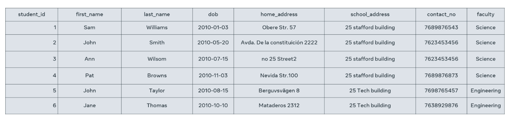

* Each table must have a **primary key**, a column (or combination of columns) that uniquely identifies each row.
  * It cannot be NULL and must be unique.
  * It can be **composite** (multiple columns) if one column is not sufficient.
* Tables are connected through **foreign keys**, which reference the primary key of another table.
  * This creates relationships between tables and enables meaningful queries across them.

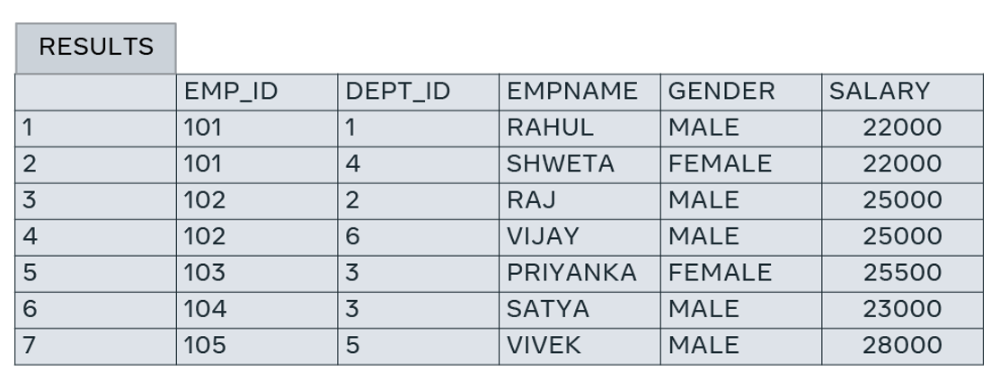

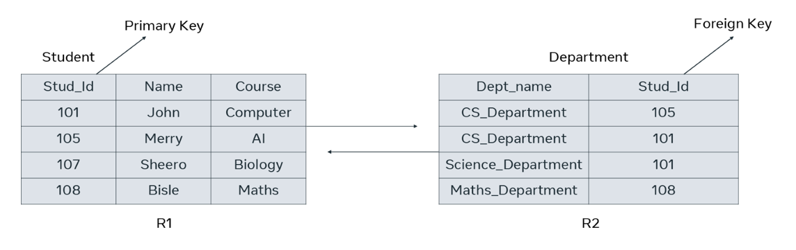

* Databases enforce **integrity constraints** to maintain correct and consistent data:
  * **Key constraints**: ensure primary keys are unique and not null.
  * **Domain constraints**: restrict allowed values in columns.
  * **Referential integrity constraints**: ensure foreign key values exist in the referenced table.
* Together, these concepts (tables, schema, data types, keys, relationships, and constraints) define how relational databases structure, link, and validate data.

#### Database Structure

* **Database structure** refers to how data is organized within a database, typically in tables composed of rows (records/tuples) and columns (fields/attributes).
* The main structural components of a database include:
  * **Tables (entities)**: store data about a specific concept.
  * **Attributes/fields (columns)**: describe properties of the entity.
  * **Records (rows)**: represent individual instances of the entity.
  * **Data elements (cell values)**: individual pieces of data in each field.
  * **Primary key**: uniquely identifies each record.
* Each column has a **data type**, which defines the kind of data it can store and how it is processed.
  * Common types include numeric, date/time, string, binary, and large object types (CLOB, BLOB).

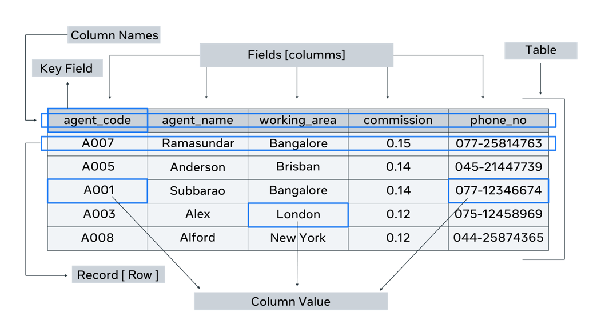

* The **logical database structure** is represented using an **Entity Relationship Diagram (ERD)**.
  * It visually shows entities, attributes, and relationships.
  * Relationships have **cardinality**: one-to-one, one-to-many, and many-to-many.

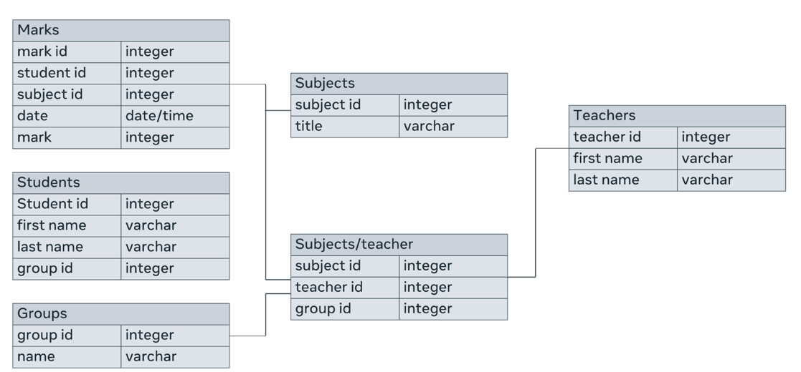

* The **physical database structure** implements the logical design using actual tables in a DBMS (e.g., MySQL or Oracle Database).
  * Relationships are created using **foreign keys**, which reference primary keys in other tables.
* Together, tables, fields, records, keys, data types, and relationships define how data is structured, linked, and stored in a relational database.

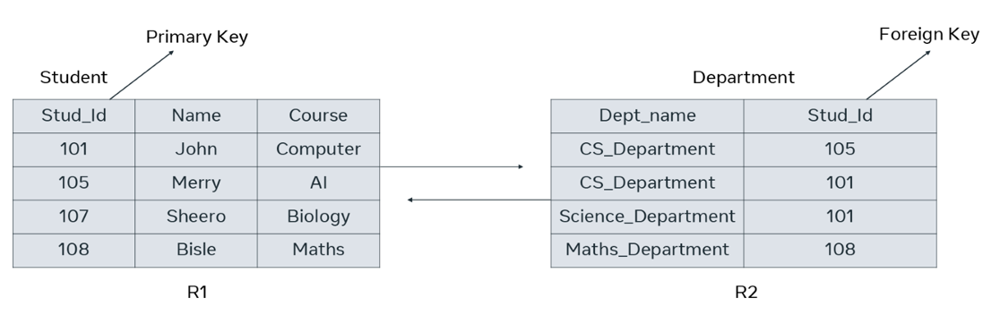

#### Type of Keys in a Database Table

* The relational database model is based on **entities (tables)** and **relationships** between them, which are established using keys.
* Tables contain attributes (columns), which can be:
  * **Simple attributes** (single value per row).
  * **Multi-valued attributes** (multiple values), which should generally be avoided in relational design.
* A **key attribute** is any column used to uniquely identify a record in a table (e.g., staff ID).
* There are several types of keys in relational databases:
  * **Primary key**: the main unique identifier for each record; cannot be duplicated or null.
  * **Candidate keys**: all columns that could uniquely identify a record.
  * **Alternate (secondary) key**: a candidate key not chosen as the primary key.
  * **Composite key**: a combination of multiple columns used as a unique identifier when a single column is insufficient.
  * **Foreign key**: a column that references the primary key in another table, establishing relationships between tables.
* Non-key attributes are columns that do not uniquely identify records and may contain duplicate values.
* Relationships between tables are built by linking **primary keys** in one table to **foreign keys** in another, enabling structured and connected data across the database.

## 2. CRUD Operations: Create, Read, Update, Delete

### MySQL Setup

This module uses MySQL as the relational database management system (RDBMS) for practicing SQL commands and CRUD operations.

See my note on [MySQL Installation on Windows](https://github.com/mxagar/sql_guide/blob/main/SQL_Guide.md#windows-1).

After that, the exercises can be carried out using MySQL Workbench or the MySQL command line interface.

### SQL Data Types

#### Numeric Data Types

* **Data types** define what kind of values each column in a table can store and how the database interprets them.
* When creating a table, each column must be assigned a data type to ensure data consistency and correct formatting.
* Common data type categories include:
  * Numeric
  * String
  * Date and time
* **Numeric data types** are used to store numbers and include two main types:
  * **Integer**: stores whole numbers (e.g., product quantity).
  * **Decimal**: stores numbers with fractional values (e.g., prices).
* Integer columns automatically round fractional inputs to whole numbers, while decimal columns preserve fractional values.
* Different database systems provide multiple variants of numeric types with different ranges (e.g., `TINYINT`, `INT`).
* Numeric types can typically store both positive and negative values, and some systems allow restricting values to positive only.
* Choosing the correct data type ensures accurate data storage, efficient processing, and proper validation of input values.

#### Exercise: Working with Numbers

See the instructions in [02_Databases/lab/01_numbers/Instructions.md](./lab/01_numbers/Instructions.md).

In the example, the following is done:

- A new database called `cm_devices` is created.
- The `cm_devices` database is selected with `USE`.
- A table called `devices` is created to store mobile device information.
- The table contains:
  * `deviceID`: an integer value for the device identifier.
  * `deviceName`: a string value for the device name.
  * `price`: a decimal value for the device price.
- The created table and its columns are checked with `SHOW TABLES` and `SHOW COLUMNS`.

To carry out the exercise, we need MySQL installed -- check the [MySQL Setup](#mysql-setup) section above. Then, we open the CLI:

```bash
# On local Windows machine (we need root PW)
mysql -u root -p

# ... Or on Coursera VSCode Terminal:
mysql
```

And the SQL commands executed are the following:

```sql
-- Create database
CREATE DATABASE cm_devices;

-- Select database
USE cm_devices;

-- Create table for mobile devices
CREATE TABLE devices (
  deviceID INT,
  deviceName VARCHAR(50),
  price DECIMAL
);

-- Check that the table was created
SHOW TABLES;
--- +----------------------+
--- | Tables_in_cm_devices |
--- +----------------------+
--- | devices              |
--- +----------------------+

-- Check the table structure
SHOW COLUMNS FROM devices;
--- +------------+---------------+------+-----+---------+-------+
--- | Field      | Type          | Null | Key | Default | Extra |
--- +------------+---------------+------+-----+---------+-------+
--- | deviceID   | int           | YES  |     | NULL    |       |
--- | deviceName | varchar(50)   | YES  |     | NULL    |       |
--- | price      | decimal(10,0) | YES  |     | NULL    |       |
--- +------------+---------------+------+-----+---------+-------+
```

The optional additional task asks us to create another table for device stock. The appropriate table name is `stock`, with the following columns:

- `deviceID`: integer device identifier.
- `quantity`: integer number of devices in stock.
- `totalCost`: decimal total cost of that quantity.

The SQL statement is:

```sql
CREATE TABLE stock (
  deviceID INT,
  quantity INT,
  totalCost DECIMAL
);
```

#### String Data Types

* **String data types** are used for columns that store text or mixed character data, including letters, numbers, and special characters.
* Assigning the correct string data type helps maintain **data integrity** by ensuring valid values are stored in each column.
* Common examples of string-based fields include names, usernames, passwords, and email addresses.
* The two most common string data types are:
  * `CHAR`: fixed-length character storage.
  * `VARCHAR`: variable-length character storage.
* `CHAR(n)` reserves exactly `n` characters of storage, regardless of the actual text length.
  * Best used when the size of the stored data is predictable and constant.
* `VARCHAR(n)` stores only the actual number of characters entered, up to a maximum length of `n`.
  * Best used when text lengths vary.
* Additional text data types support larger amounts of text:
  * `TINYTEXT`: short text (<255 characters).
  * `TEXT`: medium-sized text (<65k characters).
  * `MEDIUMTEXT`: very large text (~16.7 million characters).
  * `LONGTEXT`: extremely large text (up to several GB).

```sql
-- Fixed-length string: always reserves 50 characters
username CHAR(50);

-- Variable-length string: stores only used characters, up to 50
student_name VARCHAR(50);

-- Short text content
description TINYTEXT;

-- Article-sized text
article TEXT;

-- Book-sized text
book_content MEDIUMTEXT;

-- Very large text storage
large_document LONGTEXT;
```

#### Exercise: Working with Strings

See the instructions in [02_Databases/lab/02_strings/Instructions.md](./lab/02_strings/Instructions.md) and the tips in [02_Databases/lab/02_strings/README.md](./lab/02_strings/README.md).

In the example, the following is done:

- The existing `cm_devices` database is used. If it does not exist yet, it is created first.
- A table called `customers` is created to store customer information.
- The table contains:
  * `username`: a fixed-length string value for the customer username.
  * `fullName`: a variable-length string value for the customer's full name.
  * `email`: a variable-length string value for the customer's email address.
- `CHAR` is used for values with a fixed length, while `VARCHAR` is used for values whose length can vary.
- The created table and its columns are checked with `SHOW TABLES` and `SHOW COLUMNS`.

To carry out the exercise, we need MySQL installed -- check the [MySQL Setup](#mysql-setup) section above. Then, we open the CLI:

```bash
# On local Windows machine (we need root PW)
mysql -u root -p

# ... Or on Coursera VSCode Terminal:
mysql
```

And the SQL commands executed are the following:

```sql
-- Create database if needed
CREATE DATABASE cm_devices;

-- Select database
USE cm_devices;

-- Create table for customer information
CREATE TABLE customers (
  username CHAR(9),
  fullName VARCHAR(100),
  email VARCHAR(255)
);

-- Check that the table was created
SHOW TABLES;
--- +----------------------+
--- | Tables_in_cm_devices |
--- +----------------------+
--- | customers            |
--- | devices              |
--- | stock                |
--- +----------------------+

-- Check the table structure
SHOW COLUMNS FROM customers;
--- +----------+--------------+------+-----+---------+-------+
--- | Field    | Type         | Null | Key | Default | Extra |
--- +----------+--------------+------+-----+---------+-------+
--- | username | char(9)      | YES  |     | NULL    |       |
--- | fullName | varchar(100) | YES  |     | NULL    |       |
--- | email    | varchar(255) | YES  |     | NULL    |       |
--- +----------+--------------+------+-----+---------+-------+
```

The optional additional task asks us to create another table for customer feedback. The appropriate table name is `feedback`, with the following columns:

- `feedbackID`: fixed-length string value for the feedback identifier.
- `feedbackType`: variable-length string value for the feedback category.
- `comment`: text value for the feedback comment.

The SQL statement is:

```sql
CREATE TABLE feedback (
  feedbackID CHAR(8),
  feedbackType VARCHAR(100),
  comment TEXT(500)
);
```

#### Default Values

* **Database constraints** enforce rules on tables and columns to ensure data accuracy, consistency, and reliability.
* Constraints can operate at:
  * **Column level**: apply rules to a specific column.
  * **Table level**: enforce rules involving multiple columns or relationships between tables.
* If inserted or updated data violates a constraint, the database rejects the operation.
* Two common constraints are:
  * `NOT NULL`: prevents columns from containing empty (`NULL`) values.
  * `DEFAULT`: automatically assigns a predefined value when no value is provided.
* `NOT NULL` is typically used for mandatory fields such as IDs or names, ensuring records are always complete.
* `DEFAULT` is useful when many rows share a common value, reducing repeated manual input.
  * Example: automatically assigning `"Barcelona"` as the default city for players.
* Constraints help maintain data integrity and prevent invalid or incomplete data from entering the database.

```sql
-- Create a table with NOT NULL constraints
CREATE TABLE customer (
    customer_id INT NOT NULL,
    customer_name VARCHAR(100) NOT NULL
);
-- Ensures both columns always contain values

-- Create a table with a DEFAULT constraint
CREATE TABLE player (
    player_name VARCHAR(100) NOT NULL,
    city VARCHAR(100) DEFAULT 'Barcelona'
);
-- Automatically inserts 'Barcelona' if no city is provided
```

#### Exercise: Working with Default Values

See the instructions in [02_Databases/lab/03_default_values/Instructions.md](./lab/03_default_values/Instructions.md) and the tips in [02_Databases/lab/03_default_values/README.md](./lab/03_default_values/README.md).

In the example, the following is done:

- The existing `cm_devices` database is used. If it does not exist yet, it is created first.
- A table called `address` is created to store customer address information.
- The table contains:
  * `id`: an integer value for the customer identifier, which must not be `NULL`.
  * `street`: a variable-length string value for the street address.
  * `postcode`: a variable-length string value for the postcode.
  * `town`: a variable-length string value for the town name.
- The `town` column uses the `DEFAULT` constraint so that `Harrow` is inserted automatically when no town is provided.
- The created table and its columns are checked with `SHOW TABLES` and `SHOW COLUMNS`.

To carry out the exercise, we need MySQL installed -- check the [MySQL Setup](#mysql-setup) section above. Then, we open the CLI:

```bash
# On local Windows machine (we need root PW)
mysql -u root -p

# ... Or on Coursera VSCode Terminal:
mysql
```

And the SQL commands executed are the following:

```sql
-- Create database if needed
CREATE DATABASE cm_devices;

-- Select database
USE cm_devices;

-- Create table for customer addresses
CREATE TABLE address (
  id INT NOT NULL,
  street VARCHAR(255),
  postcode VARCHAR(10),
  town VARCHAR(30) DEFAULT 'Harrow'
);

-- Check that the table was created
SHOW TABLES;
--- +----------------------+
--- | Tables_in_cm_devices |
--- +----------------------+
--- | address              |
--- | customers            |
--- | devices              |
--- | feedback             |
--- | stock                |
--- +----------------------+

-- Check the table structure
SHOW COLUMNS FROM address;
--- +----------+--------------+------+-----+---------+-------+
--- | Field    | Type         | Null | Key | Default | Extra |
--- +----------+--------------+------+-----+---------+-------+
--- | id       | int          | NO   |     | NULL    |       |
--- | street   | varchar(255) | YES  |     | NULL    |       |
--- | postcode | varchar(10)  | YES  |     | NULL    |       |
--- | town     | varchar(30)  | YES  |     | Harrow  |       |
--- +----------+--------------+------+-----+---------+-------+
```

The optional additional task asks us to create the `address` table again, this time with default values for both `postcode` and `town`. Before recreating the table, the existing `address` table must be dropped.

The SQL statements are:

```sql
DROP TABLE address;

CREATE TABLE address (
  id INT NOT NULL,
  street VARCHAR(255),
  postcode VARCHAR(10) DEFAULT 'HA97DE',
  town VARCHAR(30) DEFAULT 'Harrow'
);
```

#### Exercise: Choosing Types

See the instructions in [02_Databases/lab/04_choosing_types/Instructions.md](./lab/04_choosing_types/Instructions.md) and the tips in [02_Databases/lab/04_choosing_types/README.md](./lab/04_choosing_types/README.md).

In the example, the following is done:

- The existing `cm_devices` database is used. If it does not exist yet, it is created first.
- A table called `invoice` is created to store customer order information.
- The table contains:
  * `customerID`: a variable-length string value for the customer identifier.
  * `orderDate`: a date value for the order date.
  * `quantity`: an integer value for the number of products ordered.
  * `price`: a decimal value for the total price.
- A suitable data type is chosen for each kind of data: string, date, whole number, and decimal number.
- The created table and its columns are checked with `SHOW TABLES` and `SHOW COLUMNS`.

To carry out the exercise, we need MySQL installed -- check the [MySQL Setup](#mysql-setup) section above. Then, we open the CLI:

```bash
# On local Windows machine (we need root PW)
mysql -u root -p

# ... Or on Coursera VSCode Terminal:
mysql
```

And the SQL commands executed are the following:

```sql
-- Create database if needed
CREATE DATABASE cm_devices;

-- Select database
USE cm_devices;

-- Create table for customer invoices
CREATE TABLE invoice (
  customerID VARCHAR(50),
  orderDate DATE,
  quantity INT,
  price DECIMAL
);

-- Check that the table was created
SHOW TABLES;
--- +----------------------+
--- | Tables_in_cm_devices |
--- +----------------------+
--- | address              |
--- | customers            |
--- | devices              |
--- | feedback             |
--- | invoice              |
--- | stock                |
--- +----------------------+

-- Check the table structure
SHOW COLUMNS FROM invoice;
--- +------------+---------------+------+-----+---------+-------+
--- | Field      | Type          | Null | Key | Default | Extra |
--- +------------+---------------+------+-----+---------+-------+
--- | customerID | varchar(50)   | YES  |     | NULL    |       |
--- | orderDate  | date          | YES  |     | NULL    |       |
--- | quantity   | int           | YES  |     | NULL    |       |
--- | price      | decimal(10,0) | YES  |     | NULL    |       |
--- +------------+---------------+------+-----+---------+-------+
```

The optional additional task asks us to choose data types for a new table that stores customer contact details. A suitable table name is `contact_details`, with the following columns:

- `accountNumber`: integer value for the customer's account number.
- `phoneNumber`: integer value for the customer's phone number.
- `email`: variable-length string value for the customer's email address.

The SQL statement is:

```sql
CREATE TABLE contact_details (
  accountNumber INT,
  phoneNumber INT,
  email VARCHAR(255)
);
```

### Create and Read

#### CREATE and DROP Database

* Before creating a database, developers must understand its purpose and determine what data needs to be stored and organized into tables.
* Databases for real applications (e.g., an online bookstore) may store information such as books, authors, customers, and sales.
* SQL provides commands to create and remove databases:
  * `CREATE DATABASE` creates a new database.
  * `DROP DATABASE` deletes an existing database.
* Database names should be meaningful, unique, and follow database naming rules (e.g., maximum length restrictions).
* SQL statements typically end with a semicolon (`;`).

```sql
-- Create a new database
CREATE DATABASE bookstore_db;
-- Creates a database named "bookstore_db"

-- Delete an existing database
DROP DATABASE bookstore_db;
-- Permanently removes the database
```

#### CREATE TABLE

* Tables are used to organize and structure data within a database so that information can be stored and retrieved efficiently.
* Before creating tables, a database must already exist on the server.
* SQL uses the `CREATE TABLE` statement to define a new table.
  * The statement includes the table name, column names, and the data type of each column.
* Columns define what data is stored in the table and what type of values are allowed.
  * Example data types include `VARCHAR` for text and `INT` for whole numbers.
* The table structure is written inside parentheses, with columns separated by commas.

```sql
-- Create a customer table
CREATE TABLE customers (
    customer_name VARCHAR(100),
    phone_number INT
);
-- Creates a table with:
-- - customer_name: text up to 100 characters
-- - phone_number: integer values only

-- Another example with more columns
CREATE TABLE customers
    (CustomerId INT, 
    FirstName VARCHAR(40), 
    LastName VARCHAR(20), 
    Company VARCHAR(80), 
    Address VARCHAR(70), 
    City VARCHAR(40),
    State VARCHAR(40), 
    Country VARCHAR(40), 
    PostalCode VARCHAR(10), 
    Phone VARCHAR(24), 
    Fax VARCHAR(24), 
    Email VARCHAR(60), 
    SupportRapid INT );   
```

#### ALTER TABLE

* Database tables are not static and often need to be modified as requirements evolve.
* SQL uses the `ALTER TABLE` statement to change the structure of existing tables.
* Common table modifications include:
  * Adding new columns.
  * Removing existing columns.
  * Changing column definitions or attributes (e.g., data type or size).
* To alter a table, the database and target table must already exist.
* The `ADD` command is used to insert new columns into a table, including their data types and constraints.
* The `DROP COLUMN` command removes unnecessary columns from a table.
* The `MODIFY` command changes the definition of an existing column, such as increasing the maximum allowed length of a `VARCHAR` field.

```sql
-- Add new columns to a table
ALTER TABLE students
ADD (
    age INT,
    country VARCHAR(50),
    nationality VARCHAR(255)
);
-- Adds three new columns with specified data types


-- Remove a column from a table
ALTER TABLE students
DROP COLUMN nationality;
-- Deletes the nationality column


-- Modify an existing column
ALTER TABLE students
MODIFY country VARCHAR(100);
-- Changes the maximum length of the country column
```

#### INSERT

* SQL uses the `INSERT INTO` statement to add new rows of data into existing database tables.
* An insert statement specifies:
  * The table name.
  * The target columns.
  * The values to insert.
* Values must match the order and data types of the specified columns.
* Non-numeric values such as strings and dates are typically enclosed in quotation marks.
* Multiple rows can be inserted in a single statement by separating value groups with commas.
* Dates should follow the correct database date format (commonly `YYYY-MM-DD`) to avoid errors.
* SQL functions such as `CURRENT_DATE()` can automatically insert the current date.
* Existing table contents can be retrieved using the `SELECT` statement with `*` to return all columns.

```sql
-- Insert a single row into a table
INSERT INTO players (id, name, age, start_date)
VALUES (1, 'Yuval', 25, '2020-10-15');


-- Insert multiple rows at once
INSERT INTO players (id, name, age, start_date)
VALUES
    (2, 'Mark', 27, '2020-10-12'),
    (3, 'Karl', 26, '2020-10-07');


-- Insert current date automatically
INSERT INTO players (id, name, age, start_date)
VALUES (4, 'Anna', 24, CURRENT_DATE());


-- Retrieve all rows and columns from a table
SELECT * FROM players;
```

#### Exercise: Create and Populate a Table

See the instructions in [02_Databases/lab/05_create_populate_table/Instructions.md](./lab/05_create_populate_table/Instructions.md) and the tips in [02_Databases/lab/05_create_populate_table/README.md](./lab/05_create_populate_table/README.md).

In the example, the following is done:

- A new database called `bookshop` is created.
- The `bookshop` database is selected with `USE`.
- A table called `customers` is created to store customer information.
- The table contains:
  * `customerID`: an integer value for the customer identifier.
  * `customerName`: a variable-length string value for the customer name.
  * `customerAddress`: a variable-length string value for the customer address.
- One customer record is inserted into the `customers` table.
- The inserted data is checked with `SELECT`.

To carry out the exercise, we need MySQL installed -- check the [MySQL Setup](#mysql-setup) section above. Then, we open the CLI:

```bash
# On local Windows machine (we need root PW)
mysql -u root -p

# ... Or on Coursera VSCode Terminal:
mysql
```

And the SQL commands executed are the following:

```sql
-- Create database
CREATE DATABASE bookshop;

-- Select database
USE bookshop;

-- Create table for bookshop customers
CREATE TABLE customers (
  customerID INT,
  customerName VARCHAR(50),
  customerAddress VARCHAR(255)
);

-- Check that the table was created
SHOW TABLES;
--- +--------------------+
--- | Tables_in_bookshop |
--- +--------------------+
--- | customers          |
--- +--------------------+

-- Insert one customer record
INSERT INTO customers (customerID, customerName, customerAddress)
VALUES (1, 'Jack', '115 Old street Belfast');

-- Read the inserted data
SELECT * FROM customers;
--- +------------+--------------+-------------------------+
--- | customerID | customerName | customerAddress         |
--- +------------+--------------+-------------------------+
--- |          1 | Jack         | 115 Old street Belfast  |
--- +------------+--------------+-------------------------+
```

The optional additional task asks us to insert another customer record into the `customers` table:

- `customerID`: `2`
- `customerName`: `James`
- `customerAddress`: `24 Carlson Rd London`

The SQL statement is:

```sql
INSERT INTO customers (customerID, customerName, customerAddress)
VALUES (2, 'James', '24 Carlson Rd London');
```

#### SELECT

* The SQL `SELECT` statement is used to query and retrieve data from database tables.
* A basic `SELECT` query specifies:
  * The column(s) to retrieve.
  * The table containing the data using the `FROM` keyword.
* Queries can retrieve:
  * A single column.
  * Multiple columns separated by commas.
  * All columns using the `*` wildcard.
* The result of a `SELECT` query is a result set displayed in table form.
* `SELECT` can also be used for tasks such as calculations, date/time queries, and string operations.
* SQL statements commonly end with a semicolon (`;`).

```sql
-- Retrieve a single column
SELECT name
FROM players;

-- Retrieve multiple columns
SELECT name, level
FROM players;

-- Retrieve all columns by listing them explicitly
SELECT id, name, age, level
FROM players;

-- Retrieve all columns using wildcard shorthand
SELECT *
FROM players;
```

#### INSERT INTO SELECT

* The SQL `INSERT INTO ... SELECT` statement is used to copy or transfer data from one table (source table) into another table (target table).
* This statement combines querying (`SELECT`) and insertion (`INSERT INTO`) in a single operation.
* The workflow is:
  * Select data from a column in the source table.
  * Insert the query results into a column in the target table.
* The target column and source column should usually have compatible data types and matching logical structure.
* `INSERT INTO ... SELECT` is useful for populating tables, migrating data, or duplicating information between related tables.

```sql
-- Copy data from one table into another
INSERT INTO country (countryName)
SELECT country
FROM players;
-- Retrieves values from the "country" column
-- in the players table and inserts them
-- into the countryName column of the country table:
-- country.countryName <- players.country
```

#### Exercise: Practicing Table Creation

See the instructions in [02_Databases/lab/06_table_creation/Instructions.md](./lab/06_table_creation/Instructions.md) and the tips in [02_Databases/lab/06_table_creation/README.md](./lab/06_table_creation/README.md).

In the example, the following is done:

- A new database called `football_club` is created.
- The `football_club` database is selected with `USE`.
- A table called `players` is created to store basic player information.
- The table contains:
  * `playerID`: an integer value for the player identifier.
  * `playerName`: a variable-length string value for the player name.
  * `age`: an integer value for the player's age.
- The created table is checked with `SHOW TABLES`.

To carry out the exercise, we need MySQL installed -- check the [MySQL Setup](#mysql-setup) section above. Then, we open the CLI:

```bash
# On local Windows machine (we need root PW)
mysql -u root -p

# ... Or on Coursera VSCode Terminal:
mysql
```

And the SQL commands executed are the following:

```sql
-- Create database
CREATE DATABASE football_club;

-- Select database
USE football_club;

-- Create table for football club players
CREATE TABLE players (
  playerID INT,
  playerName VARCHAR(50),
  age INT
);

-- Check that the table was created
SHOW TABLES;
--- +-------------------------+
--- | Tables_in_football_club |
--- +-------------------------+
--- | players                 |
--- +-------------------------+

-- Check the table structure
SHOW COLUMNS FROM players;
--- +------------+-------------+------+-----+---------+-------+
--- | Field      | Type        | Null | Key | Default | Extra |
--- +------------+-------------+------+-----+---------+-------+
--- | playerID   | int         | YES  |     | NULL    |       |
--- | playerName | varchar(50) | YES  |     | NULL    |       |
--- | age        | int         | YES  |     | NULL    |       |
--- +------------+-------------+------+-----+---------+-------+
```

The optional additional task asks us to create another table for the games the team will play. The appropriate table name is `games`, with the following columns:

- `gameID`: integer value for the game identifier.
- `gameDate`: date value for when the game is played.
- `score`: integer value for the game score.

The SQL statement is:

```sql
CREATE TABLE games (
  gameID INT,
  gameDate DATE,
  score INT
);
```

### Update and Delete

#### Updating Data

* The SQL `UPDATE` statement is used to modify existing data in a table.
* The basic structure of an update query includes:
  * `UPDATE` to specify the target table.
  * `SET` to define which columns and values should change.
  * `WHERE` to specify which records should be updated.
* Column-value assignments in the `SET` clause are written as `column = value` pairs and separated by commas.
* The `WHERE` clause is critical because it limits updates to specific rows; without it, all rows in the table may be modified.
* `UPDATE` can modify:
  * A single row.
  * Multiple rows matching a condition.
  * Multiple columns at once.
* String values are enclosed in quotation marks.

```sql
-- Update one student's address and contact number
UPDATE student
SET
    home_address = 'New Address',
    contact_number = '123456789'
WHERE id = 3;
-- Updates only the student with id = 3


-- Update all engineering students
UPDATE student
SET college_address = 'Harper Building'
WHERE department = 'Engineering';
-- Updates multiple rows matching the condition


-- Update multiple columns in multiple rows
UPDATE student
SET
    college_address = 'Harper Building',
    home_address = 'Updated Address'
WHERE department = 'Engineering';
-- Updates two columns for all engineering students
```

#### DELETE

* The SQL `DELETE` statement is used to remove records (rows) from a table.
* The basic syntax includes:
  * `DELETE FROM` to specify the target table.
  * `WHERE` to define which records should be deleted.
* The `WHERE` clause is essential because it limits deletion to matching rows.
  * Without a `WHERE` clause, all rows in the table are deleted.
* `DELETE` can remove:
  * A single record.
  * Multiple records matching a condition.
  * All records in a table.
* After executing a delete operation, the table structure remains intact; only the data rows are removed.

```sql
-- Delete a single record
DELETE FROM student
WHERE last_name = 'Miller';
-- Removes the student whose last name is Miller


-- Delete multiple records
DELETE FROM student
WHERE department = 'Engineering';
-- Removes all students in the Engineering department


-- Delete all records from a table
DELETE FROM student;
-- Removes every row from the student table
```

#### Exercise: Record Deletion

See the instructions in [02_Databases/lab/07_record_deletion/Instructions.md](./lab/07_record_deletion/Instructions.md) and the tips in [02_Databases/lab/07_record_deletion/README.md](./lab/07_record_deletion/README.md).

In the example, the following is done:

- The existing `bookshop` database is used.
- The existing `customers` table is prepared with customer data.
- The table contains:
  * `customerID`: an integer value for the customer identifier.
  * `customerName`: a variable-length string value for the customer name.
  * `customerAddress`: a variable-length string value for the customer address.
- The `customers` table is emptied with `TRUNCATE TABLE` to avoid duplicate records.
- Six customer records are inserted into the table.
- Jimmy's record is deleted from the table using `DELETE`.
- The remaining table contents are checked with `SELECT`.

To carry out the exercise, we need MySQL installed -- check the [MySQL Setup](#mysql-setup) section above. Then, we open the CLI:

```bash
# On local Windows machine (we need root PW)
mysql -u root -p

# ... Or on Coursera VSCode Terminal:
mysql
```

And the SQL commands executed are the following:

```sql
-- Create database if needed
CREATE DATABASE IF NOT EXISTS bookshop;

-- Select database
USE bookshop;

-- Create table if needed
CREATE TABLE IF NOT EXISTS customers (
  customerID INT,
  customerName VARCHAR(50),
  customerAddress VARCHAR(255)
);

-- Empty the table to avoid duplicate records
TRUNCATE TABLE customers;

-- Insert customer records
INSERT INTO customers (customerID, customerName, customerAddress)
VALUES
  (1, 'Jack', '115 Old street Belfast'),
  (2, 'James', '24 Carlson Rd London'),
  (4, 'Maria', '5 Fredrik Rd, Bedford'),
  (5, 'Jade', '10 Copland Ave Portsmouth'),
  (6, 'Yasmine', '15 Fredrik Rd, Bedford'),
  (3, 'Jimmy', '110 Copland Ave Portsmouth');

-- Check the table before deleting the record
SELECT * FROM customers;
--- +------------+--------------+----------------------------+
--- | customerID | customerName | customerAddress            |
--- +------------+--------------+----------------------------+
--- |          1 | Jack         | 115 Old street Belfast     |
--- |          2 | James        | 24 Carlson Rd London       |
--- |          4 | Maria        | 5 Fredrik Rd, Bedford      |
--- |          5 | Jade         | 10 Copland Ave Portsmouth  |
--- |          6 | Yasmine      | 15 Fredrik Rd, Bedford     |
--- |          3 | Jimmy        | 110 Copland Ave Portsmouth |
--- +------------+--------------+----------------------------+

-- Delete Jimmy's record
DELETE FROM customers
WHERE customerID = 3;

-- Check that Jimmy's record was deleted
SELECT * FROM customers;
--- +------------+--------------+---------------------------+
--- | customerID | customerName | customerAddress           |
--- +------------+--------------+---------------------------+
--- |          1 | Jack         | 115 Old street Belfast    |
--- |          2 | James        | 24 Carlson Rd London      |
--- |          4 | Maria        | 5 Fredrik Rd, Bedford     |
--- |          5 | Jade         | 10 Copland Ave Portsmouth |
--- |          6 | Yasmine      | 15 Fredrik Rd, Bedford    |
--- +------------+--------------+---------------------------+
```

The optional additional task asks us to delete Yasmine's record from the `customers` table. In the inserted data above, Yasmine's `customerID` is `6`.

The SQL statement is:

```sql
DELETE FROM customers
WHERE customerID = 6;
```

## 3. SQL Operators and Sorting and Filtering Data

### SQL Operators

#### SQL Arithmetic Operators

* SQL operators are special symbols or keywords used to manipulate data and perform operations within a database.
* Arithmetic operators in SQL allow mathematical calculations to be performed directly in queries.
* Common SQL arithmetic operators include:
  * `+` for addition
  * `-` for subtraction
  * `*` for multiplication
  * `/` for division
  * `%` for modulus (remainder of division)
* Arithmetic operations work by applying an operator to two operands and returning a result.
* SQL arithmetic operators can be used inside both the `SELECT` clause and the `WHERE` clause.
  * In `SELECT`, they calculate and return derived values.
  * In `WHERE`, they filter rows based on computed conditions.
* Arithmetic operators are useful for practical database tasks such as salary calculations, allowances, leave balances, and other numeric analyses.
  * Columns can be used as operands in arithmetic expressions to compute new values or filter data based on calculated criteria.


```sql
-- Addition
SELECT 10 + 15;
-- Returns 25


-- Subtraction
SELECT 10 - 5;
-- Returns 5


-- Multiplication
SELECT 5 * 5;
-- Returns 25


-- Division
SELECT 10 / 2;
-- Returns 5


-- Modulus (remainder)
SELECT 100 % 10;
-- Returns 0 because 100 divided by 10 has no remainder


-- Addition: calculate total salary
SELECT salary + allowance
FROM employee;


-- Addition in WHERE clause
SELECT *
FROM employee
WHERE salary + allowance = 25000;
-- Returns employees whose total salary is 25000


-- Subtraction: salary after tax
SELECT salary - tax
FROM employee;


-- Subtraction in WHERE clause
SELECT *
FROM employee
WHERE salary - tax = 50000;
-- Returns employees with post-tax salary of 50000


-- Multiplication: double tax values
SELECT tax * 2
FROM employee;


-- Multiplication in WHERE clause
SELECT *
FROM employee
WHERE tax * 2 = 4000;
-- Returns employees whose doubled tax equals 4000


-- Division: calculate allowance percentage
SELECT allowance / salary * 100
FROM employee;


-- Division in WHERE clause
SELECT *
FROM employee
WHERE allowance / salary * 100 >= 5;
-- Returns employees receiving at least 5% allowance


-- Modulus: check even/odd values
SELECT hours % 2
FROM employee;
-- 0 = even, 1 = odd


-- Modulus in WHERE clause
SELECT *
FROM employee
WHERE hours % 2 = 0;
-- Returns employees with even working hours


-- Add a $500 bonus to salaries
SELECT salary + 500
FROM employee;


-- Deduct $500 from salaries
SELECT salary - 500
FROM employee;


-- Double employee salaries
SELECT salary * 2
FROM employee;


-- Calculate monthly salary
SELECT salary / 12
FROM employee;


-- Determine whether employee IDs are even or odd
SELECT id % 2
FROM employee;
-- 0 = even ID
-- 1 = odd ID
```

#### SQL Comparison Operators

* SQL comparison operators are used to compare values or expressions and return either `TRUE` or `FALSE`.
* Comparison operators are commonly used in the `WHERE` clause to filter records in queries.
* SQL supports the following comparison operators:
  * `=` equal to
  * `<` less than
  * `>` greater than
  * `<=` less than or equal to
  * `>=` greater than or equal to
  * `<>` or `!=` not equal to
* Comparison operators help include or exclude rows based on conditions, such as filtering employees by salary ranges.
* Queries often combine `SELECT *` with `WHERE` conditions to retrieve matching records from a table.


```sql
-- Equal to
SELECT *
FROM employee
WHERE salary = 18000;
-- Returns employees earning exactly 18000


-- Less than
SELECT *
FROM employee
WHERE salary < 24000;
-- Returns employees earning less than 24000


-- Less than or equal to
SELECT *
FROM employee
WHERE salary <= 24000;
-- Returns employees earning 24000 or less


-- Greater than or equal to
SELECT *
FROM employee
WHERE salary >= 24000;
-- Returns employees earning 24000 or more


-- Not equal to
SELECT *
FROM employee
WHERE salary <> 24000;
-- Returns employees whose salary is not 24000


-- Equality with numeric data
SELECT *
FROM employee
WHERE employee_ID = 1;
-- Returns the employee with ID 1


-- Equality with text data
SELECT *
FROM employee
WHERE employee_name = 'James';
-- Text values use single quotes


-- Inequality
SELECT *
FROM employee
WHERE salary <> 24000;
-- Same as: salary != 24000


-- Greater than
SELECT *
FROM employee
WHERE salary > 50000;
-- Returns employees earning more than 50000


-- Greater than or equal
SELECT *
FROM employee
WHERE tax >= 1000;
-- Returns employees with tax of at least 1000


-- Less than
SELECT *
FROM employee
WHERE allowance < 2500;
-- Returns employees with allowance below 2500


-- Less than or equal
SELECT *
FROM employee
WHERE hours <= 10;
-- Returns employees working 10 hours or fewer
```

### Sorting and Filtering Data

#### ORDER BY

* The SQL `ORDER BY` clause is used to sort query results in either ascending or descending order.
* `ORDER BY` is typically added to a `SELECT` statement after the `FROM` clause.
* Sorting can be performed on:
  * A single column.
  * Multiple columns.
* SQL supports two sorting directions:
  * `ASC` --> ascending order (default).
  * `DESC` --> descending order.
* The sorting behavior depends on the column data type:
  * Numeric columns are sorted numerically.
  * Text/string columns are sorted alphabetically.
* Multiple-column sorting allows different ordering directions per column.
* Using `*` in a `SELECT` statement retrieves all columns without listing them individually.

```sql
-- Sort by a single column in ascending order
SELECT id, first_name, last_name, nationality
FROM student
ORDER BY nationality ASC;


-- ASC is optional because ascending is the default
SELECT id, first_name, last_name, nationality
FROM student
ORDER BY nationality;


-- Sort by a single column in descending order
SELECT id, first_name, last_name, nationality
FROM student
ORDER BY nationality DESC;


-- Sort by multiple columns
SELECT
    id,
    first_name,
    last_name,
    date_of_birth,
    nationality
FROM student
ORDER BY
    nationality ASC,
    date_of_birth DESC;
-- First sorts alphabetically by nationality,
-- then sorts by youngest-to-oldest within each nationality


-- Retrieve and sort all columns
SELECT *
FROM student
ORDER BY nationality ASC;
```

#### WHERE and Comparison & Logical Operators

* The SQL `WHERE` clause is used to filter records and retrieve only rows that satisfy a specified condition.
* `WHERE` is commonly used with `SELECT`, but it can also be used with `UPDATE` and `DELETE` statements.
* A `WHERE` condition typically contains:
  * A column name.
  * An operator.
  * A value (operand).
* Operands can be numeric or text values.
  * Text values must be enclosed in single quotes.
* Common **comparison operators** used in `WHERE` clauses include:
  * `=` equal to
  * `<` less than
  * `>` greater than
  * `<=` less than or equal to
  * `>=` greater than or equal to
  * `<>` not equal to
  * `!=` as another "not equal" operator.
  * `!<` meaning "not less than".
  * `!>` meaning "not greater than".
* Additional useful operators include:
  * `BETWEEN` --> filters values within a range.
  * `LIKE` --> filters values matching a pattern.
  * `IN` --> filters values matching multiple possible values.
* The `%` wildcard in `LIKE` represents zero or more characters, while `_` represents exactly one character.
* **Logical operators** are used to combine multiple conditions in a `WHERE` clause and include:
  * `ALL`
  * `ANY`
  * `EXISTS`
  * `NOT`
  * `OR`
  * `IS NULL`
  * `UNIQUE`
* `AND` and `OR` are **conjunctive operators** used to combine multiple `WHERE` conditions.
  * With `AND`, all conditions must be true.
  * With `OR`, at least one condition must be true.
* We use **parentheses** to group conditions and control evaluation order.


```sql
-- Filter rows using equality
SELECT *
FROM student_table
WHERE faculty = 'Engineering';
-- Returns only engineering students


-- Filter rows within a date range
SELECT *
FROM student_table
WHERE DOB BETWEEN '2010-01-01' AND '2010-05-30';
-- Returns students born within the specified range


-- Filter rows using a text pattern
SELECT *
FROM student_table
WHERE faculty LIKE 'Sc%';
-- Returns values starting with "Sc", such as "Science"


-- Wildcards:
-- %  -> any number of characters
-- _  -> exactly one character


-- Filter rows using multiple possible values
SELECT *
FROM student_table
WHERE country IN ('USA', 'UK');
-- Returns students from either USA or UK


-- Example using comparison operators
SELECT *
FROM student_table
WHERE age >= 18;
-- Returns students aged 18 or older


-- AND: both conditions must be true
SELECT *
FROM invoice
WHERE Total > 2
  AND BillingCountry = 'USA';


-- OR: at least one condition must be true
SELECT *
FROM invoice
WHERE BillingCountry = 'USA'
   OR BillingCountry = 'France';


-- AND + OR with parentheses
SELECT *
FROM invoice
WHERE Total > 2
  AND (BillingCountry = 'USA' OR BillingCountry = 'France');
```

#### Exercise: ORDER BY and WHERE

See the instructions in [02_Databases/lab/08_order_by_where/Instructions.md](./lab/08_order_by_where/Instructions.md) and the tips in [02_Databases/lab/08_order_by_where/README.md](./lab/08_order_by_where/README.md).

In the example, the following is done:

- A new database called `Chinook` is created.
- The `Chinook` database is selected with `USE`.
- A table called `Customer` is created to store customer contact information.
- Six customer records are inserted into the table.
- A `SELECT` statement is used to display only the required columns.
- The result set is sorted alphabetically with `ORDER BY`.
- The result set is filtered with `WHERE`.
- `WHERE` and `ORDER BY` are combined to show filtered results in alphabetical order.

To carry out the exercise, we need MySQL installed -- check the [MySQL Setup](#mysql-setup) section above. Then, we open the CLI:

```bash
# On local Windows machine (we need root PW)
mysql -u root -p

# ... Or on Coursera VSCode Terminal:
mysql
```

And the SQL commands executed are the following:

```sql
-- Create database
CREATE DATABASE IF NOT EXISTS Chinook;

-- Select database
USE Chinook;

-- Recreate the Customer table for this exercise
DROP TABLE IF EXISTS Customer;

CREATE TABLE Customer (
  CustomerId INT NOT NULL,
  FirstName VARCHAR(40) NOT NULL,
  LastName VARCHAR(20) NOT NULL,
  Company VARCHAR(80),
  Address VARCHAR(70),
  City VARCHAR(40),
  State VARCHAR(40),
  Country VARCHAR(40),
  PostalCode VARCHAR(10),
  Phone VARCHAR(24),
  Fax VARCHAR(24),
  Email VARCHAR(60) NOT NULL,
  SupportRepId INT,
  CONSTRAINT PK_Customer PRIMARY KEY (CustomerId)
);

-- Insert customer records
INSERT INTO Customer (
  CustomerId,
  FirstName,
  LastName,
  Company,
  Address,
  City,
  State,
  Country,
  PostalCode,
  Phone,
  Fax,
  Email,
  SupportRepId
)
VALUES
  (
    1,
    'Luís',
    'Gonçalves',
    'Embraer - Empresa Brasileira de Aeronáutica S.A.',
    'Av. Brigadeiro Faria Lima, 2170',
    'São José dos Campos',
    'SP',
    'Brazil',
    '12227-000',
    '+55 (12) 3923-5555',
    '+55 (12) 3923-5566',
    'luisg@embraer.com.br',
    3
  ),
  (
    2,
    'Eduardo',
    'Martins',
    'Woodstock Discos',
    'Rua Dr. Falcão Filho, 155',
    'São Paulo',
    'SP',
    'Brazil',
    '01007-010',
    '+55 (11) 3033-5446',
    '+55 (11) 3033-4564',
    'eduardo@woodstock.com.br',
    4
  ),
  (
    3,
    'Alexandre',
    'Rocha',
    'Banco do Brasil S.A.',
    'Av. Paulista, 2022',
    'São Paulo',
    'SP',
    'Brazil',
    '01310-200',
    '+55 (11) 3055-3278',
    '+55 (11) 3055-8131',
    'alero@uol.com.br',
    5
  ),
  (
    4,
    'Roberto',
    'Almeida',
    'Riotur',
    'Praça Pio X, 119',
    'Rio de Janeiro',
    'RJ',
    'Brazil',
    '20040-020',
    '+55 (21) 2271-7000',
    '+55 (21) 2271-7070',
    'roberto.almeida@riotur.gov.br',
    3
  ),
  (
    5,
    'Mark',
    'Philips',
    'Telus',
    '8210 111 ST NW',
    'Edmonton',
    'AB',
    'Canada',
    'T6G 2C7',
    '+1 (780) 434-4554',
    '+1 (780) 434-5565',
    'mphilips12@shaw.ca',
    5
  ),
  (
    6,
    'Jennifer',
    'Peterson',
    'Rogers Canada',
    '700 W Pender Street',
    'Vancouver',
    'BC',
    'Canada',
    'V6C 1G8',
    '+1 (604) 688-2255',
    '+1 (604) 688-8756',
    'jenniferp@rogers.ca',
    3
  );

-- Display the required customer columns
SELECT CustomerId, FirstName, LastName, City, State, Country
FROM Customer;
--- +------------+-----------+-----------+----------------------+-------+---------+
--- | CustomerId | FirstName | LastName  | City                 | State | Country |
--- +------------+-----------+-----------+----------------------+-------+---------+
--- |          1 | Luís      | Gonçalves | São José dos Campos  | SP    | Brazil  |
--- |          2 | Eduardo   | Martins   | São Paulo            | SP    | Brazil  |
--- |          3 | Alexandre | Rocha     | São Paulo            | SP    | Brazil  |
--- |          4 | Roberto   | Almeida   | Rio de Janeiro       | RJ    | Brazil  |
--- |          5 | Mark      | Philips   | Edmonton             | AB    | Canada  |
--- |          6 | Jennifer  | Peterson  | Vancouver            | BC    | Canada  |
--- +------------+-----------+-----------+----------------------+-------+---------+

-- Sort all customers by first name in ascending order
SELECT CustomerId, FirstName, LastName, City, State, Country
FROM Customer
ORDER BY FirstName;
--- +------------+-----------+-----------+----------------------+-------+---------+
--- | CustomerId | FirstName | LastName  | City                 | State | Country |
--- +------------+-----------+-----------+----------------------+-------+---------+
--- |          3 | Alexandre | Rocha     | São Paulo            | SP    | Brazil  |
--- |          2 | Eduardo   | Martins   | São Paulo            | SP    | Brazil  |
--- |          6 | Jennifer  | Peterson  | Vancouver            | BC    | Canada  |
--- |          1 | Luís      | Gonçalves | São José dos Campos  | SP    | Brazil  |
--- |          5 | Mark      | Philips   | Edmonton             | AB    | Canada  |
--- |          4 | Roberto   | Almeida   | Rio de Janeiro       | RJ    | Brazil  |
--- +------------+-----------+-----------+----------------------+-------+---------+

-- Filter the result set to show only customers from Brazil
SELECT CustomerId, FirstName, LastName, City, State, Country
FROM Customer
WHERE Country = 'Brazil';
--- +------------+-----------+-----------+----------------------+-------+---------+
--- | CustomerId | FirstName | LastName  | City                 | State | Country |
--- +------------+-----------+-----------+----------------------+-------+---------+
--- |          1 | Luís      | Gonçalves | São José dos Campos  | SP    | Brazil  |
--- |          2 | Eduardo   | Martins   | São Paulo            | SP    | Brazil  |
--- |          3 | Alexandre | Rocha     | São Paulo            | SP    | Brazil  |
--- |          4 | Roberto   | Almeida   | Rio de Janeiro       | RJ    | Brazil  |
--- +------------+-----------+-----------+----------------------+-------+---------+

-- Filter customers from Brazil and sort them by first name
SELECT CustomerId, FirstName, LastName, City, State, Country
FROM Customer
WHERE Country = 'Brazil'
ORDER BY FirstName;
--- +------------+-----------+-----------+----------------------+-------+---------+
--- | CustomerId | FirstName | LastName  | City                 | State | Country |
--- +------------+-----------+-----------+----------------------+-------+---------+
--- |          3 | Alexandre | Rocha     | São Paulo            | SP    | Brazil  |
--- |          2 | Eduardo   | Martins   | São Paulo            | SP    | Brazil  |
--- |          1 | Luís      | Gonçalves | São José dos Campos  | SP    | Brazil  |
--- |          4 | Roberto   | Almeida   | Rio de Janeiro       | RJ    | Brazil  |
--- +------------+-----------+-----------+----------------------+-------+---------+
```

The optional additional task asks us to display only the customer name and country for customers from Canada, sorted by first name.

The SQL statement is:

```sql
SELECT FirstName, Country
FROM Customer
WHERE Country = 'Canada'
ORDER BY FirstName;
--- +-----------+---------+
--- | FirstName | Country |
--- +-----------+---------+
--- | Jennifer  | Canada  |
--- | Mark      | Canada  |
--- +-----------+---------+
```

#### SELECT DISTINCT

* The SQL `SELECT DISTINCT` statement returns only unique values from query results.
* It is used to remove duplicate rows from a `SELECT` query.
* `DISTINCT` can be applied to a single column, such as retrieving a unique list of student countries.
* When used with multiple columns, `DISTINCT` returns unique combinations of those columns, not unique values from each column separately.
* `DISTINCT` treats `NULL` as a distinct value.
  * For example, a row with `NULL` faculty and `USA` country is treated as a unique faculty-country combination.
* `DISTINCT` can also be used with expressions and aggregate functions, not only plain column names. Common aggregate functions:
  * `COUNT`
  * `AVG`
  * `MAX`
* Example use case:
  * Counting the number of unique countries in a table.
* `ORDER BY` can be combined with `DISTINCT` to sort the unique results.
* Important clarification:
  * With multiple columns, `DISTINCT` checks uniqueness across the full combination of values, not per-column independently.

```sql
-- Return all country values, including duplicates
SELECT country
FROM student;


-- Return only unique countries
SELECT DISTINCT country
FROM student;


-- Return unique faculty-country combinations
SELECT DISTINCT faculty, country
FROM student;


-- Unique values from one column
SELECT DISTINCT BillingCountry
FROM invoices;


-- Unique combinations of multiple columns
SELECT DISTINCT BillingCountry, BillingCity
FROM invoices
ORDER BY BillingCountry, BillingCity;


-- DISTINCT with aggregate functions
-- Count unique countries
SELECT COUNT(DISTINCT country)
FROM customer;


-- DISTINCT with NULL values
-- NULL is treated as a unique value
SELECT DISTINCT BillingCountry, BillingCity
FROM invoices;
```

## 4. Database Design

### Designing Database Schema

#### Database Schema

* A database schema is the logical structure or blueprint of a database.
  * It defines how data is organized and how different pieces of data relate to each other.
* In MySQL, the terms *schema* and *database* are often interchangeable.
* However, the analogy *schema-database* is similar to *class-object* in programming:
  * A schema is like a class that defines the structure and rules for data.
  * A database is like an object that contains actual data following the schema's structure.
* Different database systems define schema differently:
  * **SQL Server:** collection of tables, fields, datatypes, relationships, and keys.
  * **PostgreSQL:** a namespace containing database objects such as tables, views, indexes, and functions.
  * **Oracle:** each user owns a schema named after that user.
* Core concepts of a schema:
  * Tables/entities
  * Columns/fields
  * Datatypes
  * Keys (primary/foreign)
  * Relationships between tables
* Example:
  * A music database may contain separate tables for:
    * artists
    * albums
    * genres
  * These tables are connected through keys and relationships.
* Advantages of schemas:
  * Organize database objects logically.
  * Make data easier to access and manage.
  * Improve database security through permissions and access control.
  * Allow ownership transfer between users or schemas.
  * Help developers design and document databases clearly before implementation.

```sql
-- PostgreSQL example:
-- Create a schema (namespace)
CREATE SCHEMA music;


-- Create a table inside a schema
CREATE TABLE music.artists (
    artist_id INT PRIMARY KEY,
    name VARCHAR(100)
);


-- Another table related through a foreign key
CREATE TABLE music.albums (
    album_id INT PRIMARY KEY,
    title VARCHAR(100),
    artist_id INT,
    FOREIGN KEY (artist_id)
        REFERENCES music.artists(artist_id)
);
```

#### Three-Schema Architecture

* A schema is designed **before** implementing the database or application.
  * This design process is called **data modeling**.
* A schema itself does **not store data**.
  * It only defines the structure/skeleton of the database.
* Benefits of a well-designed schema:
  * cleaner data organization
  * easier development
  * better query performance
  * less reverse-engineering later
  * lower maintenance costs
* The schema also documents:
  * table relationships
  * datatypes
  * constraints
  * expected structure of the application data
* Introduction of the **three-schema architecture**:
  1. Conceptual / Logical schema
  2. Internal / Physical schema
  3. External / View schema

##### 1. Conceptual / Logical Schema

* High-level representation of the database.
* Defines:
  * entities
  * attributes
  * relationships
* Usually represented with an:
  * Entity Relationship Diagram (ERD)
* Hides physical storage details.
* Mainly used by:
  * developers
  * database designers

Example concepts:
* Employee
* Department
* Relationships between them

##### 2. Internal / Physical Schema

* Describes how data is physically stored on disk.
* Includes:
  * tables
  * rows
  * columns
  * storage/access paths
* Low-level implementation details.

This is closer to:

* indexes
* storage layout
* actual DB implementation

```sql
-- Example: physical/internal schema elements
CREATE TABLE employee (
    employee_id INT PRIMARY KEY,
    department_id INT,
    name VARCHAR(100),
    salary DECIMAL(10,2)
);
```

##### 3. External / View Schema

* Different users can see different "views" of the database.
* Each user only sees relevant data.
* Used for:
  * simplicity
  * security
  * access control

Examples:

* Sales users see sales tables.
* HR users see employee/payroll tables.

A single database can therefore have:

* many external schemas/views.

```sql
-- Example: external/view schema
-- A limited user-facing view
CREATE VIEW sales_employee_view AS
SELECT employee_id, name
FROM employee;
```

#### Schemas in Use

* A database schema can be implemented in SQL by:
  1. Creating a database.
  2. Creating tables.
  3. Defining columns and datatypes.
  4. Defining primary keys.
  5. Defining relationships with foreign keys.
* Example project:
  * A shopping cart database with three tables:
    * `customer`
    * `product`
    * `cart_order`
* `PRIMARY KEY`
  * Uniquely identifies each row in a table.
  * Examples:
    * `customer_id`
    * `product_id`
    * `order_id`
* `FOREIGN KEY`
  * Creates relationships between tables.
  * References the primary key of another table.
  * Example:
    * `cart_order.customer_id`
      references `customer.customer_id`
    * `cart_order.product_id`
      references `product.product_id`
* Common datatypes shown:
  * `INT`
  * `VARCHAR(n)`
  * `DECIMAL(8,2)`
  * `DATE`
* `DECIMAL(8,2)` means:
  * up to 8 digits total
  * 2 digits after the decimal point
* Tables can be linked together through keys to model real-world relationships.

```sql
-- Create database
CREATE DATABASE shopping_cart_db;


-- Customer table
CREATE TABLE customer (
    customer_id INT PRIMARY KEY,
    name VARCHAR(100),
    address VARCHAR(255),
    email VARCHAR(100),
    phone VARCHAR(10)
);


-- Product table
CREATE TABLE product (
    product_id INT PRIMARY KEY,
    name VARCHAR(100),
    price DECIMAL(8,2),
    description VARCHAR(255)
);


-- Cart order table
CREATE TABLE cart_order (
    order_id INT PRIMARY KEY,
    customer_id INT,
    product_id INT,
    quantity INT,
    order_date DATE,
    status VARCHAR(100),

    FOREIGN KEY (customer_id)
        REFERENCES customer(customer_id),

    FOREIGN KEY (product_id)
        REFERENCES product(product_id)
);
```

#### Types of Database Schemas

* There are different types of database schemas, mainly:
  * logical schema
  * physical schema
* A **logical database schema** describes:
  * how data is organized conceptually
  * what tables/entities exist
  * how tables are related
  * primary keys and foreign keys
  * relationships between entities
* Logical schema design is also called:
  * Entity Relationship (ER) modeling
* ER models are used to visually represent:
  * entities/tables
  * attributes/columns
  * relationships between entities
* Example:
  * `order`
  * `shipment`
  * `courier`
  * `shipment_id` and `courier_id` in the `order` table are foreign keys referencing other tables.
* A **physical database schema** describes:
  * how data is physically stored on disk
  * actual database implementation
  * SQL table creation
  * database objects such as tables and constraints
* Physical schemas are implemented with SQL statements.
* Different database systems may implement physical schemas slightly differently.
* Important distinction:
  * Logical schema = conceptual design/relationships
  * Physical schema = actual SQL implementation/storage

```sql
-- Physical schema example
CREATE TABLE courier (
    courier_id INT PRIMARY KEY,
    courier_name VARCHAR(100)
);

CREATE TABLE shipment (
    shipment_id INT PRIMARY KEY,
    shipment_date DATE
);

CREATE TABLE orders (
    order_id INT PRIMARY KEY,
    shipment_id INT,
    courier_id INT,

    FOREIGN KEY (shipment_id)
        REFERENCES shipment(shipment_id),

    FOREIGN KEY (courier_id)
        REFERENCES courier(courier_id)
);
```

#### Example: Database Schema Design

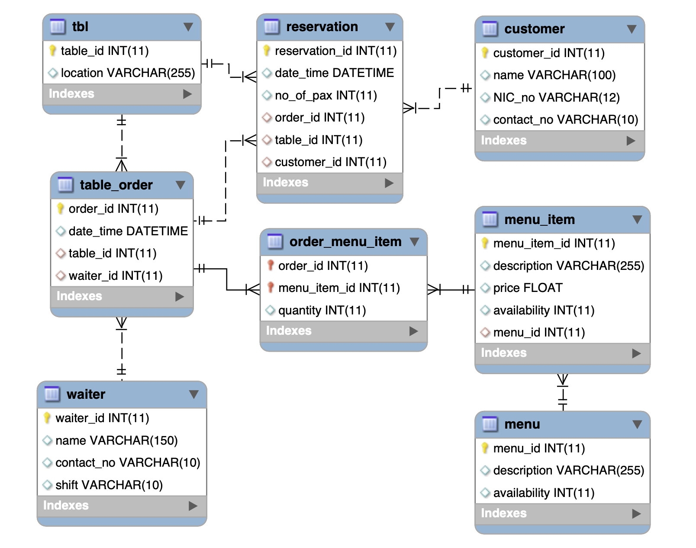

```sql
-- Create the restaurant database
CREATE DATABASE restaurant;

-- Select the database
USE restaurant;


-- Table: restaurant tables
-- Represents physical tables inside the restaurant.
CREATE TABLE tbl (
    table_id INT PRIMARY KEY,
    location VARCHAR(255)
);


-- Table: waiters
-- Stores waiter information and their usual shift.
CREATE TABLE waiter (
    waiter_id INT PRIMARY KEY,
    name VARCHAR(100),
    contact_no VARCHAR(15),
    shift VARCHAR(50)
);


-- Table: table orders
-- Stores orders associated with restaurant tables and waiters.
CREATE TABLE table_order (
    order_id INT PRIMARY KEY,
    table_id INT,
    date_time DATETIME,
    waiter_id INT,

    FOREIGN KEY (table_id)
        REFERENCES tbl(table_id),

    FOREIGN KEY (waiter_id)
        REFERENCES waiter(waiter_id)
);


-- Table: customers
-- Stores customer information.
-- NIC = National Identity Card number.
CREATE TABLE customer (
    customer_id INT PRIMARY KEY,
    name VARCHAR(100),
    nic_no VARCHAR(20),
    contact_no VARCHAR(15)
);


-- Table: reservations
-- Associates customers with orders and restaurant tables.
CREATE TABLE reservation (
    reservation_id INT PRIMARY KEY,
    date_time DATETIME,
    pax INT,
    order_id INT,
    table_id INT,
    customer_id INT,

    FOREIGN KEY (order_id)
        REFERENCES table_order(order_id),

    FOREIGN KEY (table_id)
        REFERENCES tbl(table_id),

    FOREIGN KEY (customer_id)
        REFERENCES customer(customer_id)
);


-- Table: menus
-- Stores restaurant menus and whether they are available.
CREATE TABLE menu (
    menu_id INT PRIMARY KEY,
    description VARCHAR(255),
    availability BOOLEAN
);


-- Table: menu items
-- Stores items that belong to a menu.
CREATE TABLE menu_item (
    menu_item_id INT PRIMARY KEY,
    menu_id INT,
    description VARCHAR(255),
    price DECIMAL(8,2),
    availability BOOLEAN,

    FOREIGN KEY (menu_id)
        REFERENCES menu(menu_id)
);


-- Table: ordered menu items
-- Captures which menu items were ordered in each order.
-- Composite primary key: one order can contain many menu items,
-- and each menu item can appear in many orders.
CREATE TABLE order_menu_item (
    order_id INT,
    menu_item_id INT,
    quantity INT,

    PRIMARY KEY (order_id, menu_item_id),

    FOREIGN KEY (order_id)
        REFERENCES table_order(order_id),

    FOREIGN KEY (menu_item_id)
        REFERENCES menu_item(menu_item_id)
);
```

### Relational Database Design

#### Table Relationships

The **relational model** defines how data is structured and how tables relate to each other in a database. Understanding these relationships helps you design databases correctly and query data efficiently.

Example Scenario: A college database contains:

* A **student** table
* A **course** table

Questions arise such as:

* Which student studies which course?
* Can a student study multiple courses?

These questions are answered through **relationships between tables**.

##### Types of Relationships

1. One-to-Many (1:N): One record in one table is linked to multiple records in another table.
  * Example: One student can enroll in many courses.
  * ERD Concept: * `Student` --> enrolled in --> many `Courses`
  * Keys
     * The related table contains a **foreign key (FK)**.
     * The referenced table contains the **primary key (PK)**.
 * Example:
   * `course_id` in `student` table = foreign key
   * `course_id` in `course` table = primary key

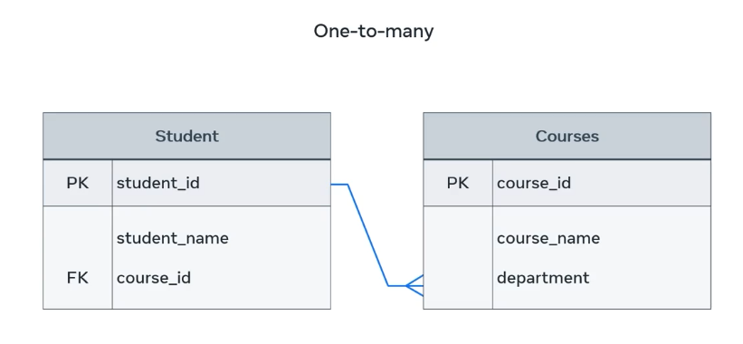

2. One-to-One (1:1): One record in a table is associated with exactly one record in another table.
   * Example: One department head manages one department location.
   * ERD Concept: One `DepartmentHead` <--> one `Department`

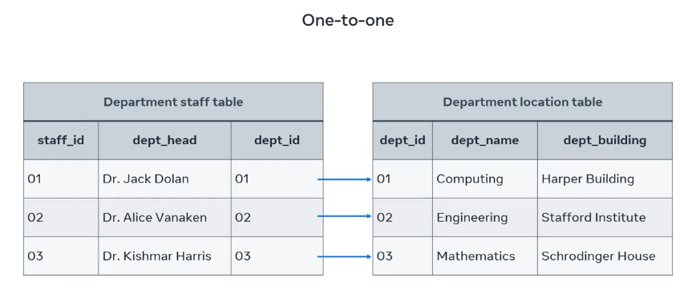

3. Many-to-Many (M:N): Multiple records in one table relate to multiple records in another table.
   * Example
     * One student can work on many research projects.
     * One staff member can supervise many students.
   * ERD Concept: Many `Students` <--> many `Staff`
   * Usually implemented with an intermediate/junction table.

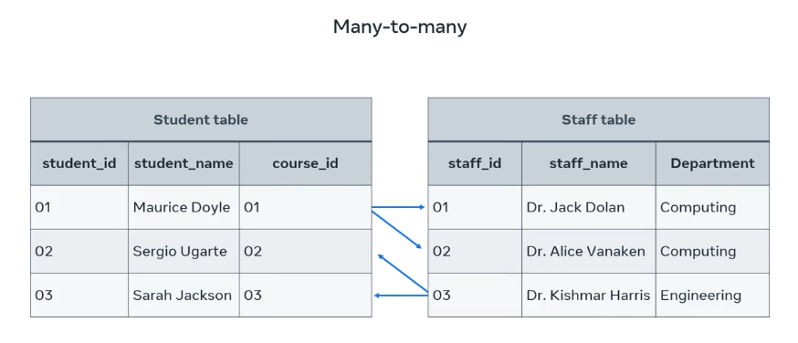

##### ER Diagrams (ERD)

An **Entity Relationship Diagram (ERD)** visually represents:

* Tables/entities
* Relationships
* Primary keys (PK)
* Foreign keys (FK)

Common Symbols:

| Symbol      | Meaning             |
| ----------- | ------------------- |
| Rectangle   | Entity/Table        |
| Diamond     | Relationship        |
| Crow's foot | "Many" relationship |
| PK          | Primary Key         |
| FK          | Foreign Key         |

#### Relational Model

* The **relational model** is the most widely used model for relational databases.
  * It is based on three main concepts:
    * Data
    * Relationships
    * Constraints
  * A relational database is essentially a collection of related tables.
  * SQL is the language used to retrieve and manipulate data in relational databases.
* A **relation** is another name for a database table.
  * A table contains:
    * Rows (records or tuples)
    * Columns (attributes or fields)
  * Each row represents one complete record.
  * Each column represents one type of data.
* A **column (attribute)** stores one specific type of information.
  * Examples:
    * `ID`
    * `FirstName`
    * `LastName`
  * Each column has:
    * A name
    * A datatype
  * Datatypes define what values can be stored:
    * Integer
    * Text
    * Date
    * Decimal
    * etc.
* A **domain** defines the set of valid values for a column.
  * Numeric columns only allow numeric values.
  * Text columns only allow text values.
  * Invalid values violate domain constraints.
* A **record (tuple)** is a single row in a table.
  * A tuple contains a complete set of values for one entity.
* A **key** uniquely identifies a row.
  * Usually implemented as a **primary key (PK)**.
  * Primary keys:
    * Must be unique
    * Cannot contain `NULL`
* The **degree** of a relation is the number of columns in the table.
  * Example:
    * A table with `name`, `address`, `phone`, and `email`
    * Degree = 4
* The **cardinality** of a relation is the number of rows in the table.
  * Example:
    * 100 student records
    * Cardinality = 100
* Relational databases enforce **integrity constraints** to keep data valid and consistent.
  * Three major types exist:
    * Key constraints
    * Domain constraints
    * Referential integrity constraints
* **Key constraints** ensure that primary keys are valid.
  * Primary keys:
    * Must be unique
    * Cannot be `NULL`

```sql
-- PRIMARY KEY guarantees uniqueness and NOT NULL
CREATE TABLE student (
    student_id INT PRIMARY KEY,
    name VARCHAR(100)
);


-- Domain constraints ensure that inserted values match the expected datatype
CREATE TABLE product (
    price DECIMAL(8,2)
);
-- price must contain numeric decimal values


-- INVALID: text inserted into decimal column
INSERT INTO product(price)
VALUES ('hello');


-- Referential integrity constraints ensure that foreign keys reference existing rows in another table.
-- A foreign key references a primary key in another table.
-- This prevents broken relationships between tables.
CREATE TABLE customer (
    customer_id INT PRIMARY KEY
);

CREATE TABLE orders (
    order_id INT PRIMARY KEY,
    customer_id INT,
    FOREIGN KEY (customer_id)
        REFERENCES customer(customer_id)
);
-- customer_id in orders must exist in customer table


-- One customer -> many orders
CREATE TABLE customer (
    customer_id INT PRIMARY KEY
);

CREATE TABLE orders (
    order_id INT PRIMARY KEY,
    customer_id INT,
    FOREIGN KEY (customer_id)
        REFERENCES customer(customer_id)
);


-- Junction table implements many-to-many relationship
CREATE TABLE customer (
    customer_id INT PRIMARY KEY
);

CREATE TABLE product (
    product_id INT PRIMARY KEY
);

CREATE TABLE customer_product (
    customer_id INT,
    product_id INT,
    PRIMARY KEY (customer_id, product_id),
    FOREIGN KEY (customer_id)
        REFERENCES customer(customer_id),
    FOREIGN KEY (product_id)
        REFERENCES product(product_id)
);
```

#### Primary Key

* A **primary key** is used to uniquely identify each row in a database table.
  * It prevents duplicate records.
  * It allows precise querying and updating of records.
* A primary key must satisfy two conditions:
  * Its value must be unique for every row.
  * It cannot contain `NULL` values.
* A **candidate key** is any column that could potentially serve as a primary key.
  * A table can have multiple candidate keys.
  * One candidate key is selected as the primary key.
  * The remaining candidate keys become alternate/secondary keys.
* Example:
  * In a student table:
    * `student_id` could be unique.
    * `email` could also be unique.
  * Either could be chosen as the primary key.

```sql
CREATE TABLE student (
    student_id INT PRIMARY KEY,
    name VARCHAR(100),
    dob DATE,
    email VARCHAR(255) UNIQUE,
    grade VARCHAR(10)
);
-- student_id = primary key
-- email = alternate/candidate key
```

* Some columns cannot be primary keys because they may contain duplicates.
  * Example:
    * Multiple students may share the same name.
    * Multiple students may share the same birth date.
* A **composite primary key** is a primary key made from two or more columns combined together.
  * It is used when no single column is unique enough.
  * The combination of values must uniquely identify each row.
* Example:
  * A delivery table may contain:
    * `customer_id`
    * `product_code`
  * Neither column alone is unique.
  * Together they uniquely identify each delivery.

```sql
CREATE TABLE delivery (
    customer_id INT,
    product_code INT,
    delivery_status VARCHAR(50),

    PRIMARY KEY (customer_id, product_code)
);

-- Composite primary key:
-- combination of customer_id + product_code
```

* Single-column primary keys are preferred when possible because they are simpler.
* Composite primary keys are useful when uniqueness depends on multiple attributes together.

#### Foreign Key

* A **foreign key (FK)** is one or more columns used to connect two tables in a relational database.
  * It creates relationships between records in different tables.
  * It enables cross-referencing between tables.
* A foreign key in one table references a column in another table.
  * Usually, the referenced column is a **primary key (PK)**.
  * The referenced column must contain unique values.
* Foreign keys are used to:
  * Connect related data
  * Maintain consistency between tables
  * Enable queries across tables
  * Prevent invalid references
* Example:
  * A bookstore database contains:
    * `customer` table
    * `orders` table
  * The `orders` table includes `customer_id` as a foreign key.
  * This links each order to the customer who placed it.

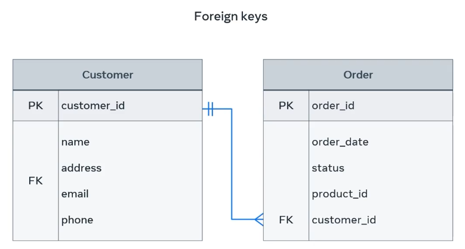

```sql
CREATE TABLE customer (
    customer_id INT PRIMARY KEY,
    name VARCHAR(100),
    address VARCHAR(255)
);

CREATE TABLE orders (
    order_id INT PRIMARY KEY,
    order_date DATE,
    status VARCHAR(50),
    customer_id INT,

    FOREIGN KEY (customer_id)
        REFERENCES customer(customer_id)
);

-- customer_id in orders references customer table
-- This creates a relationship between customers and orders
```

* The table containing the foreign key is called the **child table**.
* The referenced table is called the **parent table**.
* Example:
  * `customer` = parent table
  * `orders` = child table
* Foreign keys enforce **referential integrity**.
  * A child record cannot reference a parent record that does not exist.
  * Example:
    * An order cannot exist for a non-existent customer.
* The relationship between customer and orders is typically **one-to-many (1:N)**.
  * One customer can place many orders.
  * Each order belongs to one customer.
* Important property:
  * A parent can exist without children.
    * Example:
      * A customer may exist without any orders.
  * A child cannot exist without a parent.
    * Example:
      * An order must reference an existing customer.
* A table can contain multiple foreign keys.
  * This allows one child table to connect to multiple parent tables.
* Example:
  * `orders` table may reference:
    * `customer`
    * `product`

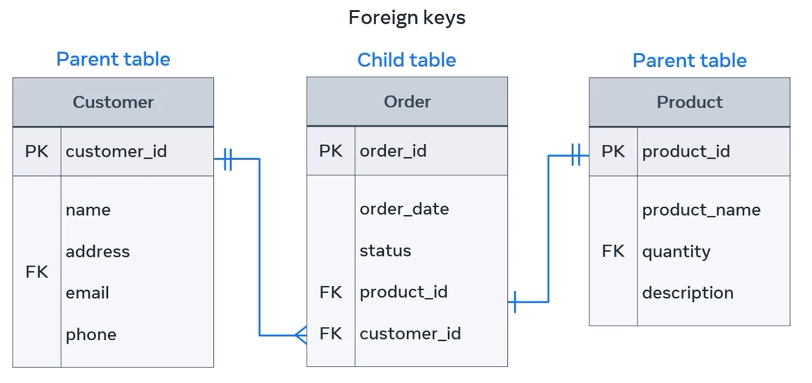

```sql
CREATE TABLE product (
    product_id INT PRIMARY KEY,
    product_name VARCHAR(100)
);

CREATE TABLE orders (
    order_id INT PRIMARY KEY,
    customer_id INT,
    product_id INT,

    FOREIGN KEY (customer_id)
        REFERENCES customer(customer_id),

    FOREIGN KEY (product_id)
        REFERENCES product(product_id)
);

-- orders table references both customer and product
-- customer and product are parent tables
-- orders is the child table
```

#### Example: Keys in Depth

```sql
-- Create the database for the automobile scenario.
CREATE DATABASE automobile;

-- Select the database so the following tables are created inside it.
USE automobile;


-- Create the owner table.
-- ownerID is the primary key because it uniquely identifies each owner.
-- ownerName is not a good primary key because different owners may share the same name.
-- ownerAddress is not a good primary key because different owners may live at the same address.
CREATE TABLE owner (
    ownerID VARCHAR(10),
    ownerName VARCHAR(50),
    ownerAddress VARCHAR(255),
    PRIMARY KEY (ownerID)
);


-- Create the vehicle table.
-- vehicleID is chosen as the primary key because it is unique and stable.
-- plateNumber and phoneNumber may be unique now, but they can change over time.
-- ownerID is not a primary key here because one owner can own multiple vehicles.
CREATE TABLE vehicle (
    vehicleID VARCHAR(10),
    ownerID VARCHAR(10),
    plateNumber VARCHAR(10),
    phoneNumber VARCHAR(20),
    PRIMARY KEY (vehicleID)
);


-- Add a foreign key from vehicle.ownerID to owner.ownerID.
-- This creates a one-to-many relationship:
-- one owner can have many vehicles.
ALTER TABLE vehicle
ADD FOREIGN KEY (ownerID)
REFERENCES owner(ownerID);


-- Show all tables in the selected database.
SHOW TABLES;


-- Show the structure of the owner table.
SHOW COLUMNS FROM owner;


-- Show the structure of the vehicle table.
SHOW COLUMNS FROM vehicle;


-- Example inserts for owners.
INSERT INTO owner (ownerID, ownerName, ownerAddress)
VALUES
    ('Ow01', 'Amjad Omer', '110, Elephant Way'),
    ('Ow02', 'Hans Henderson', '120, Dragon Way'),
    ('Ow03', 'Paulo Galdames', '130, Giraffe Avenue');


-- Example inserts for vehicles.
-- Each ownerID must already exist in the owner table because of the foreign key.
INSERT INTO vehicle (vehicleID, ownerID, plateNumber, phoneNumber)
VALUES
    ('D01', 'Ow01', 'PL02NY', '0738297294'),
    ('D02', 'Ow02', 'SN02L2', '0725021582'),
    ('D03', 'Ow03', 'PK02L2', '0765021583');


-- Query vehicles with their owner information.
SELECT
    vehicle.vehicleID,
    vehicle.plateNumber,
    vehicle.phoneNumber,
    owner.ownerID,
    owner.ownerName,
    owner.ownerAddress
FROM vehicle
JOIN owner
    ON vehicle.ownerID = owner.ownerID;


-- MySQL key labels in SHOW COLUMNS:
-- PRI = primary key.
-- UNI = unique key.
-- MUL = column can contain repeated values and is often used in indexes/foreign keys.
```

#### Entities and Attributes

* An entity is an object in a relational database that represents something important the system needs to store information about, such as a person, place, product, customer, or delivery.
* In relational databases:
  * A table usually represents an entity.
  * Columns represent attributes of that entity.
  * Rows represent individual instances or records of the entity.
* Example:
  * A `deliveries` table represents the `Delivery` entity.
  * Columns such as `ID`, `customer_name`, and `delivery_status` are attributes of that entity.
* Only entities and attributes that are useful for the application or business process should be included in the database design.
* Several attribute types exist in relational databases:
  * **Simple attributes**
    * Cannot be divided further.
    * Example:
      * `grade`
  * **Composite attributes**
    * Can be split into smaller components.
    * Example:
      * `name` --> `first_name` + `last_name`
  * **Single-valued attributes**
    * Store only one value per record.
    * Example:
      * `date_of_birth`
  * **Multi-valued attributes**
    * Can store multiple values for one entity.
    * Example:
      * multiple email addresses for one student
    * In relational database design, this practice is usually avoided because it breaks normalization principles.
  * **Derived attributes**
    * Values are calculated from other attributes.
    * Example:
      * `age` derived from `date_of_birth`
  * **Key attributes**
    * Contain unique values used to identify records.
    * Example:
      * `student_id`
    * Key attributes are commonly used as primary keys.
* Important design principle:
  * A database should only store data that supports the required tasks, queries, and business operations.


### Database Normalization

#### What is Database Normalization?

* Database normalization is a process used to organize database tables efficiently.
    * Its goals are:
        * Reduce duplicated data
        * Avoid inconsistencies during data modifications
        * Simplify queries and maintenance
* Poorly designed tables often try to serve multiple purposes at once.
    * Example:
        * A single Enrollment table storing:
            * students
            * courses
            * departments
            * department heads
    * This causes redundancy and maintenance problems.
* Three main anomalies occur in non-normalized databases:
    * Insert anomaly
        * Inserting one piece of data requires inserting unrelated data.
        * Example:
            * Cannot add a new course unless a student is enrolled in it.
            * Cannot enroll a student without assigning a student ID.
        * Problem:
            * Some data cannot exist independently.
    * Update anomaly
        * Updating one value requires updating many duplicated rows.
        * Example:
            * A department director changes.
            * Every student row related to that department must also be updated.
        * Risks:
            * missed updates
            * inconsistent data
            * maintenance difficulty
    * Deletion anomaly
        * Deleting one record accidentally removes important related data.
        * Example:
            * Deleting the only student in a department removes all department information.
        * Problem:
            * loss of unrelated data
* Normalization solves these problems by splitting large multi-purpose tables into smaller single-purpose tables.
* Example normalization:
    * One large Enrollment table becomes:
        * Student table
        * Course table
        * Department table
* Benefits of normalization:
    * Less duplicated data
    * Easier maintenance
    * More consistent data
    * Reduced anomalies
    * Simpler SQL queries
    * Better database design

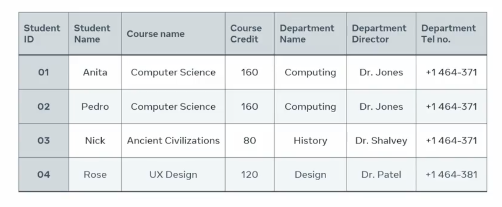

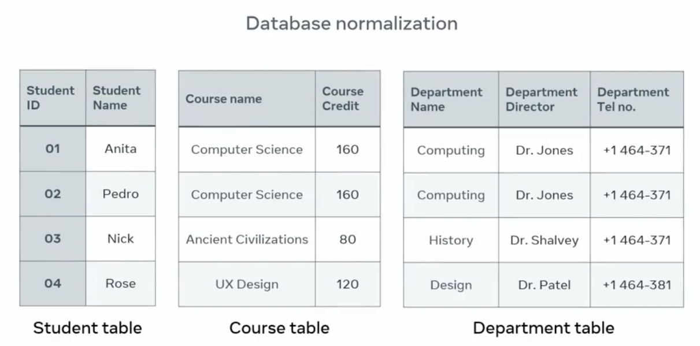

#### Normalization Example

* The three fundamental normalization stages are:
    * First Normal Form (1NF)
    * Second Normal Form (2NF)
    * Third Normal Form (3NF)

##### Unnormalized Form (UNF)

* The original medical surgery table contains:
    * doctors
    * patients
    * surgeries
    * councils
    * regions
    * appointments
    * costs
* Problems in the unnormalized table:
    * Repeating groups of data
    * Multiple values stored in single cells
    * Difficult querying and updating
    * Hard to define proper primary keys

```sql
-- Unnormalized table: mixes multiple entities together
CREATE TABLE Surgery (
    DoctorID VARCHAR(10),
    DoctorName VARCHAR(50),
    Region VARCHAR(20),
    SurgeryNumber INT,
    Council VARCHAR(20),
    Postcode VARCHAR(10),
    PatientID VARCHAR(10),
    PatientName VARCHAR(50),
    SlotID VARCHAR(5),
    TotalCost DECIMAL
);
```

##### First Normal Form (1NF)

Goals:

* Enforce atomicity:
    * Each table cell must contain only one value.
* Remove repeating groups.
* Separate entities into dedicated tables.

Problems Found:

* Patient-related columns contain multiple values.
* The table mixes:
    * doctors
    * surgeries
    * patients

Solution: Create Patient, Doctor & Surgery tables:

* In the Patient table, each row stores one patient appointment only.
  * A composite primary key is required: `(PatientID, SlotID)`
* Data becomes atomic.
* Repeating groups are removed.
* Tables become easier to query and maintain.


```sql
-- 1NF Patient table
-- Composite primary key because PatientID alone is not unique
CREATE TABLE Patient (
    PatientID VARCHAR(10) NOT NULL,
    PatientName VARCHAR(50),
    SlotID VARCHAR(10) NOT NULL,
    TotalCost DECIMAL,
    CONSTRAINT PK_Patient
    PRIMARY KEY (PatientID, SlotID)
);

-- Doctor entity separated from other data
CREATE TABLE Doctor (
    DoctorID VARCHAR(10),
    DoctorName VARCHAR(50),
    PRIMARY KEY (DoctorID)
);

-- Surgery entity separated from doctor and patient data
CREATE TABLE Surgery (
    SurgeryNumber INT NOT NULL,
    Region VARCHAR(20),
    Council VARCHAR(20),
    Postcode VARCHAR(10),
    PRIMARY KEY (SurgeryNumber)
);
```

##### Second Normal Form (2NF)

Goals:

* Remove partial dependencies.
* Applies mainly to tables with composite primary keys.

Problem Found: In the Patient table:

* PatientName depends only on PatientID
* TotalCost depends only on SlotID
* This violates 2NF because: Non-key attributes must depend on the entire composite key.

Solution: Split Patient table into Patient + Appointments tables

* Partial dependencies are removed.
* Every non-key attribute depends on the whole primary key.

```sql
-- Patient information depends only on PatientID
CREATE TABLE Patient (
    PatientID VARCHAR(10) NOT NULL,
    PatientName VARCHAR(50),
    PRIMARY KEY (PatientID)
);

-- Appointment data separated from patient data
-- AppointmentID added as a simple primary key
CREATE TABLE Appointments (
    AppointmentID INT NOT NULL,
    SlotID VARCHAR(10),
    TotalCost DECIMAL,
    PRIMARY KEY (AppointmentID)
);
```

##### Third Normal Form (3NF)

Goals:

* Remove transitive dependencies.
* Non-key attributes must not depend on other non-key attributes.

Problem Found: In the Surgery table:

* Postcode depends on Council
* Both are non-key attributes
* This creates transitive dependency.


Solution: Split Surgery table into Location + Council tables

```sql
-- Stores surgery locations
CREATE TABLE Location (
    SurgeryNumber INT NOT NULL,
    Postcode VARCHAR(10),
    PRIMARY KEY (SurgeryNumber)
);

-- Stores council-region mapping
CREATE TABLE Council (
    Council VARCHAR(20) NOT NULL,
    Region VARCHAR(20),
    PRIMARY KEY (Council)
);
```

Foreign Keys:

* After normalization, tables should be connected using foreign keys.
* Foreign keys maintain relationships and referential integrity.

Example:

```sql
-- Example foreign key relationship
ALTER TABLE Appointments
ADD COLUMN PatientID VARCHAR(10);
ALTER TABLE Appointments
ADD CONSTRAINT FK_AppointmentPatient
FOREIGN KEY (PatientID)
REFERENCES Patient(PatientID);
```

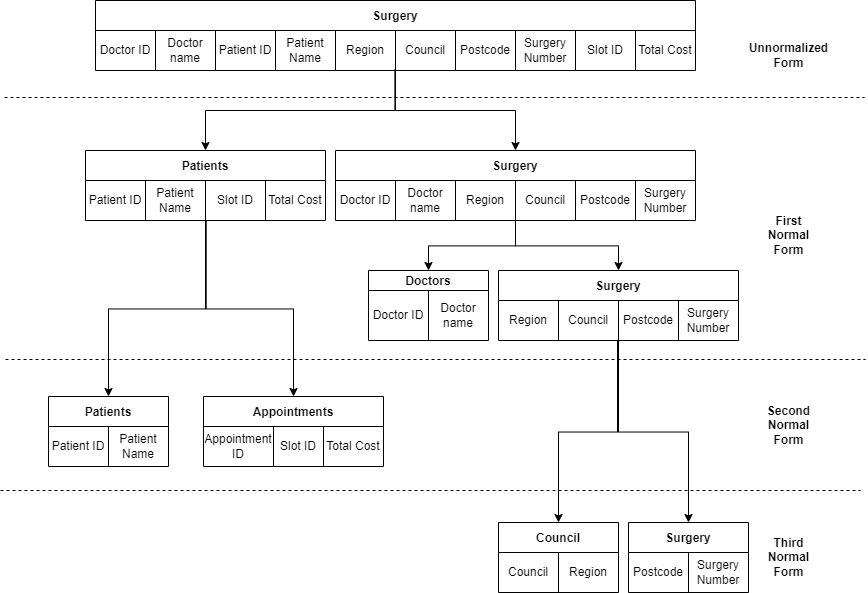


## 5. Assessment

## 6. Extra: Database Migrations and Backups

Explain two options:

- Django migrations (very beginner-friendly)
- SQLAlchemy + Alembic (FastAPI world)

## 7. Extra: Other Topics

Which other topics?

- Docker PostgreSQL container
- Docker MySQL container
- Create a DB in the cloud: AWS RDS, Azure SQL Database
- Database security and user management
- ...
