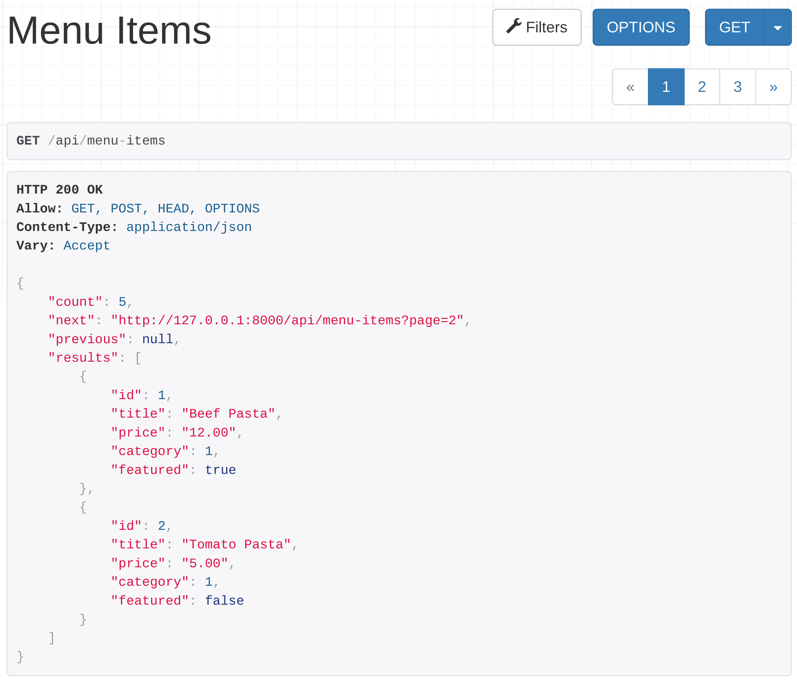
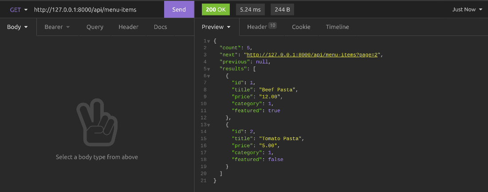
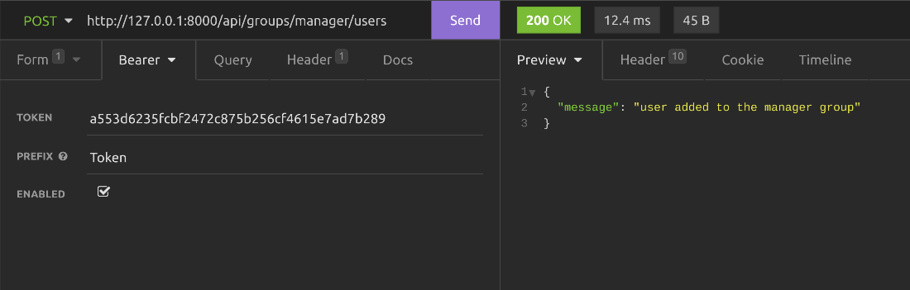
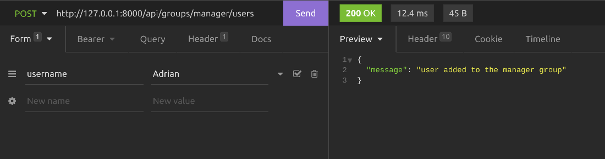

# Little Lemon API Project

## Project Introduction

- Final project: build a full REST API for the Little Lemon restaurant, combining everything covered so far (models, serializers, views, authentication, permissions, filtering, throttling).
- Three user types share the API, each with different capabilities:
  - **Manager** -- add, edit, and remove menu items; promote any user to delivery crew; browse all orders and assign them to a delivery person; filter orders by status (delivered / not delivered).
  - **Customer** -- the default role for any user not assigned to a group.
    - Browse, filter (by category and price range), and search menu items.
    - Add menu items to a cart and place an order from it; the cart must empty automatically once the order is created.
    - Flush the cart on demand; each customer has exactly one cart, which can hold multiple menu items.
    - View their own orders, including status and total price.
  - **Delivery crew** -- after authenticating, browse the orders assigned to them and mark them as delivered.
- Start with user registration and authentication, then add endpoints to assign/remove users from groups (manager, delivery crew) -- decide carefully which token/permission type should gate that endpoint.
- Add throttling across the API, capped at five calls per minute.
- Endpoints must accept only their required HTTP methods and always return an appropriate status code.
- Tooling: VS Code, Django with DRF (Django REST Framework), a virtual environment, and Insomnia for testing -- reuse only packages and libraries introduced earlier in the course.
- Final submission constraint: the finished project must support token-based authentication only -- remove any session authentication class used during development before submitting.

## Project Structure and API Routes

### Introduction

This reading is an overview of the scope of the project, all the necessary endpoints, and notes that you will have to implement in the final project. Read it carefully and reference it while developing the API project to keep on track.

### Scope

You will create a fully functioning API project for the Little Lemon restaurant so that client application developers can use the APIs to develop web and mobile applications. People with different roles will be able to browse, add, and edit menu items, place orders, browse orders, assign delivery crew to orders, and finally deliver the orders.

The next section walks through the required endpoints with an authorization level and other helpful notes. The task is to create these endpoints by following the instructions.

### Structure

- Create one single Django app called `LittleLemonAPI` and implement all API endpoints in it. Use pipenv to manage the dependencies in the virtual environment.
- Function- or class-based views, or a mix of both, can be used in this project. Follow the proper API naming convention throughout the project.
- User groups:
  - Create two user groups -- **Manager** and **Delivery crew** -- then create some random users and assign them to these groups from the Django admin panel.
  - Users not assigned to a group are considered customers.

### Error Handling and Status Codes

Display error messages with appropriate HTTP status codes for specific errors: a request for a non-existing item, an unauthorized API request, or invalid data sent in a `POST`, `PUT`, or `PATCH` request. Full list:

| HTTP Status Code | Reason |
|---|---|
| `200 - Ok` | For all successful `GET`, `PUT`, `PATCH`, and `DELETE` calls |
| `201 - Created` | For all successful `POST` requests |
| `403 - Unauthorized` | If authorization fails for the current user token |
| `401 - Forbidden` | If user authentication fails |
| `400 - Bad request` | If validation fails for `POST`, `PUT`, `PATCH`, and `DELETE` calls |
| `404 - Not found` | If the request was made for a non-existing resource |

### API Endpoints

All the required API routes for this project, grouped into several categories.

**User registration and token generation endpoints**

Djoser can be used in the project to automatically create the following endpoints and functionalities.

| Endpoint | Role | Method | Purpose |
|---|---|---|---|
| `/api/users` | No role required | `POST` | Creates a new user with name, email, and password |
| `/api/users/users/me/` | Anyone with a valid user token | `GET` | Displays only the current user |
| `/token/login/` | Anyone with a valid username and password | `POST` | Generates access tokens that can be used in other API calls in this project |

Including Djoser's endpoints also brings in the other useful endpoints it creates automatically.

**Menu-items endpoints**

| Endpoint | Role | Method | Purpose |
|---|---|---|---|
| `/api/menu-items` | Customer, delivery crew | `GET` | Lists all menu items. Returns a `200 - Ok` HTTP status code |
| `/api/menu-items` | Customer, delivery crew | `POST`, `PUT`, `PATCH`, `DELETE` | Denies access and returns a `403 - Unauthorized` HTTP status code |
| `/api/menu-items/{menuItem}` | Customer, delivery crew | `GET` | Lists a single menu item |
| `/api/menu-items/{menuItem}` | Customer, delivery crew | `POST`, `PUT`, `PATCH`, `DELETE` | Returns `403 - Unauthorized` |
| `/api/menu-items` | Manager | `GET` | Lists all menu items |
| `/api/menu-items` | Manager | `POST` | Creates a new menu item and returns `201 - Created` |
| `/api/menu-items/{menuItem}` | Manager | `GET` | Lists a single menu item |
| `/api/menu-items/{menuItem}` | Manager | `PUT`, `PATCH` | Updates a single menu item |
| `/api/menu-items/{menuItem}` | Manager | `DELETE` | Deletes the menu item |

**User group management endpoints**

| Endpoint | Role | Method | Purpose |
|---|---|---|---|
| `/api/groups/manager/users` | Manager | `GET` | Returns all managers |
| `/api/groups/manager/users` | Manager | `POST` | Assigns the user in the payload to the manager group and returns `201 - Created` |
| `/api/groups/manager/users/{userId}` | Manager | `DELETE` | Removes this particular user from the manager group and returns `200 - Success` if everything is okay. If the user is not found, returns `404 - Not found` |
| `/api/groups/delivery-crew/users` | Manager | `GET` | Returns all delivery crew |
| `/api/groups/delivery-crew/users` | Manager | `POST` | Assigns the user in the payload to the delivery crew group and returns `201 - Created` |
| `/api/groups/delivery-crew/users/{userId}` | Manager | `DELETE` | Removes this user from the manager group and returns `200 - Success` if everything is okay. If the user is not found, returns `404 - Not found` |

**Cart management endpoints**

| Endpoint | Role | Method | Purpose |
|---|---|---|---|
| `/api/cart/menu-items` | Customer | `GET` | Returns current items in the cart for the current user token |
| `/api/cart/menu-items` | Customer | `POST` | Adds the menu item to the cart. Sets the authenticated user as the user ID for these cart items |
| `/api/cart/menu-items` | Customer | `DELETE` | Deletes all menu items created by the current user token |

**Order management endpoints**

| Endpoint | Role | Method | Purpose |
|---|---|---|---|
| `/api/orders` | Customer | `GET` | Returns all orders with order items created by this user |
| `/api/orders` | Customer | `POST` | Creates a new order item for the current user. Gets current cart items from the cart endpoints and adds those items to the order items table, then deletes all items from the cart for this user |
| `/api/orders/{orderId}` | Customer | `GET` | Returns all items for this order id. If the order ID doesn't belong to the current user, displays an appropriate HTTP error status code |
| `/api/orders` | Manager | `GET` | Returns all orders with order items by all users |
| `/api/orders/{orderId}` | Customer | `PUT`, `PATCH` | Updates the order. A manager can use this endpoint to set a delivery crew for this order, and also update the order status to `0` or `1`: status `0` with a delivery crew assigned means the order is out for delivery; status `1` means the order has been delivered |
| `/api/orders/{orderId}` | Manager | `DELETE` | Deletes this order |
| `/api/orders` | Delivery crew | `GET` | Returns all orders with order items assigned to the delivery crew |
| `/api/orders/{orderId}` | Delivery crew | `PATCH` | A delivery crew member can use this endpoint to update the order status to `0` or `1`. They cannot update anything else in this order |

**Note:** the row above lists `Customer` as the role for `PUT`/`PATCH` on `/api/orders/{orderId}`, but its own description says "a manager can use this endpoint" -- this is an inconsistency carried over from the source material. The implementation in this lab follows the *description* (Manager sets `delivery_crew` and `status`; Delivery crew may `PATCH` only `status`), matching the capabilities listed under *Project Introduction* above, where customers can only view their own orders.

### Additional Step

Implement proper filtering, pagination, and sorting capabilities for the `/api/menu-items` and `/api/orders` endpoints.

### Throttling

Apply some throttling for authenticated users and for anonymous/unauthenticated users.

## Creating Models

- Five models cover the final project's data: Django's built-in `User` model handles accounts, so only `Category`, `MenuItem`, `Cart`, `Order`, and `OrderItem` need to be created.
- `Category` needs two fields:
  - `slug` (`SlugField`).
  - `title` (`CharField`, `max_length=255`), indexed because client applications search against it.
- `MenuItem` needs:
  - `title` (`CharField`) and `price` (`DecimalField`).
  - `featured` (`BooleanField`), marking whether the item is currently featured.
  - `category` (`ForeignKey` to `Category`), since every menu item belongs to exactly one category.
- `Cart` is temporary storage for the menu items a user adds before placing an order; each user can only have one cart at a time.
  - `user` (`ForeignKey` to Django's built-in `User` model, imported from `django.contrib.auth.models`).
  - `menuitem` (`ForeignKey` to `MenuItem`).
  - `quantity`, plus two price fields kept for easier calculation: `unit_price` (the menu item's price) and `price` (`quantity` times `unit_price`, computed and saved).
- Placing an order does two things: creates an `Order` record holding the order's summary info, then moves every item from the cart into the `OrderItem` table linked to that new order -- after which the cart is emptied.
- `Order` needs:
  - `user` (`ForeignKey` to `User`).
  - `delivery_crew` (`ForeignKey` to `User`) -- a second foreign key to the same `User` table alongside `user`, so it needs an explicit related name (set to `delivery_crew`) for Django to tell the two relations apart.
  - `status` (`BooleanField`, default `0`), marking whether the order has been delivered.
  - `total`, holding the combined price of all menu items in the order.
  - `date`, marking when the order was placed.
- `OrderItem` mirrors `Cart`'s item-level fields but links to the order instead: `order` (`ForeignKey` to `Order`), `menuitem` (`ForeignKey` to `MenuItem`), `quantity`, `unit_price`, and `price`.
- Both `Cart` and `OrderItem` add a `Meta` class with a unique-together index:
  - `Cart`: unique on (`user`, `menuitem`) -- a user can only have one entry per menu item, so only its quantity can change afterward.
  - `OrderItem`: unique on (`order`, `menuitem`) -- an order can only have one entry per menu item, though the quantity can vary.

## Grading Criteria

When you submit your assignment, other learners in the course will review and grade your work. These are the criteria they'll use to evaluate your APIs.

In this project, your APIs need to make it possible for your end-users to perform certain tasks, and your reviewer will be looking for the following functionalities:

1. The admin can assign users to the manager group.
2. You can access the manager group with an admin token.
3. The admin can add menu items.
4. The admin can add categories.
5. Managers can log in.
6. Managers can update the item of the day.
7. Managers can assign users to the delivery crew.
8. Managers can assign orders to the delivery crew.
9. The delivery crew can access orders assigned to them.
10. The delivery crew can update an order as delivered.
11. Customers can register.
12. Customers can log in using their username and password and get access tokens.
13. Customers can browse all categories.
14. Customers can browse all the menu items at once.
15. Customers can browse menu items by category.
16. Customers can paginate menu items.
17. Customers can sort menu items by price.
18. Customers can add menu items to the cart.
19. Customers can access previously added items in the cart.
20. Customers can place orders.
21. Customers can browse their own orders.

You'll also need to give feedback on and grade the assignments of two other learners using the same criteria.

## Example Submissions

Here are some examples to help you understand what your assignment should look like.

Browsing menu-items endpoint using the browser:



Making an HTTP GET call to menu-items endpoint:



Adding a user as a manager with admin token:



The HTTP body content to add a user to the manager group with an admin token:



## How to Create Assignment and Submit

You need to use pipenv to create the virtual environment and to manage the dependencies. Your APIs should be created using Django, DRF, and Djoser. You need to use SQLite as the database for this project. You can develop your APIs using VS Code and test them using your browser or Insomnia.

Name the project directory `LittleLemon` and the app `LittleLemonAPI`. Ensure that you follow this naming convention to make the reviewing process easier.

You will be required to submit your APIs by uploading a zipped folder that contains your code.

**Important note:** Include the SQLite database file `db.sqlite3` in your project submission, and share the superuser's username and password plus those of all the other users you have created. Write these usernames and passwords in a `notes.txt` file, keep it inside the project directory, then zip the project.

To learn more about how to zip and unzip folders, visit the Mac or Windows support page.

## How to Review Peers

Once you have submitted your file, you are required to review two peer submissions. You can view the peers that you need to review in the "Peers to review" section. You need to download their zipped project folder and unzip it. Then, prepare the virtual environment and install all dependencies using the following commands:

```bash
cd LittleLemon
pipenv shell
pipenv install

python manage.py makemigrations
python manage.py migrate
python manage.py runserver
```

Then log into the Django admin panel, create a superuser and the user groups, and randomly assign users into these groups, the same way you did in your own project.

## Examples of Good Feedback

The focus of your feedback should be on the functionality of the APIs.

Follow the prompts and look for the expected output. If you notice any errors in the functionality of any of the elements of the APIs, you will have the opportunity to provide guidance to your peers on how they might fix the error.

An example of good feedback would be:

> On the whole, the APIs performed as expected; however, customers couldn't log in using their username and password and get access tokens. I would suggest reviewing the code you have written to ensure that the Djoser package was installed and configured correctly. You could revisit the video, *Introduction to Djoser library for better authentication*, in Module 3, lesson 2.
