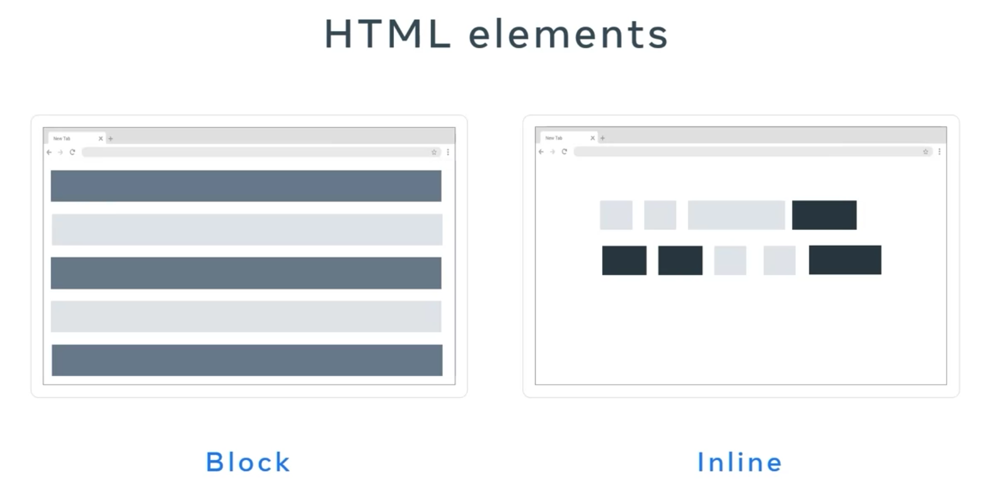

# Intoduction to Web-App Back-End Development

This is my guide for web-app backend development, based on selected courses from:
- the [Meta Back-End Developer Professional Certificate](https://www.coursera.org/programs/deutsche-telekom-learning-program-ddjuh/professional-certificates/meta-back-end-developer) specialization on Coursera
- and the [Backend Developer with Python](https://www.udacity.com/course/backend-developer-with-python--nd0044) nanodegree on Udacity.

From these specializations, I have selected the following topics/courses:

1. [Introduction to Back-End Development](https://www.coursera.org/programs/deutsche-telekom-learning-program-ddjuh/learn/introduction-to-back-end-development)
2. [Introduction to Databases for Back-End Development](https://www.coursera.org/programs/deutsche-telekom-learning-program-ddjuh/learn/intro-to-databases-back-end-development)
3. [Django Web Framework](https://www.coursera.org/programs/deutsche-telekom-learning-program-ddjuh/learn/django-web-framework?authProvider)
4. [APIs](https://www.coursera.org/programs/deutsche-telekom-learning-program-ddjuh/learn/apis)
5. [The Full Stack](https://www.coursera.org/programs/deutsche-telekom-learning-program-ddjuh/learn/the-full-stack?authProvider=deutschetelekom)
6. [Flask SQLAlchemy Data Modelling](https://www.udacity.com/course/sql-and-data-modeling-for-the-web--cd0046)
7. [Software Architecture Patterns](https://www.udacity.com/course/software-architecture-patterns--cd14601)
8. [Implement NGINX Web Servers and Reverse Proxy Solutions](https://www.coursera.org/learn/implement-nginx-web-servers-and-reverse-proxy-solutions)

This module deals with the fifth topic/course: **The Full Stack**.

Table of Contents:

- [Intoduction to Web-App Back-End Development](#intoduction-to-web-app-back-end-development)
  - [1. Introduction to the Full Stack](#1-introduction-to-the-full-stack)
    - [Introduction to the Full Stack](#introduction-to-the-full-stack)
      - [What is full stack development?](#what-is-full-stack-development)
      - [N-tier architecture](#n-tier-architecture)
      - [Client-server architecture](#client-server-architecture)
  - [2. Front-End Technologies](#2-front-end-technologies)
    - [HTML](#html)
      - [How are HTML and CSS used in the real world?](#how-are-html-and-css-used-in-the-real-world)
      - [Semantic tags and why we need them](#semantic-tags-and-why-we-need-them)
      - [Semantic HTML cheat sheet](#semantic-html-cheat-sheet)
        - [Sectioning Tags](#sectioning-tags)
        - [Content Tags](#content-tags)
        - [Inline Tags](#inline-tags)
        - [Embedded Content and Media Tags](#embedded-content-and-media-tags)
        - [Table Tags](#table-tags)
      - [Semantic tags in action](#semantic-tags-in-action)
      - [Forms and validation](#forms-and-validation)
      - [Input types](#input-types)
        - [Button](#button)
        - [Checkbox](#checkbox)
        - [Radio](#radio)
        - [Submit](#submit)
        - [Text](#text)
        - [Password](#password)
        - [Date](#date)
        - [Datetime-local](#datetime-local)
        - [Email](#email)
        - [File](#file)
        - [Hidden](#hidden)
        - [Image](#image)
        - [Number](#number)
        - [Range](#range)
        - [Reset](#reset)
        - [Search](#search)
        - [Time](#time)
        - [Tel](#tel)
        - [Url](#url)
        - [Week](#week)
        - [Month](#month)
      - [Form submission](#form-submission)
      - [Submit](#submit-1)
    - [CSS](#css)
      - [CSS web layout](#css-web-layout)
      - [Widely used selectors](#widely-used-selectors)
      - [CSS units of measurement](#css-units-of-measurement)
        - [Absolute units](#absolute-units)
        - [Relative units](#relative-units)
      - [Document flow - Block vs. In-line](#document-flow---block-vs-in-line)
    - [Javascript](#javascript)
  - [3. The Full Stack Using Django](#3-the-full-stack-using-django)
  - [4. Production Environments](#4-production-environments)
  - [5. Final Project](#5-final-project)

## 1. Introduction to the Full Stack

### Introduction to the Full Stack

#### What is full stack development?

- A "stack" is a combination of software applications and components used for a specific development focus.
  - Front-end stack: builds the user interface (UI) of web and mobile applications.
    - Web: HTML, CSS, CSS frameworks, JavaScript/TypeScript, JavaScript frameworks like React.
    - Mobile: iOS or Android development tools.
  - Back-end stack: builds the application's core, handling business logic, workflows, and data.
    - Languages/frameworks: Python, Django, DRF (Django REST Framework).
    - Also includes build tools, databases, and caching applications.
    - Includes the data stack, the tools used to store, process, and retrieve data.
      - SQL/NoSQL database engines: MySQL, MariaDB, PostgreSQL.
      - Caching: Redis.
  - Full stack: the end-to-end solution, combining the back-end core with APIs that serve data to web/mobile front ends.
- A full stack developer is equally skilled in the front-end, back-end, and database stacks, plus essential DevOps (development operations) skills to build and deploy to development, staging, and production servers, and familiarity with git for version control.
- Typical responsibilities of a full stack developer:
  - Understand the complete project and take full ownership.
  - Select or create tools for front-end, back-end, and database development.
  - Create effective UIs for web and mobile applications.
  - Develop APIs and the back end of applications.
  - Store, process, and retrieve data from databases.
  - Create and manage servers for development, staging, and production.
  - Integrate with CI/CD (continuous integration/continuous deployment) workflows.
  - Ensure the responsiveness of web applications.
  - Collaborate with the graphics team.
  - Optimize application performance and follow security best practices.

#### N-tier architecture

- An application has multiple parts: the user interface (UI), business logic, and database. "Layers" and "tiers" are often used interchangeably, but they differ.
  - Layers: virtual separations of an application's parts, not necessarily on separate machines.
  - Tiers: parts that are physically separated in the infrastructure (e.g., on different servers) while still communicating to function correctly.
- N-tier architecture splits an application's architecture into multiple tiers. 3-tier is the most common; 4-tier is used when needed.
  - 3-tier architecture:
    - Presentation tier: the client (computer or mobile), a "thin client" that only communicates with the application and presents data, without running business logic.
    - Application tier: holds the application code and business logic, hosted on its own server.
    - Data tier: holds the database, hosted on its own server.
  - 4-tier architecture: adds a delivery tier that handles caching and delivering front-end assets (HTML, CSS, JavaScript, images) to the client, e.g., via a Content Delivery Network (CDN), which uses geographically distributed servers to deliver content from the nearest location.
    - The delivery tier is physically separate from the application and data tiers, so it counts as its own tier.
  - Real N-tier applications vary by purpose (e.g., financial vs. enterprise applications have different needs).
- Benefits of N-tier architecture: easier to secure and scale, and easier to fix or extend since each tier works independently, making development more efficient overall.


#### Client-server architecture

- Full stack development includes a back-end (the application core, hosted on a server or serverless platform) and a front-end (the client). Together, client and server form the client-server architecture, used by websites, multiplayer mobile games, and internet-connected home appliances alike.
  - Client: the computer or mobile device that communicates with the back end.
    - Thin clients: only communicate with the back end to display/present data, without running business logic.
    - Thick clients: consume API data and perform heavier data processing on the client side.
  - Server: hosts the application core, which handles incoming data, applies business logic, and saves/processes data in a database.
    - Hosted on cloud computing units, virtual machines, containers, or a dedicated server.
    - Can use an N-tier architecture to spread layers across multiple physical or virtual servers.
- How it works: client and server communicate over a network (public or private), following standard protocols like HTTP or WebSocket.
  - The client accepts user input, does basic validation, and sends the data to the server.
  - The server runs rigorous validation and sanitization on incoming data to catch invalid or malicious content; the rule of thumb is to never trust incoming data, regardless of its source.
  - The server processes the data with business logic, saves/serves it via the database, and returns a response.
  - The client processes the response: it makes decisions or displays the result.
  - The server must handle multiple simultaneous client requests and must be scaled if its capacity becomes insufficient.
- Advantages:
  - Separates application layers: the database can be installed and managed independently, keeping data centralized and synced so multiple clients see the same up-to-date information (e.g., the Little Lemon restaurant application used throughout the course).
  - Because parts live in separate tiers/layers, scaling, optimizing, securing, backing up, and recovering data is easier and can be done per tier without affecting the whole application.
  - Cost-effective: can be hosted on-demand in the cloud (pay only for what's used), avoiding the need for expensive server hardware or powerful client devices, since business logic runs entirely on the server.
- Disadvantages:
  - Requires ongoing server management: configuring, maintaining, and keeping servers in working order.
  - Unmonitored or abusive API usage can cause cost spikes.
  - Security is a major concern: breaches can leak sensitive user data and cause severe financial damage.
  - If the server goes down or becomes unresponsive, dependent clients stop working.

## 2. Front-End Technologies

### HTML

#### How are HTML and CSS used in the real world?

- HTML (HyperText Markup Language) is the most basic and fundamental markup language for creating webpages, in use since 1990, originally designed to share information (basic images and text) over the internet.
- CSS (Cascading Style Sheets) is a stylesheet language that describes the look and layout of an HTML document.
  - Not a programming language, but supports some programming-like features, such as variables and nested rules.
  - Controls color, size, spacing, fonts, positioning, and more.
  - Enables a key principle: separation of content (HTML) and style (CSS), so a webpage's appearance can change without editing its underlying HTML.
- W3C (World Wide Web Consortium), the organization responsible for web standards, manages both the HTML and CSS specifications and continually updates them to meet current requirements.
  - Newer HTML features: better multimedia support (audio, video), responsive design (adapting layout to the viewing device), new form input types (sliders, range inputs, date/color pickers), new form validation, and improved text handling (spell checking, text editing).
  - Major CSS additions since 2011: media queries (different styles per device), box sizing (control over content sizing/padding), multiple backgrounds per element, border images, text shadows, and transformations/transitions (animating elements).
- Together, HTML and CSS let websites adapt their design and layout to the device they're viewed on. What started as support for phones and tablets has expanded to video game consoles and smart TVs, extending the web browser well beyond traditional desktop devices.

#### Semantic tags and why we need them

- Semantic tags describe the meaning of content, not just its appearance, similar to how numbers on elevator buttons convey which floor a button leads to, beyond their mere vertical arrangement.
  - Writing HTML semantically lets search engines and accessibility software (e.g., screen readers) understand a page's content.
  - Basic examples: heading tags (e.g., `H1`) mark headings; `UL`/`OL` mark lists.
- A typical HTML page can be semantically structured, inside the `body`, using these top-level elements:
  - `header`: usually holds the company logo and navigation links.
  - `nav`: the main navigation, typically placed after `header`; its links are commonly wrapped in an unordered list.
  - `main`: holds the page's main content, made up of `section` and `article` elements.
  - `footer`: holds contact information, social media links, or other closing content.
- `article`: per the W3C (World Wide Web Consortium) specification, represents a complete, self-contained, independently distributable piece of content, like an article on a newspaper page you could cut out with scissors.
  - Examples: a forum post, a magazine/newspaper article, a blog entry, a user comment, or an interactive widget.
  - Best practice: place `article` elements inside `main`; a page can contain multiple `article` elements, e.g., for a blog post list.
  - Semantic elements can nest, since their purpose is only to describe the semantics of their content: an `article` can contain its own `header` (e.g., a heading with the blog title and a paragraph with date/author).
- `section`: semantically divides an `article`, or a webpage more generally, into individual sections; a `section` should contain its own heading element and doesn't require an `article` to be used.

```html
<body>
  <header>
    <!-- Company logo -->
    <nav>
      <ul>
        <li><a href="/">Home</a></li>
        <li><a href="/about">About</a></li>
      </ul>
    </nav>
  </header>
  <main>
    <article>
      <header>
        <h1>My Summer Holiday</h1>
        <p>Posted on 2026-07-16 by Author Name</p>
      </header>
      <section>
        <h2>Day One</h2>
        <p>Blog post content...</p>
      </section>
    </article>
  </main>
  <footer>
    <!-- Contact info, social media links -->
  </footer>
</body>
```

#### Semantic HTML cheat sheet

##### Sectioning Tags

Use the following tags to organize your HTML document into structured sections.

- `<header>`: the header of a content section or the web page; the page header often contains the website branding or logo.
- `<nav>`: the navigation links of a section or the web page.
- `<footer>`: the footer of a content section or the web page; on a web page, it often contains secondary links, the copyright notice, and the privacy/cookie policy links.
- `<main>`: specifies the main content of a section or the web page.
- `<aside>`: a secondary set of content that is not required to understand the main content.
- `<article>`: an independent, self-contained block of content, such as a blog post or a product.
- `<section>`: a standalone section of the document, often used within `<body>` and `<article>` elements.
- `<details>`: a collapsed section of content that can be expanded if the user wishes to view it.
- `<summary>`: specifies the summary or caption of a `<details>` element.
- `<h1>`-`<h6>`: headings on the web page; `<h1>` indicates the most important heading, `<h6>` the least important.

##### Content Tags

- `<blockquote>`: used to describe a quotation.
- `<dl>`: used to define a description list.
  - `<dt>`: describes terms inside `<dl>` elements.
  - `<dd>`: defines a description for the preceding `<dt>` element.
- `<figure>`: applies markup to a photo image.
  - `<figcaption>`: defines a caption for a photo image.
- `<hr>`: adds a horizontal line to the parent element.
- `<ul>`: unordered list.
  - `<ol>`: defines an ordered list.
  - `<menu>`: a semantic alternative to the `<ul>` tag.
  - `<li>`: used to define an item within a list.
- `<p>`: defines a paragraph.
- `<pre>`: used to represent preformatted text, typically rendered in the web browser using a monospace font.

##### Inline Tags

- `<a>`: an anchor link to another HTML document.
- `<abbr>`: specifies that the containing text is an abbreviation or acronym.
- `<b>`: bolds the containing text; use `<strong>` instead when indicating importance.
- `<strong>`: displays the containing text in bold, used to indicate importance.
- `<br>`: a line break; moves the subsequent text to a new line.
- `<cite>`: defines the title of a creative work (e.g., a book, poem, song, movie, painting, or sculpture); the text is usually rendered in italics.
- `<code>`: indicates that the containing text is a block of computer code.
- `<data>`: indicates machine-readable data.
- `<em>`: emphasizes the containing text.
- `<i>`: displays the containing text in italics; used to indicate idiomatic text or technical terms.
- `<mark>`: the containing text should be marked or highlighted.
- `<q>`: the containing text is a short quotation.
- `<s>`: displays the containing text with a strikethrough or line through it.
- `<samp>`: the containing text represents a sample.
- `<small>`: used to represent small text, such as copyright and legal text.
- `<span>`: a generic element for grouping content for CSS styling.
- `<sub>`: the containing text is subscript text, displayed with a lowered baseline.
- `<sup>`: the containing text is superscript text, displayed with a raised baseline.
- `<time>`: a semantic tag used to display both dates and times.
- `<u>`: displays the containing text with a solid underline.
- `<var>`: the containing text is a variable in a mathematical expression.

##### Embedded Content and Media Tags

- `<audio>`: used to embed audio in web pages.
- `<video>`: embeds a video on a web page.
- `<source>`: specifies media resources for `<picture>`, `<audio>`, and `<video>` elements.
- `<picture>`: contains one `` element and one or more `<source>` elements to offer alternative images for different displays/devices.
- ``: embeds an image on a web page.
- `<canvas>`: used to render 2D and 3D graphics on web pages.
- `<svg>`: used to define Scalable Vector Graphics (SVG) within a web page.
- `<embed>`: a containing element for external content provided by an external application, such as a media player or plug-in application.
- `<object>`: similar to `<embed>`, but the content is provided by a web browser plug-in.
- `<iframe>`: used to embed a nested web page.

##### Table Tags

- `<table>`: defines a table element to display table data within a web page.
- `<caption>`: defines the caption of a table element.
- `<colgroup>`: defines a semantic group of one or more columns in a table for formatting.
  - `<col>`: defines a semantic column in a table.
- `<thead>`: represents the header content of a table; typically contains one `<tr>` element.
- `<tbody>`: represents the main content of a table; contains one or more `<tr>` elements.
- `<tfoot>`: represents the footer content of a table; typically contains one `<tr>` element.
- `<tr>`: represents a row in a table; contains one or more `<td>` elements when used within `<tbody>` or `<tfoot>`, or one or more `<th>` elements when used within `<thead>`.
  - `<td>`: represents a cell in a table, containing the text content of the cell.
  - `<th>`: defines a header cell of a table, containing the text content of the header.

#### Semantic tags in action

- Worked example: Little Lemon Restaurant needs a new blog page (`blog.html`) with several blog posts, built with semantic HTML so search engines and accessibility software (e.g., screen readers) can understand the page's content.
- Step 1: lay out the top-level semantic structure inside the existing basic HTML document, in order:
  - `header`: will hold the Little Lemon logo.
  - `nav`: will describe the site's navigational structure.
  - `main`: will hold the page's main content.
  - `footer`: will hold copyright information.
- Step 2: fill in the details of each element.
  - `header`: add the logo with an `img` tag.
  - `nav`: add a `ul` with three `li` items, each wrapping an `a` tag linking to `index.html`, `location.html`, and `blog.html`.
  - `main`: add an `h1` for the blog heading, then one `article` per blog post (two posts, since the restaurant requested two).
    - Each `article` gets an `h2` title and a `p` with the post text.
    - First post: "20% off this weekend".
    - Second post: "Our new menu".
  - `footer`: add a `p` with the copyright notice.
- Step 3: save the file (Ctrl+S / Cmd+S), then right-click `blog.html` and select Live Preview to check the result.
- Outcome: the semantic structure makes the page accessible to assistive technology and optimized for search engines (SEO), helping both the restaurant's visibility and customers with disabilities.

```html
<body>
  <header>
    
  </header>
  <nav>
    <ul>
      <li><a href="index.html">Home</a></li>
      <li><a href="location.html">Location</a></li>
      <li><a href="blog.html">Blog</a></li>
    </ul>
  </nav>
  <main>
    <h1>Little Lemon Blog</h1>
    <article>
      <h2>20% off this weekend</h2>
      <p>Blog post text...</p>
    </article>
    <article>
      <h2>Our new menu</h2>
      <p>Blog post text...</p>
    </article>
  </main>
  <footer>
    <p>&copy; 2026 Little Lemon Restaurant</p>
  </footer>
</body>
```

#### Forms and validation

- HTML forms capture user input, e.g., account registration or a delivery address at checkout.
- Capturing input isn't enough; the data must also be usable. Example: a food delivery site that accepts a mistyped, nonexistent address causes a bad user experience when the order never arrives.
- Form validation solves this: it's the process of ensuring user-entered data is valid and conforms to rules defined by the developer, via two methods.
  - Client-side validation:
    - Checks for errors as soon as they're typed, performed by the web browser or JavaScript, giving immediate feedback.
    - Flow: on submission, the browser checks the form; if there are no errors, it submits to the server; if there are errors, it shows a message explaining what's invalid and how to fix it.
    - Achieved with HTML input types the browser validates natively: `email`, `tel` (telephone number), `url`, `date`, `time`, `number`, `range` (numeric with a minimum and maximum), and `color`.
      - Example: an `input` with `type="email"` triggers a browser error message if the entered value isn't a valid email address.
    - The `required` attribute forces a field to have a value; the browser alerts the user if a required field is left empty.
  - Server-side validation:
    - Checks for errors after the data has been submitted to the web server.
    - More secure than client-side validation, since it prevents malicious users from tampering with the site's client-side code to submit invalid data.
    - Can run more complex checks, such as validating against a database or business requirements.
  - Most websites combine both methods: client-side validation for immediate user feedback, server-side validation to guard against malicious submissions and ensure data integrity.

```html
<form>
  <input type="email" name="email" required />
  <input type="tel" name="phone" />
  <input type="url" name="website" />
  <input type="date" name="delivery-date" />
  <input type="time" name="delivery-time" />
  <input type="number" name="quantity" />
  <input type="range" name="rating" min="1" max="10" />
  <input type="color" name="favorite-color" />
</form>
```

#### Input types

##### Button

Displays a clickable button, mostly used in HTML forms to activate a script when clicked.

```html
<input type="button" value="Click me" onclick="msg()" />
```

You can also define buttons with the `<button>` tag, which has the added benefit of letting you place content like text or images inside the tag.

```html
<button onclick="alert('Are you sure you want to continue?')">
  
</button>
```

##### Checkbox

Defines a checkbox, letting a user select or deselect a single value. Checkboxes let a user select one or more options from a limited set of choices.

```html
<input type="checkbox" id="dog" name="dog" value="Dog">
<label for="dog">I like dogs</label>
<input type="checkbox" id="cat" name="cat" value="Cat">
<label for="cat">I like cats</label>
```

##### Radio

Displays a radio button, allowing only a single value to be selected out of multiple choices. Radio buttons are normally presented in radio groups: collections of related options that share the same `name` attribute.

```html
<input type="radio" id="light" name="theme" value="Light">
<label for="light">Light</label>
<input type="radio" id="dark" name="theme" value="Dark">
<label for="dark">Dark</label>
```

##### Submit

Displays a submit button for submitting all values from an HTML form to a form-handler, typically a server. The form-handler is specified in the form's `action` attribute.

```html
<form action="myserver.com" method="POST">
  <!-- other form fields -->
  <input type="submit" value="Submit" />
</form>
```

##### Text

Defines a basic single-line text field that a user can enter text into.

```html
<label for="fname">First name:</label>
<input type="text" id="fname" name="fname">
```

##### Password

Defines a single-line text field whose value is obscured, suited for sensitive information like passwords.

```html
<label for="pwd">Password:</label>
<input type="password" id="pwd" name="pwd">
```

##### Date

Displays a control for entering a date (year, month, and day), with no time.

```html
<label for="dob">Date of birth:</label>
<input type="date" id="dob" name="date-of-birth">
```

##### Datetime-local

Defines a control for entering a date and time, including the year, month, and day, as well as the time in hours and minutes.

```html
<label for="birthdaytime">Birthday (date and time):</label>
<input type="datetime-local" id="birthdaytime" name="birthdaytime">
```

##### Email

Defines a field for an email address. It behaves like a plain text input, with the addition that the browser validates it automatically before submission.

```html
<label for="email">Enter your email:</label>
<input type="email" id="email" name="email">
```

##### File

Displays a control that lets the user select and upload a file from their computer.

- Use the `accept` attribute to define the permissible file types.
- Add the `multiple` attribute to allow selecting more than one file.

```html
<label for="myfile">Select a file:</label>
<input type="file" id="myfile" name="myfile">
```

##### Hidden

Defines a control that is not displayed but whose value is still submitted to the server.

```html
<input type="hidden" id="custId" name="custId" value="3487">
```

##### Image

Defines an image as a graphical submit button. Use the `src` attribute to point to the location of the image file.

```html
<input type="image" src="submit_img.png" alt="Submit" width="48" height="48">
```

##### Number

Defines a control for entering a number. Attributes can specify restrictions, such as `min`/`max` values allowed, number intervals, or a default value.

```html
<input type="number" id="quantity" name="quantity" min="1" max="5">
```

##### Range

Displays a range widget for specifying a number between two values, typically represented using a slider or dial control; the precise value is not considered important. Use the `min` and `max` attributes to define the range of acceptable values.

```html
<label for="volume">Volume:</label>
<input type="range" id="volume" name="volume" min="0" max="10">
```

##### Reset

Displays a button that resets the contents of the form to their default values.

```html
<input type="reset">
```

##### Search

Defines a text field for entering a search query. These are functionally identical to text inputs, but may be styled differently depending on the browser.

```html
<label for="gsearch">Search in Google:</label>
<input type="search" id="gsearch" name="gsearch">
```

##### Time

Displays a control for entering a time value in hours and minutes, with no time zone.

```html
<label for="appt">Select a time:</label>
<input type="time" id="appt" name="appt">
```

##### Tel

Defines a control for entering a telephone number. Browsers that do not support `tel` fall back to a standard text input. Optionally use the `pattern` attribute to perform validation.

```html
<label for="phone">Enter your phone number:</label>
<input type="tel" id="phone" name="phone" pattern="[+]{1}[0-9]{11,14}">
```

##### Url

Displays a field for entering a text URL. It works similarly to a text input, but performs automatic validation before being submitted to the server.

```html
<label for="homepage">Add your homepage:</label>
<input type="url" id="homepage" name="homepage">
```

##### Week

Defines a control for entering a date consisting of a week number and a year, with no time zone. This is a newer type that is not supported by all browsers.

```html
<label for="week">Select a week:</label>
<input type="week" id="week" name="week">
```

##### Month

Displays a control for entering a month and year, with no time zone. This is a newer type that is not supported by all browsers.

```html
<label for="bdaymonth">Birthday (month and year):</label>
<input type="month" id="bdaymonth" name="bdaymonth" min="1930-01" value="2000-01">
```

#### Form submission

- Forms send data to the web server as part of the browser-server HTTP (HyperText Transfer Protocol) request-response cycle: the browser sends a request, and the server sends back a response.
- Besides requesting resources (HTML documents, images, CSS files, JavaScript files), a request can also carry data -- this is how a submitted form sends its data to the server.
- A form can send its data with either the HTTP GET or POST method, chosen via the form element's `method` attribute.
- GET method:
  - On submission, the form data is appended to the end of the request URL, visible in the browser's address bar; the server receives the GET request and extracts the form data from the URL.
  - Easy to use, but has three problems:
    - Browsers limit URL length to around 2,000 characters (varies by browser), so a large form's data may be lost.
    - Servers also limit URL length; popular server software like Apache and Nginx defaults to around 4,096 characters, risking the same data loss.
    - Security: since the data sits in the URL, it's stored in the browser history and possibly in server request logs, a major privacy/security risk for personal data such as addresses or credit card numbers.
- POST method:
  - The form data is inserted into the body of the HTTP request instead of the URL.
  - More secure than GET, since the data isn't exposed in the URL, browser history, or logs.
  - Still not fully secure on its own: a third party listening to the request could still read the data. HTTPS (HTTP Secure) encrypts the request so only the sender and receiver can understand it.
- Once the server processes the request, it sends back an HTTP response: on success, the response directs the browser to a new webpage; errors are handled by the webpage itself, as covered in a previous video.

```html
<form action="/login" method="get">
  <!-- Submitted data is appended to the URL, e.g. /login?username=...&password=... -->
</form>

<form action="/login" method="post">
  <!-- Submitted data is sent in the request body, not visible in the URL -->
</form>
```

#### Submit

- A `form` tag's submission is controlled by two attributes: `action` (where to send it) and `method` (how to send it).

```html
<form action="/login" method="post">
</form>
```

- `action`: the target address for the server-side handler. Can be a full URL, an absolute path (resolved against the site's root, e.g., `/login` on `meta.com/company-info/` --> `meta.com/login`), or a relative path (resolved against the current page, e.g., `login` on `meta.com/company-info/` --> `meta.com/company-info/login`).
- `method`: GET or POST; defaults to GET if omitted.
  - GET encodes the data into the URL.
  - POST puts it in the request body.
- The server processes the request and responds with success or failure (e.g., invalid data).
- Forms aren't the only way to send data -- JavaScript can submit HTTP requests directly, typically with a JSON (JavaScript Object Notation) body.

### CSS

#### CSS web layout

- CSS (Cascading Style Sheets) is a set of rules for enhancing a web page's appearance: fonts, colors, layout, size, and other style formatting.
- Browsers adopted CSS early on for better visual design and creativity; as browsers grew beyond traditional devices, CSS capabilities grew with them, including responsive design and layout options like flexbox, grid, and box models.
- Layout is one of the most important parts of web design, since it divides a page into sections and makes it more presentable.
- The viewport is the browser window area visible to the user; the goal of any CSS layout is a well-designed page with a good viewport at any size.
- The `display` property specifies the box type used to render an HTML element, determining whether it's rendered as an inline or block box and how rectangles/boxes are allocated to elements.
  - Example: setting `display: block` on an element renders it as a block-type box.
- Evolving requirements led beyond basic block layouts to CSS layout modules such as flexbox and grid, which define rules across multiple elements for more flexible, finely tuned page sections.
  - Flexbox (flexible box model): introduced before grid; one-dimensional, arranging items along a single axis (a row or a column) within a flex container. The container can shrink or expand its items, producing a flexible, responsive design.
  - Grid: two-dimensional, arranging items along both the row and column axes at once. It adds more layout power but can add complexity if element rules aren't defined systematically.
- No strict rule governs which to use: flexbox suits flexible elements in smaller spaces, while grid suits large-scale layouts; in practice, a single page often combines more than one layout type.
- CSS layout rules are standardized, but that doesn't limit creativity, aesthetics, or optimization when designing a page.

```css
#sample {
  display: block; /* Renders the element as a block box */
}

#sample {
  display: flex; /* One-dimensional: arranges items along a row or column */
}

#sample {
  display: grid; /* Two-dimensional: arranges items across rows and columns */
}
```

#### Widely used selectors

- Recap of previously covered selectors:
  - Element (type) selectors: select HTML elements based on their element type.
  - ID selectors: select a specific element via its `id` attribute, which is unique within the page.
  - Class selectors: select all elements sharing a given `class` attribute.

```html
<p>A plain paragraph.</p>
<p id="intro">The introduction paragraph.</p>
<p class="highlight">A highlighted paragraph.</p>
<span class="highlight">A highlighted span.</span>
```

```css
/* Element (type) selector */
p { color: black; }

/* ID selector */
#intro { font-weight: bold; }

/* Class selector */
.highlight { background-color: yellow; }
```

- Attribute selectors match an element based on the presence or value of one of its attributes (e.g., an `img` tag's `src` and `alt` are attributes; `first.jpeg` would be a value). They have several syntax variations, demonstrated here on three `a` tags linking to different pages on the Meta website, where the second link has `class="home"` and the third has `class="about"`:
  - `[class]` selects every element that has a `class` attribute defined, e.g., turns the second and third links green.
  - `[href*="meta"]` selects elements whose `href` contains a given substring, e.g., turns all three links green since each `href` contains "meta".
  - `[href="..."]` with a full value selects only the element whose attribute exactly matches that value, e.g., targets only the first link.
  - Attribute selectors work on any attribute present on the page, making them a flexible styling tool.
- `nth-of-type` and `nth-child` selectors have very similar syntax and target the nth child (or nth element of a given type) of a parent element.
  - Example: in an unordered list (the parent) containing list items (the children), both selectors can style just the second list item the same way, e.g., coloring it aqua.
  - The two differ in what they count: `nth-child(n)` counts an element's position among *all* siblings regardless of tag, then checks whether that positioned element matches the selector; `nth-of-type(n)` counts an element's position only among siblings of the *same tag type*, ignoring other tags mixed in.
    - They only diverge when siblings are of mixed types. With a heading followed by two paragraphs, `p:nth-child(2)` matches the first paragraph (it's the 2nd child overall, and it happens to be a `p`), while `p:nth-of-type(2)` matches the second paragraph (it's the 2nd `p` among `p` siblings).
    - In the list example above, every child of the `ul` is an `li`, so child-position and type-position coincide -- that's why both selectors produce the same result there.
- The star selector (`*`) is the universal selector: it selects every element in the document, which is especially useful for resetting a browser's default styles before applying custom styling.
- Group selectors, also called selector stacking, apply the same styling rule to multiple element types at once by listing them comma-separated (e.g., targeting both `h1` and `p` elements) instead of writing a separate rule for each, saving time.

```html
<a href="https://meta.com">Meta</a>
<a href="https://meta.com/home" class="home">Home</a>
<a href="https://meta.com/about" class="about">About</a>

<ul>
  <li>First item</li>
  <li>Second item</li>
  <li>Third item</li>
</ul>

<!-- Mixed siblings: nth-child and nth-of-type diverge here -->
<div>
  <h2>Title</h2>
  <p>First paragraph</p>
  <p>Second paragraph</p>
</div>

<h1>Heading</h1>
<p>Paragraph</p>
```

```css
/* Attribute selectors */
a[class] { color: green; }                          /* any <a> with a class attribute */
a[href*="meta"] { color: green; }                    /* any <a> whose href contains "meta" */
a[href="https://meta.com/about"] { color: green; }   /* exact href match */

/* nth-child / nth-of-type: same result when siblings are all the same type */
li:nth-child(2) { color: aqua; }
li:nth-of-type(2) { color: aqua; }

/* nth-child / nth-of-type: different result with mixed sibling types */
div p:nth-child(2) { color: red; }    /* matches "First paragraph" (2nd child overall) */
div p:nth-of-type(2) { color: blue; } /* matches "Second paragraph" (2nd <p> among <p> siblings) */

/* Universal selector, commonly used for resets */
* { margin: 0; padding: 0; }

/* Group selector (selector stacking) */
h1, p { color: navy; }
```

#### CSS units of measurement

A web page is two-dimensional (width and height), and its size can be static or dynamic. CSS property values reflect this: the same property can be set using different units of measurement, broadly grouped into absolute and relative units.

##### Absolute units

Fixed and constant across devices -- useful when a page's size is known and won't change (e.g., print), but less suited to today's wide range of viewport sizes.

| Unit | Name | Comparison |
|---|---|---|
| `Q` | Quarter-millimeters | 1Q = 1/40th of 1cm |
| `mm` | Millimeters | 1mm = 1/10th of 1cm |
| `cm` | Centimeters | 1cm = 37.8px = 25.2/64in |
| `in` | Inches | 1in = 2.54cm = 96px |
| `pc` | Picas | 1pc = 1/6th of 1in |
| `pt` | Points | 1pt = 1/72nd of 1in |
| `px` | Pixels | 1px = 1/96th of 1in |

`px` and `cm` are the most frequently used absolute units.

##### Relative units

Defined relative to another element -- typically a parent element or the viewport -- rather than a fixed size. This makes them the go-to choice for today's dynamic, multi-device web pages.

| Unit | Relative to |
|---|---|
| `em` | Font size of the parent element. |
| `ex` | x-coordinate or height of the font element. |
| `ch` | Width of the font character. |
| `rem` | Font size of the root element. |
| `lh` | Computed line height of the parent element. |
| `rlh` | Computed line height of the root (`<html>`) element. |
| `vw` | 1% of the viewport width. |
| `vh` | 1% of the viewport height. |
| `vmin` | 1% of the viewport's smaller dimension. |
| `vmax` | 1% of the viewport's larger dimension. |
| `%` | A percentage relative to the parent element. |

The most commonly used relative units are `%`, `em`, `rem`, `vw`, and `vh`; `vw`/`vh` are especially useful when viewport dimensions matter.

Beyond length units, other CSS properties accept their own value types -- e.g., color properties like `background-color` accept hex codes, `rgb()`, `rgba()`, `hsl()`, or `hsla()`. Each property is worth exploring individually; practice helps in choosing the most suitable unit.

#### Document flow - Block vs. In-line

- Document flow is the browser's default way of calculating where to place HTML elements on the screen. By default, nearly every HTML element falls into one of two categories: block-level or inline.

| | Block-level | Inline |
|---|---|---|
| Width | Full horizontal width of its parent element | Only the width of its own content |
| Line breaks | Forces a new line before and after itself | Stays within the surrounding flow, no line break |
| Stacking | Multiple block elements stack vertically | Multiple inline elements form a row |
| Examples | `div`, `form`, headings (`h1`-`h6`) | `a`, `img`, `input`, `label`, `b`, `i`, `em`, `span` |

- The `display` CSS property can convert an element from one category to the other (e.g., `display: inline;` or `display: block;`).
- Worked example: a `div` holds three Lorem ipsum sentences, with `span` elements wrapping some of them. Changing the middle sentence's wrapper from `span` to `div` breaks it onto its own line, since `div` is block-level by default. Giving that `div` an `id` and setting `display: inline;` on it via CSS turns it back into an inline element within the flow; removing the rule (or setting `display: block;` explicitly) restores block behavior.

```html
<div>
  Lorem ipsum sentence one.
  <span>Lorem ipsum sentence two.</span>
  <div id="middle">Lorem ipsum sentence three.</div>
</div>
```

```css
#middle {
  display: inline; /* Converts the block-level div into an inline element */
}
```




### Javascript

## 3. The Full Stack Using Django

## 4. Production Environments

## 5. Final Project


