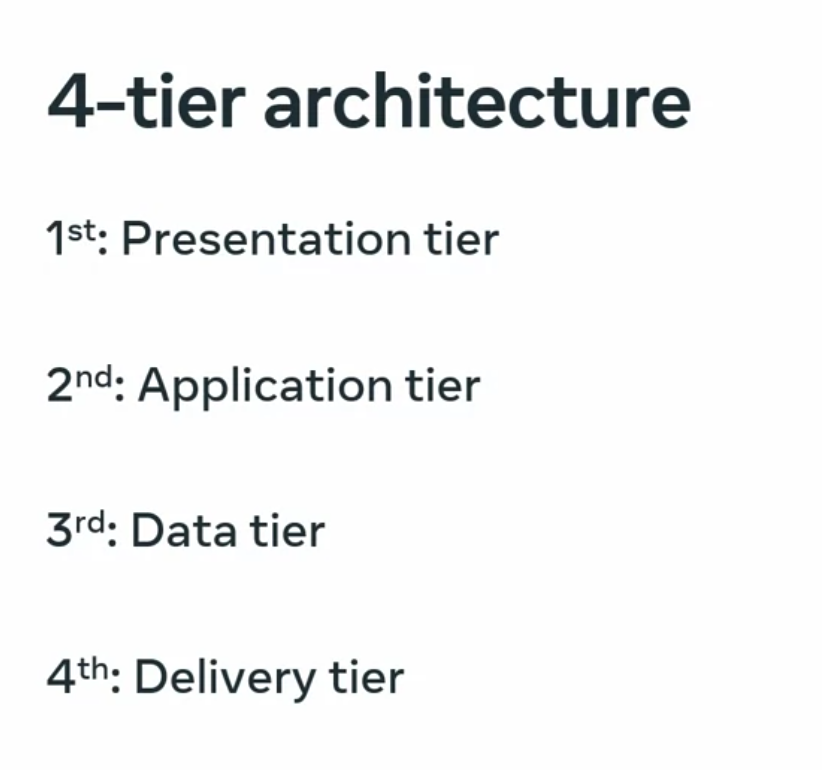

# Intoduction to Web-App Back-End Development

This is my guide for web-app backend development, based on selected courses from:
- the [Meta Back-End Developer Professional Certificate](https://www.coursera.org/programs/deutsche-telekom-learning-program-ddjuh/professional-certificates/meta-back-end-developer) specialization on Coursera
- and the [Backend Developer with Python](https://www.udacity.com/course/backend-developer-with-python--nd0044) nanodegree on Udacity.

From these specializations, I have selected the following topics/courses:

1. [Introduction to Back-End Development](https://www.coursera.org/programs/deutsche-telekom-learning-program-ddjuh/learn/introduction-to-back-end-development)
2. [Introduction to Databases for Back-End Development](https://www.coursera.org/programs/deutsche-telekom-learning-program-ddjuh/learn/intro-to-databases-back-end-development)
3. [Django Web Framework](https://www.coursera.org/programs/deutsche-telekom-learning-program-ddjuh/learn/django-web-framework?authProvider)
4. [APIs](https://www.coursera.org/programs/deutsche-telekom-learning-program-ddjuh/learn/apis)
5. [The Full Stack](https://www.coursera.org/programs/deutsche-telekom-learning-program-ddjuh/learn/the-full-stack?authProvider=deutschetelekom)
6. [Flask SQLAlchemy Data Modelling](https://www.udacity.com/course/sql-and-data-modeling-for-the-web--cd0046)
7. [Software Architecture Patterns](https://www.udacity.com/course/software-architecture-patterns--cd14601)
8. [Implement NGINX Web Servers and Reverse Proxy Solutions](https://www.coursera.org/learn/implement-nginx-web-servers-and-reverse-proxy-solutions)

This module deals with the fifth topic/course: **The Full Stack**.

Table of Contents:

- [Intoduction to Web-App Back-End Development](#intoduction-to-web-app-back-end-development)
  - [1. Introduction to the Full Stack](#1-introduction-to-the-full-stack)
    - [Introduction to the Full Stack](#introduction-to-the-full-stack)
      - [What is full stack development?](#what-is-full-stack-development)
      - [N-tier architecture](#n-tier-architecture)
      - [Client-server architecture](#client-server-architecture)
  - [2. Front-End Technologies](#2-front-end-technologies)
    - [How are HTML and CSS used in the real world?](#how-are-html-and-css-used-in-the-real-world)
      - [Semantic tags and why we need them](#semantic-tags-and-why-we-need-them)
      - [Semantic HTML cheat sheet](#semantic-html-cheat-sheet)
        - [Sectioning Tags](#sectioning-tags)
        - [Content Tags](#content-tags)
        - [Inline Tags](#inline-tags)
        - [Embedded Content and Media Tags](#embedded-content-and-media-tags)
        - [Table Tags](#table-tags)
  - [3. The Full Stack Using Django](#3-the-full-stack-using-django)
  - [4. Production Environments](#4-production-environments)
  - [5. Final Project](#5-final-project)

## 1. Introduction to the Full Stack

### Introduction to the Full Stack

#### What is full stack development?

- A "stack" is a combination of software applications and components used for a specific development focus.
  - Front-end stack: builds the user interface (UI) of web and mobile applications.
    - Web: HTML, CSS, CSS frameworks, JavaScript/TypeScript, JavaScript frameworks like React.
    - Mobile: iOS or Android development tools.
  - Back-end stack: builds the application's core, handling business logic, workflows, and data.
    - Languages/frameworks: Python, Django, DRF (Django REST Framework).
    - Also includes build tools, databases, and caching applications.
    - Includes the data stack, the tools used to store, process, and retrieve data.
      - SQL/NoSQL database engines: MySQL, MariaDB, PostgreSQL.
      - Caching: Redis.
  - Full stack: the end-to-end solution, combining the back-end core with APIs that serve data to web/mobile front ends.
- A full stack developer is equally skilled in the front-end, back-end, and database stacks, plus essential DevOps (development operations) skills to build and deploy to development, staging, and production servers, and familiarity with git for version control.
- Typical responsibilities of a full stack developer:
  - Understand the complete project and take full ownership.
  - Select or create tools for front-end, back-end, and database development.
  - Create effective UIs for web and mobile applications.
  - Develop APIs and the back end of applications.
  - Store, process, and retrieve data from databases.
  - Create and manage servers for development, staging, and production.
  - Integrate with CI/CD (continuous integration/continuous deployment) workflows.
  - Ensure the responsiveness of web applications.
  - Collaborate with the graphics team.
  - Optimize application performance and follow security best practices.

#### N-tier architecture

- An application has multiple parts: the user interface (UI), business logic, and database. "Layers" and "tiers" are often used interchangeably, but they differ.
  - Layers: virtual separations of an application's parts, not necessarily on separate machines.
  - Tiers: parts that are physically separated in the infrastructure (e.g., on different servers) while still communicating to function correctly.
- N-tier architecture splits an application's architecture into multiple tiers. 3-tier is the most common; 4-tier is used when needed.
  - 3-tier architecture:
    - Presentation tier: the client (computer or mobile), a "thin client" that only communicates with the application and presents data, without running business logic.
    - Application tier: holds the application code and business logic, hosted on its own server.
    - Data tier: holds the database, hosted on its own server.
  - 4-tier architecture: adds a delivery tier that handles caching and delivering front-end assets (HTML, CSS, JavaScript, images) to the client, e.g., via a Content Delivery Network (CDN), which uses geographically distributed servers to deliver content from the nearest location.
    - The delivery tier is physically separate from the application and data tiers, so it counts as its own tier.
  - Real N-tier applications vary by purpose (e.g., financial vs. enterprise applications have different needs).
- Benefits of N-tier architecture: easier to secure and scale, and easier to fix or extend since each tier works independently, making development more efficient overall.



#### Client-server architecture

- Full stack development includes a back-end (the application core, hosted on a server or serverless platform) and a front-end (the client). Together, client and server form the client-server architecture, used by websites, multiplayer mobile games, and internet-connected home appliances alike.
  - Client: the computer or mobile device that communicates with the back end.
    - Thin clients: only communicate with the back end to display/present data, without running business logic.
    - Thick clients: consume API data and perform heavier data processing on the client side.
  - Server: hosts the application core, which handles incoming data, applies business logic, and saves/processes data in a database.
    - Hosted on cloud computing units, virtual machines, containers, or a dedicated server.
    - Can use an N-tier architecture to spread layers across multiple physical or virtual servers.
- How it works: client and server communicate over a network (public or private), following standard protocols like HTTP or WebSocket.
  - The client accepts user input, does basic validation, and sends the data to the server.
  - The server runs rigorous validation and sanitization on incoming data to catch invalid or malicious content; the rule of thumb is to never trust incoming data, regardless of its source.
  - The server processes the data with business logic, saves/serves it via the database, and returns a response.
  - The client processes the response: it makes decisions or displays the result.
  - The server must handle multiple simultaneous client requests and must be scaled if its capacity becomes insufficient.
- Advantages:
  - Separates application layers: the database can be installed and managed independently, keeping data centralized and synced so multiple clients see the same up-to-date information (e.g., the Little Lemon restaurant application used throughout the course).
  - Because parts live in separate tiers/layers, scaling, optimizing, securing, backing up, and recovering data is easier and can be done per tier without affecting the whole application.
  - Cost-effective: can be hosted on-demand in the cloud (pay only for what's used), avoiding the need for expensive server hardware or powerful client devices, since business logic runs entirely on the server.
- Disadvantages:
  - Requires ongoing server management: configuring, maintaining, and keeping servers in working order.
  - Unmonitored or abusive API usage can cause cost spikes.
  - Security is a major concern: breaches can leak sensitive user data and cause severe financial damage.
  - If the server goes down or becomes unresponsive, dependent clients stop working.

## 2. Front-End Technologies

### How are HTML and CSS used in the real world?

- HTML (HyperText Markup Language) is the most basic and fundamental markup language for creating webpages, in use since 1990, originally designed to share information (basic images and text) over the internet.
- CSS (Cascading Style Sheets) is a stylesheet language that describes the look and layout of an HTML document.
  - Not a programming language, but supports some programming-like features, such as variables and nested rules.
  - Controls color, size, spacing, fonts, positioning, and more.
  - Enables a key principle: separation of content (HTML) and style (CSS), so a webpage's appearance can change without editing its underlying HTML.
- W3C (World Wide Web Consortium), the organization responsible for web standards, manages both the HTML and CSS specifications and continually updates them to meet current requirements.
  - Newer HTML features: better multimedia support (audio, video), responsive design (adapting layout to the viewing device), new form input types (sliders, range inputs, date/color pickers), new form validation, and improved text handling (spell checking, text editing).
  - Major CSS additions since 2011: media queries (different styles per device), box sizing (control over content sizing/padding), multiple backgrounds per element, border images, text shadows, and transformations/transitions (animating elements).
- Together, HTML and CSS let websites adapt their design and layout to the device they're viewed on. What started as support for phones and tablets has expanded to video game consoles and smart TVs, extending the web browser well beyond traditional desktop devices.

#### Semantic tags and why we need them

- Semantic tags describe the meaning of content, not just its appearance, similar to how numbers on elevator buttons convey which floor a button leads to, beyond their mere vertical arrangement.
  - Writing HTML semantically lets search engines and accessibility software (e.g., screen readers) understand a page's content.
  - Basic examples: heading tags (e.g., `H1`) mark headings; `UL`/`OL` mark lists.
- A typical HTML page can be semantically structured, inside the `body`, using these top-level elements:
  - `header`: usually holds the company logo and navigation links.
  - `nav`: the main navigation, typically placed after `header`; its links are commonly wrapped in an unordered list.
  - `main`: holds the page's main content, made up of `section` and `article` elements.
  - `footer`: holds contact information, social media links, or other closing content.
- `article`: per the W3C (World Wide Web Consortium) specification, represents a complete, self-contained, independently distributable piece of content, like an article on a newspaper page you could cut out with scissors.
  - Examples: a forum post, a magazine/newspaper article, a blog entry, a user comment, or an interactive widget.
  - Best practice: place `article` elements inside `main`; a page can contain multiple `article` elements, e.g., for a blog post list.
  - Semantic elements can nest, since their purpose is only to describe the semantics of their content: an `article` can contain its own `header` (e.g., a heading with the blog title and a paragraph with date/author).
- `section`: semantically divides an `article`, or a webpage more generally, into individual sections; a `section` should contain its own heading element and doesn't require an `article` to be used.

```html
<body>
  <header>
    <!-- Company logo -->
    <nav>
      <ul>
        <li><a href="/">Home</a></li>
        <li><a href="/about">About</a></li>
      </ul>
    </nav>
  </header>
  <main>
    <article>
      <header>
        <h1>My Summer Holiday</h1>
        <p>Posted on 2026-07-16 by Author Name</p>
      </header>
      <section>
        <h2>Day One</h2>
        <p>Blog post content...</p>
      </section>
    </article>
  </main>
  <footer>
    <!-- Contact info, social media links -->
  </footer>
</body>
```

#### Semantic HTML cheat sheet

##### Sectioning Tags

Use the following tags to organize your HTML document into structured sections.

- `<header>`: the header of a content section or the web page; the page header often contains the website branding or logo.
- `<nav>`: the navigation links of a section or the web page.
- `<footer>`: the footer of a content section or the web page; on a web page, it often contains secondary links, the copyright notice, and the privacy/cookie policy links.
- `<main>`: specifies the main content of a section or the web page.
- `<aside>`: a secondary set of content that is not required to understand the main content.
- `<article>`: an independent, self-contained block of content, such as a blog post or a product.
- `<section>`: a standalone section of the document, often used within `<body>` and `<article>` elements.
- `<details>`: a collapsed section of content that can be expanded if the user wishes to view it.
- `<summary>`: specifies the summary or caption of a `<details>` element.
- `<h1>`-`<h6>`: headings on the web page; `<h1>` indicates the most important heading, `<h6>` the least important.

##### Content Tags

- `<blockquote>`: used to describe a quotation.
- `<dl>`: used to define a description list.
  - `<dt>`: describes terms inside `<dl>` elements.
  - `<dd>`: defines a description for the preceding `<dt>` element.
- `<figure>`: applies markup to a photo image.
  - `<figcaption>`: defines a caption for a photo image.
- `<hr>`: adds a horizontal line to the parent element.
- `<ul>`: unordered list.
  - `<ol>`: defines an ordered list.
  - `<menu>`: a semantic alternative to the `<ul>` tag.
  - `<li>`: used to define an item within a list.
- `<p>`: defines a paragraph.
- `<pre>`: used to represent preformatted text, typically rendered in the web browser using a monospace font.

##### Inline Tags

- `<a>`: an anchor link to another HTML document.
- `<abbr>`: specifies that the containing text is an abbreviation or acronym.
- `<b>`: bolds the containing text; use `<strong>` instead when indicating importance.
- `<strong>`: displays the containing text in bold, used to indicate importance.
- `<br>`: a line break; moves the subsequent text to a new line.
- `<cite>`: defines the title of a creative work (e.g., a book, poem, song, movie, painting, or sculpture); the text is usually rendered in italics.
- `<code>`: indicates that the containing text is a block of computer code.
- `<data>`: indicates machine-readable data.
- `<em>`: emphasizes the containing text.
- `<i>`: displays the containing text in italics; used to indicate idiomatic text or technical terms.
- `<mark>`: the containing text should be marked or highlighted.
- `<q>`: the containing text is a short quotation.
- `<s>`: displays the containing text with a strikethrough or line through it.
- `<samp>`: the containing text represents a sample.
- `<small>`: used to represent small text, such as copyright and legal text.
- `<span>`: a generic element for grouping content for CSS styling.
- `<sub>`: the containing text is subscript text, displayed with a lowered baseline.
- `<sup>`: the containing text is superscript text, displayed with a raised baseline.
- `<time>`: a semantic tag used to display both dates and times.
- `<u>`: displays the containing text with a solid underline.
- `<var>`: the containing text is a variable in a mathematical expression.

##### Embedded Content and Media Tags

- `<audio>`: used to embed audio in web pages.
- `<video>`: embeds a video on a web page.
- `<source>`: specifies media resources for `<picture>`, `<audio>`, and `<video>` elements.
- `<picture>`: contains one `` element and one or more `<source>` elements to offer alternative images for different displays/devices.
- ``: embeds an image on a web page.
- `<canvas>`: used to render 2D and 3D graphics on web pages.
- `<svg>`: used to define Scalable Vector Graphics (SVG) within a web page.
- `<embed>`: a containing element for external content provided by an external application, such as a media player or plug-in application.
- `<object>`: similar to `<embed>`, but the content is provided by a web browser plug-in.
- `<iframe>`: used to embed a nested web page.

##### Table Tags

- `<table>`: defines a table element to display table data within a web page.
- `<caption>`: defines the caption of a table element.
- `<colgroup>`: defines a semantic group of one or more columns in a table for formatting.
  - `<col>`: defines a semantic column in a table.
- `<thead>`: represents the header content of a table; typically contains one `<tr>` element.
- `<tbody>`: represents the main content of a table; contains one or more `<tr>` elements.
- `<tfoot>`: represents the footer content of a table; typically contains one `<tr>` element.
- `<tr>`: represents a row in a table; contains one or more `<td>` elements when used within `<tbody>` or `<tfoot>`, or one or more `<th>` elements when used within `<thead>`.
  - `<td>`: represents a cell in a table, containing the text content of the cell.
  - `<th>`: defines a header cell of a table, containing the text content of the header.


## 3. The Full Stack Using Django

## 4. Production Environments

## 5. Final Project


