# Intoduction to Web-App Back-End Development

This is my guide for web-app backend development, based on selected courses from:
- the [Meta Back-End Developer Professional Certificate](https://www.coursera.org/programs/deutsche-telekom-learning-program-ddjuh/professional-certificates/meta-back-end-developer) specialization on Coursera
- and the [Backend Developer with Python](https://www.udacity.com/course/backend-developer-with-python--nd0044) nanodegree on Udacity.

From these specializations, I have selected the following topics/courses:

1. [Introduction to Back-End Development](https://www.coursera.org/programs/deutsche-telekom-learning-program-ddjuh/learn/introduction-to-back-end-development)
2. [Introduction to Databases for Back-End Development](https://www.coursera.org/programs/deutsche-telekom-learning-program-ddjuh/learn/intro-to-databases-back-end-development)
3. [Django Web Framework](https://www.coursera.org/programs/deutsche-telekom-learning-program-ddjuh/learn/django-web-framework?authProvider)
4. [APIs](https://www.coursera.org/programs/deutsche-telekom-learning-program-ddjuh/learn/apis)
5. [The Full Stack](https://www.coursera.org/programs/deutsche-telekom-learning-program-ddjuh/learn/the-full-stack?authProvider=deutschetelekom)
6. [Flask SQLAlchemy Data Modelling](https://www.udacity.com/course/sql-and-data-modeling-for-the-web--cd0046)
7. [Software Architecture Patterns](https://www.udacity.com/course/software-architecture-patterns--cd14601)
8. [Implement NGINX Web Servers and Reverse Proxy Solutions](https://www.coursera.org/learn/implement-nginx-web-servers-and-reverse-proxy-solutions)

This module deals with the fifth topic/course: **The Full Stack**.

Table of Contents:

- [Intoduction to Web-App Back-End Development](#intoduction-to-web-app-back-end-development)
  - [1. Introduction to the Full Stack](#1-introduction-to-the-full-stack)
    - [Introduction to the Full Stack](#introduction-to-the-full-stack)
      - [What is full stack development?](#what-is-full-stack-development)
      - [N-tier architecture](#n-tier-architecture)
      - [Client-server architecture](#client-server-architecture)
  - [2. Front-End Technologies](#2-front-end-technologies)
    - [HTML](#html)
      - [How are HTML and CSS used in the real world?](#how-are-html-and-css-used-in-the-real-world)
      - [Semantic tags and why we need them](#semantic-tags-and-why-we-need-them)
      - [Semantic HTML cheat sheet](#semantic-html-cheat-sheet)
        - [Sectioning Tags](#sectioning-tags)
        - [Content Tags](#content-tags)
        - [Inline Tags](#inline-tags)
        - [Embedded Content and Media Tags](#embedded-content-and-media-tags)
        - [Table Tags](#table-tags)
      - [Semantic tags in action](#semantic-tags-in-action)
      - [Forms and validation](#forms-and-validation)
      - [Input types](#input-types)
        - [Button](#button)
        - [Checkbox](#checkbox)
        - [Radio](#radio)
        - [Submit](#submit)
        - [Text](#text)
        - [Password](#password)
        - [Date](#date)
        - [Datetime-local](#datetime-local)
        - [Email](#email)
        - [File](#file)
        - [Hidden](#hidden)
        - [Image](#image)
        - [Number](#number)
        - [Range](#range)
        - [Reset](#reset)
        - [Search](#search)
        - [Time](#time)
        - [Tel](#tel)
        - [Url](#url)
        - [Week](#week)
        - [Month](#month)
      - [Form submission](#form-submission)
      - [Submit](#submit-1)
    - [CSS](#css)
      - [CSS web layout](#css-web-layout)
      - [Widely used selectors](#widely-used-selectors)
      - [CSS units of measurement](#css-units-of-measurement)
        - [Absolute units](#absolute-units)
        - [Relative units](#relative-units)
      - [Document flow - Block vs. In-line](#document-flow---block-vs-in-line)
      - [Basic flexbox](#basic-flexbox)
      - [CSS grids](#css-grids)
      - [Grids and flexbox cheat sheet](#grids-and-flexbox-cheat-sheet)
        - [Grid](#grid)
        - [Flexbox](#flexbox)
      - [Exercise: Create a Grid Layout](#exercise-create-a-grid-layout)
      - [All selectors and their specificity](#all-selectors-and-their-specificity)
        - [Specificity hierarchy](#specificity-hierarchy)
        - [Calculating scores](#calculating-scores)
      - [Pseudo-classes](#pseudo-classes)
      - [Pseudo-elements](#pseudo-elements)
        - [Syntax](#syntax)
        - [Setting up the HTML and CSS files](#setting-up-the-html-and-css-files)
        - [`::first-letter`](#first-letter)
        - [`::first-line`](#first-line)
        - [`::selection`](#selection)
        - [`::marker`](#marker)
        - [`::before` and `::after`](#before-and-after)
      - [Additional Resources](#additional-resources)
    - [Javascript](#javascript)
      - [Why Javascript?](#why-javascript)
      - [Programming in Javascript](#programming-in-javascript)
      - [Attaching JavaScript to HTML](#attaching-javascript-to-html)
      - [Variables](#variables)
      - [Data Types](#data-types)
      - [Operators](#operators)
      - [Numbers](#numbers)
      - [Strings](#strings)
      - [Booleans](#booleans)
      - [Javascript Interactivity](#javascript-interactivity)
      - [Javascript Selectors](#javascript-selectors)
      - [Scoping: var, let, const](#scoping-var-let-const)
      - [Arrays](#arrays)
      - [Objects and Maps](#objects-and-maps)
      - [Conditional Statements and Loops](#conditional-statements-and-loops)
      - [Functions](#functions)
      - [Classes](#classes)
      - [Javascript DOM Manipulation](#javascript-dom-manipulation)
      - [Event Handling](#event-handling)
      - [Exercise: Web Page Content Update](#exercise-web-page-content-update)
        - [Capturing Input with `prompt()`](#capturing-input-with-prompt)
        - [Using an HTML Form Input Instead](#using-an-html-form-input-instead)
        - [Listening for Input Changes](#listening-for-input-changes)
      - [Frameworks and Libraries](#frameworks-and-libraries)
      - [Additional Resources](#additional-resources-1)
  - [3. The Full Stack Using Django](#3-the-full-stack-using-django)
    - [Django Architecture](#django-architecture)
      - [Recap: What you know about Django](#recap-what-you-know-about-django)
      - [Recap: What you know about APIs](#recap-what-you-know-about-apis)
      - [Environment check](#environment-check)
      - [Creating a Django project (steps and code)](#creating-a-django-project-steps-and-code)
        - [App-level `urls.py`](#app-level-urlspy)
        - [Project-level `urls.py`](#project-level-urlspy)
    - [Django and MySQL](#django-and-mysql)
      - [Recap: What you know about Databases and MySQL](#recap-what-you-know-about-databases-and-mysql)
      - [Recap: Models and migrations](#recap-models-and-migrations)
        - [ORM and CRUD Operations in Models](#orm-and-crud-operations-in-models)
        - [Using Raw SQL with `raw()`](#using-raw-sql-with-raw)
        - [Model Relationships](#model-relationships)
        - [Migrations](#migrations)
        - [History of Changes](#history-of-changes)
        - [Logic Behind Migrations](#logic-behind-migrations)
      - [Configuring Django to connect to MySQL](#configuring-django-to-connect-to-mysql)
      - [Exercise: Connect Django to MySQL](#exercise-connect-django-to-mysql)
    - [Django and the Front End](#django-and-the-front-end)
      - [Recap: What you know about forms and ModelForms](#recap-what-you-know-about-forms-and-modelforms)
        - [Plain HTML Form](#plain-html-form)
        - [The Form Class](#the-form-class)
        - [ModelForm](#modelform)
        - [Form Field Types](#form-field-types)
      - [Fetching data using JavaScript](#fetching-data-using-javascript)
      - [Querying APIs using JavaScript](#querying-apis-using-javascript)
        - [Native Solution vs. Third-Party Libraries](#native-solution-vs-third-party-libraries)
        - [Making a GET Call](#making-a-get-call)
        - [POST, PUT, and PATCH Calls](#post-put-and-patch-calls)
        - [DELETE Calls](#delete-calls)
        - [Making Authenticated Calls with Tokens](#making-authenticated-calls-with-tokens)
      - [Exercise: Submitting a form with JavaScript](#exercise-submitting-a-form-with-javascript)
  - [4. Production Environments](#4-production-environments)
    - [Web server environments](#web-server-environments)
      - [Server and serverless](#server-and-serverless)
      - [Virtual machines and containerization](#virtual-machines-and-containerization)
      - [What does self-hosted, PaaS, SaaS and DBaaS mean?](#what-does-self-hosted-paas-saas-and-dbaas-mean)
    - [Introduction to cloud computing](#introduction-to-cloud-computing)
      - [What is cloud computing?](#what-is-cloud-computing)
      - [Key elements of cloud computing](#key-elements-of-cloud-computing)
      - [Networking in the cloud](#networking-in-the-cloud)
    - [Scaling in the cloud](#scaling-in-the-cloud)
  - [5. Final Project](#5-final-project)
    - [Final project assessment](#final-project-assessment)
  - [6. Extra: HTMX](#6-extra-htmx)
  - [7. Extra: Bootstrap](#7-extra-bootstrap)
  - [8. Extra: UX](#8-extra-ux)

## 1. Introduction to the Full Stack

### Introduction to the Full Stack

#### What is full stack development?

- A "stack" is a combination of software applications and components used for a specific development focus.
  - Front-end stack: builds the user interface (UI) of web and mobile applications.
    - Web: HTML, CSS, CSS frameworks, JavaScript/TypeScript, JavaScript frameworks like React.
    - Mobile: iOS or Android development tools.
  - Back-end stack: builds the application's core, handling business logic, workflows, and data.
    - Languages/frameworks: Python, Django, DRF (Django REST Framework).
    - Also includes build tools, databases, and caching applications.
    - Includes the data stack, the tools used to store, process, and retrieve data.
      - SQL/NoSQL database engines: MySQL, MariaDB, PostgreSQL.
      - Caching: Redis.
  - Full stack: the end-to-end solution, combining the back-end core with APIs that serve data to web/mobile front ends.
- A full stack developer is equally skilled in the front-end, back-end, and database stacks, plus essential DevOps (development operations) skills to build and deploy to development, staging, and production servers, and familiarity with git for version control.
- Typical responsibilities of a full stack developer:
  - Understand the complete project and take full ownership.
  - Select or create tools for front-end, back-end, and database development.
  - Create effective UIs for web and mobile applications.
  - Develop APIs and the back end of applications.
  - Store, process, and retrieve data from databases.
  - Create and manage servers for development, staging, and production.
  - Integrate with CI/CD (continuous integration/continuous deployment) workflows.
  - Ensure the responsiveness of web applications.
  - Collaborate with the graphics team.
  - Optimize application performance and follow security best practices.

#### N-tier architecture

- An application has multiple parts: the user interface (UI), business logic, and database. "Layers" and "tiers" are often used interchangeably, but they differ.
  - Layers: virtual separations of an application's parts, not necessarily on separate machines.
  - Tiers: parts that are physically separated in the infrastructure (e.g., on different servers) while still communicating to function correctly.
- N-tier architecture splits an application's architecture into multiple tiers. 3-tier is the most common; 4-tier is used when needed.
  - 3-tier architecture:
    - Presentation tier: the client (computer or mobile), a "thin client" that only communicates with the application and presents data, without running business logic.
    - Application tier: holds the application code and business logic, hosted on its own server.
    - Data tier: holds the database, hosted on its own server.
  - 4-tier architecture: adds a delivery tier that handles caching and delivering front-end assets (HTML, CSS, JavaScript, images) to the client, e.g., via a Content Delivery Network (CDN), which uses geographically distributed servers to deliver content from the nearest location.
    - The delivery tier is physically separate from the application and data tiers, so it counts as its own tier.
  - Real N-tier applications vary by purpose (e.g., financial vs. enterprise applications have different needs).
- Benefits of N-tier architecture: easier to secure and scale, and easier to fix or extend since each tier works independently, making development more efficient overall.

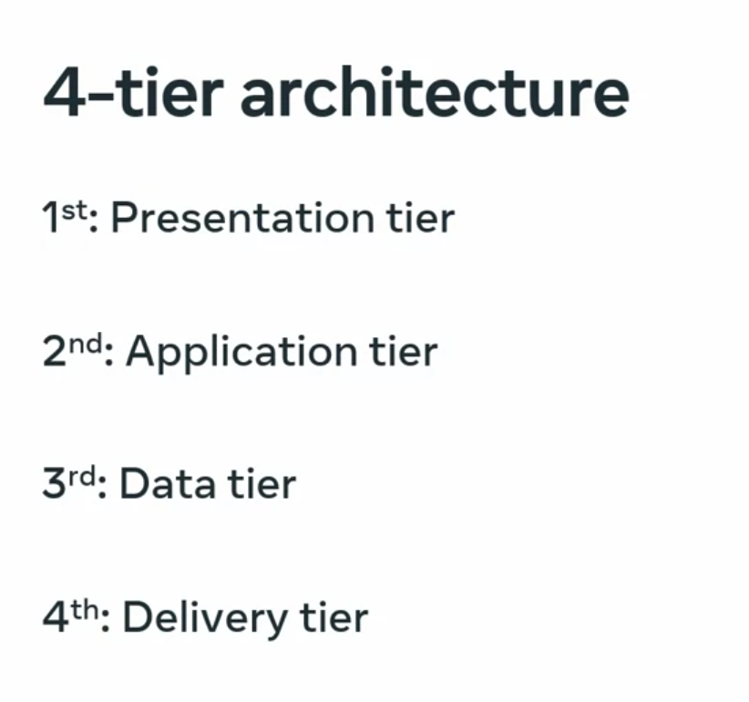

#### Client-server architecture

- Full stack development includes a back-end (the application core, hosted on a server or serverless platform) and a front-end (the client). Together, client and server form the client-server architecture, used by websites, multiplayer mobile games, and internet-connected home appliances alike.
  - Client: the computer or mobile device that communicates with the back end.
    - Thin clients: only communicate with the back end to display/present data, without running business logic.
    - Thick clients: consume API data and perform heavier data processing on the client side.
  - Server: hosts the application core, which handles incoming data, applies business logic, and saves/processes data in a database.
    - Hosted on cloud computing units, virtual machines, containers, or a dedicated server.
    - Can use an N-tier architecture to spread layers across multiple physical or virtual servers.
- How it works: client and server communicate over a network (public or private), following standard protocols like HTTP or WebSocket.
  - The client accepts user input, does basic validation, and sends the data to the server.
  - The server runs rigorous validation and sanitization on incoming data to catch invalid or malicious content; the rule of thumb is to never trust incoming data, regardless of its source.
  - The server processes the data with business logic, saves/serves it via the database, and returns a response.
  - The client processes the response: it makes decisions or displays the result.
  - The server must handle multiple simultaneous client requests and must be scaled if its capacity becomes insufficient.
- Advantages:
  - Separates application layers: the database can be installed and managed independently, keeping data centralized and synced so multiple clients see the same up-to-date information (e.g., the Little Lemon restaurant application used throughout the course).
  - Because parts live in separate tiers/layers, scaling, optimizing, securing, backing up, and recovering data is easier and can be done per tier without affecting the whole application.
  - Cost-effective: can be hosted on-demand in the cloud (pay only for what's used), avoiding the need for expensive server hardware or powerful client devices, since business logic runs entirely on the server.
- Disadvantages:
  - Requires ongoing server management: configuring, maintaining, and keeping servers in working order.
  - Unmonitored or abusive API usage can cause cost spikes.
  - Security is a major concern: breaches can leak sensitive user data and cause severe financial damage.
  - If the server goes down or becomes unresponsive, dependent clients stop working.

## 2. Front-End Technologies

### HTML

#### How are HTML and CSS used in the real world?

- HTML (HyperText Markup Language) is the most basic and fundamental markup language for creating webpages, in use since 1990, originally designed to share information (basic images and text) over the internet.
- CSS (Cascading Style Sheets) is a stylesheet language that describes the look and layout of an HTML document.
  - Not a programming language, but supports some programming-like features, such as variables and nested rules.
  - Controls color, size, spacing, fonts, positioning, and more.
  - Enables a key principle: separation of content (HTML) and style (CSS), so a webpage's appearance can change without editing its underlying HTML.
- W3C (World Wide Web Consortium), the organization responsible for web standards, manages both the HTML and CSS specifications and continually updates them to meet current requirements.
  - Newer HTML features: better multimedia support (audio, video), responsive design (adapting layout to the viewing device), new form input types (sliders, range inputs, date/color pickers), new form validation, and improved text handling (spell checking, text editing).
  - Major CSS additions since 2011: media queries (different styles per device), box sizing (control over content sizing/padding), multiple backgrounds per element, border images, text shadows, and transformations/transitions (animating elements).
- Together, HTML and CSS let websites adapt their design and layout to the device they're viewed on. What started as support for phones and tablets has expanded to video game consoles and smart TVs, extending the web browser well beyond traditional desktop devices.

#### Semantic tags and why we need them

- Semantic tags describe the meaning of content, not just its appearance, similar to how numbers on elevator buttons convey which floor a button leads to, beyond their mere vertical arrangement.
  - Writing HTML semantically lets search engines and accessibility software (e.g., screen readers) understand a page's content.
  - Basic examples: heading tags (e.g., `H1`) mark headings; `UL`/`OL` mark lists.
- A typical HTML page can be semantically structured, inside the `body`, using these top-level elements:
  - `header`: usually holds the company logo and navigation links.
  - `nav`: the main navigation, typically placed after `header`; its links are commonly wrapped in an unordered list.
  - `main`: holds the page's main content, made up of `section` and `article` elements.
  - `footer`: holds contact information, social media links, or other closing content.
- `article`: per the W3C (World Wide Web Consortium) specification, represents a complete, self-contained, independently distributable piece of content, like an article on a newspaper page you could cut out with scissors.
  - Examples: a forum post, a magazine/newspaper article, a blog entry, a user comment, or an interactive widget.
  - Best practice: place `article` elements inside `main`; a page can contain multiple `article` elements, e.g., for a blog post list.
  - Semantic elements can nest, since their purpose is only to describe the semantics of their content: an `article` can contain its own `header` (e.g., a heading with the blog title and a paragraph with date/author).
- `section`: semantically divides an `article`, or a webpage more generally, into individual sections; a `section` should contain its own heading element and doesn't require an `article` to be used.

```html
<body>
  <header>
    <!-- Company logo -->
    <nav>
      <ul>
        <li><a href="/">Home</a></li>
        <li><a href="/about">About</a></li>
      </ul>
    </nav>
  </header>
  <main>
    <article>
      <header>
        <h1>My Summer Holiday</h1>
        <p>Posted on 2026-07-16 by Author Name</p>
      </header>
      <section>
        <h2>Day One</h2>
        <p>Blog post content...</p>
      </section>
    </article>
  </main>
  <footer>
    <!-- Contact info, social media links -->
  </footer>
</body>
```

#### Semantic HTML cheat sheet

##### Sectioning Tags

Use the following tags to organize your HTML document into structured sections.

- `<header>`: the header of a content section or the web page; the page header often contains the website branding or logo.
- `<nav>`: the navigation links of a section or the web page.
- `<footer>`: the footer of a content section or the web page; on a web page, it often contains secondary links, the copyright notice, and the privacy/cookie policy links.
- `<main>`: specifies the main content of a section or the web page.
- `<aside>`: a secondary set of content that is not required to understand the main content.
- `<article>`: an independent, self-contained block of content, such as a blog post or a product.
- `<section>`: a standalone section of the document, often used within `<body>` and `<article>` elements.
- `<details>`: a collapsed section of content that can be expanded if the user wishes to view it.
- `<summary>`: specifies the summary or caption of a `<details>` element.
- `<h1>`-`<h6>`: headings on the web page; `<h1>` indicates the most important heading, `<h6>` the least important.

##### Content Tags

- `<blockquote>`: used to describe a quotation.
- `<dl>`: used to define a description list.
  - `<dt>`: describes terms inside `<dl>` elements.
  - `<dd>`: defines a description for the preceding `<dt>` element.
- `<figure>`: applies markup to a photo image.
  - `<figcaption>`: defines a caption for a photo image.
- `<hr>`: adds a horizontal line to the parent element.
- `<ul>`: unordered list.
  - `<ol>`: defines an ordered list.
  - `<menu>`: a semantic alternative to the `<ul>` tag.
  - `<li>`: used to define an item within a list.
- `<p>`: defines a paragraph.
- `<pre>`: used to represent preformatted text, typically rendered in the web browser using a monospace font.

##### Inline Tags

- `<a>`: an anchor link to another HTML document.
- `<abbr>`: specifies that the containing text is an abbreviation or acronym.
- `<b>`: bolds the containing text; use `<strong>` instead when indicating importance.
- `<strong>`: displays the containing text in bold, used to indicate importance.
- `<br>`: a line break; moves the subsequent text to a new line.
- `<cite>`: defines the title of a creative work (e.g., a book, poem, song, movie, painting, or sculpture); the text is usually rendered in italics.
- `<code>`: indicates that the containing text is a block of computer code.
- `<data>`: indicates machine-readable data.
- `<em>`: emphasizes the containing text.
- `<i>`: displays the containing text in italics; used to indicate idiomatic text or technical terms.
- `<mark>`: the containing text should be marked or highlighted.
- `<q>`: the containing text is a short quotation.
- `<s>`: displays the containing text with a strikethrough or line through it.
- `<samp>`: the containing text represents a sample.
- `<small>`: used to represent small text, such as copyright and legal text.
- `<span>`: a generic element for grouping content for CSS styling.
- `<sub>`: the containing text is subscript text, displayed with a lowered baseline.
- `<sup>`: the containing text is superscript text, displayed with a raised baseline.
- `<time>`: a semantic tag used to display both dates and times.
- `<u>`: displays the containing text with a solid underline.
- `<var>`: the containing text is a variable in a mathematical expression.

##### Embedded Content and Media Tags

- `<audio>`: used to embed audio in web pages.
- `<video>`: embeds a video on a web page.
- `<source>`: specifies media resources for `<picture>`, `<audio>`, and `<video>` elements.
- `<picture>`: contains one `` element and one or more `<source>` elements to offer alternative images for different displays/devices.
- ``: embeds an image on a web page.
- `<canvas>`: used to render 2D and 3D graphics on web pages.
- `<svg>`: used to define Scalable Vector Graphics (SVG) within a web page.
- `<embed>`: a containing element for external content provided by an external application, such as a media player or plug-in application.
- `<object>`: similar to `<embed>`, but the content is provided by a web browser plug-in.
- `<iframe>`: used to embed a nested web page.

##### Table Tags

- `<table>`: defines a table element to display table data within a web page.
- `<caption>`: defines the caption of a table element.
- `<colgroup>`: defines a semantic group of one or more columns in a table for formatting.
  - `<col>`: defines a semantic column in a table.
- `<thead>`: represents the header content of a table; typically contains one `<tr>` element.
- `<tbody>`: represents the main content of a table; contains one or more `<tr>` elements.
- `<tfoot>`: represents the footer content of a table; typically contains one `<tr>` element.
- `<tr>`: represents a row in a table; contains one or more `<td>` elements when used within `<tbody>` or `<tfoot>`, or one or more `<th>` elements when used within `<thead>`.
  - `<td>`: represents a cell in a table, containing the text content of the cell.
  - `<th>`: defines a header cell of a table, containing the text content of the header.

#### Semantic tags in action

- Worked example: Little Lemon Restaurant needs a new blog page (`blog.html`) with several blog posts, built with semantic HTML so search engines and accessibility software (e.g., screen readers) can understand the page's content.
- Step 1: lay out the top-level semantic structure inside the existing basic HTML document, in order:
  - `header`: will hold the Little Lemon logo.
  - `nav`: will describe the site's navigational structure.
  - `main`: will hold the page's main content.
  - `footer`: will hold copyright information.
- Step 2: fill in the details of each element.
  - `header`: add the logo with an `img` tag.
  - `nav`: add a `ul` with three `li` items, each wrapping an `a` tag linking to `index.html`, `location.html`, and `blog.html`.
  - `main`: add an `h1` for the blog heading, then one `article` per blog post (two posts, since the restaurant requested two).
    - Each `article` gets an `h2` title and a `p` with the post text.
    - First post: "20% off this weekend".
    - Second post: "Our new menu".
  - `footer`: add a `p` with the copyright notice.
- Step 3: save the file (Ctrl+S / Cmd+S), then right-click `blog.html` and select Live Preview to check the result.
- Outcome: the semantic structure makes the page accessible to assistive technology and optimized for search engines (SEO), helping both the restaurant's visibility and customers with disabilities.

```html
<body>
  <header>
    
  </header>
  <nav>
    <ul>
      <li><a href="index.html">Home</a></li>
      <li><a href="location.html">Location</a></li>
      <li><a href="blog.html">Blog</a></li>
    </ul>
  </nav>
  <main>
    <h1>Little Lemon Blog</h1>
    <article>
      <h2>20% off this weekend</h2>
      <p>Blog post text...</p>
    </article>
    <article>
      <h2>Our new menu</h2>
      <p>Blog post text...</p>
    </article>
  </main>
  <footer>
    <p>&copy; 2026 Little Lemon Restaurant</p>
  </footer>
</body>
```

#### Forms and validation

- HTML forms capture user input, e.g., account registration or a delivery address at checkout.
- Capturing input isn't enough; the data must also be usable. Example: a food delivery site that accepts a mistyped, nonexistent address causes a bad user experience when the order never arrives.
- Form validation solves this: it's the process of ensuring user-entered data is valid and conforms to rules defined by the developer, via two methods.
  - Client-side validation:
    - Checks for errors as soon as they're typed, performed by the web browser or JavaScript, giving immediate feedback.
    - Flow: on submission, the browser checks the form; if there are no errors, it submits to the server; if there are errors, it shows a message explaining what's invalid and how to fix it.
    - Achieved with HTML input types the browser validates natively: `email`, `tel` (telephone number), `url`, `date`, `time`, `number`, `range` (numeric with a minimum and maximum), and `color`.
      - Example: an `input` with `type="email"` triggers a browser error message if the entered value isn't a valid email address.
    - The `required` attribute forces a field to have a value; the browser alerts the user if a required field is left empty.
  - Server-side validation:
    - Checks for errors after the data has been submitted to the web server.
    - More secure than client-side validation, since it prevents malicious users from tampering with the site's client-side code to submit invalid data.
    - Can run more complex checks, such as validating against a database or business requirements.
  - Most websites combine both methods: client-side validation for immediate user feedback, server-side validation to guard against malicious submissions and ensure data integrity.

```html
<form>
  <input type="email" name="email" required />
  <input type="tel" name="phone" />
  <input type="url" name="website" />
  <input type="date" name="delivery-date" />
  <input type="time" name="delivery-time" />
  <input type="number" name="quantity" />
  <input type="range" name="rating" min="1" max="10" />
  <input type="color" name="favorite-color" />
</form>
```

#### Input types

##### Button

Displays a clickable button, mostly used in HTML forms to activate a script when clicked.

```html
<input type="button" value="Click me" onclick="msg()" />
```

You can also define buttons with the `<button>` tag, which has the added benefit of letting you place content like text or images inside the tag.

```html
<button onclick="alert('Are you sure you want to continue?')">
  
</button>
```

##### Checkbox

Defines a checkbox, letting a user select or deselect a single value. Checkboxes let a user select one or more options from a limited set of choices.

```html
<input type="checkbox" id="dog" name="dog" value="Dog">
<label for="dog">I like dogs</label>
<input type="checkbox" id="cat" name="cat" value="Cat">
<label for="cat">I like cats</label>
```

##### Radio

Displays a radio button, allowing only a single value to be selected out of multiple choices. Radio buttons are normally presented in radio groups: collections of related options that share the same `name` attribute.

```html
<input type="radio" id="light" name="theme" value="Light">
<label for="light">Light</label>
<input type="radio" id="dark" name="theme" value="Dark">
<label for="dark">Dark</label>
```

##### Submit

Displays a submit button for submitting all values from an HTML form to a form-handler, typically a server. The form-handler is specified in the form's `action` attribute.

```html
<form action="myserver.com" method="POST">
  <!-- other form fields -->
  <input type="submit" value="Submit" />
</form>
```

##### Text

Defines a basic single-line text field that a user can enter text into.

```html
<label for="fname">First name:</label>
<input type="text" id="fname" name="fname">
```

##### Password

Defines a single-line text field whose value is obscured, suited for sensitive information like passwords.

```html
<label for="pwd">Password:</label>
<input type="password" id="pwd" name="pwd">
```

##### Date

Displays a control for entering a date (year, month, and day), with no time.

```html
<label for="dob">Date of birth:</label>
<input type="date" id="dob" name="date-of-birth">
```

##### Datetime-local

Defines a control for entering a date and time, including the year, month, and day, as well as the time in hours and minutes.

```html
<label for="birthdaytime">Birthday (date and time):</label>
<input type="datetime-local" id="birthdaytime" name="birthdaytime">
```

##### Email

Defines a field for an email address. It behaves like a plain text input, with the addition that the browser validates it automatically before submission.

```html
<label for="email">Enter your email:</label>
<input type="email" id="email" name="email">
```

##### File

Displays a control that lets the user select and upload a file from their computer.

- Use the `accept` attribute to define the permissible file types.
- Add the `multiple` attribute to allow selecting more than one file.

```html
<label for="myfile">Select a file:</label>
<input type="file" id="myfile" name="myfile">
```

##### Hidden

Defines a control that is not displayed but whose value is still submitted to the server.

```html
<input type="hidden" id="custId" name="custId" value="3487">
```

##### Image

Defines an image as a graphical submit button. Use the `src` attribute to point to the location of the image file.

```html
<input type="image" src="submit_img.png" alt="Submit" width="48" height="48">
```

##### Number

Defines a control for entering a number. Attributes can specify restrictions, such as `min`/`max` values allowed, number intervals, or a default value.

```html
<input type="number" id="quantity" name="quantity" min="1" max="5">
```

##### Range

Displays a range widget for specifying a number between two values, typically represented using a slider or dial control; the precise value is not considered important. Use the `min` and `max` attributes to define the range of acceptable values.

```html
<label for="volume">Volume:</label>
<input type="range" id="volume" name="volume" min="0" max="10">
```

##### Reset

Displays a button that resets the contents of the form to their default values.

```html
<input type="reset">
```

##### Search

Defines a text field for entering a search query. These are functionally identical to text inputs, but may be styled differently depending on the browser.

```html
<label for="gsearch">Search in Google:</label>
<input type="search" id="gsearch" name="gsearch">
```

##### Time

Displays a control for entering a time value in hours and minutes, with no time zone.

```html
<label for="appt">Select a time:</label>
<input type="time" id="appt" name="appt">
```

##### Tel

Defines a control for entering a telephone number. Browsers that do not support `tel` fall back to a standard text input. Optionally use the `pattern` attribute to perform validation.

```html
<label for="phone">Enter your phone number:</label>
<input type="tel" id="phone" name="phone" pattern="[+]{1}[0-9]{11,14}">
```

##### Url

Displays a field for entering a text URL. It works similarly to a text input, but performs automatic validation before being submitted to the server.

```html
<label for="homepage">Add your homepage:</label>
<input type="url" id="homepage" name="homepage">
```

##### Week

Defines a control for entering a date consisting of a week number and a year, with no time zone. This is a newer type that is not supported by all browsers.

```html
<label for="week">Select a week:</label>
<input type="week" id="week" name="week">
```

##### Month

Displays a control for entering a month and year, with no time zone. This is a newer type that is not supported by all browsers.

```html
<label for="bdaymonth">Birthday (month and year):</label>
<input type="month" id="bdaymonth" name="bdaymonth" min="1930-01" value="2000-01">
```

#### Form submission

- Forms send data to the web server as part of the browser-server HTTP (HyperText Transfer Protocol) request-response cycle: the browser sends a request, and the server sends back a response.
- Besides requesting resources (HTML documents, images, CSS files, JavaScript files), a request can also carry data -- this is how a submitted form sends its data to the server.
- A form can send its data with either the HTTP GET or POST method, chosen via the form element's `method` attribute.
- GET method:
  - On submission, the form data is appended to the end of the request URL, visible in the browser's address bar; the server receives the GET request and extracts the form data from the URL.
  - Easy to use, but has three problems:
    - Browsers limit URL length to around 2,000 characters (varies by browser), so a large form's data may be lost.
    - Servers also limit URL length; popular server software like Apache and Nginx defaults to around 4,096 characters, risking the same data loss.
    - Security: since the data sits in the URL, it's stored in the browser history and possibly in server request logs, a major privacy/security risk for personal data such as addresses or credit card numbers.
- POST method:
  - The form data is inserted into the body of the HTTP request instead of the URL.
  - More secure than GET, since the data isn't exposed in the URL, browser history, or logs.
  - Still not fully secure on its own: a third party listening to the request could still read the data. HTTPS (HTTP Secure) encrypts the request so only the sender and receiver can understand it.
- Once the server processes the request, it sends back an HTTP response: on success, the response directs the browser to a new webpage; errors are handled by the webpage itself, as covered in a previous video.

```html
<form action="/login" method="get">
  <!-- Submitted data is appended to the URL, e.g. /login?username=...&password=... -->
</form>

<form action="/login" method="post">
  <!-- Submitted data is sent in the request body, not visible in the URL -->
</form>
```

#### Submit

- A `form` tag's submission is controlled by two attributes: `action` (where to send it) and `method` (how to send it).

```html
<form action="/login" method="post">
</form>
```

- `action`: the target address for the server-side handler. Can be a full URL, an absolute path (resolved against the site's root, e.g., `/login` on `meta.com/company-info/` --> `meta.com/login`), or a relative path (resolved against the current page, e.g., `login` on `meta.com/company-info/` --> `meta.com/company-info/login`).
- `method`: GET or POST; defaults to GET if omitted.
  - GET encodes the data into the URL.
  - POST puts it in the request body.
- The server processes the request and responds with success or failure (e.g., invalid data).
- Forms aren't the only way to send data -- JavaScript can submit HTTP requests directly, typically with a JSON (JavaScript Object Notation) body.

### CSS

#### CSS web layout

- CSS (Cascading Style Sheets) is a set of rules for enhancing a web page's appearance: fonts, colors, layout, size, and other style formatting.
- Browsers adopted CSS early on for better visual design and creativity; as browsers grew beyond traditional devices, CSS capabilities grew with them, including responsive design and layout options like flexbox, grid, and box models.
- Layout is one of the most important parts of web design, since it divides a page into sections and makes it more presentable.
- The viewport is the browser window area visible to the user; the goal of any CSS layout is a well-designed page with a good viewport at any size.
- The `display` property specifies the box type used to render an HTML element, determining whether it's rendered as an inline or block box and how rectangles/boxes are allocated to elements.
  - Example: setting `display: block` on an element renders it as a block-type box.
- Evolving requirements led beyond basic block layouts to CSS layout modules such as flexbox and grid, which define rules across multiple elements for more flexible, finely tuned page sections.
  - Flexbox (flexible box model): introduced before grid; one-dimensional, arranging items along a single axis (a row or a column) within a flex container. The container can shrink or expand its items, producing a flexible, responsive design.
  - Grid: two-dimensional, arranging items along both the row and column axes at once. It adds more layout power but can add complexity if element rules aren't defined systematically.
- No strict rule governs which to use: flexbox suits flexible elements in smaller spaces, while grid suits large-scale layouts; in practice, a single page often combines more than one layout type.
- CSS layout rules are standardized, but that doesn't limit creativity, aesthetics, or optimization when designing a page.

```css
#sample {
  display: block; /* Renders the element as a block box */
}

#sample {
  display: flex; /* One-dimensional: arranges items along a row or column */
}

#sample {
  display: grid; /* Two-dimensional: arranges items across rows and columns */
}
```

#### Widely used selectors

- Recap of previously covered selectors:
  - Element (type) selectors: select HTML elements based on their element type.
  - ID selectors: select a specific element via its `id` attribute, which is unique within the page.
  - Class selectors: select all elements sharing a given `class` attribute.

```html
<p>A plain paragraph.</p>
<p id="intro">The introduction paragraph.</p>
<p class="highlight">A highlighted paragraph.</p>
<span class="highlight">A highlighted span.</span>
```

```css
/* Element (type) selector */
p { color: black; }

/* ID selector */
#intro { font-weight: bold; }

/* Class selector */
.highlight { background-color: yellow; }
```

- Attribute selectors match an element based on the presence or value of one of its attributes (e.g., an `img` tag's `src` and `alt` are attributes; `first.jpeg` would be a value). They have several syntax variations, demonstrated here on three `a` tags linking to different pages on the Meta website, where the second link has `class="home"` and the third has `class="about"`:
  - `[class]` selects every element that has a `class` attribute defined, e.g., turns the second and third links green.
  - `[href*="meta"]` selects elements whose `href` contains a given substring, e.g., turns all three links green since each `href` contains "meta".
  - `[href="..."]` with a full value selects only the element whose attribute exactly matches that value, e.g., targets only the first link.
  - Attribute selectors work on any attribute present on the page, making them a flexible styling tool.
- `nth-of-type` and `nth-child` selectors have very similar syntax and target the nth child (or nth element of a given type) of a parent element.
  - Example: in an unordered list (the parent) containing list items (the children), both selectors can style just the second list item the same way, e.g., coloring it aqua.
  - The two differ in what they count: `nth-child(n)` counts an element's position among *all* siblings regardless of tag, then checks whether that positioned element matches the selector; `nth-of-type(n)` counts an element's position only among siblings of the *same tag type*, ignoring other tags mixed in.
    - They only diverge when siblings are of mixed types. With a heading followed by two paragraphs, `p:nth-child(2)` matches the first paragraph (it's the 2nd child overall, and it happens to be a `p`), while `p:nth-of-type(2)` matches the second paragraph (it's the 2nd `p` among `p` siblings).
    - In the list example above, every child of the `ul` is an `li`, so child-position and type-position coincide -- that's why both selectors produce the same result there.
- The star selector (`*`) is the universal selector: it selects every element in the document, which is especially useful for resetting a browser's default styles before applying custom styling.
- Group selectors, also called selector stacking, apply the same styling rule to multiple element types at once by listing them comma-separated (e.g., targeting both `h1` and `p` elements) instead of writing a separate rule for each, saving time.

```html
<a href="https://meta.com">Meta</a>
<a href="https://meta.com/home" class="home">Home</a>
<a href="https://meta.com/about" class="about">About</a>

<ul>
  <li>First item</li>
  <li>Second item</li>
  <li>Third item</li>
</ul>

<!-- Mixed siblings: nth-child and nth-of-type diverge here -->
<div>
  <h2>Title</h2>
  <p>First paragraph</p>
  <p>Second paragraph</p>
</div>

<h1>Heading</h1>
<p>Paragraph</p>
```

```css
/* Attribute selectors */
a[class] { color: green; }                          /* any <a> with a class attribute */
a[href*="meta"] { color: green; }                    /* any <a> whose href contains "meta" */
a[href="https://meta.com/about"] { color: green; }   /* exact href match */

/* nth-child / nth-of-type: same result when siblings are all the same type */
li:nth-child(2) { color: aqua; }
li:nth-of-type(2) { color: aqua; }

/* nth-child / nth-of-type: different result with mixed sibling types */
div p:nth-child(2) { color: red; }    /* matches "First paragraph" (2nd child overall) */
div p:nth-of-type(2) { color: blue; } /* matches "Second paragraph" (2nd <p> among <p> siblings) */

/* Universal selector, commonly used for resets */
* { margin: 0; padding: 0; }

/* Group selector (selector stacking) */
h1, p { color: navy; }
```

#### CSS units of measurement

A web page is two-dimensional (width and height), and its size can be static or dynamic. CSS property values reflect this: the same property can be set using different units of measurement, broadly grouped into absolute and relative units.

##### Absolute units

Fixed and constant across devices -- useful when a page's size is known and won't change (e.g., print), but less suited to today's wide range of viewport sizes.

| Unit | Name | Comparison |
|---|---|---|
| `Q` | Quarter-millimeters | 1Q = 1/40th of 1cm |
| `mm` | Millimeters | 1mm = 1/10th of 1cm |
| `cm` | Centimeters | 1cm = 37.8px = 25.2/64in |
| `in` | Inches | 1in = 2.54cm = 96px |
| `pc` | Picas | 1pc = 1/6th of 1in |
| `pt` | Points | 1pt = 1/72nd of 1in |
| `px` | Pixels | 1px = 1/96th of 1in |

`px` and `cm` are the most frequently used absolute units.

##### Relative units

Defined relative to another element -- typically a parent element or the viewport -- rather than a fixed size. This makes them the go-to choice for today's dynamic, multi-device web pages.

| Unit | Relative to |
|---|---|
| `em` | Font size of the parent element. |
| `ex` | x-coordinate or height of the font element. |
| `ch` | Width of the font character. |
| `rem` | Font size of the root element. |
| `lh` | Computed line height of the parent element. |
| `rlh` | Computed line height of the root (`<html>`) element. |
| `vw` | 1% of the viewport width. |
| `vh` | 1% of the viewport height. |
| `vmin` | 1% of the viewport's smaller dimension. |
| `vmax` | 1% of the viewport's larger dimension. |
| `%` | A percentage relative to the parent element. |

The most commonly used relative units are `%`, `em`, `rem`, `vw`, and `vh`; `vw`/`vh` are especially useful when viewport dimensions matter.

Beyond length units, other CSS properties accept their own value types -- e.g., color properties like `background-color` accept hex codes, `rgb()`, `rgba()`, `hsl()`, or `hsla()`. Each property is worth exploring individually; practice helps in choosing the most suitable unit.

#### Document flow - Block vs. In-line

- Document flow is the browser's default way of calculating where to place HTML elements on the screen. By default, nearly every HTML element falls into one of two categories: block-level or inline.

| | Block-level | Inline |
|---|---|---|
| Width | Full horizontal width of its parent element | Only the width of its own content |
| Line breaks | Forces a new line before and after itself | Stays within the surrounding flow, no line break |
| Stacking | Multiple block elements stack vertically | Multiple inline elements form a row |
| Examples | `div`, `form`, headings (`h1`-`h6`) | `a`, `img`, `input`, `label`, `b`, `i`, `em`, `span` |

- The `display` CSS property can convert an element from one category to the other (e.g., `display: inline;` or `display: block;`).
- Worked example: a `div` holds three Lorem ipsum sentences, with `span` elements wrapping some of them. Changing the middle sentence's wrapper from `span` to `div` breaks it onto its own line, since `div` is block-level by default. Giving that `div` an `id` and setting `display: inline;` on it via CSS turns it back into an inline element within the flow; removing the rule (or setting `display: block;` explicitly) restores block behavior.

```html
<div>
  Lorem ipsum sentence one.
  <span>Lorem ipsum sentence two.</span>
  <div id="middle">Lorem ipsum sentence three.</div>
</div>
```

```css
#middle {
  display: inline; /* Converts the block-level div into an inline element */
}
```

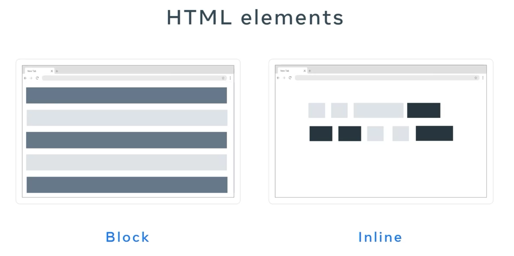

#### Basic flexbox

- Three of the most common practical uses of flexbox: a search bar, a navigation menu, and an image gallery -- flexbox suits simple layouts and binding elements together.
- Search bar:
  - HTML: a `container` div wrapping three elements -- a search icon, the search input, and a submit button.
  - CSS: the container uses `display: inline-flex` rather than `flex`, so the flex container itself behaves like an inline element; `overflow` clips content that overflows the input (e.g., long typed queries). The icon, input, and button each get their own alignment rules.
  - Result: a compact search bar whose size stays fixed as the window is resized.
- Navigation menu:
  - HTML: an unordered list of four items.
  - CSS: the universal selector (`*`) resets browser-specific default spacing before other rules apply. The container uses the `flex-flow` shorthand (sets both direction and wrap behavior) and `justify-content: stretch` to align items along the main axis; rules are applied to both the container and its children (`li`, `a`, etc.).
  - Result: a responsive nav bar -- items stack vertically in a narrow window and lay out horizontally once the window is wide enough.
- Image gallery:
  - HTML: a `container` div holding six images.
  - CSS: the universal selector again resets margin, padding, and border to zero. The container then sets `display: flex`, `flex-wrap` (whether items must stay on one line or can wrap across multiple lines), `justify-content: space-between` (spaces images along the main axis), and some padding.
  - Result: a responsive gallery -- images stack when the window is narrow and spread out as it widens.

```html
<!-- Search bar -->
<div class="container">
  <span class="search-icon">🔍</span>
  <input type="search" class="search-box" placeholder="Search…">
  <button type="submit">Go</button>
</div>
```

```css
.container {
  display: inline-flex; /* flex container that behaves like an inline element */
  overflow: hidden;     /* clips overflowing search text */
}
```

```html
<!-- Navigation menu -->
<ul class="container">
  <li><a href="/">Home</a></li>
  <li><a href="/about">About</a></li>
  <li><a href="/services">Services</a></li>
  <li><a href="/contact">Contact</a></li>
</ul>
```

```css
* {
  margin: 0;
  padding: 0; /* reset browser-specific defaults */
}
.container {
  display: flex;
  flex-flow: row wrap;      /* shorthand: direction + wrap behavior */
  justify-content: stretch; /* aligns items along the main axis */
}
```

```html
<!-- Image gallery -->
<div class="container">
  
  
  
  
  
  
</div>
```

```css
* {
  margin: 0;
  padding: 0;
  border: 0;
}
.container {
  display: flex;
  flex-wrap: wrap;                 /* allow images to wrap onto multiple lines */
  justify-content: space-between;  /* spaces images along the main axis */
  padding: 1rem;
}
```

#### CSS grids

- CSS Grid is a two-dimensional, responsive layout system, compatible across browsers -- an alternative to flexbox or tables, especially for larger-scale layouts.
- Terminology:
  - Columns are the vertical tracks; rows are the horizontal tracks.
  - Gutters (or gaps) are the space between tracks.
  - A cell is where a row and a column intersect.
- Worked example (five lettered boxes, A-E):
  - Starting point: a plain HTML page listing the letters with no styling, so they stack in a vertical, unstyled list.
  - Adding basic CSS to the box classes improves their look but doesn't change their arrangement -- it isn't an actual grid yet, just default layout with styling applied.
  - Turning the container into a real grid:
    - Set `display: grid` on the container (the same `display` property used for `flex`, `block`, `inline`, etc.).
    - `grid-template-columns` sets each column's size; combined with two rows, this produces 5 cells arranged in 3 columns by 2 rows.
    - The `fr` (fraction) unit divides the available track space proportionally, e.g., two rows sized in a 2:1 ratio; `fr` and pixel sizes can be mixed freely for both rows and columns.
    - `grid-gap` (the gutter) sets spacing between cells; giving the container a `background-color` makes the grid area itself visible. The grid stretches to the page's full width by default.
    - The implicit grid (`grid-auto-rows` / `grid-auto-columns`) auto-sizes tracks that aren't explicitly defined, e.g., replacing `grid-template-rows` with `grid-auto-rows` auto-sizes every row to a fixed size.
  - Helper functions for configuring tracks:
    - `repeat()`: specifies how many times a row/column definition repeats, reducing repetitive code without changing the resulting layout.
    - `minmax()`: sets a minimum and maximum size for a track, e.g., applied to `grid-auto-rows` to guarantee a minimum row height.
  - Grid frameworks: common conventions like 12-column and 16-column grids divide the page into that many vertical tracks, letting rules target a specific track.

```html
<div class="container">
  <div class="box">A</div>
  <div class="box">B</div>
  <div class="box">C</div>
  <div class="box">D</div>
  <div class="box">E</div>
</div>
```

```css
.container {
  display: grid;
  grid-template-columns: 100px 100px 100px; /* three fixed-size columns */
  grid-template-rows: 2fr 1fr;              /* two rows in a 2:1 ratio, using fr units */
  grid-gap: 10px;                           /* gutter between cells */
  background-color: red;                    /* visualizes the grid area */
}

/* Implicit grid: auto-size rows that aren't explicitly defined */
.container {
  grid-auto-rows: 100px;
}

/* repeat(): avoid writing the same track definition multiple times */
.container {
  grid-template-columns: repeat(3, 100px); /* same as: 100px 100px 100px */
}

/* minmax(): set a minimum and maximum track size */
.container {
  grid-auto-rows: minmax(150px, auto); /* rows are at least 150px tall */
}
```

#### Grids and flexbox cheat sheet

##### Grid

```css
selector {
  display: grid; /* or inline-grid */
}
```

Grid shorthand properties and their defaults:

| Property | Default | Description |
|---|---|---|
| `grid-template-rows` | `none` | Configures elements like rows in a table. |
| `grid-template-columns` | `none` | Configures elements like columns in a table. |
| `grid-template-areas` | `none` | Names grid areas and how they relate to one another. |
| `grid-auto-rows` | `auto` | Default size for rows not explicitly configured. |
| `grid-auto-columns` | `auto` | Default size for columns not explicitly configured. |
| `grid-auto-flow` | `row` | Default placement direction for items not explicitly allocated. |
| `column-gap` | `normal` | Gap between columns. |
| `row-gap` | `normal` | Gap between rows. |

Container properties:

| Property | Accepted values | Description |
|---|---|---|
| `grid-template-columns` / `grid-template-rows` | measurement units, `%`, `repeat()` | Defines line names and keeps column/row sizes constant. |
| `grid-auto-columns` / `grid-auto-rows` | a fixed measurement unit | Default size for columns/rows created without explicit sizing. |
| `grid-template` | named areas + sizing | Defines and sizes named grid cells, e.g. `"header header" auto`, `"main right" 75vh` (two cells named `main` and `right`, sized to 75% of the viewport height), `"footer footer" 20rem` (two cells named `footer`, sized to 20 root em -- relative to the HTML root font size). |
| `grid-gap` | measurement units | Gap between both rows and columns. |
| `grid-column-gap` / `grid-row-gap` | measurement units | Gap between columns / between rows. |
| `justify-items` / `align-items` | `start \| center \| end \| stretch` | Default space allotted to each item along the inline / block axis. |
| `place-items` | shorthand | Shorthand for `justify-items` + `align-items`. |
| `justify-content` / `align-content` | `start \| center \| end \| stretch \| space-between \| space-evenly \| space-around` | Browser's allocation of space to content items along the main axis / cross axis. |
| `place-content` | shorthand | Shorthand for `justify-content` + `align-content`. |
| `grid-auto-flow` | `row \| column \| dense` | How items are placed automatically within the grid. |

Item (child) properties:

| Property | Example | Description |
|---|---|---|
| `grid-column` / `grid-row` | `1 / 2` | Specifies where the item starts (and ends) on the grid. |
| `grid-column-start` / `grid-column-end` | column position | Starting / ending column position for the item. |
| `grid-row-start` / `grid-row-end` | row position | Starting / ending row position for the item. |
| `justify-self` / `align-self` | `start \| center \| end \| stretch` | Positions an item within its grid area along the inline / block axis. |
| `place-self` | shorthand | Shorthand for `justify-self` + `align-self`. |

##### Flexbox

```css
selector {
  display: flex; /* or inline-flex */
}
```

The selector can be any attribute, class, ID, type, or universal selector. `flex` makes the selector a flex container; `inline-flex` makes it a flex container that is itself an inline element.

Container properties:

| Property | Values | Description |
|---|---|---|
| `flex-direction` | `row \| row-reverse \| column \| column-reverse` | Direction items flow in: left-to-right, right-to-left, top-to-bottom, or bottom-to-top. `row` is the default. |
| `flex-wrap` | `wrap \| nowrap` | `wrap` lets items wrap onto new lines as the window shrinks; `nowrap` (default) keeps items rigid regardless of window size. |
| `align-items` | `flex-start \| flex-end \| center \| stretch` | Positions items on the cross axis: top-left corner (`flex-start`), bottom-right corner (`flex-end`), centered (`center`), or stretched to fill the container (`stretch`). |
| `justify-content` | `flex-start \| flex-end \| center \| space-between \| space-evenly` | Aligns items along the main axis: anchored to the axis start (`flex-start`) or end (`flex-end`), centered and expanding outward (`center`), first/last items flush with the edges with the rest evenly spaced (`space-between`), or every item and the edges equally spaced (`space-evenly`). |

Item (child) properties:

| Property | Values | Description |
|---|---|---|
| `flex-grow` | factor | How much an item grows relative to its siblings. |
| `flex-shrink` | factor | How much an item shrinks relative to its siblings. |
| `flex-basis` | `auto \| factor \| measurement unit` | Sets an item's initial main size; can be overridden by other styling. |
| `order` | position | Overrides the default source-order positioning of items (ascending by default). |
| `align-self` | `start \| center \| end \| stretch` | Positions an individual item, overriding the container's `align-items` for that item. |

#### Exercise: Create a Grid Layout

Folder: [`lab/01-grid-layout/`](./lab/01-grid-layout/).

- Goal: build the "Holy Grail" layout (header, footer, main content, and two sidebars) using `grid-template-areas`, with `index.html` and the layout-area rules (`.header`, `.main`, `.left`, `.right`, `.footer`) already provided; the task was to style the `.container` class itself.
- Default rules (small screens): a single-column grid, five rows tall, with each area (`header`, `left`, `main`, `right`, `footer`) stacked on its own row -- the middle (`main`) row set to `1fr` so it absorbs any extra space, the rest sized to `auto`.
- Media query rules (`min-width: 440px`): a three-column grid, three rows tall -- the header spans the full top row, the footer spans the full bottom row, and the middle row holds `left`, `main`, and `right` side by side (sidebars fixed at 150px, `main` filling the remaining space with `1fr`).
- Verified in the browser: below 440px the sections stack vertically in source order; at 440px and above the layout switches to the fixed-sidebar/fluid-center three-column arrangement.
- Notes on `grid-template-areas`:
  - Each quoted string is one row; the words in it name which area occupies each column of that row. `"header header header"` repeats `header` across all 3 columns of row 1, so it spans the full row; `"left main right"` gives `left`, `main`, and `right` one column each in row 2; `"footer footer footer"` spans `footer` across all 3 columns of row 3.
  - `grid-template-rows` changes together with `grid-template-columns` inside the media query, since both must match the row/column dimensions implied by `grid-template-areas`.
  - The number of rows in `grid-template-rows` and columns in `grid-template-columns` must match the dimensions of `grid-template-areas`.
  - A named grid area with no matching rule renders empty (not an issue here, since `header`, `left`, `main`, `right`, and `footer` are all styled).
  - Each rule declares which grid area it occupies via the `grid-area` property.
  - The selectors used here are classes (`.header`, `.main`, etc.), though `grid-area` works the same on element-tag or ID selectors.

```html
<div class="container">
    <header class="header"> Header </header>
    <main class="main"> Content </main>
    <div class="sidebar left"> Sidebar </div>
    <div class="sidebar right"> Sidebar </div>
    <footer class="footer"> Footer </footer>
</div>
```

```css
.container {
    display: grid;
    max-width: 900px;
    min-height: 50vh;
    grid-template-columns: 100%;
    grid-template-rows: auto auto 1fr auto auto;
    grid-template-areas:
        "header"
        "left"
        "main"
        "right"
        "footer";
}

@media (min-width: 440px) {
    .container {
        grid-template-columns: 150px 1fr 150px;
        grid-template-rows: auto 1fr auto;
        grid-template-areas:
            "header header header"
            "left main right"
            "footer footer footer";
    }
}
```

```css
.container {
  display: grid;
  max-width: 900px;
  min-height: 50vh;
  grid-template-columns: 100%;
  grid-template-rows: auto auto 1fr auto auto;
  grid-template-areas: "header" "left" "main" "right" "footer";
}

@media (min-width: 440px) {
  .container {
    grid-template-columns: 150px 1fr 150px;
    grid-template-rows: auto 1fr auto;
    grid-template-areas: "header header header" "left main right" "footer footer footer";
  }
}

.header {
  grid-area: header;
  padding: 10px;
  background-color: black;
  color: #fff;
  text-align: center;
}

.main {
  grid-area: main;
  padding: 25px;
}

.left {
  grid-area: left;
  background-color: peachpuff;
}

.right {
  grid-area: right;
}

.footer {
  grid-area: footer;
  padding: 10px;
  background-color: black;
  color: #fff;
  text-align: center;
}

.sidebar {
  padding: 25px;
  background-color: darkcyan;
}

```

#### All selectors and their specificity

As a website's CSS grows, more than one rule can end up targeting the same element -- either intentionally, as the code gets more complex, or by accident. This creates a conflict, since only one rule can apply to a given property: a `p` tag's color can be blue or white, but not both. CSS engines resolve these conflicts using specificity: a ranking, or score, that determines which rule wins. These rules only come into play when a conflict actually exists between properties.

##### Specificity hierarchy

CSS scores, or weights, each selector, creating a specificity hierarchy with four categories, from highest to lowest:

| Category | Example | Weight |
|---|---|---|
| Inline styles | `style="..."` | 1000 |
| IDs | `#div` | 100 |
| Classes, attributes, and pseudo-classes | `.my-class`, `p[attribute]`, `div:hover` | 10 |
| Elements and pseudo-elements | `p`, `::before` | 1 |

- Inline styles: attached directly to an element via the `style` attribute; they have the highest specificity, so they apply regardless of any other rule. For example, given a conflict between:

  ```html
  <p style="color: white;"></p>
  ```

  ```css
  p { color: blue; }
  ```

  the `p` tag renders white, since the inline style wins.
- IDs: next in the hierarchy, represented with `#`, e.g. `#div`.
- Classes, attributes, and pseudo-classes: come next, e.g. `.my-class`, `p[attribute]`, `div:hover` (pseudo-classes are covered in more detail later in this lesson).
- Elements and pseudo-elements: the lowest position in the hierarchy (pseudo-elements are also covered later in this lesson).

##### Calculating scores

CSS uses this hierarchical model internally to calculate each selector's specificity. As CSS code grows, developers unavoidably run into rule conflicts; the specificity hierarchy is what lets them calculate precedence and control the outcome.

Each of the four categories contributes its weight (1000, 100, 10, or 1) once per matching element inside the selector, and the total is what's compared:

```css
#hello {}    /* 1 ID                    -> score: 0100 */
div {}       /* 1 element               -> score: 0001 */
div p.foo {} /* 2 elements, 1 class     -> score: 0012 */
```

**Example 1** (properties and values are omitted here to keep the focus on the selectors):

```css
p {}         /* 1 element                -> 0 0 0 1 -> score: 1  */
div p {}     /* 2 elements               -> 0 0 0 2 -> score: 2  */
div p.foo {} /* 2 elements, 1 class      -> 0 0 1 2 -> score: 12 */
```

The third rule scores 12, the highest of the three, so its rules are applied and the other two are overridden.

**Example 2**:

```css
p#bar {}     /* 1 element, 1 ID         -> 0 1 0 1 -> score: 101 */
p.foo {}     /* 1 element, 1 class      -> 0 0 1 1 -> score: 11  */
p.foo.bar {} /* 1 element, 2 classes    -> 0 0 2 1 -> score: 21  */
```

The rule with an ID scores far higher than the others, so its rules are applied.

The wide range of selectors covered earlier, together with the pseudo-classes and pseudo-elements covered later in this lesson, are what make specificity worth understanding.

A few additional guidelines matter once the hierarchy's weights alone don't decide a conflict, e.g. when two selectors tie on specificity:

- Every selector has a score and a place in the hierarchy.
- When selectors have equal specificity, the last-written rule is the one applied.
- In general, use an ID selector when a rule needs to be certain to apply.
- Universal selectors have zero specificity.

Specificity is a much broader topic than this overview covers, and it's the underlying basis on which CSS engines work -- this is what "cascading" in CSS means: the way engines evaluate and apply specificity rules is called the cascade, much like a waterfall that falls in stages. CSS specificity calculators are available online to help work out the styling outcome of a page, so there's no need to compute every score by hand.

#### Pseudo-classes

- Pseudo-classes (pseudo-class selectors) give fine-grained control over what gets selected and styled: they are state-based selectors, matching an element based on its current state (e.g., hovered) rather than its type, class, or ID.
  - Using them improves a page's interactivity and adds advanced styling with little extra effort, by styling elements in response to user input.
  - Syntax: selector, a colon, the pseudo-class name, then the properties, e.g. `selector:pseudo-class { property: value; }`.
- There's no single broadly accepted classification for pseudo-classes, but they can be grouped by general similarity and purpose:
  - User action states: apply while a user is actively engaging with an element.
    - `:hover` -- styles an element while the cursor is over it.
    - `:active` -- styles an element only while the user presses and holds the mouse button on it.
    - `:focus` -- styles the currently focused element.
  - Form states: specific to HTML forms, usually come in pairs targeting opposite states of the same kind of element.
    - `:disabled` / `:enabled` -- generally used for buttons.
    - `:checked` / `:indeterminate` -- used for checkboxes.
    - `:valid` / `:invalid` -- used for fields like emails and phone numbers (`:invalid` was already introduced earlier, when covering form validation).
  - Position-based states: target a specific item among a set, e.g. a specific list item.
    - `:first-of-type`, `:last-of-type`, `:nth-of-type`, `:nth-last-of-type`.
- There are plenty of other pseudo-classes beyond these groups, some more popular than others -- worth exploring further and finding your own style with them.

```html
<p class="mypage">
  <a href="#">Link</a>
</p>
<div>
  <button class="mybutton">Click me</button>
</div>
```

```css
.mypage {
  /* base styling for the paragraph */
}

.mybutton {
  /* base styling for the button */
}

/* User action states */
.mypage a:hover {
  color: red; /* changes the link's appearance on hover */
}

.mybutton:active {
  background-color: darkblue; /* applied only while pressed and held */
}
```

```html
<ul>
  <li>Adrian</li>
  <li>Mario</li>
</ul>
```

```css
/* Position-based state: styles only the first list item */
li:first-of-type {
  font-weight: bold;
}
```

#### Pseudo-elements

Pseudo-elements let you style a specific part of an element, e.g., only the first word or line of its content.

##### Syntax

```css
selector::pseudo-element {
  property: value;
}
```

Pseudo-elements use two colons (`::`) instead of one.

##### Setting up the HTML and CSS files

To practice the pseudo-element examples below:

- Reference the CSS file from the HTML file with a `link` tag, e.g.:

  ```html
  <link rel="stylesheet" href="style.css">
  ```

  where `style.css` is your CSS file's name.
- Add the HTML code inside the `<body>` tag. A minimal starting file:

  ```html
  <!DOCTYPE html>
  <html>
  <head>
    <link rel="stylesheet" href="style.css">
  </head>
  <body>
    <!-- Add your HTML code here -->
  </body>
  </html>
  ```

- Once both files are in place, right-click the HTML file in VSCode's Explorer and select "Show Preview" to open a built-in VSCode browser preview.

##### `::first-letter`

Changes the color (and other styling) of just the first letter of each block, illustrated here by coloring the first letter of each of three list items.

```html
<!DOCTYPE html>
<html>
<head>
  <link rel="stylesheet" href="pseudo4.css">
</head>
<body>
  <ul>
    <li>Based in Chicago, Illinois, Little Lemon is a family-owned Mediterranean restaurant, focused on traditional recipes served with a modern twist.</li>
    <li>The chefs draw inspiration from Italian, Greek, and Turkish culture and have a menu of 12-15 items that they rotate seasonally. The restaurant has a rustic and relaxed atmosphere with moderate prices, making it a popular place for a meal any time of the day.</li>
    <li>Little Lemon is owned by two Italian brothers, Mario and Adrian, who moved to the United States to pursue their shared dream of owning a restaurant. To craft the menu, Mario relies on family recipes and his experience as a chef in Italy.</li>
  </ul>
</body>
</html>
```

```css
li::first-letter {
  color: coral;
  font-size: 1.3em;
  font-weight: bold;
  line-height: 1;
}
```

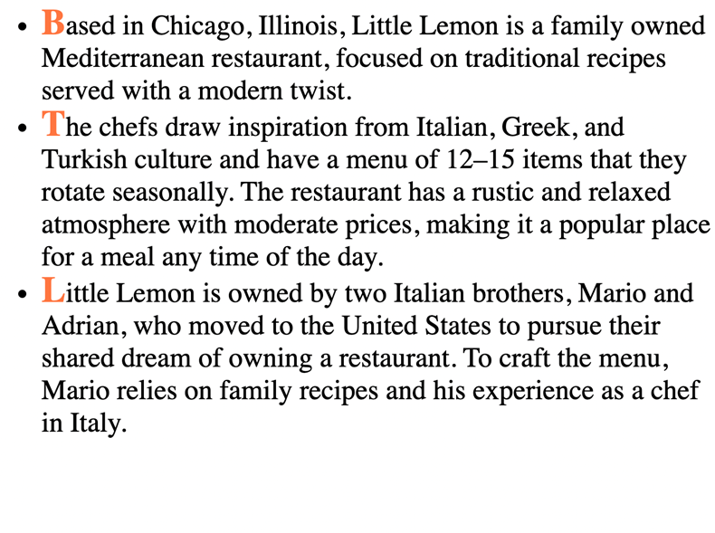

Although the change only affects the first letter of each bullet point, it makes a noticeable difference in presentation.

##### `::first-line`

Changes the color (and other styling) of the complete first line of each bullet point -- here, to light sea green.

```css
ul {
  list-style-type: none;
}

li::first-line {
  color: lightseagreen;
  text-decoration: underline;
  line-height: 1;
}
```

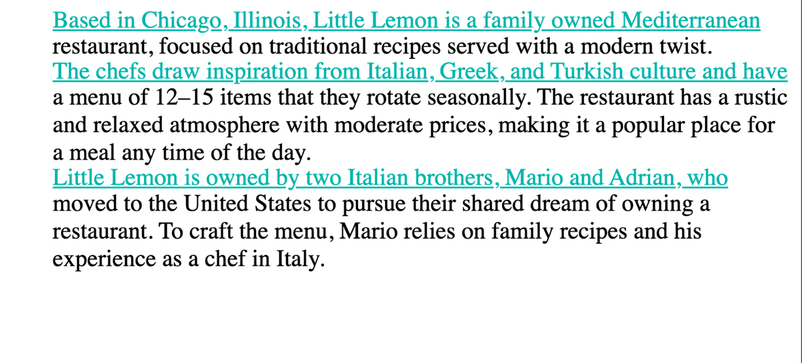

Since it's only the first line of each point, it ends up functioning almost like a divider between the three points, rather than relying on bullets.

The content covered by `::first-line` isn't fixed -- it changes as the viewport is resized, since it always covers whatever text currently wraps onto the first line.

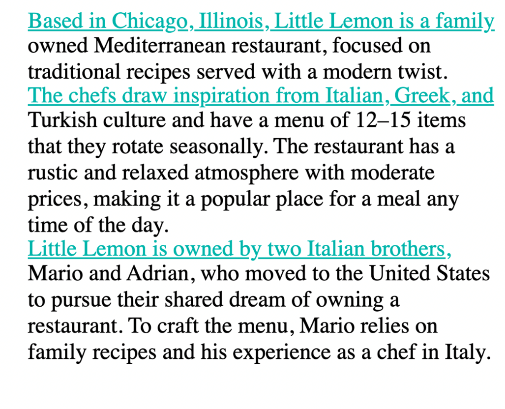

##### `::selection`

Styles the text a user selects or highlights, e.g. when copying notes -- the effect is only visible once the user actually selects some content. By default, browsers typically invert the selected text's colors (e.g. white-on-black to black-on-white).

```css
ul {
  list-style-type: none;
}

li::selection {
  color: brown;
  background-color: antiquewhite;
  line-height: 1;
}
```

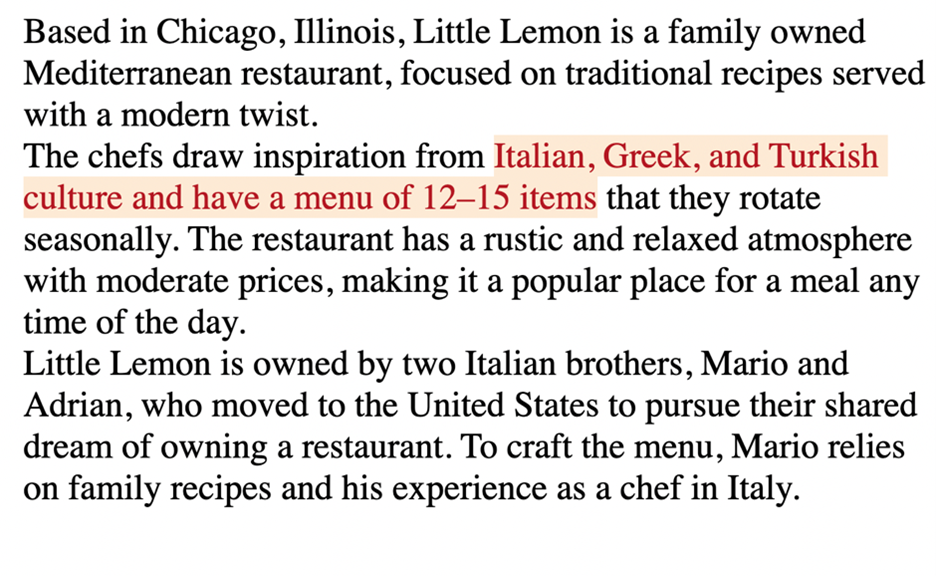

Different segments of the text are highlighted depending on which part is selected at any given point.

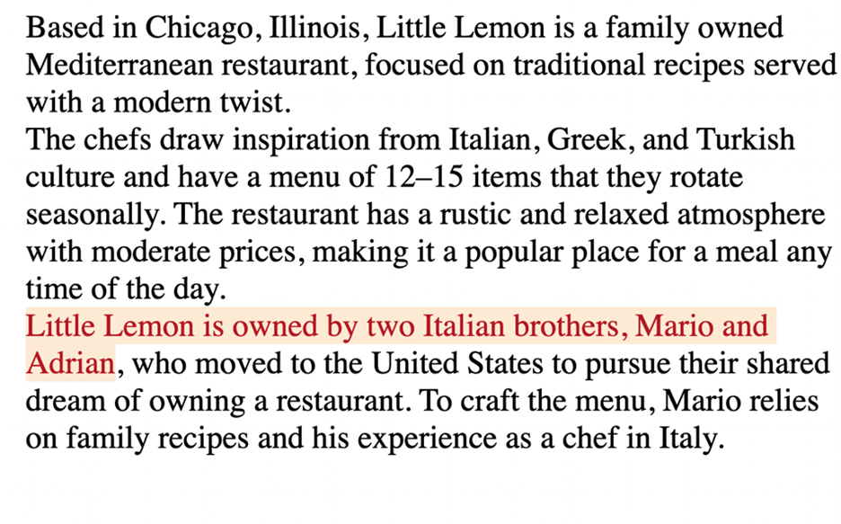

##### `::marker`

Styles a list's marker (bullet or number), e.g. to change a bullet point's color.

```css
li::marker {
  color: cornflowerblue;
  content: '<> ';
  font-size: 1.1em;
}
```

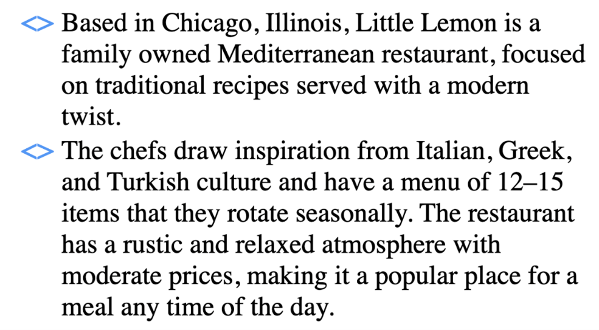

The bullet points are now cornflower blue, using the shape specified by `content`.

##### `::before` and `::after`

Add content immediately before or after an element's own content, without needing to add that content in the HTML -- and that generated content can be styled like any other. Example: adding "Tip:" before, and "!!" after, selected cooking guidelines to flag them as important.

```html
<body>
  <p id="tips">Don't rinse your pasta after it is drained.</p>
  <p>Slice the tomatoes. Take the extra efforts to seed them.</p>
  <p id="tips">Peel and seed large tomatoes.</p>
</body>
```

```css
#tips::before {
  background: darkkhaki;
  color: darkslategray;
  content: "Tip:";
  padding-left: 3px;
  padding-right: 5px;
  border-radius: 10%;
}

#tips::after {
  background: darkkhaki;
  color: darkslategray;
  content: "!!";
  padding-right: 5px;
  border-radius: 20%;
}
```

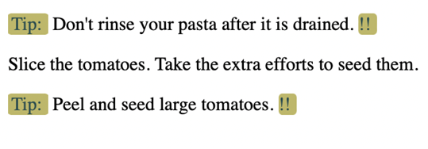

The `content` property holds the text for `::before`/`::after`. "Tip:" is added before each `#tips` paragraph via the `::before` rule, and two exclamation marks are added after each via the `::after` rule; the second `<p>` (without `id="tips"`) is unaffected. `::before` and `::after` don't have to be used together, but combining them is often useful.

#### Additional Resources

- [Broad overview of layouts in CSS](https://developer.mozilla.org/en-US/docs/Learn/CSS/CSS_layout)
- [Detailed overview of flexboxes](https://css-tricks.com/snippets/css/a-guide-to-flexbox/)
- [Detailed overview of grids (1)](https://learncssgrid.com/)
- [Detailed overview of grids (2)](https://web.dev/learn/css/grid/)
- [Commonly used selectors](https://www.geeksforgeeks.org/10-css-selectors-every-developer-should-know/)
- [Combinator selectors](https://developer.mozilla.org/en-US/docs/Learn/CSS/Building_blocks/Selectors/Combinators)
- [Comprehensive list of selectors](https://www.w3schools.com/cssref/css_selectors.asp)
- [Comprehensive list of pseudo-classes](https://developer.mozilla.org/en-US/docs/Web/CSS/Pseudo-classes)
- [Comprehensive list of pseudo-elements](https://developer.mozilla.org/en-US/docs/Web/CSS/Pseudo-elements)


### Javascript

#### Why Javascript?

- JavaScript (JS) is the language that builds interactivity into web pages -- "the language of the web" -- and almost every website runs some form of it.
- Since its inception in 1995, JS has been the main way to interact with a web page's client side (the front end), driving real-time updates such as interactive maps and client-side form validation.
- Alternatives have existed over the years (e.g., VBScript, more recently TypeScript), but even TypeScript compiles down to JS so browsers can understand it.
- JS is the only language that lets you directly and dynamically interact with web pages on the client side -- it's baked into the browser -- which is a large part of why it's one of the most popular programming languages in developer surveys.
- Backwards compatibility -- the rule that websites built in the past must keep working today -- is central to JS's enduring role: removing it from browsers would break millions of existing sites, making JS one of the central pillars of web development ("browsers speak JavaScript").
- Beyond that, several practical reasons make JS worth learning:
  - Ease of use: every browser ships a built-in JS engine, reachable via the developer tools' console, so a newcomer can start experimenting without heavy setup (a proper workflow later adds a code editor and tools like Node.js and NPM (Node Package Manager)).
  - Ubiquity: it runs almost everywhere -- as plain ("vanilla") JavaScript on the client side, through frameworks like React, Vue, and D3, and on the server via Node.js and, more recently, Deno.
  - Accessibility: it's considered one of the more approachable languages, backed by a large community, making it a good entry point into programming and a stepping stone to other languages and technologies.
  - Demand: JS skills are consistently in demand, with a steady stream of job postings for JS developers.

#### Programming in Javascript

- JavaScript is used across many environments, each solving a different problem:
  - Browser: adds behaviors and interactivity, e.g. adding an item to a shopping cart on a button click.
  - Server: powers websites, communicates with databases, and gives web apps a native feel.
  - Mobile apps: via technologies like React Native.
  - IoT (Internet of Things) devices.
- This breadth of use cases led to many different implementations of JavaScript, each geared toward solving a particular problem, which in turn drove a history of fragmentation and consolidation:
  - In the early 2000s, different browser vendors built browsers with inconsistent behavior, forcing developers to write separate code per browser -- wasted effort and a frustrating experience for end-users.
  - jQuery emerged to solve this: import the library, write code once using its features, and it works across all browsers -- it became the most popular JavaScript library for well over a decade.
  - As the web kept evolving, new problems emerged; React, released in 2011, was a major solution, changing how developers think about building, updating, and maintaining complex websites.
  - Many further frameworks followed the same idea, including Knockout, Backbone, Angular, Ember, Vue, and Alpine.
- With millions of websites running JavaScript from different versions and libraries, a lot of old code -- legacy code -- is still out there; you likely won't use jQuery to build something new today, but you may still encounter it in an actively running project.
- Beginners don't need to learn or master every JavaScript technology. The essential foundation is plain JavaScript without frameworks; once mastered, it becomes much easier to pick up a framework built on top of it, such as React.

#### Attaching JavaScript to HTML

- A `<script>` tag attaches JavaScript to an HTML document, either by pointing to an external file (`src`) or by holding inline code directly.
- A plain `<script>` blocks HTML parsing while it downloads and runs, so it's traditionally placed just before `</body>` so the page content loads first.
- `defer` and `async` let an external script live in `<head>` without blocking parsing, but they behave differently:
  - `defer`: downloads in parallel, runs after the HTML is fully parsed, in document order -- the modern default for most scripts.
  - `async`: downloads in parallel and runs as soon as it's ready, which can be before parsing finishes and out of order relative to other scripts -- suited to independent scripts (e.g. analytics) that don't touch the DOM.

```html
<!-- External file (most common) -->
<script src="script.js"></script>

<!-- Inline, directly in the HTML -->
<script>
  console.log('Hello from inline JS');
</script>

<!-- defer: runs after parsing, in order -- safe to place in <head> -->
<script defer src="script.js"></script>

<!-- async: runs as soon as it's downloaded, order not guaranteed -->
<script async src="analytics.js"></script>
```

A `<script>` tag always lives inside `<html>`, either in `<head>` or in `<body>` -- never outside it:

```html
<!doctype html>
<html>
<head>
  <!-- Common with defer: doesn't block parsing, so <head> is fine -->
  <script defer src="script.js"></script>
</head>
<body>
  <h1>Page content</h1>

  <!-- Common without defer/async: placed at the end of <body>,
       so the page content is already parsed and visible before the script runs -->
  <script src="script.js"></script>
</body>
</html>
```

#### Variables

The demo runs in the browser's Developer Tools console (open it with F12 on Windows/Linux or Cmd+Option+I on Mac, then select the Console tab; this works in any browser, demoed here in Google Chrome).

```js
// Declaration: introduces the variable "person" (currently undefined)
var person;

// Assignment: stores "John" in person via the assignment operator (=)
person = "John";
person; // "John"

// Declaration and assignment combined
var greeting = "Hello";

// console.log accepts multiple comma-separated values
console.log(greeting, person); // Hello John

// Reassignment: no `var` needed, JavaScript already knows these variables exist
greeting = "Hi";
person = "James";

console.log(greeting, person); // Hi James
```

- There are three keywords for declaring a variable -- `var`, `let`, and `const` -- differing in scope and whether they can be reassigned:
  - `var`: function-scoped (or global if declared outside a function), not confined to a `{ }` block; can be redeclared and reassigned. It's the original, legacy way to declare variables.
  - `let`: block-scoped, confined to the nearest enclosing `{ }`; can be reassigned but not redeclared in the same scope. Use it for variables whose value will change, like `discount` and `quantity` in the [Data Types](#data-types) example below.
  - `const`: also block-scoped, but must be initialized at declaration and can never be reassigned afterward. Use it as the default choice for values that don't change, like `guitarName` and `guitarPrice` in the [Data Types](#data-types) example below. Note: for objects and arrays, `const` only locks the variable binding -- the contents can still be mutated.
- Modern JavaScript style: default to `const`; reach for `let` only when the variable needs to be reassigned; avoid `var`.

#### Data Types

- JavaScript has seven primitive data types: string, number, Boolean, null, undefined, BigInt, and symbol -- each with its own use case.
- `string`: holds text values (e.g., a name or description); characters must be wrapped in single or double quotes, and it can practically hold an unlimited number of character combinations.
- `number`: holds numerical values (e.g., a price, or any value meant to be calculated), typed directly with no quotes; it has a very wide range, sufficient for most common use cases, but is limited by JavaScript's calculation capabilities. There's no separate integer type -- `number` represents both whole numbers and decimals (e.g., `375` and `3.14`) using the same IEEE 754 double-precision floating-point format.
- `Boolean`: has only two possible values, `true` and `false`, making it useful for decisions.
- Two data types express the absence of a value:
  - `null`: only holds the value `null`, representing an intentionally absent value.
  - `undefined`: only holds the value `undefined`, usually referring to a variable that hasn't been assigned a value yet.
- ES6 (ECMAScript 2015) introduced two further primitive data types for more complex tasks:
  - `BigInt`: like an oversized number box, it accommodates a much greater range of numbers than `number`.
  - `symbol`: a unique identifier, useful when you need multiple values that would otherwise look identical (like several same-labeled boxes distinguished only by serial number).

```js
const guitarName = "Fender Stratocaster";  // string
const guitarDescription = "The best guitar around";  // string
const guitarPrice = 375;  // number
const inStock = true;  // boolean
let discount = null;  // null: intentionally no value
let quantity;  // undefined: not yet assigned
const totalUnitsSold = 9007199254740993n;  // BigInt: beyond number's safe range
const guitarId = Symbol("guitar");  // symbol: unique identifier
```

#### Operators

- An operator manipulates variables/values and returns a result; JavaScript groups them into arithmetic, comparison, and logical operators.
- Comparison operators need `==` (double equals), since a single `=` is the assignment operator.
- Logical operators (`&&`, `||`, `!`) combine or invert boolean conditions to control program flow.

```js
// Arithmetic operators: +, -, *, /
console.log(2 + 2);        // 4
console.log(2 + 5 + 8);    // 15 -- can chain the same operator across multiple values
console.log(20 - 18);      // 2
console.log(2 * 3);        // 6
console.log(8 / 1);        // 8

// Comparison operators: >, <, == (return true/false)
console.log(3 > 2);        // true
console.log(2 > 3);        // false
console.log(10 == 10);     // true -- note the double `=`, single `=` would be an assignment

// Logical operators: && (AND), || (OR), ! (NOT)
let a = 7;
console.log(a > 5 && a < 10);  // true  -- AND: both conditions must be true
console.log(a > 5 || a > 10);  // true  -- OR: at least one condition must be true
console.log(!(a > 10));        // true  -- NOT: inverts the boolean result
```

#### Numbers

- The `number` data type represents both integers and decimals, e.g. `123` and `123.456`.
- Beyond `+`, `-`, `*`, `/`, JavaScript supports exponentiation (`**`) and modulus/remainder (`%`).
- Without parentheses, JavaScript follows standard operator precedence (multiplication/division before addition/subtraction); parentheses override that order.

```js
// Basic arithmetic
console.log(2 + 2);    // 4
console.log(4 - 2);    // 2
console.log(4 * 4);    // 16
console.log(16 / 4);   // 4

// Exponentiation: base ** exponent
console.log(10 ** 2);  // 100 -- 10 to the power of 2

// Modulus (%): remainder after division
console.log(9 % 8);    // 1  -- 8 fits once into 9, remainder 1
console.log(16 % 8);   // 0  -- 8 divides evenly into 16, no remainder

// Operator precedence: multiplication runs before addition
console.log(2 * 4 + 8);    // 16 -- (2 * 4) + 8
console.log(2 * (4 + 8));  // 24 -- parentheses force addition first
```

#### Strings

- A string is a sequence of characters enclosed by single or double quotes, called delimiters; an empty string has no characters between them.
- Strings can hold letters, numbers, and punctuation, but can't span multiple lines -- pressing Enter before the closing quote causes an error.
- An unescaped quote of the same type inside a string ends it early; nest one quote type inside the other to fix it, and stay consistent with one style throughout a project.

```js
// Empty strings
let emptySingle = '';
let emptyDouble = "";

// Non-empty strings can hold letters, numbers, and symbols
let greeting = 'Hello there! 123';

// Strings can't break onto a new line -- this throws a SyntaxError:
// let broken = 'hello
// there';

// An apostrophe closes a single-quoted string early -- this throws a SyntaxError:
// let phrase = 'It's a lovely day';

// Fix: nest the single quote inside double quotes
let phrase = "It's a lovely day";
```

#### Booleans

- A Boolean has only two possible values, `true` or `false`, most often produced by comparing two values.
- `==` (equality) and `!=` (inequality) compare value only, ignoring type differences; so strings are equal to numbers if they represent the same value (e.g., `"100"` and `100` are equal), but not if they don't (e.g., `"100"` and `101` are not equal).
- `===` (strict equality) and `!==` (strict inequality) compare both value and type; so `"100"` and `100` are not strictly equal, since one is a string and the other is a number.

```js
// Basic comparisons
console.log(1 < 2);   // true
console.log(1 > 2);   // false

// == compares value only -- a single `=` is the assignment operator, not comparison
var score = 100;
console.log(1 == 2);      // false
console.log(100 == "100"); // true -- same value, different type (number vs string), == ignores type

// === compares value AND type
console.log(100 === "100"); // false -- same value but different type

// != and !== mirror the same value-only vs value-and-type distinction
console.log(1 != 1);        // false -- same value
console.log(1 !== "1");     // true -- same value, different type
```

#### Javascript Interactivity

- JavaScript's initial purpose was to provide browser interactivity -- controlling webpage and browser behavior -- and this is still the case today.
- Ecosystem timeline:
  - Late 1990s: plain JavaScript, tweaked per browser.
  - Mid-2000s: jQuery, a single codebase across browsers with less code.
  - Later: frameworks like React, Vue, Angular, and D3, plus npm (Node Package Manager) and Node.js.
- Despite CSS's growth, JavaScript still lets users:
  - Get their geolocation.
  - Interact with maps.
  - Play games in the browser.
  - Handle user-triggered events across devices.
  - Verify form input before sending it to the backend.

#### Javascript Selectors

- DOM (Document Object Model) manipulation dynamically updates HTML in real time, e.g. changing text color or showing a popup on a button click; selectors locate the elements to manipulate.
- The `document` keyword gives access to the DOM, the webpage as stored in the browser's memory.
- `getElementById` is singular (an ID is unique) and returns `null` if no match is found; `getElementsByClassName` is plural and returns an empty collection if no match is found.

```js
// document.querySelector(selector): returns the FIRST matching element
document.querySelector('p');   // first <p> element
document.querySelector('a');   // first <a> element

// document.querySelectorAll(selector): returns ALL matching elements
document.querySelectorAll('p');  // e.g. all <p> elements on the page

// document.getElementById(id): returns the element with that ID, or null
document.getElementById('heading');  // e.g. an <h1> with id="heading"

// document.getElementsByClassName(className): returns all elements with that class
document.getElementsByClassName('txt');  // e.g. all elements with class="txt"
```

#### Scoping: var, let, const

- Scope determines which parts of the code can access a given variable.
  - Global scope: code outside any function, accessible everywhere.
  - Local (function) scope: code inside a function, only accessible there -- the only local scope ES5 (`var`) provides.
  - Block scope (ES6): code inside a `{ }` block, only accessible there -- built by `let` and `const`.
- `var` is lenient: usable before its declaration, redeclarable, and ignores block scope (only function/global scope apply).
- `let`/`const` are stricter: cannot be used before declaration, cannot be redeclared in the same scope, and are always block-scoped, even inside `if` statements and loops.
- Rule of thumb: use `let` when the value might change, `const` when it never will.

```js
// Global scope: accessible everywhere
var globalVar = "global";

function myFunc() {
  // Local (function) scope: only accessible inside the function
  var localVar = "local";
}
// localVar is not accessible here

// var ignores block scope -- it "leaks" out of if/for/while blocks
if (true) {
  var leaked = "I escape the block";
}
console.log(leaked); // "I escape the block"

// let/const are block-scoped -- confined to the nearest { }
if (true) {
  let blockScoped = "confined to this block";
  const alsoBlockScoped = "confined to this block";
}
// blockScoped and alsoBlockScoped are not accessible here

// var is lenient: usable before declaration (hoisted as undefined), redeclarable
console.log(hoisted); // undefined, not an error
var hoisted = "value";
var hoisted = "redeclared"; // no error

// let/const are strict: using them before declaration throws
console.log(notHoisted); // ReferenceError
let notHoisted = "value";
```

#### Arrays

- An array is an ordered list of values, written between square brackets and accessed by a zero-based index.
- Arrays can mix data types and be nested; `.length` gives the number of elements.
- Common methods: `push`/`pop` add/remove at the end, `shift`/`unshift` add/remove at the start, `map` transforms each element into a new array, `filter` keeps only matching elements, and `forEach` runs code for each element without returning a new array.

```js
// Declaring and indexing an array (index starts at 0)
const fruits = ["apple", "banana", "cherry"];
console.log(fruits[0]);     // "apple"
console.log(fruits.length); // 3

// push/pop: add/remove at the end
fruits.push("date");  // ["apple", "banana", "cherry", "date"]
fruits.pop();          // removes "date" -> ["apple", "banana", "cherry"]

// shift/unshift: add/remove at the start
fruits.unshift("apricot"); // ["apricot", "apple", "banana", "cherry"]
fruits.shift();             // removes "apricot" -> ["apple", "banana", "cherry"]

// map: builds a NEW array by transforming each element
const upperFruits = fruits.map((fruit) => fruit.toUpperCase());
console.log(upperFruits); // ["APPLE", "BANANA", "CHERRY"]

// filter: builds a NEW array with only the elements that pass a test
const longNames = fruits.filter((fruit) => fruit.length > 5);
console.log(longNames); // ["banana", "cherry"]

// forEach: runs code for each element, returns nothing
fruits.forEach((fruit) => console.log(fruit)); // logs "apple", "banana", "cherry"
```

#### Objects and Maps

- An object is JavaScript's dictionary/hash map: an unordered collection of key-value pairs, written between curly braces.
- Values are read and written with dot notation (`obj.key`) or bracket notation (`obj["key"]`); bracket notation is required when the key is dynamic (stored in a variable) or not a valid identifier.
- Keys can be added, updated, or removed at any time -- objects are mutable even when declared with `const`.
- ES6 also added `Map` (any type of key, not just strings, and remembers insertion order) and `Set` (a collection of unique values) as more specialized dictionary/collection types built on the same idea.

```js
// object: key-value pairs
const guitar = {
  name: "Fender Stratocaster",
  price: 375,
  inStock: true,
};

console.log(guitar.name);      // "Fender Stratocaster" -- dot notation
console.log(guitar["price"]);  // 375 -- bracket notation

const key = "price";
console.log(guitar[key]); // 375 -- bracket notation needed for a dynamic key

guitar.discount = 10;   // add a new key
guitar.price = 350;     // update an existing key
delete guitar.inStock;  // remove a key
console.log(guitar); // { name: "Fender Stratocaster", price: 350, discount: 10 }

// Iterate over an object's keys
for (const key in guitar) {
  console.log(key, guitar[key]);
}

// Map: dictionary-like, but keys can be any type
const scores = new Map();
scores.set("Alice", 90);
scores.set(42, "numeric key works too");
console.log(scores.get("Alice")); // 90

// Set: a collection of unique values, duplicates are ignored
const uniqueNumbers = new Set([1, 2, 2, 3]);
console.log(uniqueNumbers); // Set(3) {1, 2, 3}
```

#### Conditional Statements and Loops

- Conditional statements run different code depending on whether a condition is true: `if`/`else if`/`else`, `switch`, and the ternary operator.
- Loops repeat a block of code: `for` (fixed count), `while` (condition checked before each run), `do...while` (condition checked after each run, so it always runs at least once), and `for...of`/`for...in` for iterating over collections.

```js
// if / else if / else
const temperature = 18;
if (temperature > 25) {
  console.log("It's hot");
} else if (temperature > 15) {
  console.log("It's mild"); // this branch runs
} else {
  console.log("It's cold");
}

// switch: compares a value against multiple exact cases
const day = "Tue";
switch (day) {
  case "Mon":
    console.log("Start of the week");
    break;
  case "Tue":
  case "Wed":
    console.log("Midweek"); // matches "Tue" here, falls through from "Tue" to "Wed"
    break;
  default:
    console.log("Some other day"); // runs when no case matches
}

// Ternary operator: compact if/else that returns a value
const age = 20;
const canVote = age >= 18 ? "yes" : "no"; // "yes"

// for: repeat a fixed number of times
for (let i = 0; i < 3; i++) {
  console.log(i); // 0, 1, 2
}

// while: check the condition before each iteration
let count = 0;
while (count < 3) {
  console.log(count); // 0, 1, 2
  count++;
}

// do...while: run the body once, then check the condition
let attempts = 0;
do {
  console.log(attempts); // runs at least once, even if the condition is already false
  attempts++;
} while (attempts < 0);

// for...of: iterate over the VALUES of an iterable (e.g. an array)
const fruits = ["apple", "banana", "cherry"];
for (const fruit of fruits) {
  console.log(fruit); // "apple", "banana", "cherry"
}

// for...in: iterate over the KEYS of an object
const guitar = { name: "Stratocaster", price: 375 };
for (const key in guitar) {
  console.log(key, guitar[key]); // "name Stratocaster", "price 375"
}
```

#### Functions

- Functions group reusable code under a name, following the DRY (don't repeat yourself) principle: write the logic once, then run it as many times as needed.
- Declaring a function (`function name() { ... }`) only defines its body; it doesn't execute the code.
- Calling, invoking, or running a function -- all the same thing -- executes its body, done by writing the function name with parentheses: `name()`.
- Parameters (placeholders in the function definition) and arguments (the actual values passed when calling) make a function flexible, since it can produce different results without changing its code.

```js
// Declaring a function without parameters: fixed values baked into the body
function addTwoNums() {
  const a = 10;
  const b = 20;
  const c = a + b;
  console.log(c);
}
addTwoNums(); // 30 -- calling/invoking runs the body; always the same result

// Declaring a function with parameters: a and b are placeholders
function addTwoNumsFlexible(a, b) {
  const c = a + b;
  console.log(c);
}

// Calling it with different arguments reuses the same code for different results
addTwoNumsFlexible(10, 20); // 30
addTwoNumsFlexible(1, 2);   // 3
```

- `return` sends a value back to the caller and immediately ends the function; without it, a function returns `undefined`.
- A default parameter value is used when the caller omits that argument.
- Arrow functions (`(params) => { ... }`) are a shorter syntax for function expressions, often used for short, throw-away functions.
- A function can accept or return another function -- this is a "higher-order function," useful for reusing behavior like an array callback.

```js
// return: sends a value back instead of just logging it
function addTwoNumsReturn(a, b) {
  return a + b; // ends the function here, nothing after this line runs
}
const sum = addTwoNumsReturn(10, 20); // sum is 30, ready to use elsewhere
console.log(sum * 2); // 60

// Default parameters: used when an argument is omitted
function greet(name = "there") {
  return `Hello, ${name}!`;
}
console.log(greet("Miranda")); // "Hello, Miranda!"
console.log(greet());          // "Hello, there!" -- default kicks in

// Arrow function: shorter syntax for the same addTwoNumsReturn function
const addArrow = (a, b) => a + b; // implicit return for a single expression
console.log(addArrow(4, 5)); // 9

// Higher-order function: a function passed as an argument to another
const numbers = [1, 2, 3];
const doubled = numbers.map((n) => n * 2); // map calls this arrow function for each element
console.log(doubled); // [2, 4, 6]
```

#### Classes

- ES6 introduced `class` syntax as a cleaner way to write JavaScript's underlying prototype-based object model -- classes are a blueprint for creating objects that share the same structure and behavior.
- The `constructor` method runs when a new instance is created (`new ClassName(...)`) and sets up its initial properties via `this`.
- Regular methods defined in a class are shared by all instances, rather than being copied onto each object individually.
- `extends` lets one class inherit from another; `super(...)` calls the parent class's constructor from the child class.

```js
class Guitar {
  constructor(name, price) {
    this.name = name;
    this.price = price;
  }

  describe() {
    return `${this.name} costs $${this.price}`;
  }
}

const strat = new Guitar("Fender Stratocaster", 375);
console.log(strat.describe()); // "Fender Stratocaster costs $375"

// Inheritance: BassGuitar reuses everything from Guitar and adds its own property
class BassGuitar extends Guitar {
  constructor(name, price, strings) {
    super(name, price); // calls Guitar's constructor
    this.strings = strings;
  }
}

const bass = new BassGuitar("Fender Precision Bass", 450, 4);
console.log(bass.describe());      // inherited method: "Fender Precision Bass costs $450"
console.log(bass.strings);         // 4 -- BassGuitar's own property
console.log(bass instanceof Guitar); // true -- BassGuitar is still a Guitar
```

#### Javascript DOM Manipulation

- The DOM (Document Object Model) is a JavaScript object representing the HTML page as a tree of nested objects; the browser builds it automatically from the downloaded HTML and stores it in the `document` variable.
- DOM changes made via DevTools (the Elements tab's GUI, or JavaScript in the Console tab) only affect the browser's local copy of the page -- reloading resets it to what the server sent.
- Creating and inserting a new element takes three steps: build it with `createElement`, give it content/attributes, then attach it to the page with `appendChild` -- until that last step, it only exists in JavaScript's memory and isn't visible.

```js
// 1. Create an element (not yet part of the page)
const h2 = document.createElement('h2');

// 2. Give it text content and HTML attributes
h2.innerText = 'This is an h2 heading';
h2.setAttribute('id', 'sub-heading');
h2.setAttribute('class', 'secondary');

// 3. Attach it to the DOM so it renders on the page
document.body.appendChild(h2);
```

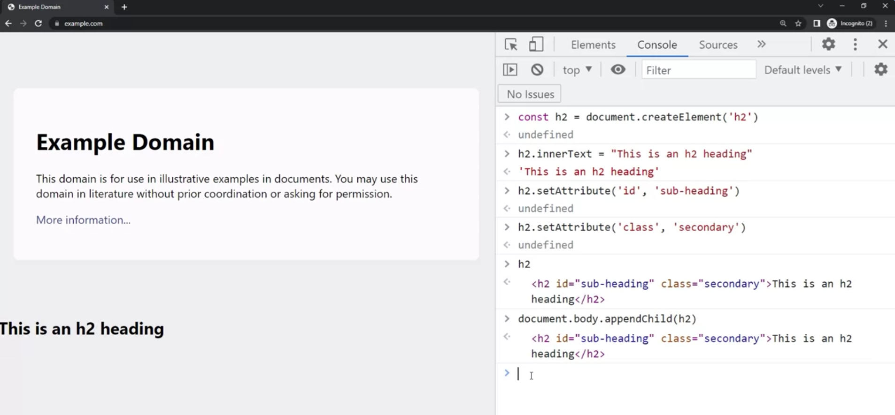

#### Event Handling

- Events are user-triggered actions (a click, a tap, etc.) that JavaScript can listen for on a specific part of the page.
- An event handler is the function that runs when a listened-for event fires.
- Two ways to attach a handler: the `addEventListener` method, or an inline HTML event attribute like `onclick`.
- Events bubble up from a child element to its parents -- clicking a heading inside the body triggers both the heading's own handler and the body's handler; clicking elsewhere in the body only triggers the body's handler.

```js
// addEventListener: get a reference to the element, then listen on it
const target = document.querySelector('body');

function handleClick() {
  console.log('clicked the body');
}
target.addEventListener('click', handleClick);

// Alternative: an inline HTML event attribute achieves the same thing
// <h1 onclick="handleClick2()">Heading</h1>
function handleClick2() {
  console.log('clicked the heading');
}

// Clicking the <h1> logs both messages (event bubbles from h1 up to body):
// "clicked the heading"
// "clicked the body"
// Clicking elsewhere in <body> only logs "clicked the body"
```

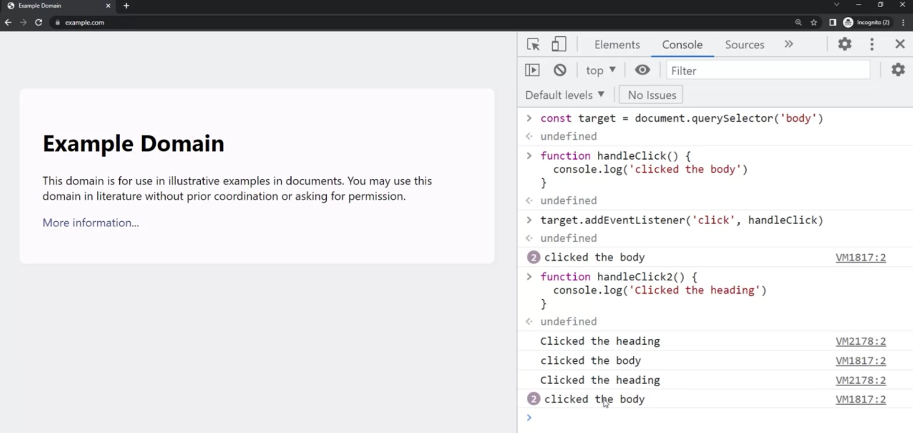

#### Exercise: Web Page Content Update

- This exercise captures user input and manipulates displayed content based on it.

##### Capturing Input with `prompt()`

- The built-in `prompt()` method captures user input into a variable, which you can then manipulate however you need.
- Quickest way to show it on screen: create an `<h1>` and set its text to the captured input.
- Simple, but not efficient for more complex scenarios -- that's where HTML forms come in.

```js
let answer = prompt('What is your name?');
if (typeof(answer) === 'string') {
    var h1 = document.createElement('h1')
    h1.innerText = answer;
    document.body.innerText = '';
    document.body.appendChild(h1);
}
```

##### Using an HTML Form Input Instead

- Test solution: dynamically add an `<h1>` and an `<input type="text">`, so typing into the input will eventually update the `h1`'s text.
  - At this stage the input doesn't do anything yet -- it just renders empty, next to the heading.
  - Try it yourself: point the browser to example.com and run the code in the console (accessible via the browser's developer tools).
- Note on `var`: `let`/`const` are generally preferred, but `var` is used here because it's the most lenient keyword -- it won't complain about `h1`/`input` already being declared during quick, repeated console experiments. In a real project with modern tooling, use `let` or `const` instead.

```js
var h1 = document.createElement('h1')
h1.innerText = "Type into the input to make this text change"

var input = document.createElement('input')
input.setAttribute('type', 'text')

document.body.innerText = '';
document.body.appendChild(h1);
document.body.appendChild(input);
```

##### Listening for Input Changes

- Add an event listener for the `change` event, which fires once you type into the input and press ENTER.
- First test it by just logging the typed value to the console.

```js
input.addEventListener('change', function() {
    console.log(input.value)
})
```

- Finish the exercise by using that same value to update the `h1`'s text instead of just logging it -- now, whatever you type and confirm with ENTER appears as the heading's text.

```js
input.addEventListener('change', function() {
    h1.innerText = input.value
})
```

- Combining DOM manipulation and event handling like this enables remarkable interactive websites.

#### Frameworks and Libraries

- Frameworks and libraries package up development problems that have already been solved, saving time instead of reinventing the wheel; they may be open source (source freely available to modify) or proprietary (licensed or built in-house).
- Library: a reusable piece of code purpose-built for one specific functionality, e.g. validating an email address instead of implementing its technical specification from scratch. The developer calls the library whenever that functionality is needed.
- Framework: provides the overall structure of an application, and the developer's code plugs into it -- e.g. a web framework handles receiving HTTP requests and sending responses, while the developer implements the request-processing logic in between.
- Most frameworks use libraries internally, and an application built on a framework can still bring in its own libraries too.
- Frameworks are opinionated (they dictate an application's flow and structure); libraries are unopinionated (implementation decisions are left to the developer). Opinionatedness varies between frameworks, but a framework is always more opinionated than a library.
- Trade-offs:
  - Framework: speeds up development and enforces best practices/structure, but your code may not always fit that structure, and a library the framework depends on can conflict with one you need.
  - No framework (libraries only): full freedom to swap any individual library for a better one later, but the developer alone is responsible for choosing compatible libraries and making them work together.
- Overall, reusing frameworks and libraries means faster development, fewer errors, and more time for the application's essential features.

#### Additional Resources

- [Mozilla Developer Network Expressions and Operators](https://developer.mozilla.org/en-US/docs/Web/JavaScript/Reference/Operators)
- [Mozilla Developer Network Operator Precedence and Associativity](https://developer.mozilla.org/en-US/docs/Web/JavaScript/Reference/Operators/Operator_Precedence)
- [JavaScript Primitive Values](https://developer.mozilla.org/en-US/docs/Glossary/Primitive)
- [ECMA262 Specification](https://tc39.es/ecma262/)
- [jQuery Official Website](https://jquery.com/)
- [React Official Website](https://reactjs.org/)
- [StackOverflow Developer Survey 2021 Most Popular Technologies](https://insights.stackoverflow.com/survey/2021#technology-most-popular-technologies)
- [Emojis](http://unicode.org/emoji/charts/full-emoji-list.html#1f600)
- [MDN: Modules](https://developer.mozilla.org/en-US/docs/Web/JavaScript/Guide/Modules)

## 3. The Full Stack Using Django

### Django Architecture

#### Recap: What you know about Django

- Django is a back-end framework that can connect to a front-end framework, covering projects, applications, the admin site, and overall structure; it follows the DRY (don't repeat yourself) principle -- write logic once, reuse it many times.
- `django-admin` and `manage.py` are command-line utilities for administration tasks, including creating projects and apps.
- Framework benefits recap: a clean, ordered structure for building web apps, plus speed, feature-rich classes, security, and scalability.
- Django implements the MVT (model, view, template) architecture, splitting data, logic, and display to rapidly build large-scale, data-driven web applications:
  - Model: migrations evolve the database schema; the QuerySet API queries the database; the Form API binds data to objects and builds model forms and HTML forms; the Django Admin panel manages users/groups and their permissions; an external MySQL database can be configured for the app.
  - View: handles HTTP requests and returns responses.
    - A view function is mapped to a URL through routing to connect the request-response cycle.
    - View functions can also process/retrieve database data, transform data, and render templates.
    - `urls.py` is the URL configuration file, present by default at the project level and addable at the app level too.
    - The HTTP request object maps to URLs and common CRUD operations, and retrieves client information.
    - URL namespacing maps a URL to a name and its corresponding view.
    - URL parameters and query parameters relate to GET, PUT, POST, and DELETE operations; URLs can also use regular expressions.
    - Error handling covers HTTP status responses and server error responses.
    - Class-based views apply object-oriented inheritance to create reusable, simplified views.
  - Template: the Django Template Language (DTL) provides variables, tags, filters, and comments, including variable interpolation to build dynamic templates that map model objects.
    - Template inheritance uses the `include` and `extends` tags to split content into reusable components and replace blocks from a parent template.
- Debugging removes an application's errors and bugs; Django's debugger shows a yellow-page error when the `DEBUG = True` flag is set.
- Testing measures quality, reliability, and performance; unit testing isolates a single function, class, or method for testing, and Django's unit test module uses a class-based approach where tests are added to a class inheriting from `TestCase` in Django's test package.

#### Recap: What you know about APIs

- APIs are the communication bridge between the different parts of an application, e.g. making a restaurant booking for a specific date and time.
- HTTP/HTTPS fundamentals: HTTPS encrypts data on both client and server side; a client requests information and a server responds. HTTP methods instruct the back end how to handle resources, and HTTP status codes give the client more information about a request's outcome.
- RESTfulness, naming, and tooling:
  - A well-designed endpoint conveys its purpose; naming conventions include lowercase URIs, forward slashes for hierarchical relationships, nouns for resource names, and no file extensions.
  - Insomnia is a free, cross-platform, user-friendly REST API client used for testing APIs.
  - API development principles cover REST best practices, security, authentication, authorization, access control, project organization, and XML/JSON response types.
- Debugging and mocking: Python scripts can be debugged from VS Code's built-in tools, and the Django debugging toolbar helps debug APIs specifically; API mocking imitates a real endpoint's responses to support testing and development.
- Django REST Framework (DRF): a utility app bridging the Django framework and the ORM (object-relational mapping) library that talks to the database, used to serialize, convert, validate, and render data.
  - Benefits include a built-in API view, human-readable HTTP status codes, and serializers -- DRF's most popular feature, converting Django models into formats like JSON/XML, and deserializing user-supplied data (e.g. parsed JSON) back into models for safe storage.
  - Routers auto-configure URLs from class-based views; class-based views need less code, reduce duplication, and can be extended with new features over time.
  - A built-in renderer object displays different content types.
- Filtering, ordering, searching, and pagination:
  - Filtering lets client applications access specific data via APIs, usually through query strings.
  - Ordering sorts API results ascending/descending, including multiple-field ordering.
  - Pagination chunks results (e.g. restaurant menu items) by page number and page size, letting the client choose both while reducing server resource use.
  - Caching serves saved results instead of regenerating them, optimizing performance.
- Security:
  - Data sanitation prevents vulnerabilities from unsanitized input; API security matters because APIs give third-party clients access to your databases.
  - Token-based authentication in DRF is built via a registration/login API that issues tokens for authenticating calls -- but authentication alone isn't enough.
  - Access control adds authorization: checking user privileges and roles so only the right users can access data, including creating different user roles in DRF.
  - The Djoser library adds authentication endpoints (registration, sign-in) as an alternative to DRF's built-in authentication system.
  - Signed URLs limit access to a resource for a specific time period.
  - API throttling uses DRF's two throttling classes to control how often authenticated and unauthenticated users can access APIs in a given time window.

#### Environment check

- Terminal: needed to run Django/build commands and talk to the server and database -- Terminal app on macOS/Linux, PowerShell on Windows.
- Django-specific: Pipenv manages dependencies inside a virtual environment instead of a global one, avoiding package conflicts.
- Database: Django works with SQLite (file-based, built in) and others like MySQL and MariaDB, two of the most widely used engines; MySQL installs via its official installer or an OS package manager.
- Editor: Visual Studio Code (free) provides debuggers, quick refactoring, syntax highlighting, and extensions for added functionality.
- API testing: a REST API client sends API calls with JSON/form-URL-encoded payloads and headers -- Postman, Insomnia, and HTTPie are free, cross-platform options; useful resources include the Postman platform, Postman Echo (sample API calls), Insomnia's homepage/getting-started guide, and Httpbin.
- Version control: a system like Git tracks code versions and lets you roll back to any past state; commonly integrated directly into build tools.
- Front-end tooling (e.g. for React): Node.js to run JavaScript tooling from the command line, a package manager (npm or Yarn) for dependencies, and a build tool (Vite or Webpack, with Vite the popular, fast, free choice today) to build the production version of your code.
- Overall: the right environment and tools make development faster, more enjoyable, and help avoid common errors.

#### Creating a Django project (steps and code)

- Sets up a Django project in VS Code, using uv to manage the virtual environment and dependencies. The project structure can vary by preference; the one below is simple to follow.
- `uv run` resolves the right Python interpreter for you, so unlike with pipenv there's no need for OS-specific tweaks like `python` vs `python3`.

```bash
# Open the project folder in VS Code, then open a terminal inside it (File > Open Folder, Terminal > New Terminal)

# 1. Create and enter the project directory
mkdir LittleLemon
cd LittleLemon

# 2. Initialize a uv-managed project -- creates pyproject.toml and .python-version
uv init --python 3.9

# 3. Add dependencies -- uv writes them to pyproject.toml/uv.lock and manages the .venv automatically
uv add django djangorestframework djangorestframework-xml mysqlclient

# 4. Create the Django project in the current directory (the trailing dot avoids an extra nested folder)
uv run django-admin startproject myproject .

# 5. Create a Django app
uv run python manage.py startapp myapp

# 6. Start the dev server to confirm the setup works (Ctrl+C to stop)
uv run python manage.py runserver
```

- No manual dependency file to edit -- `uv add` updates `pyproject.toml` directly, replacing the Pipfile-editing step.
- `uv init` also scaffolds a placeholder script (e.g. `main.py`), which isn't needed here since `manage.py` is the real entry point and can be deleted.

##### App-level `urls.py`

Create `urls.py` inside the app directory (e.g. `myapp/`) to map the app's own routes:

```python
from django.urls import path
from . import views

urlpatterns = [
    path('ratings', views.ratings),  # maps /ratings to the `ratings` view
]
```

##### Project-level `urls.py`

Update the project-level `urls.py` (next to `settings.py`) to include the app's routes under a prefix:

```python
from django.contrib import admin
from django.urls import path, include

urlpatterns = [
    path('admin/', admin.site.urls),
    path('home/', include('myapp.urls')),  # delegates everything under /home/ to myapp's urls.py
]
```

- Both URL configurations will vary depending on the views and app names actually used in a given project.

### Django and MySQL

#### Recap: What you know about Databases and MySQL

- Databases persist data so applications can perform CRUD (create, read, update, delete) operations; they can be relational (PostgreSQL, MySQL) or non-relational (MongoDB, Neo4j). Relational databases are more common, thanks to referential identity -- keys and constraints that keep data consistent and accurate.
- Django supports several databases with minimal, generic configuration: PostgreSQL, MariaDB, MySQL, Oracle, and SQLite (PostgreSQL and MySQL are the most used). A new project defaults to SQLite, auto-configured in `settings.py`.
- SQLite is zero-configuration and serverless (no starting/stopping, no extra config files), great for small projects or prototyping -- but lacks a user management system, limiting it for production.
- MySQL is a common production alternative: open source, more scalable, with authentication support. Connecting needs its address, port, and database name. Setup:
  - Install the MySQL server (see Additional Resources for the download link).
  - Create a database via the CLI:
    ```bash
    mysql -u root -p        # -u username, -p prompts for password
    ```
    ```sql
    CREATE DATABASE my_database;
    SHOW DATABASES;
    ```
  - Install a database driver -- Django recommends `mysqlclient` -- to translate Python queries into SQL. It's a C extension, so it needs MySQL's client dev headers installed first:

```bash
# Debian/Ubuntu
sudo apt-get install default-libmysqlclient-dev pkg-config
# macOS (Homebrew)
brew install mysql-client pkg-config
# Fedora/RHEL
sudo dnf install mysql-devel pkg-config gcc

# Then install the package (Windows usually has precompiled wheels, so headers aren't needed there)
uv add mysqlclient
```

  - Configure the connection under `DATABASES` in `settings.py`: `CONN_MAX_AGE` sets how long a connection stays open, and credentials can live in a separate MySQL options file outside the project (e.g. `/etc/mysql/`) rather than hardcoded in `settings.py`, which is safer for production.
  - Migrations create tables from models, but the database itself must be created manually first, with a connection that has sufficient permissions.
- Security: use strong credentials and roles -- leaked database credentials are a major risk. Despite the setup effort, Django + MySQL is an industry-standard, scalable combination for full stack apps.

#### Recap: Models and migrations

- Models are the M in Django's MVT (model, view, template) architecture, widely considered one of Django's best features.
- ORM (object-relational mapping) lets you build SQL queries using an object-oriented language like Python, enabling fast turnaround in production environments with frequent updates.

##### ORM and CRUD Operations in Models

- The ORM sits as a layer between the application and the database.
- Each model is a Python class, a subclass of `django.db.models.Model`; each attribute represents a database field/column, and models support CRUD (create, read, update, delete) operations.
- Models are defined in an app's `models.py` file. Compare the SQL and the corresponding Django model for a `User` table:

```sql
CREATE TABLE user (
    "id" serial NOT NULL PRIMARY KEY,
    "first_name" varchar(30) NOT NULL,
    "last_name" varchar(30) NOT NULL
);
```

```python
from django.db import models

class User(models.Model):
    first_name = models.CharField(max_length=30)
    last_name = models.CharField(max_length=30)
```

- The `first_name`/`last_name` columns map directly to model attributes; `id` is auto-generated during migrations. Methods like `CharField` are "form fields" that determine an attribute's data type.

CRUD examples, Django ORM alongside the equivalent SQL:

```python
# Create
new_user = User(id=1, first_name="John", last_name="Jones")
new_user.save()
```
```sql
INSERT INTO user (id, first_name, last_name) VALUES (1, 'John', 'Jones');
```

```python
# Update
user = User.objects.get(id=1)
user.last_name = "Smith"
user.save()
```
```sql
UPDATE user
SET last_name = 'Smith'
WHERE id = 1;
```

```python
# Delete
user = User.objects.get(id=1)
user.delete()
```
```sql
DELETE FROM user WHERE id = 1;
```

- Django's ORM supports many more SQL query options beyond these basics -- see Django's official documentation for the full reference.

##### Using Raw SQL with `raw()`

Django processes data as `QuerySet` objects, but you can also run SQL directly via `raw()`. From the Django shell:

```python
people = Person.objects.raw('SELECT id, first_name FROM myapp_person')

for p in people:
    print(p.first_name, p.last_name)
# e.g. prints: Jesse Rogers
```

##### Model Relationships

Model relationships come in three types:
- One-to-one: a primary key in one model maps to exactly one record in a related model.
- One-to-many: one object in a model can be associated with one or more objects in another (e.g. one subject can have many teachers who teach it).
- Many-to-many: multiple objects in one model associate with multiple objects in another.

These mirror table relationships in SQL, built primarily around foreign keys -- represented in Django via the `ForeignKey` field.

Many-to-many example:

```python
class Teacher(models.Model):
    teacherID = models.IntegerField(primary_key=True)
    qualification = models.CharField(max_length=50)
    email = models.EmailField(max_length=50)

class Subject(models.Model):
    subjectcode = models.IntegerField(primary_key=True)
    name = models.CharField(max_length=30)
    credits = models.IntegerField()
    teacher = models.ManyToManyField(Teacher)
```

One-to-many example, using `ForeignKey`:

```python
class Subject(models.Model):
    subjectcode = models.IntegerField(primary_key=True)
    name = models.CharField(max_length=30)
    credits = models.IntegerField()

class Teacher(models.Model):
    teacherID = models.IntegerField(primary_key=True)
    subjectcode = models.ForeignKey(Subject, on_delete=models.CASCADE)
    qualification = models.CharField(max_length=50)
    email = models.EmailField(max_length=50)
```

##### Migrations

Once a model is defined in `models.py`, migrations are the next, most important step for applying it to the database.

- Migrations let Django create and change the models that represent a database schema; they're tied to models and stored as files in each app's `migrations/` folder.
- Without an ORM, adding a column (e.g. `City` to the `User` table) would require logging into the database and running an SQL `ALTER TABLE` statement. With Django, you just add the attribute to the model and run the migration scripts instead.

Migrating is a two-step process:

```bash
# 1. Create a migration from model changes
python3 manage.py makemigrations

# 2. Apply the migration to the database
python3 manage.py migrate
```

- Beyond applying model changes, migrations also sync and version-control the database schema.

##### History of Changes

- Migrations track a history of schema changes over time, so multiple users/databases stay in sync -- a developer changes the model, then applies it via a migration script.
- This also avoids repetition: instead of manually writing SQL for every model change, migrations generate it for you.
- The history is stored as files in each app's `migrations/` folder. Running:

```bash
python3 manage.py showmigrations
```

might return something like:

```
[X] 0001_initial
[X] 0002_logentry_remove_menu_items
[X] __init__
[X] 0001_initial
[X] 0001_alter_menu_items
```

- Django names migration files based on the action performed or a timestamp.
- `[X]` marks a migration that has been created (via `makemigrations`) and applied (via `migrate`); Django won't reapply a migration to the same database unless it detects further changes.

##### Logic Behind Migrations

Django tracks migrations in a `django_migrations` table. Every time a migration runs:
- The table is updated with the latest changes.
- It's checked before the migration script runs.
- Django confirms which scripts have already run and which still need to be applied.

A typical migration file looks like:

```python
dependencies = [
    ('LittleLemonDRF', '0001_initial'),
]

operations = [
    migrations.CreateModel(
        name='table_customers',
        fields=[
            ('id', models.BigAutoField(auto_created=True, primary_key=True, serialize=False, verbose_name='ID')),
            ('first_name', models.CharField(max_length=200)),
        ],
    ),
]
```

- `dependencies` lists prior migrations that must be applied first; `operations` lists the actions performed in this migration.

#### Configuring Django to connect to MySQL

- MySQL is a popular, performant, open-source database engine suited to projects of any scale.
- Install `mysqlclient`, the package Django needs to talk to MySQL, inside your project's virtual environment.
- Connect to the MySQL server from the terminal, adjusting the command if using a non-default host/port, then create and verify the database.
- Update `settings.py` to point `DATABASES` at MySQL instead of the SQLite default, filling in the engine, database name, host, user, password, and (if non-default) port.
  - Never use the root user in production -- it has full access to every database, so misuse can cause serious damage.
- Run migrations to confirm the connection works, then check inside the MySQL shell that Django created the expected tables.

```bash
# Install the MySQL driver Django needs -- uv adds it to pyproject.toml and manages the virtual environment
uv add mysqlclient

# Connect to the MySQL server (adjust host/port if not using the defaults)
mysql -u root -p
mysql -u root -p -P 3307        # non-default port (3306 is the default)
mysql -u root -h 127.0.0.1 -p   # non-default host
```

```sql
-- Inside the MySQL shell: create and verify the database
CREATE DATABASE little_lemon;
SHOW DATABASES;
exit
```

```python
# settings.py: point DATABASES at MySQL instead of the SQLite default
DATABASES = {
    'default': {
        'ENGINE': 'django.db.backends.mysql',  # was 'django.db.backends.sqlite3'
        'NAME': 'little_lemon',
        'HOST': 'localhost',       # or e.g. '127.0.0.1'
        'USER': 'root',            # never use root in production
        'PASSWORD': 'yourpassword',
        'PORT': '3307',            # only needed if not using the default 3306
    }
}
```

```bash
# Apply migrations to confirm the connection works
uv run python manage.py makemigrations
uv run python manage.py migrate
```

```sql
-- Back in the MySQL shell: confirm Django created the tables
USE little_lemon;
SHOW TABLES;
```

#### Exercise: Connect Django to MySQL

Folder: [`lab/02-connect-django-mysql/`](./lab/02-connect-django-mysql/) ([Instructions.md](./lab/02-connect-django-mysql/Instructions.md)).

- Replaced the lab's pipenv setup (`Pipfile`/`Pipfile.lock`) with `uv` (`pyproject.toml` + `uv.lock`), pinning Django and `mysqlclient` as dependencies.
- Updated `myproject/settings.py`: pointed `DATABASES` at MySQL (`menu_db`, via the `admindjango` user) instead of the SQLite default, and added `'myapp'` to `INSTALLED_APPS`.
- Verified the setup with `uv run python manage.py check` and `uv run python manage.py makemigrations` -- both ran cleanly against the new configuration (the sample credentials below are placeholders; running `migrate` for real requires an actual MySQL server with that database/user created via the steps below).

```bash
# Create the database's virtual environment and install dependencies (Django, mysqlclient)
uv sync
```

```bash
# Step 1: log into the MySQL shell (add sudo if your OS requires admin privileges)
mysql -u root -p
```

```sql
-- Step 2-3: create and verify a database
CREATE DATABASE menu_db;
SHOW DATABASES;
```

```sql
-- Step 6-7: create a second database, as practice, from the VS Code terminal
CREATE DATABASE menu_items;
SHOW DATABASES;
```

```sql
-- Step 8-10: create a dedicated user and grant it privileges (or just use root)
CREATE USER 'admindjango'@'localhost' IDENTIFIED BY 'employee@123!';
GRANT ALL ON *.* TO 'admindjango'@'localhost';
FLUSH PRIVILEGES;
exit
```

```python
# Step 12-13: myproject/settings.py -- connect to MySQL and register the app
DATABASES = {
    'default': {
        'ENGINE': 'django.db.backends.mysql',
        'NAME': 'menu_db',
        'HOST': '127.0.0.1',
        'PORT': '3306',
        'USER': 'admindjango',
        'PASSWORD': 'employee@123!',
    }
}

INSTALLED_APPS = [
    'django.contrib.admin',
    'django.contrib.auth',
    'django.contrib.contenttypes',
    'django.contrib.sessions',
    'django.contrib.messages',
    'django.contrib.staticfiles',
    'myapp',
]
```

```bash
# Step 14: apply the migrations against the MySQL database
uv run python manage.py makemigrations
uv run python manage.py migrate
```

### Django and the Front End

#### Recap: What you know about forms and ModelForms

- Forms are the primary mechanism for user interactivity and data exchange on the web, e.g. social media comments or restaurant app reviews -- not just a minor front-end detail.
- Beyond plain HTML/CSS/JS, Django offers two easier alternatives for generating forms: the Form API and the ModelForm class, which auto-generate HTML form elements from a Python class. The most common submission method is a POST request, handled server-side.
- Plain HTML forms work but get tedious and error-prone at scale: every input's `name`/`id` must manually match what the back-end code expects, and complex/conditional forms compound this.

##### Plain HTML Form

- A basic HTML form to submit a name: a `label` describes the input, a `text` input captures the name, and a `submit` input triggers a POST request to the view named in the `action` attribute.

```html
<form action="/order/" method="post">
  <label for="name">Name:</label>
  <input type="text" name="name" id="name">
  <input type="submit" value="Send Name">
</form>
```

- This works, but every `name`/`id` here must match what the receiving view expects to read -- a manual, error-prone link that gets worse as forms grow larger or more conditional.

##### The Form Class

- A Django `Form` class defines the expected attributes once, and both renders the HTML and validates incoming data against it -- no more manually matching input names to server-side code.
- Example: the same name-submission form, as a `Form` class.

```python
from django import forms

class NameForm(forms.Form):
    your_name = forms.CharField(max_length=100)  # renders as an HTML text input, validated to 100 chars
```

- The mapping from the Python class to rendered HTML happens in the view: it creates a `NameForm` instance and passes it into the template context under the key `form` -- that key is what `{{ form }}` refers to in the template.

```python
# views.py
def order_view(request):
    form = NameForm(request.POST or None)  # the same NameForm instance is used to render AND validate
    if form.is_valid():
        name = form.cleaned_data['your_name']
        # ... process name ...
    return render(request, 'order.html', {'form': form})
```

- The template then renders that `form` object -- `{{ form }}` expands to the HTML for every field declared on `NameForm` (here, just `your_name`), which is how the class ends up generating the equivalent HTML automatically:

```html
<!-- order.html -->
<form action="/order/" method="post">
  
  {{ form }}
  <input type="submit" value="Send Name">
</form>
```

##### ModelForm

- `ModelForm` goes a step further than `Form`: since submitted data usually needs to be persisted, it binds a form directly to a model so the data can be saved straight to the database.
- Creating a `ModelForm` involves three steps: create the model, create the `ModelForm` (via a `Meta` class referencing that model instead of a separate form class), and configure the view to process the POST data.
- Example: a work-hours logging form for restaurant employees.

```python
# models.py
from django.db import models

class Logger(models.Model):
    first_name = models.CharField(max_length=100)
    last_name = models.CharField(max_length=100)
    time_log = models.TimeField()
```

```python
# forms.py -- by convention, user-defined form classes live in forms.py inside the app
from django import forms
from .models import Logger

class LogForm(forms.ModelForm):
    class Meta:
        model = Logger
        fields = '__all__'
```

```python
# views.py -- an instance of LogForm handles validating and saving POST data
def form_view(request):
    form = LogForm(request.POST or None)
    if form.is_valid():
        form.save()  # persists directly to the Logger table
    return render(request, 'log_form.html', {'form': form})
```

```html
<!-- log_form.html -->
<form method="post">
  
  {{ form }}
  <input type="submit" value="Log Hours">
</form>
```

- Once migrations are applied and the server runs, submitted form data is processed by the view and saved to the database.

##### Form Field Types

A form's attributes are field class objects, each corresponding to the HTML element it renders as. Frequently used ones:
- `CharField` -- HTML text input.
- `IntegerField` -- like `CharField`, but only accepts integers.
- `FloatField` -- text input validated as a float.
- `FileField` -- file upload input.
- `EmailField` -- a `CharField` that validates the text as a valid email address.
- `ChoiceField` -- emulates an HTML `<select>` element.

Choosing the right form/field type matters for both user experience and efficient data processing.

#### Fetching data using JavaScript

- Combining JavaScript and Django in a full stack app generally follows one of two approaches:
  - Client-first: build the front end first with JavaScript/frameworks like React (templating, URL routing), then bring in Django mainly for database interaction and utility apps like DRF (Django REST Framework).
  - Server-first: build the Django side first, then fill in the gaps with JavaScript, AJAX, and simple event handling -- the approach a back-end developer tends to prefer.
- Native JavaScript alone (no extra library) -- `addEventListener` plus the `fetch` API -- is enough to submit a form without reloading the page.
- Example, following the server-first approach: a comment form for the Little Lemon food blog that POSTs to a Django view and saves each comment to MySQL via a model, without a full page refresh.

```python
# models.py
from django.db import models

class UserComments(models.Model):
    first_name = models.CharField(max_length=100)
    last_name = models.CharField(max_length=100)
    comment = models.CharField(max_length=500)
```

```python
# forms.py
from django import forms
from .models import UserComments

class CommentForm(forms.ModelForm):
    class Meta:
        model = UserComments
        fields = '__all__'
```

```python
# views.py -- renders the form (GET) and processes/saves it (POST)
from django.shortcuts import render
from django.http import JsonResponse
from .models import UserComments
from .forms import CommentForm

def form_view(request):
    form = CommentForm()
    if request.method == 'POST':
        form = CommentForm(request.POST)
        if form.is_valid():
            cd = form.cleaned_data  # cleaned_data normalizes the validated form data
            uc = UserComments()
            uc.first_name = cd['first_name']
            uc.last_name = cd['last_name']
            uc.comment = cd['comment']
            uc.save()
            # JsonResponse, not render, so the fetch() call below can read a JSON success message
            return JsonResponse({'message': 'Comment submitted successfully!'})
    return render(request, 'blog.html', {'form': form})
```

```html
<!-- blog.html -->
<!DOCTYPE html>
<html>
<head>
    <title>Little Lemon Food Blog</title>
</head>
<body>
    <h1>Comments</h1>
    <form id="form" action="" method="post">
        
        {{ form.as_p }}
        <button type="submit">Submit</button>
    </form>

    <script>
        const form = document.getElementById('form');  // access the form element from the HTML
        form.addEventListener('submit', submitHandler);

        function submitHandler(event) {
            event.preventDefault(); // stop the default full-page form submission
            fetch(form.action, {
                method: 'POST',
                body: new FormData(form), // includes the CSRF token automatically
            })
                .then((response) => response.json()) // parse the JsonResponse from the view
                .then((data) => {
                    alert(data.message);
                    form.reset(); // clear the form for the next comment
                });
        }
    </script>
</body>
</html>
```

- End to end: submitting the form fires `submitHandler`, which POSTs the form data via `fetch` instead of reloading the page; the Django view validates and saves it to the `UserComments` model (visible as a table in the MySQL database), then responds with JSON that the script turns into a success alert.

#### Querying APIs using JavaScript

JavaScript isn't just for client-side programming and interactivity -- it's also commonly used to send and receive data from an API, including from back-end code. This section covers fetching and sending data to an API using the native `fetch` function.

##### Native Solution vs. Third-Party Libraries

When fetching data from APIs, the options are the native `fetch` function, the older `XMLHttpRequest` object, or a library like jQuery or Axios. Some context:

- Fetching data with `XMLHttpRequest` was historically difficult, requiring a lot of code for even a simple request -- at the time, there was no alternative.
- Third-party libraries emerged as wrappers around `XMLHttpRequest`, providing a simpler interface, and quickly became popular.
- Later, JavaScript introduced the native `fetch` API: powerful, simple, and easy to use.
- Even so, `fetch` still requires manually writing extra code for error checking and header processing, which is why libraries like Axios remain popular -- they provide a simpler interface and handle more of this automatically.
- Both the native `fetch` API and Axios are viable choices for fetching data from APIs.

The rest of this section covers making GET, POST, PUT, PATCH, and DELETE calls with `fetch`, plus authenticated calls using tokens.

##### Making a GET Call

A GET call with `fetch` just needs the call itself, converting the response to JSON (or text), then processing it however you like. Example, calling the menu-items endpoint of the Little Lemon restaurant app (from the APIs course):

```js
fetch('http://127.0.0.1:8000/api/menu-items')
    .then(response => response.json())
    .then(data => {
        console.log(data)
    })
```

##### POST, PUT, and PATCH Calls

To make a POST call with data via `fetch`, convert the JSON payload to a string with `JSON.stringify()` and pass it as `body` in the second argument to `fetch`. It's also good practice to add `Accept` and `Content-Type` headers to API calls.

Example: creating a new menu item with a POST call to the `http://127.0.0.1:8000/api/menu-items` endpoint.

```js
const payload = {
    "title": "Ambrosia Ice cream",
    "price": 5.00,
    "inventory": 100
}
const endpoint = 'http://127.0.0.1:8000/api/menu-items'
fetch(endpoint,
    {
        method: 'POST',
        headers: {
            'Accept': 'application/json',
            'Content-Type': 'application/json'
        },
        body: JSON.stringify(payload)
    })
    .then(response => response.json())
    .then(data => {
        console.log(data)
    })
```

For PUT and PATCH calls, just change the `method` from `'POST'` to `'PUT'` or `'PATCH'` -- everything else stays the same. These requests typically operate on a single resource, identified by an ID in the URL.

##### DELETE Calls

For DELETE calls, change the method to `'DELETE'`; in most cases, no body is passed. Example, a DELETE call to the menu-items endpoint:

```js
const endpoint = 'http://127.0.0.1:8000/api/menu-items/17'
fetch(endpoint,
    {
        method: 'DELETE',
        headers: {
            'Accept': 'application/json',
            'Content-Type': 'application/json'
        }
    })
    .then(response => response.json())
    .then(data => {
        console.log(data)
    })
```

##### Making Authenticated Calls with Tokens

For authenticated API calls using bearer tokens, pass an `Authorization` header in the second argument to `fetch`. Example: an authenticated POST call, with the bearer token passed in the headers.

```js
const endpoint = 'http://127.0.0.1:8000/api/menu-items/17'
const token = "Some token"
fetch(endpoint,
    {
        method: 'POST',
        headers: {
            'Accept': 'application/json',
            'Content-Type': 'application/json',
            'Authorization': 'Bearer ' + token
        },
        body: JSON.stringify(payload)
    })
    .then(response => response.json())
    .then(data => {
        console.log(data)
    })
```

The same `Authorization` header approach works for authenticated GET calls too.

#### Exercise: Submitting a form with JavaScript

Folder: [`lab/03-javascript-form/`](./lab/03-javascript-form/) ([Instructions.md](./lab/03-javascript-form/Instructions.md)).

- Replaced the lab's pipenv setup (`Pipfile`/`Pipfile.lock`) with `uv` (`pyproject.toml` + `uv.lock`), pinning Django and `mysqlclient` as dependencies.
- Implemented `myapp/views.py`'s `form_view()`: on POST, validates `MenuForm`, saves a new `Menu` from its `cleaned_data`, and returns a `JsonResponse`; otherwise renders `menu_items.html` with the form (fixing the template name to match the one actually provided in the lab -- the original solution text referenced a nonexistent `booking.html`).
- Implemented `myapp/templates/menu_items.html`: the Bootstrap-based form markup plus a `<script>` that submits it via `fetch` instead of a full page reload, and shows a success alert.
- Verified with `uv run python manage.py check` -- Django's system check framework, which inspects models/settings/URLs/apps for configuration problems without touching the database (passed) -- and `makemigrations` (generated `0001_initial.py` for the `Menu` model cleanly).

```bash
# Install dependencies and create the project's virtual environment
uv sync
```

```bash
# Apply migrations and start the dev server
uv run python manage.py makemigrations
uv run python manage.py migrate
uv run python manage.py runserver
```

```python
# myapp/views.py
from django.shortcuts import render
from myapp.forms import MenuForm
from .models import Menu
from django.http import JsonResponse


def form_view(request):
    form = MenuForm()

    if request.method == 'POST':
        form = MenuForm(request.POST)
        if form.is_valid():
            cd = form.cleaned_data

            mf = Menu(
                item_name=cd['item_name'],
                category=cd['category'],
                description=cd['description'],
            )

            mf.save()
            return JsonResponse({'message': 'success'})

    return render(request, 'menu_items.html', {'form': form})
```

```html
<!-- myapp/templates/menu_items.html -->
<!doctype html>
<html lang="en">
<head>
    <!-- Required meta tags -->
    <meta charset="utf-8">
    <meta name="viewport" content="width=device-width, initial-scale=1, shrink-to-fit=no">

    <!-- Bootstrap CSS -->
    <link rel="stylesheet" href="https://stackpath.bootstrapcdn.com/bootstrap/4.4.1/css/bootstrap.min.css"
          integrity="sha384-Vkoo8x4CGsO3+Hhxv8T/Q5PaXtkKtu6ug5TOeNV6gBiFeWPGFN9MuhOf23Q9Ifjh" crossorigin="anonymous">

    <title>Menu Items</title>
</head>
<body class="bg-light">
<div class="container pt-4">
    <h1>Menu Items</h1>
    <form method="POST" id="form">
        
        {{ form.as_p }}
        <button type="submit" class="btn btn-primary">Submit</button>
    </form>
</div>

<script>
    const form = document.getElementById('form');
    form.addEventListener('submit', submitHandler);

    function submitHandler(e) {
        e.preventDefault();

        fetch(form.action, { method: 'POST', body: new FormData(form) })
            .then(response => response.json())
            .then(data => {
                if (data.message === 'success') {
                    alert('Success!');
                    form.reset();
                }
            });
    }
</script>
</body>
</html>
```

## 4. Production Environments

### Web server environments

#### Server and serverless

- Deployment is uploading an application's code and data to one or more servers and linking them to a domain, so it can run in production in the cloud.
  - Manual deployment: uploading everything by hand via FTP (File Transfer Protocol), SFTP (Secure File Transfer Protocol), or tools like `rsync`.
  - Automated deployment: triggered by a push to a version-controlled repository; build tools then create a build environment matching production, run tests, and -- if everything passes -- connect to the server and upload the code.
- CI/CD (continuous integration / continuous deployment) are the two halves of that automated process:
  - CI: imitating the development environment and running tests to confirm the code works.
  - CD (continuous deployment, or continuous delivery): the actual uploading step. Without a test runner, this half alone is just "continuous deployment," not full CI/CD.
  - Typical workflow: code -> version control -> build -> test -> deploy, using tools like Jenkins, CircleCI, or GitHub Actions.
- Hosting an application and database follows one of two approaches, server or serverless -- both actually rely on physical servers under the hood, but differ significantly in how deployment and management work.
  - Server approach: hosting companies offer dedicated or virtual servers.
    - Dedicated server: a computing unit for your exclusive use, with full access to add RAM/storage as needed -- but wasteful (and costly) if the application doesn't need that much power.
    - Virtual server: hypervisor software splits a dedicated server into separate virtual machines, each assignable fixed resources or able to share idle capacity. Advantage: each VM can run a different OS/toolset without conflicts (e.g. one for app code, another for the database). Disadvantage: you manage everything yourself.
  - Serverless approach: no manual configuration of storage, CPU, memory, or environment -- the provider handles it all.
    - Tightly integrated with version control: a push triggers an automatic build, test, and deploy, ending with a URL to the hosted application and database.
    - Billed by actual resource usage (compute, memory, storage, bandwidth) rather than fixed capacity.
    - Downsides: unmonitored usage can spike monthly bills, and vendor lock-in -- serverless conventions aren't universal, so moving to another vendor requires code changes.

#### Virtual machines and containerization

- Virtual machines (VMs) and containers both host and isolate applications, but work very differently.
- Hypervisors: virtualization software that splits a dedicated server into VMs, each running its own OS and applications like an individual computer, with its own IP address to communicate with the others. Two types:
  - Type 1 (bare-metal): a software layer working directly with server hardware -- more efficient resource management and faster applications thanks to dedicated resources, but more complex to set up. Example: KVM (open source).
  - Type 2: runs on top of an existing OS -- simpler to manage (a simpler console, no direct hardware handling), but slower than Type 1. Example: Oracle VirtualBox (open source, free).
- Resource sharing between VMs on the same dedicated server:
  - Dedicated allocation: resources split into fixed shares per VM (e.g. a 3 TB / 12 GB RAM / 6-core server split evenly across 3 VMs, each getting 1 TB / 4 GB / 2 cores). Guarantees availability, but any unused portion of a VM's share sits idle and can't be borrowed by other VMs, wasting capacity.
  - Shared allocation: VMs use their assigned resources plus draw on extra shared capacity when available -- useful when a single machine's resources aren't quite enough. This is monitored, though: sustained over-usage counts as abuse and can get a server terminated on a public provider.
- Containerization removes the hardware/OS setup step entirely: package an application and its dependencies into a container image, then run it via a container engine (e.g. Docker) on any OS or hardware.
  - A container can hold one or multiple applications with their dependencies, or an application can be split across multiple containers coordinated by the container engine -- best practice is to keep containers lean, one process/application each.
  - Since containers don't run their own OS, they're smaller, faster, more portable, and easier to manage than VMs.
- Key container terms:
  - Pod: a group of tightly coupled containers sharing resources to solve one problem together.
  - Node: the physical or virtual machine running one or more pods.
  - Cluster: multiple pods and nodes, whether related or fully independent.
  - Container orchestration: managing, deploying, networking, and scaling containers -- Kubernetes (K8s) is the most widely used solution.

#### What does self-hosted, PaaS, SaaS and DBaaS mean?

- Self-hosted: creating and fully managing your own public or private cloud network yourself -- expensive, high-effort, and costly to set up, so not a popular default choice. Still necessary when dealing with sensitive data, needing extra security, or having custom requirements public cloud providers can't meet.
- IaaS (infrastructure as a service): a provider offers on-demand infrastructure units -- load balancers, servers, compute units, storage, virtualization -- to build the infrastructure your application needs. You control everything, can scale up or down anytime, and pay only for what you use. Popular IaaS: AWS EC2, Google Compute Engine, DigitalOcean, Azure virtual machines.
- PaaS (platform as a service): a managed solution providing everything needed to develop, build, host, and run an application, exposing services like databases, caching, and file storage as APIs. You don't manage servers, and since these common components are already built and managed for you, you can focus on the application's core logic and growth instead. Meta is one example (an API for building apps for Facebook users); other popular PaaS: AWS Elastic Beanstalk, Heroku, Cloudflare, Google App Engine, Microsoft Azure.
- SaaS (software as a service): an application hosted on the cloud and used online under an on-demand or subscription pricing model -- most premium/freemium web applications fall into this category.
- DBaaS (database as a service): a managed database solution (SQL, NoSQL, etc.) with on-demand pricing, handling setup, management, optimization, and scaling for you instead of doing it manually.

### Introduction to cloud computing

#### What is cloud computing?

- Cloud computing is an on-demand solution that hosts applications on the internet, making them accessible to everyone, and lets people use a provider's computing resources to build solutions quickly.
- Motivation: buying (or buying more) physical computers to speed up a task -- e.g. an 8-hour job spread across several machines -- leaves that hardware sitting idle once the job is done, an unrealistic expense. Cloud computing avoids this: rent powerful, on-demand computing units (the latest CPUs, GPUs, memory, storage) for only as long as needed, paying just for what's used, with no physical hardware to buy.
- Three types of cloud infrastructure suit different problems:
  - Public cloud: open to everyone, pay-as-you-go; the provider hosts and maintains the servers and network, and resources can be used and discarded anytime. Benefits: mostly managed (more time to focus on the application), on-demand pricing, quick availability, and scalability (adding nodes to balance load, with some providers auto-scaling -- deploying extra nodes under traffic spikes and removing them once load normalizes). Cheap to start, but costs grow as usage grows.
  - Private cloud: privately hosted and not publicly accessible, restricted to authorized users -- suited to applications handling sensitive data that need more security. A tailored solution with fewer features than public providers, but with better security, control, scalability, and reliability; costly to start since everything is self-hosted and self-managed.
  - Hybrid cloud: mixes private and public cloud, with the public portion connected to the private portion so the application works as a whole. Cheaper than a fully private cloud since it leverages the public cloud, but complex and time-consuming to set up.

#### Key elements of cloud computing

- Computing units: on-demand virtual machines to host a web application or run a program, chosen mainly by processor cores and memory, resizable up or down as needed.
  - Complex workloads (data analysis, machine learning) can pick from a range of core/memory combinations, and some providers even offer GPUs.
  - Billed only for actual usage: deploy a powerful unit when needed, run it as long as required, then delete it -- with your choice of OS and applications installed on it.
  - Caveat: some computing units use volatile storage, wiped on reboot, so pair them with a permanent storage solution when persistence matters.
- Storage:
  - Regular purchasable storage (GB/TB) works like a hard disk, but with near-zero risk of data loss from hardware failure, since providers automatically back it up to redundant storage.
  - Object storage offers just an API to upload/download files of any size, and can share a file via a unique URL with a timestamp signature that expires after a set duration.
- Databases: most providers offer SQL, NoSQL, and time-series options.
  - SQL examples: MySQL, MariaDB, PostgreSQL.
  - NoSQL examples: MongoDB, Cassandra, DynamoDB.
  - Time-series examples: InfluxDB, Prometheus.
  - Fully managed database solutions, compatible with these popular engines (no application code changes needed), remove the burden of manual tuning and scaling -- they scale automatically to handle growing traffic.
  - Some providers also offer in-memory databases (great for caching or very fast operations) and specialized solutions for big data; database nodes (single or multiple) can be deployed in seconds and linked to an application.
- Machine learning normally needs powerful, expensive compute and GPUs for data modeling and training; cloud computing's on-demand pricing makes it much more affordable, with providers offering current hardware/software for machine learning, natural language processing (NLP), voice processing, and similar workloads.
- Overall, cloud computing lets developers spend more time on application development instead of managing hardware and infrastructure.

#### Networking in the cloud

- Public vs. private network: computing units on a public network are reachable via IP address or URL; units on a private network are not publicly reachable, only accessible via the management console. Public communication can span different networks, but private communication requires being on the same network.
  - Example: a load balancer sits in front of the infrastructure and is connected to multiple web servers -- it's connected to the public, while the web servers behind it can reach it either publicly or privately depending on whether they share a network with it.
- IP address: a unique identifier locating a machine on the internet or a private network, using one of two systems:
  - IPv4: four period-separated numbers from 0-255 (e.g. Meta's `69.63.176.13`), max 15 characters, ranging from `0.0.0.0` to `255.255.255.255` -- a maximum of ~4.29 billion addresses, which is running out as demand grows.
  - IPv6: eight colon-separated groups of four hexadecimal digits (e.g. Facebook's `2a03:2880:2130:cf05:face:b00c:0:1`, where "face" and "b00c" are valid hex values) -- invented to solve IPv4's scarcity, offering roughly 3.4 x 10^38 addresses; still being adopted worldwide.
  - Certain IPv4 ranges are reserved for private networks only: `10.0.0.0`-`10.255.255.255`, `172.16.0.0`-`172.31.255.255`, and `192.168.0.0`-`192.168.255.255`.
  - A single device can hold multiple IP addresses, including both IPv4 and IPv6 at once.
- DNS (Domain Name System): public servers that map domain names to IP addresses, so people don't have to remember the latter. A browser request to a domain queries the DNS server for its IP, then connects to that machine.
- Bandwidth: data transferred to/from a server, split into incoming/ingress (e.g. form submissions, file uploads) and outgoing/egress (e.g. page or API responses, downloads).
- Uplink and downlink: on a server, the uplink is the network path used to send data out, and the downlink is the network path used to receive incoming data.

### Scaling in the cloud


## 5. Final Project

### Final project assessment


## 6. Extra: HTMX

[Udemy: HTMX - The Practical Guide](https://www.udemy.com/course/htmx-the-practical-guide/)

## 7. Extra: Bootstrap

[Udemy: Web Design Modern SinglePage Website from Scratch Bootstrap](https://www.udemy.com/course/build-a-responsive-singlepage-website-from-scratch-bootstrap)

## 8. Extra: UX

[Udemy: UX - Leyes y Fundamentos Explicados con Ejemplos Practicos](https://www.udemy.com/course/ux-leyes-y-fundamentos-explicados-con-ejemplos-practicos)
