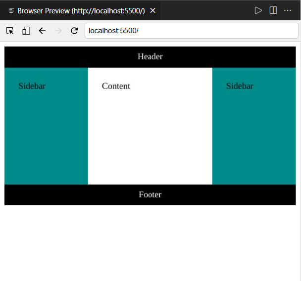

# Instructions - Create a Grid Layout

## Introduction

In this lab, you will create a common layout pattern known as the Holy Grail layout using CSS Grid. The Holy Grail Layout is a classic web design pattern featuring a header, footer, main content area, and two sidebars (left and right). It is widely used for creating structured and responsive layouts where the sidebars often house navigation or supplementary content, and the main content takes center stage. Historically challenging to implement, modern CSS Grid makes it easy to create this layout with minimal code, offering flexibility and precision in design.

## Goal

The goal of this lab is to design a grid layout using the `grid-template-areas` property.

## Objectives

- Add styling to the CSS file using the grid template area.
- Configure rules for different properties within the grid template to create a responsive layout.

## Instructions

The HTML code structure is already provided in the `index.html` file, and basic rules for layout areas are set in the CSS. Your task is to complete the styling for the `.container` class.

You will add two sets of rules for the `.container` class:

- Standard rules for default screen sizes.
- Media query rules for screens with a viewport width of at least 440 pixels.

### Part 1: Standard Rules for `.container` Class

1. Open the `styles.css` file present under the project folder. This is where you'll add all the CSS rules for the `.container` class.
2. Locate the `.container` class and add the following properties:
   - Set the container to display as a grid.

     ```css
     display: grid;
     ```

   - Set the maximum width of the container to 900 pixels.

     ```css
     max-width: 900px;
     ```

   - Set the minimum height to 50% of the viewport height.

     ```css
     min-height: 50vh;
     ```

   - Define a single-column layout that spans 100% of the container width.

     ```css
     grid-template-columns: 100%;
     ```

   - Create five rows, with the middle row taking up 1 fractional unit and the others set to auto.

     ```css
     grid-template-rows: auto auto 1fr auto auto;
     ```

   - Define the grid template areas for the rows, assigning areas for header, left, main, right, and footer.

     ```css
     grid-template-areas:
       "header"
       "left"
       "main"
       "right"
       "footer";
     ```

### Part 2: Media Query for `.container` Class

1. Inside the media query section, which activates for screens with a minimum width of 440 pixels, add the following properties to the `.container` class:
   - Define three columns: the left and right columns at 150 pixels each, with the middle column using 1 fractional unit to fill available space.

     ```css
     grid-template-columns: 150px 1fr 150px;
     ```

   - Define three rows: set the first and last rows to auto, and the middle row to 1 fractional unit.

     ```css
     grid-template-rows: auto 1fr auto;
     ```

   - Define a 3x3 grid layout with the following structure:
     - The first row contains only the header.
     - The second row contains left, main, and right.
     - The third row contains only the footer.

     ```css
     grid-template-areas:
       "header header header"
       "left main right"
       "footer footer footer";
     ```

2. After successfully modifying the `styles.css` file, navigate to File > Save to save changes in the file.

### Part 3: Preview Your Styled Page

1. Start the live server:
   - At the bottom-right of the editor, click on the Go Live button.
   - Once the server is up and running, you will see an exposed port number (e.g., 5500, 5501, and so forth). This means your server is now live.
2. Open the browser preview: at the middle-left of the editor, click on the Browser Preview button to open a new Browser Preview tab.
3. Enter the URL in the browser: in the browser, enter the following URL format (replacing `<exposed port>` with the actual port number shown in the editor): `http://localhost:<exposed port>`.
4. Verify your styles: check and verify that the webpage displays the updated styles. Resize the Browser Preview panel to see the layout transition at the 440px breakpoint.
5. Close the server after completing the lab: once you're done with the lab, make sure to close the server to free up the port:
   - Click on the exposed port number (e.g., 5500, 5501, and so forth) at the bottom-right of VSCode.
   - You should see a notification confirming that the server is now offline (stopped).

## Explanation of Changes

- Default rules for `.container`: configures the layout to use a single-column grid with specific row areas for small screens.
- Media query rules for `.container`: for screens 440px and wider, it switches to a 3-column grid layout with areas assigned for a more complex grid structure.



## Key Takeaways

- CSS grid layout allows precise control over webpage structure by defining rows, columns, and areas for content placement.
- Media queries enable responsive design by dynamically adjusting layouts based on viewport size, ensuring optimal display on various devices.
- Using properties like `grid-template-columns` and `grid-template-rows`, layouts can be customized to span specific widths and heights, providing flexibility.

## Final Step: Mark as Completed

Click the Mark as Completed button present below to mark the lab as Completed.