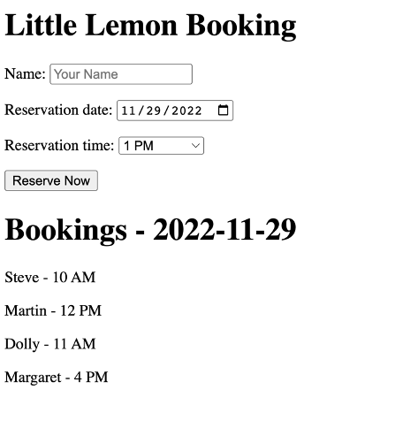
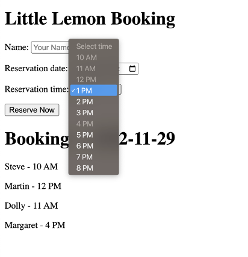
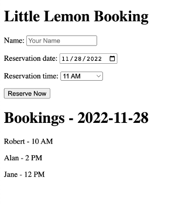

# Exercise: Display the Little Lemon available booking times

## Lab Assets

A basic Django project and app are provided (`littlelemon`, with an app called `restaurant`), managed with `uv`, along with an updated template and supporting files.

> Note: this lab uses its own starter code (including extra stylesheets/formatting), not a continuation of the project from part two -- use the provided files rather than the earlier lab's project.

### Objective

Implement changes to update the HTML form data using JavaScript.

## Introduction

Parts one and two of the final assessment connected a model and built a form to accept reservation details from an end user. This exercise uses JavaScript to:

- Create new bookings and refresh the current bookings list.
- Refresh bookings for a date whenever that date is changed.
- Dynamically process the available time slots.

### Initial Lab Instructions

This lab requires modifying:

- `views.py`
- `templates/book.html`

Starter code has already been added to:

- `settings.py`
- `forms.py`
- `models.py`
- `urls.py` (app-level and project-level)

Once set up, review the contents of all the files and follow the steps in order. The project `littlelemon` and app `restaurant` are already set up.

> Note: MySQL must already be installed locally, with the `root` user set up. To keep things simple, this lab starts with the `root` user's credentials (password `password` or blank -- press Enter for a blank password; the password won't be visible as it's typed).

This is part three of the final assessment: JavaScript functionality layered onto the view logic and booking template built in part two.

## Steps

### Step 1: Sync the project's dependencies

From the directory containing `manage.py`:

```bash
uv sync
```

`uv` reads `pyproject.toml`/`uv.lock`, installs Django and `mysqlclient`, and creates the project's `.venv` automatically -- every command below runs through `uv run`, so there's no separate activation step.

### Step 2: Review the supporting files

Check the code already in place across the supporting files -- there are a few changes since the end of part two.

### Step 3: Run the migrations

```bash
uv run python manage.py makemigrations
uv run python manage.py migrate
```

> Note: make sure the correct MySQL user has been created with the right privileges, and the database is configured to match (including the `root` password in `settings.py`, if using `root`) -- see the earlier labs for those steps. These migrations are a no-op here since the model hasn't changed since part two, but it's good practice to run them before starting on new code.

### Step 4: Add the `bookings()` API view

In `views.py`, below the `@csrf_exempt` decorator already in the file, add a `bookings(request)` view implementing:

- If `request.method == 'POST'`:
  - `data = json.load(request)`.
  - `exist = Booking.objects.filter(reservation_date=data['reservation_date']).filter(reservation_slot=data['reservation_slot']).exists()`.
  - If `not exist`: create a `Booking(first_name=data['first_name'], reservation_date=data['reservation_date'], reservation_slot=data['reservation_slot'])` and `.save()` it.
  - Otherwise: return `HttpResponse("{'error':1}", content_type='application/json')`.
- `date = request.GET.get('date', datetime.today().date())`.
- `bookings = Booking.objects.all().filter(reservation_date=date)`.
- `booking_json = serializers.serialize('json', bookings)`.
- Return `HttpResponse(booking_json, content_type='application/json')`.

> Note: the necessary imports and the app-level URL configuration for this view are already in place.

```python
@csrf_exempt
def bookings(request):
    if request.method == 'POST':
        data = json.load(request)
        exist = Booking.objects.filter(reservation_date=data['reservation_date']).filter(
            reservation_slot=data['reservation_slot']).exists()
        if not exist:
            booking = Booking(
                first_name=data['first_name'],
                reservation_date=data['reservation_date'],
                reservation_slot=data['reservation_slot'],
            )
            booking.save()
        else:
            return HttpResponse("{'error':1}", content_type='application/json')

    date = request.GET.get('date', datetime.today().date())
    bookings = Booking.objects.all().filter(reservation_date=date)
    booking_json = serializers.serialize('json', bookings)
    return HttpResponse(booking_json, content_type='application/json')
```

Save `views.py` and check for errors.

### Step 5: Complete `book.html`

Open `book.html` and look for three placeholder comments to replace: `<!-- Part 1 -->` and similar markers, described in the steps below.

#### Part 1: the reservation date field

Replicate the markup already used for the first name field, adapted for the reservation date:

```html
<p>
  <label for="reservation_date">Reservation date:</label>
  <input type="text" placeholder="Reservation Date" required="" id="reservation_date">
</p>
```

#### Part 2: refresh bookings when the date changes

Get the `reservation_date` element and attach a `change` listener that calls `getBookings()`:

```js
document.getElementById('reservation_date').addEventListener('change', function () { getBookings() })
```

#### Part 3: render the existing bookings for the selected date

Loop over the fetched `data`, logging each item's fields, collecting reserved slots, and building the bookings list markup:

```js
for (const item of data) {
  console.log(item.fields)
  reserved_slots.push(item.fields.reservation_slot)
  bookings += `<p>${item.fields.first_name} - ${formatTime(item.fields.reservation_slot)}</p>`
}
```

#### Part 4: build the time slot dropdown

Build the `<select>` options for the bookable hours, disabling any slot already reserved:

```js
let slot_options = '<option value="0" disabled>Select time</option>'
for (let i = 10; i < 20; i++) {
  const label = formatTime(i)
  if (reserved_slots.includes(i)) {
    slot_options += `<option value=${i} disabled>${label}</option>`
  } else {
    slot_options += `<option value=${i}>${label}</option>`
  }
}
```

Save `book.html` and make sure there are no visible errors.

### Step 6: Run the server

```bash
uv run python manage.py runserver
```

Visit the local URL and observe the page.

### Step 7: Create a reservation

Enter a name, then select a date and time to create a reservation. The page should look similar to:



### Step 8: Confirm the reservation was saved

After pressing "Reserve," the page updates with the new details -- note the previously selected time is no longer available for selection:



### Step 9: Change the date

Confirm the displayed content updates to match a newly selected date:



### Step 10: Verify in the database

Open the MySQL database and confirm the entries match the reservations made through the template.

## Conclusion

Part three of the final assessment used JavaScript to dynamically process available time slots and refresh bookings, including reloading the template's data when the date changes. This completes the Django final assessment: a reservation form backed by MySQL, with JavaScript handling dynamic updates.
