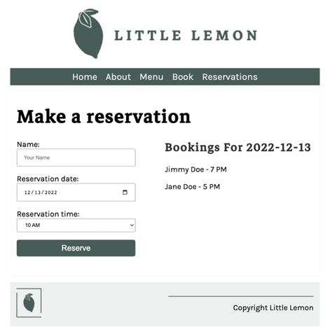
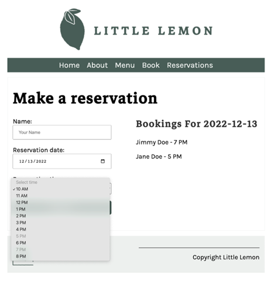
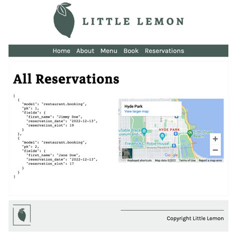
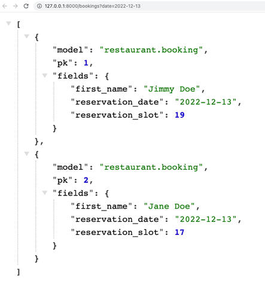

# Peer-graded Assignment: Little Lemon booking system

By working through the lessons in this course, you've learned the necessary skills and knowledge to develop the back end for the booking form on the Little Lemon website. You were provided with code snippets, and your task was to use these, plus any of your own code, to complete the full stack final assessment.

You will now take part in a peer review in which you will submit your completed final assessment for two of your peers to review. You will also be required to review two of your peers' projects.

Detailed criteria are covered in the grading criteria overview below.

## Grading Criteria

When you submit your assignment, other learners in the course will review and grade your work. These are the criteria they'll use to evaluate your submission.

- Is the app added to the installed apps list in the settings file?
- Is the database configuration updated inside the settings file?
- Were migrations performed?
- Are there three fields in the booking form: First name, Reservation date and Reservation slot?
- Does a date selector open up when you click on the reservation date field on the booking form?
- Are all the bookings available as JSON (JavaScript Object Notation) data on the reservations page?
- Is duplicate booking prohibited on a specific date if the time is already booked?
- Does changing the date refresh the booking data?
- Is a duplicate booking on a specific date and time unavailable if the slot is already booked?
- Can you display bookings for a specific date using the API (Application Programming Interface)?
- If there is no booking, does a No Booking message show for that date?
- Was fetch API used to retrieve data from the API?
- Is the current date automatically selected when you open the booking form?

## Example Submissions

Booking form with a list of current reservations.



Duplicate booking is not possible on the booking form. Note how the booked time slots are grey.



All reservations are available as JSON data on the reservations page.



All reservations for a specific date returned from the bookings API endpoint, for example `http://127.0.0.1:8080/bookings?date=2022-12-13`.



## How to create your submission

- You need to use `pipenv` to create the virtual environment and to manage the dependencies.
- You are required to use the Django project for your back end, MySQL as your database, and JavaScript to handle form components of the template.
  - HTML with supportive stylesheets are already added as part of the starter code.
  - You also received the code for a functional Little Lemon website as part of the Django project starter code.
- Name the project directory `littlelemon` and the app `restaurant`. Ensure that you follow this naming convention to make the reviewing process easier.
- You will be required to submit your updated Django project in a zipped folder.

> Important note: there may be variations in terms of the username and password set for the MySQL user depending on your peer's local machine. Be mindful that the MySQL database that you will be accessing is local to your machine.

## How to review

Once you have submitted your file, you are required to review two peer submissions. You can view the peers that you need to review in the "Peers to review" section. You need to download their zipped project folder and unzip it. Then, prepare the virtual environment and install all dependencies using the following commands.

```bash
cd <project directory>

pipenv shell

pipenv install

python manage.py makemigrations
python manage.py migrate

python manage.py runserver
```

Navigate to the Book page and Reservations page, and perform the form actions required to grade the assessment where required.
