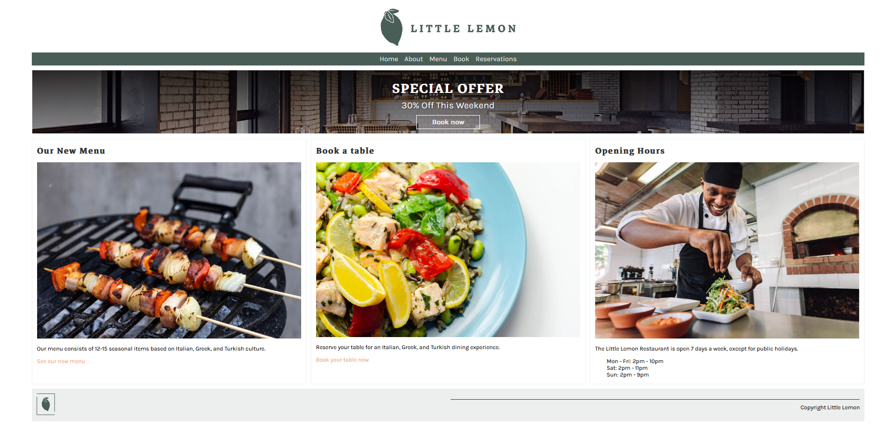
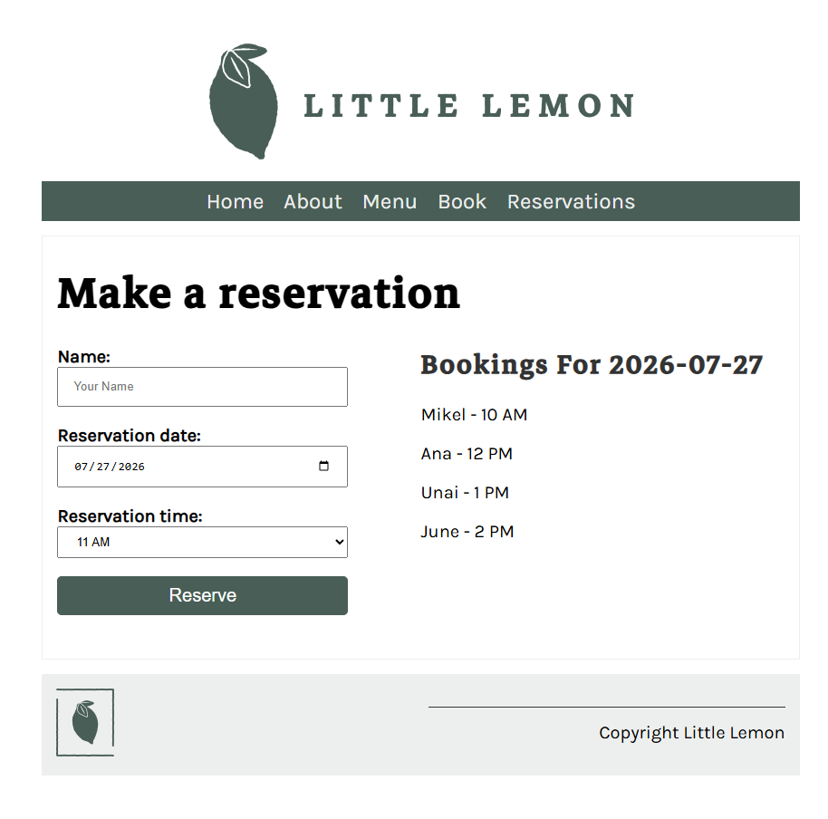
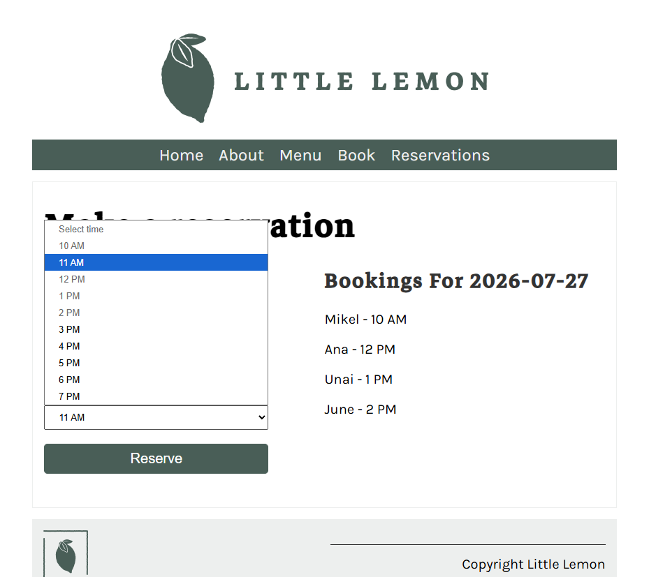
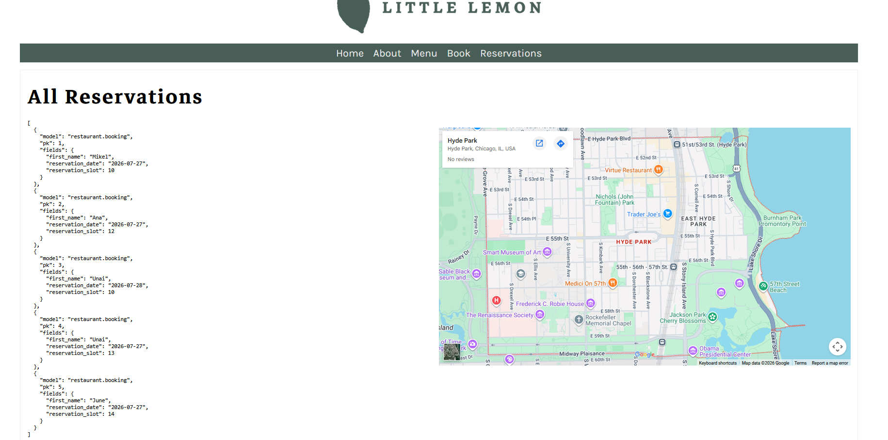
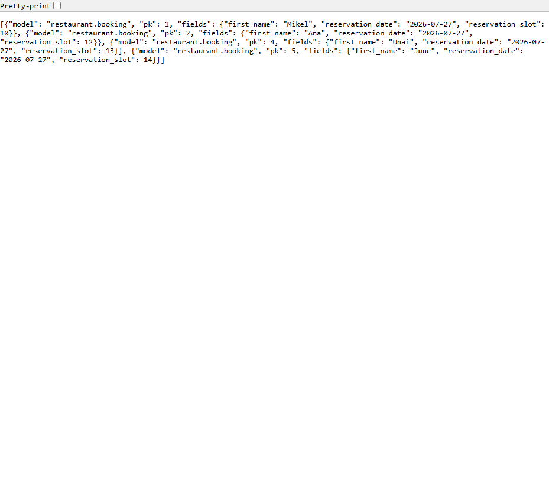
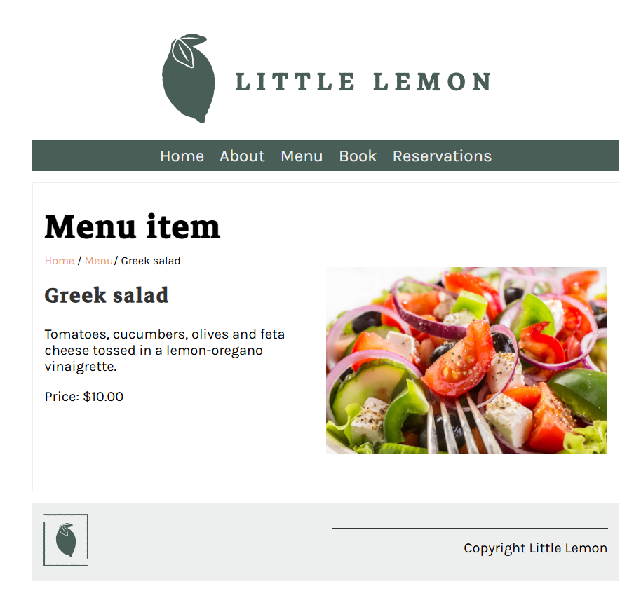

# Peer-graded Assignment: Little Lemon booking system

## Setup

Django project `littlelemon`, app `restaurant`, using MySQL as the database and `pipenv` for dependency management.

### Requirements

- Python 3.12 and `pipenv`.
- A running local MySQL server.

### 1. Configure credentials

Copy `.env.example` to `.env` and fill in your own MySQL credentials -- `.env` is git-ignored, so nothing real ever gets committed.

```bash
cp .env.example .env
```

```bash
# .env
MYSQL_ROOT_USER="root"
MYSQL_ADMIN_USER="admindjango"
MYSQL_ROOT_PASSWORD="<your MySQL root password>"
MYSQL_ADMIN_PASSWORD="<your admindjango password>"
```

### 2. Create the database and user

```sql
-- Create the MySQL database and user in the MySQL shell (mysql -u root -p),
-- with the password masked out -- substitute your own admindjango password from .env
CREATE DATABASE IF NOT EXISTS reservations;
CREATE USER IF NOT EXISTS 'admindjango'@'localhost' IDENTIFIED BY '***';
GRANT ALL ON *.* TO 'admindjango'@'localhost';
FLUSH PRIVILEGES;
exit
```

### 3. Install dependencies and run

```bash
pipenv install

pipenv run python manage.py makemigrations
pipenv run python manage.py migrate
pipenv run python manage.py runserver 8080
```

> Windows note: if plain `pipenv` isn't on your PATH, invoke everything above as `py -3.12 -m pipenv ...` instead (works the same, just doesn't rely on `pipenv.exe` being resolvable).

Once the server is running, visit `http://127.0.0.1:8080` and use the **Book** page to create a reservation -- the **Reservations** page then lists every booking as JSON.

`migrate` also seeds four menu items (Bruschetta, Greek salad, Grilled fish, Lemon dessert) via a data migration (`restaurant/migrations/0004_seed_menu_items.py`), so the **Menu** page isn't empty out of the box.

## Results

[http://127.0.0.1:8080](http://127.0.0.1:8080):



[http://127.0.0.1:8080/book](http://127.0.0.1:8080/book):



Duplicate booking is not possible on the booking form -- already-booked time slots are greyed out:



[http://127.0.0.1:8080/reservations](http://127.0.0.1:8080/reservations):



[http://127.0.0.1:8080/bookings?date=2026-07-27](http://127.0.0.1:8080/bookings?date=2026-07-27):



[http://127.0.0.1:8080/menu_item/2/](http://127.0.0.1:8080/menu_item/2/) (Greek salad, one of the seeded menu items):



