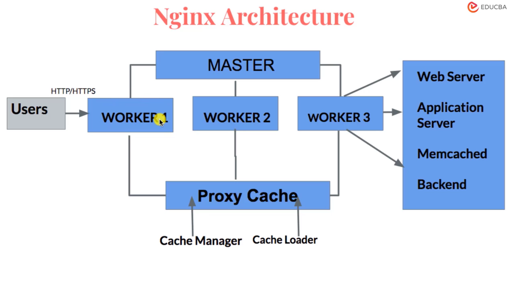

# Intoduction to Web-App Back-End Development

This is my guide for web-app backend development, based on selected courses from:
- the [Meta Back-End Developer Professional Certificate](https://www.coursera.org/programs/deutsche-telekom-learning-program-ddjuh/professional-certificates/meta-back-end-developer) specialization on Coursera
- and the [Backend Developer with Python](https://www.udacity.com/course/backend-developer-with-python--nd0044) nanodegree on Udacity.

From these specializations, I have selected the following topics/courses:

1. [Introduction to Back-End Development](https://www.coursera.org/programs/deutsche-telekom-learning-program-ddjuh/learn/introduction-to-back-end-development)
2. [Introduction to Databases for Back-End Development](https://www.coursera.org/programs/deutsche-telekom-learning-program-ddjuh/learn/intro-to-databases-back-end-development)
3. [Django Web Framework](https://www.coursera.org/programs/deutsche-telekom-learning-program-ddjuh/learn/django-web-framework?authProvider)
4. [APIs](https://www.coursera.org/programs/deutsche-telekom-learning-program-ddjuh/learn/apis)
5. [The Full Stack](https://www.coursera.org/programs/deutsche-telekom-learning-program-ddjuh/learn/the-full-stack?authProvider=deutschetelekom)
6. [Flask SQLAlchemy Data Modelling](https://www.udacity.com/course/sql-and-data-modeling-for-the-web--cd0046)
7. [Software Architecture Patterns](https://www.udacity.com/course/software-architecture-patterns--cd14601)
8. [Implement NGINX Web Servers and Reverse Proxy Solutions](https://www.coursera.org/learn/implement-nginx-web-servers-and-reverse-proxy-solutions)

This module deals with the eighth topic/course: **Implement NGINX Web Servers and Reverse Proxy Solutions**.

Table of Contents:

- [Intoduction to Web-App Back-End Development](#intoduction-to-web-app-back-end-development)
  - [1. Getting Statrted with NGINX Website Deployment](#1-getting-statrted-with-nginx-website-deployment)
    - [Introduction and Objectives](#introduction-and-objectives)
    - [NGINX Fundamentals through Demos](#nginx-fundamentals-through-demos)
      - [Demo Part 1a: Create an AWS EC2 Instance](#demo-part-1a-create-an-aws-ec2-instance)
        - [Preliminary setup](#preliminary-setup)
        - [Step 1: Sign in to AWS](#step-1-sign-in-to-aws)
        - [Step 2: Select an AWS region](#step-2-select-an-aws-region)
        - [Step 3: Open EC2](#step-3-open-ec2)
        - [Step 4: Give the instance a name](#step-4-give-the-instance-a-name)
        - [Step 5: Select the operating system image](#step-5-select-the-operating-system-image)
        - [Step 6: Select the instance type](#step-6-select-the-instance-type)
        - [Step 7: Create or select an EC2 key pair](#step-7-create-or-select-an-ec2-key-pair)
        - [Step 8: Configure network settings](#step-8-configure-network-settings)
        - [Step 9: Review storage](#step-9-review-storage)
        - [Step 10: Launch the instance](#step-10-launch-the-instance)
        - [Step 11: Find the public address](#step-11-find-the-public-address)
        - [Step 12: Connect using SSH](#step-12-connect-using-ssh)
        - [Optional: create an SSH config entry](#optional-create-an-ssh-config-entry)
        - [AWS access keys: do you need them?](#aws-access-keys-do-you-need-them)
        - [Cleanup](#cleanup)
      - [Demo Part 1b: Create an Azure VM Instance (extra)](#demo-part-1b-create-an-azure-vm-instance-extra)
        - [Step 1: Sign in to Azure](#step-1-sign-in-to-azure)
        - [Step 2: Understand the resource group](#step-2-understand-the-resource-group)
        - [Step 3: Start creating the VM](#step-3-start-creating-the-vm)
        - [Step 4: Configure the Basics tab](#step-4-configure-the-basics-tab)
        - [Step 5: Configure the administrator account](#step-5-configure-the-administrator-account)
        - [Step 6: Configure inbound ports](#step-6-configure-inbound-ports)
        - [Step 7: Configure disks](#step-7-configure-disks)
        - [Step 8: Configure networking](#step-8-configure-networking)
        - [Step 9: Review and create](#step-9-review-and-create)
        - [Step 10: Restrict SSH to your IP](#step-10-restrict-ssh-to-your-ip)
        - [Step 11: Find the public IP](#step-11-find-the-public-ip)
        - [Step 12: Connect using SSH](#step-12-connect-using-ssh-1)
        - [Azure API credentials: do you need them?](#azure-api-credentials-do-you-need-them)
        - [Cleanup](#cleanup-1)
      - [Demo Part 1c: Install and Launch NGINX](#demo-part-1c-install-and-launch-nginx)
        - [Step 1: Confirm the operating system](#step-1-confirm-the-operating-system)
        - [Step 2: Update the package index](#step-2-update-the-package-index)
        - [Step 3: Install NGINX](#step-3-install-nginx)
        - [Step 4: Check whether NGINX is running](#step-4-check-whether-nginx-is-running)
        - [Step 5: Inspect NGINX's UFW profiles](#step-5-inspect-nginxs-ufw-profiles)
        - [Step 6: Understand the two firewall layers](#step-6-understand-the-two-firewall-layers)
        - [Step 7: Configure UFW safely](#step-7-configure-ufw-safely)
        - [Step 8: Verify that NGINX is listening](#step-8-verify-that-nginx-is-listening)
        - [Step 9: Test NGINX from inside the VM](#step-9-test-nginx-from-inside-the-vm)
        - [Step 10: Test from your own computer](#step-10-test-from-your-own-computer)
        - [Step 11: Locate the default website files](#step-11-locate-the-default-website-files)
        - [Step 12: Locate the main configuration](#step-12-locate-the-main-configuration)
        - [Step 13: Validate configuration before reloading](#step-13-validate-configuration-before-reloading)
        - [Step 14: Inspect logs](#step-14-inspect-logs)
        - [Complete command sequence](#complete-command-sequence)
        - [Troubleshooting](#troubleshooting)
      - [Demo Part 2: NGINX Basic Configuration](#demo-part-2-nginx-basic-configuration)
      - [Demo Part 3: Create the Landing Page for the Demo Website](#demo-part-3-create-the-landing-page-for-the-demo-website)
      - [Demo Part 4: Deploy the Landing Page and Basic Management Commands](#demo-part-4-deploy-the-landing-page-and-basic-management-commands)
  - [2. Project Setup and Core NGINX Configuration](#2-project-setup-and-core-nginx-configuration)
    - [Reverse Proxy Introduction and Case Content](#reverse-proxy-introduction-and-case-content)
    - [Lab Preparation and Secure Server Access](#lab-preparation-and-secure-server-access)
    - [NGINX Configuration and Static Content Hosting](#nginx-configuration-and-static-content-hosting)
  - [3. Backend Integration and Reverse Proxy Implementation](#3-backend-integration-and-reverse-proxy-implementation)
    - [Backend Services Creation](#backend-services-creation)
    - [Virtual Hosting and Reverse Proxy Architecture](#virtual-hosting-and-reverse-proxy-architecture)
  - [4. Security, Load Balancing, and Performance Optimization](#4-security-load-balancing-and-performance-optimization)
    - [Access Control and SSL Security](#access-control-and-ssl-security)
    - [Advanced SSL and Load Balancing Strategies](#advanced-ssl-and-load-balancing-strategies)
    - [Monitoring, Optimization, and Project Wrap-Up](#monitoring-optimization-and-project-wrap-up)
  - [Extra: Notes on Gunicorn / Uvicorn](#extra-notes-on-gunicorn--uvicorn)
    - [Gunicorn](#gunicorn)
      - [Scaling Gunicorn with Nginx](#scaling-gunicorn-with-nginx)
    - [Uvicorn](#uvicorn)
    - [What to use: Gunicorn or Uvicorn?](#what-to-use-gunicorn-or-uvicorn)
  - [Extra: Caddy -- Alternative to NGINX](#extra-caddy----alternative-to-nginx)

## 1. Getting Statrted with NGINX Website Deployment

### Introduction and Objectives

- This tutorial covers deploying an already-built website (HTML, JavaScript, CSS) onto a production server using NGINX (pronounced "engine-x"), an open-source web server and reverse proxy, free on Linux.
- What a web server does: mediates HTTP (hypertext transfer protocol) requests/responses between users and a backend server (e.g. Google), handling many simultaneous, varied requests (images, music, etc.) efficiently and smoothly.
- NGINX architecture:
  - A master process handles privileged operations: reading configuration and binding to the website's allocated ports.
  - Worker processes (helpers) and a cache manager/cache loader handle the rest; the cache loader loads disk cache into memory, and the cache manager manages that disk cache.
  - It is event-driven: sockets listen for incoming events (HTTP requests); workers pick up events based on request type (GET, POST, etc.) and perform the read/write I/O (input/output) against the backend.
  - Goal: handle any volume of traffic efficiently via load balancing and efficient CPU/memory usage.
- NGINX benefits: efficient load balancing and concurrent-connection handling, large community/forum support, proven compatibility with common web applications, smoother and faster site performance, and reverse-proxy capability.
- Hands-on lab plan (5 steps): install NGINX, enable the firewall for NGINX, deploy the demo website, check the NGINX service status, and manage the NGINX process after deployment.



- Diagram walkthrough: users send HTTP/HTTPS requests, which the master routes to workers (Worker 1, 2, 3).
  - Worker 1 and the proxy cache exchange data directly, serving cached responses without hitting the backend.
  - Worker 2 feeds the proxy cache, which is populated and maintained by the cache manager and cache loader.
  - Worker 3 forwards requests onward to the backend resources: web server, application server, Memcached, and other backend services.
- NGINX workers vs. Django: the "workers" in the diagram are NGINX's own worker processes, not Django; each runs an event loop handling many connections concurrently (non-blocking I/O), accepting requests, serving static/cached content directly, and proxying the rest onward.
- Where Django runs: Django never runs inside NGINX. NGINX only serves static files and reverse-proxies dynamic requests to a separate WSGI/ASGI (web/asynchronous server gateway interface) server such as Gunicorn, uWSGI, or Daphne/Uvicorn, which is where Django actually executes. In the diagram, this is the "Application Server"/"Backend" box that Worker 3 forwards to.
- Multiple Django instances: whether several Django backends run is a deployment choice, at two independent levels.
  - Within one app server: Gunicorn/uWSGI can spawn multiple worker processes (like NGINX's own workers) from a single codebase and app-server instance.
  - Across app servers: separate app-server instances (different ports, containers, or machines) can each run their own Gunicorn+Django stack, with NGINX load-balancing across them via an `upstream` block (round-robin, least-connections, etc.) -- covered in the "Load Balancing" topic of section 4.

A typical Django setup looks like this:

```
Internet
   ↓
Nginx
   ↓
Gunicorn / Uvicorn
   ↓
Django
   ↓
PostgreSQL
```

With multiple Django/Gunicorn replicas (Nginx acts as the entry point and load-balances requests between them):

```
                  ┌─ Django/Gunicorn replica 1
Internet -> Nginx ├─ Django/Gunicorn replica 2
                  └─ Django/Gunicorn replica 3
```

See the section [Extra: Notes on Gunicorn / Uvicorn](#extra-notes-on-gunicorn--uvicorn) for more details on how Gunicorn and Uvicorn work with Django.

### NGINX Fundamentals through Demos

#### Demo Part 1a: Create an AWS EC2 Instance

Your notes can mix together three different types of credentials, which is a common source of confusion:

| Credential | Used for |
| --- | --- |
| Cloud-console login | Your AWS account (username, password, MFA) |
| SSH key pair | Logging in to the Linux VM |
| API access credentials | AWS CLI, SDKs, Terraform, scripts |

For this NGINX lab, you need **console access and an SSH key**. You do **not** need an AWS access-key ID and secret access key unless you intend to create the instance using the AWS CLI, Terraform, or an SDK.

##### Preliminary setup

Install an SSH client -- Linux and macOS normally include OpenSSH, and Windows 10/11 PowerShell usually includes it too:

```bash
ssh -V
```

Find your public IP address so you can restrict SSH to it instead of the whole internet: search "what is my IP" in a browser, or run:

```bash
curl -4 ifconfig.me
```

A single address is written as a CIDR (classless inter-domain routing) block with a `/32` suffix, e.g. `203.xxx.xxx.xxx/32` -- meaning "only this exact address." A residential IP can change; that's the first thing to check if SSH later stops connecting.

##### Step 1: Sign in to AWS

Open the AWS Management Console and sign in. For regular work, avoid the account's root user, which has unrestricted control; use or create an IAM (identity and access management) identity with only the permissions EC2 needs, with MFA (multi-factor authentication) enabled, and avoid creating permanent access keys unless you actually need CLI/API access.

##### Step 2: Select an AWS region

Pick one region at the top-right of the console and keep using it for the whole tutorial -- resources are region-scoped, so switching regions mid-tutorial makes an instance appear to vanish. For example:

```text
Europe (Frankfurt) — eu-central-1
```

##### Step 3: Open EC2

Search for **EC2**, then select:

```text
Instances -> Launch instances
```

EC2 (Elastic Compute Cloud) provides virtual machines -- called instances -- on AWS infrastructure.

##### Step 4: Give the instance a name

```text
nginx-tutorial
```

This is stored as an AWS tag; it helps identify the instance but does not become the Linux hostname or public domain name automatically.

##### Step 5: Select the operating system image

Under **Application and OS Images**, select a current LTS (long-term support) Ubuntu release published by Canonical:

```text
Ubuntu Server 24.04 LTS
```

Confirm the architecture (x86-64 vs. Arm). The original demo's Ubuntu 18.04 image is past standard support and should not be used for a new deployment.

##### Step 6: Select the instance type

A small instance is sufficient for this lab:

```text
t3.micro
```

Be careful with `t4g.micro`: it's an Arm processor. NGINX works fine on Arm, but later tutorial software may expect x86-64. Review the price shown in the console -- Free Tier eligibility depends on account, region, instance type, and disk configuration.

##### Step 7: Create or select an EC2 key pair

This is the SSH key pair for the VM -- **not** an AWS API access key. Suggested configuration:

```text
Key pair name: nginx-tutorial-key
Key pair type: ED25519
Private key format: .pem
```

AWS stores the public key and gives you the private key once; protect it. Move it to a safe directory and lock down its permissions:

```bash
mkdir -p ~/.ssh
mv ~/Downloads/nginx-tutorial-key.pem ~/.ssh/
chmod 600 ~/.ssh/nginx-tutorial-key.pem
```

On Windows PowerShell:

```powershell
New-Item -ItemType Directory -Force "$HOME\.ssh"
Move-Item "$HOME\Downloads\nginx-tutorial-key.pem" "$HOME\.ssh\"
icacls "$HOME\.ssh\nginx-tutorial-key.pem" /inheritance:r
icacls "$HOME\.ssh\nginx-tutorial-key.pem" /grant:r "$($env:USERNAME):(R)"
```

Never email the private key, commit it to git, bake it into a Docker image, or paste it into source code.

##### Step 8: Configure network settings

Create a security group (AWS's instance-level virtual firewall), e.g. `nginx-tutorial-sg`, with these inbound rules:

| Type | Protocol | Port | Source | Description |
| --- | --- | --- | --- | --- |
| SSH | TCP | 22 | My IP (your `/32`) | SSH from my computer |
| HTTP | TCP | 80 | Anywhere-IPv4 (`0.0.0.0/0`) | Public NGINX HTTP |
| HTTPS (optional) | TCP | 443 | Anywhere-IPv4 (`0.0.0.0/0`) | For later TLS work |

Do not open SSH to `0.0.0.0/0` -- that exposes port 22 to the entire internet. HTTP does need to be public for this exercise; add `::/0` too if the instance/VPC (virtual private cloud) uses IPv6.

##### Step 9: Review storage

The root volume is normally an EBS (elastic block store) volume; the default size is more than enough:

```text
8–16 GiB
```

Check the volume type/size, whether it's deleted on instance termination, and whether encryption is enabled. For a disposable tutorial instance, deleting the root volume on termination is normally appropriate.

##### Step 10: Launch the instance

Review the summary, select **Launch instance**, then **View all instances**, and wait for:

```text
Instance state: Running
Status checks: 2/2 checks passed
```

##### Step 11: Find the public address

Select the instance and note:

```text
Public IPv4 address
Public IPv4 DNS
```

The address can change after stopping/starting the instance unless you assign an Elastic IP; a reboot alone does not change it.

##### Step 12: Connect using SSH

The default username for the official Ubuntu AWS image is `ubuntu`:

```bash
ssh -i ~/.ssh/nginx-tutorial-key.pem ubuntu@<public-ip-or-dns>
```

The first connection asks you to trust the server fingerprint (`yes`); SSH then records it in `~/.ssh/known_hosts`.

##### Optional: create an SSH config entry

```sshconfig
Host aws-nginx
    HostName <public-ip>
    User ubuntu
    IdentityFile ~/.ssh/nginx-tutorial-key.pem
```

```bash
ssh aws-nginx
```

##### AWS access keys: do you need them?

Not for the console-based tutorial above. An access key (`AWS_ACCESS_KEY_ID` / `AWS_SECRET_ACCESS_KEY`) authenticates API/CLI requests, not an SSH session:

| Credential | Used for |
| --- | --- |
| AWS username, password, and MFA | AWS web console |
| EC2 `.pem` private key | SSH into Ubuntu |
| AWS access-key ID and secret | AWS CLI, SDK, or API |

Prefer temporary credentials (SSO/roles) over long-lived IAM access keys:

```bash
aws --version
aws configure sso
aws sts get-caller-identity
```

Only create a permanent access key when a tool explicitly requires it (IAM -> Users -> your user -> Security credentials -> Access keys -> Create access key), then:

```bash
aws configure
```

Credentials are stored in `~/.aws/credentials`, config in `~/.aws/config`. Never embed access keys in application source; for software running **inside EC2**, attach an IAM role to the instance instead.

##### Cleanup

```text
EC2 -> Instances -> select instance -> Instance state -> Terminate instance
```

Also check for leftover Elastic IPs, extra EBS volumes, snapshots, or load balancers that keep incurring cost.

#### Demo Part 1b: Create an Azure VM Instance (extra)

Azure uses different terminology, but the architecture is similar:

| AWS | Azure |
| --- | --- |
| EC2 instance | Virtual machine |
| Security group | Network Security Group (NSG) |
| VPC | Virtual Network |
| EBS volume | Managed disk |
| AWS region | Azure region |
| EC2 key pair | SSH key resource or supplied public key |

##### Step 1: Sign in to Azure

Open the Azure portal and sign in with a subscription that has permission to create resources.

##### Step 2: Understand the resource group

Azure places resources inside a resource group, e.g.:

```text
rg-nginx-tutorial
```

The VM, network interface, virtual network, NSG, public IP, and disk can all belong to this group -- so deleting the whole resource group later removes every tutorial resource at once.

##### Step 3: Start creating the VM

```text
Virtual machines -> Create -> Azure virtual machine
```

##### Step 4: Configure the Basics tab

- **Subscription**: the one that should be billed.
- **Resource group**: create new, e.g. `rg-nginx-tutorial`.
- **Virtual machine name**: e.g. `vm-nginx-tutorial`.
- **Region**: a nearby region where the desired size is available, e.g. Spain Central, West Europe, France Central, Germany West Central.
- **Availability options**: "No infrastructure redundancy required" is fine for a one-VM lab.
- **Security type**: use the portal default unless your course requires otherwise.
- **Image**: a current Ubuntu LTS release, e.g. `Ubuntu Server 24.04 LTS`.
- **Architecture**: `x64`, unless you deliberately want Arm.
- **Size**: a small general-purpose VM, e.g. `Standard_B1s` or `Standard_B2s` -- always check the estimated monthly cost.

##### Step 5: Configure the administrator account

```text
Authentication type: SSH public key
```

SSH keys are more secure than password-only auth and are the recommended method for Azure Linux VMs. Choose a username, e.g. `azureuser` (unlike AWS's fixed `ubuntu` user, Azure lets you pick it).

Option A -- generate a new key pair in Azure:

```text
SSH public key source: Generate new key pair
Key pair name: nginx-azure-key
```

Azure offers the private key for download when deployment starts; store and restrict it:

```bash
chmod 600 ~/.ssh/nginx-azure-key.pem
```

Option B -- use your existing SSH public key (often cleaner, since you control the key pair locally):

```bash
ssh-keygen -t ed25519 -f ~/.ssh/id_azure_nginx -C "azure-nginx-tutorial"
cat ~/.ssh/id_azure_nginx.pub
```

On Windows PowerShell:

```powershell
Get-Content "$HOME\.ssh\id_azure_nginx.pub"
```

Copy the full public-key line (starting with `ssh-ed25519 ...`) and paste it under:

```text
SSH public key source: Use existing public key
```

Never paste the private key.

##### Step 6: Configure inbound ports

```text
Allow selected ports: SSH (22), HTTP (80)
```

This creates NSG rules for that traffic; the SSH rule is tightened to your own IP in Step 10.

##### Step 7: Configure disks

The default OS disk is normally sufficient (small standard or premium SSD); no separate data disk is needed for this exercise.

##### Step 8: Configure networking

Azure normally creates a virtual network, a subnet, a public IP, a network interface, and an NSG (network security group, containing rules that allow or deny traffic) -- the generated defaults are fine for a tutorial. Check:

```text
Public IP: Enabled
NIC network security group: Basic or Advanced
```

##### Step 9: Review and create

```text
Review + create -> Create
```

Download the private key if Azure generated one, then wait for **Your deployment is complete** and select **Go to resource**.

##### Step 10: Restrict SSH to your IP

```text
VM -> Networking -> Network settings -> Inbound port rules
```

Find the SSH rule and change its source:

```text
Source: IP Addresses
Source IP addresses/CIDR ranges: 203.0.113.24/32
Destination port: 22
Protocol: TCP
Action: Allow
```

Look up your own IP the same way as for AWS (browser search or `curl -4 ifconfig.me`). Keep the HTTP rule's source as `Any` so the site stays publicly reachable.

##### Step 11: Find the public IP

On the VM overview page, copy the **Public IP address**.

##### Step 12: Connect using SSH

```bash
# using a locally generated key
ssh -i ~/.ssh/id_azure_nginx azureuser@<public-ip>

# using a key downloaded from Azure
ssh -i ~/.ssh/nginx-azure-key.pem azureuser@<public-ip>
```

```sshconfig
Host azure-nginx
    HostName <public-ip>
    User azureuser
    IdentityFile ~/.ssh/id_azure_nginx
```

```bash
ssh azure-nginx
```

##### Azure API credentials: do you need them?

Not for portal-based VM creation. For interactive CLI use:

```bash
az login
az account show
az account list --output table
az account set --subscription "<subscription-name-or-id>"
```

For scripts and automation, Azure commonly uses managed identities, service principals, or workload identity federation; for software running inside an Azure VM, prefer a managed identity over storing a client secret on disk.

##### Cleanup

```text
Resource groups -> rg-nginx-tutorial -> Delete resource group
```

This removes the VM and every related resource contained in that group.

#### Demo Part 1c: Install and Launch NGINX

These steps are effectively identical on the AWS and Azure Ubuntu machines. First, connect over SSH:

```bash
ssh aws-nginx
# or
ssh azure-nginx
```

##### Step 1: Confirm the operating system

```bash
cat /etc/os-release
uname -a
```

You should see Ubuntu and its version, plus kernel/architecture info.

##### Step 2: Update the package index

```bash
sudo apt update
```

`apt` is Ubuntu's package-management tool; `update` downloads the current package indexes but does not itself upgrade installed packages. `apt upgrade` is the separate step that installs newer versions of what's already installed:

```bash
sudo apt upgrade -y
```

`apt update` is required before installation; for production, review upgrades rather than blindly applying every package change.

##### Step 3: Install NGINX

```bash
sudo apt install nginx -y
```

- `sudo`: run with administrator privileges.
- `apt install`: install a package.
- `nginx`: the package name.
- `-y`: auto-answer yes to the confirmation prompt.

This installs the NGINX binaries, creates its configuration directories, installs a `systemd` service, starts/enables it, and registers UFW (uncomplicated firewall) application profiles.

##### Step 4: Check whether NGINX is running

```bash
sudo systemctl status nginx    # look for: Active: active (running); press q to exit
sudo systemctl is-enabled nginx    # expected: enabled
```

The older `sudo service nginx status` still works, but `systemctl` is the more direct interface to `systemd`. Other useful commands:

```bash
sudo systemctl start nginx
sudo systemctl stop nginx
sudo systemctl restart nginx
sudo systemctl reload nginx
sudo systemctl enable nginx
sudo systemctl disable nginx
```

| Command | Meaning |
| --- | --- |
| `start` | start a stopped service |
| `stop` | stop it |
| `restart` | stop and start it |
| `reload` | reread configuration without a full restart |
| `enable` | start automatically on boot |
| `disable` | do not start automatically on boot |

##### Step 5: Inspect NGINX's UFW profiles

```bash
sudo ufw app list
sudo ufw app info 'Nginx HTTP'
```

| Profile | Ports |
| --- | --- |
| `Nginx HTTP` | TCP 80 |
| `Nginx HTTPS` | TCP 443 |
| `Nginx Full` | TCP 80 and 443 |
| `OpenSSH` | TCP 22 |

##### Step 6: Understand the two firewall layers

```text
Internet
   ↓
AWS Security Group / Azure NSG
   ↓
Ubuntu UFW firewall
   ↓
NGINX
```

Both layers must allow the traffic -- if AWS permits port 80 but UFW blocks it (or vice versa), the site stays unreachable.

##### Step 7: Configure UFW safely

Allow SSH *before* enabling UFW, or you could lock yourself out:

```bash
sudo ufw allow OpenSSH
sudo ufw allow 'Nginx HTTP'
sudo ufw enable    # confirm with "y" -- may disrupt existing SSH connections
sudo ufw status verbose
```

Expected output resembles:

```text
Status: active

To                         Action      From
--                         ------      ----
OpenSSH                    ALLOW       Anywhere
Nginx HTTP                 ALLOW       Anywhere
```

UFW ships disabled by default on many Ubuntu installations, so `sudo ufw allow 'Nginx HTTP'` alone creates a rule without activating the firewall -- check `sudo ufw status` and explicitly `sudo ufw enable` after permitting SSH.

##### Step 8: Verify that NGINX is listening

```bash
sudo ss -ltnp | grep ':80'
```

Look for a line containing `LISTEN ... 0.0.0.0:80 ...` (and possibly `[::]:80`), confirming a process is listening locally on port 80.

##### Step 9: Test NGINX from inside the VM

```bash
curl -I http://localhost
```

Expected response:

```text
HTTP/1.1 200 OK
Server: nginx
```

This proves NGINX is running, listening on port 80, and reachable locally -- it does **not** prove the cloud firewall is correctly configured.

##### Step 10: Test from your own computer

Visit `http://<public-ip>` in a browser -- you should see **Welcome to nginx!** -- or test from your terminal:

```bash
curl -I http://<public-ip>
```

##### Step 11: Locate the default website files

```bash
ls -la /var/www/html
cat /var/www/html/index.nginx-debian.html
```

Replace the default page with a simple custom one:

```bash
sudo tee /var/www/html/index.html > /dev/null <<'EOF'
<!doctype html>
<html lang="en">
<head>
    <meta charset="utf-8">
    <title>NGINX tutorial</title>
</head>
<body>
    <h1>NGINX is working</h1>
    <p>This page is being served from my Ubuntu VM.</p>
</body>
</html>
EOF
```

Depending on NGINX's default index ordering, you may need to rename the original page so your new `index.html` takes priority:

```bash
sudo mv /var/www/html/index.nginx-debian.html /var/www/html/index.nginx-debian.html.backup
```

##### Step 12: Locate the main configuration

```text
/etc/nginx/nginx.conf
/etc/nginx/sites-available/
/etc/nginx/sites-enabled/
/var/log/nginx/access.log
/var/log/nginx/error.log
/var/www/html/
```

`nginx.conf` holds global configuration; `sites-available` holds potential site configs; `sites-enabled` holds symlinks to the active ones (see [Demo Part 2](#demo-part-2-nginx-basic-configuration) for the full walkthrough).

```bash
sudo less /etc/nginx/sites-available/default
```

##### Step 13: Validate configuration before reloading

```bash
sudo nginx -t
```

A valid result reads `syntax is ok` / `test is successful`. Only then reload -- chaining the two makes the reload conditional on a passing test:

```bash
sudo nginx -t && sudo systemctl reload nginx
```

##### Step 14: Inspect logs

```bash
sudo tail -f /var/log/nginx/access.log    # reload the page in your browser to see a request appear
sudo tail -f /var/log/nginx/error.log
```

Stop following with `Ctrl+C`. These logs are the first place to check for `403`, `404`, `502`, connection resets, or configuration errors.

##### Complete command sequence

```bash
cat /etc/os-release

sudo apt update
sudo apt install nginx -y

sudo systemctl status nginx
sudo systemctl is-enabled nginx

sudo ufw app list
sudo ufw allow OpenSSH
sudo ufw allow 'Nginx HTTP'
sudo ufw enable
sudo ufw status verbose

sudo nginx -t
sudo ss -ltnp | grep ':80'

curl -I http://localhost
```

```bash
# from your local computer
curl -I http://<public-ip>
```

##### Troubleshooting

**SSH times out** -- typically a firewall/network problem, not a bad key: missing port 22 rule, wrong source IP, no public IP, stopped VM, blocked outbound SSH, or UFW not permitting `OpenSSH`.

**`Permission denied (publickey)`** -- wrong private key, wrong username (`ubuntu` on AWS, your chosen admin user on Azure), the matching public key wasn't installed, key-file permissions too open, or a different key pair was selected at launch.

**Browser times out** -- check every layer:

```bash
sudo systemctl status nginx
sudo ss -ltnp | grep ':80'
sudo ufw status
curl -I http://localhost
```

Then verify the AWS security group/Azure NSG allows TCP 80 from the internet.

**Browser says "connection refused"** -- the host was reached but nothing is listening on that port:

```bash
sudo systemctl status nginx
sudo journalctl -u nginx --since "10 minutes ago"
```

**`nginx: configuration file test failed`** -- run `sudo nginx -t`, read the reported file/line, and fix it before reloading.

**Public IP changed** -- AWS/Azure dynamic public IPs can change under some lifecycle operations; for a persistent server use an AWS Elastic IP or an Azure static public IP. For the tutorial, just update your SSH config with the new address.

#### Demo Part 2: NGINX Basic Configuration

- Case study recap: a startup has a new website ready and wants it deployed with NGINX; Part 1 installed NGINX and opened the firewall, this lab explores NGINX's configuration layout and then scaffolds a placeholder site to deploy next.
- Key locations to know for managing and debugging a site:
  - `/var/www/html` -- the default web root holding the built-in "Welcome to nginx!" page served out of the box.
  - `/etc/nginx` -- the main configuration directory:
    - `sites-available/` stores one server-block config file per site you might host.
    - `sites-enabled/` holds only the sites NGINX actually serves; a config in `sites-available` takes effect only once it's symlinked into `sites-enabled`. Each server block sets what port to listen on, the server (domain) name, the site's root folder, and its default index file.
    - `nginx.conf` is the global config file -- edits here affect the whole server, not a single site.
  - `/var/log/nginx` -- holds `access.log` (every incoming request) and `error.log` (server errors), the first places to check when debugging a deployment.
- Demo site scaffold: create a placeholder site (`demo.com`) matching the case study, to be wired up and deployed in the next lab.
  - Create the site's web root, using `-p` to create parent directories as needed (the narrated `-b` flag doesn't exist for `mkdir`).
  - Recursively hand ownership of that folder to the current user so it can be edited without `sudo`.

```bash
sudo mkdir -p /var/www/demo.com/html
sudo chown -R $USER:$USER /var/www/demo.com/html
```

#### Demo Part 3: Create the Landing Page for the Demo Website

- Set the site folder's permissions with `chmod` (not `chown`, which only changes ownership): `755` grants the owner read/write/execute, and group/others read/execute, so NGINX can traverse and serve the folder.
- Create the landing page with `vim`, opening `index.html` directly inside the demo site's web root.
- The page content is intentionally minimal (see below).
- Recap of what this tutorial covered before deployment: the default `/var/www/html` landing page, the `/etc/nginx` `sites-available`/`sites-enabled` folders, the global `nginx.conf`, the `access.log`/`error.log` files in `/var/log/nginx`, and now the demo site's own folder, ownership, and `index.html` landing page. The site is ready; the next lab wires it up via NGINX configuration.

```bash
sudo chmod -R 755 /var/www/demo.com
sudo vim /var/www/demo.com/html/index.html
```

```html
<!DOCTYPE html>
<html>
<head>
    <title>Welcome to Demo Site</title>
</head>
<body>
    <h1>Congratulations! You have just hosted a website using the Nginx web server.</h1>
</body>
</html>
```

#### Demo Part 4: Deploy the Landing Page and Basic Management Commands

- Goal: wire up the `demo.com` site (created in Part 3, at `/var/www/demo.com/html/index.html`) through NGINX configuration, then reload and verify it.
- Create a server block for the site, based on the existing default one:
  - Copy `/etc/nginx/sites-available/default` to a new file, `/etc/nginx/sites-available/demo.com`, then edit it with `sudo` (editing under `/etc/nginx` requires root).
  - Keep `listen 80;`, drop the default `server_name`, and set `root` to the site's web root, `server_name` to the site's domain, and `index` to `index.html`.
- Enable the site by symlinking it from `sites-available` into `sites-enabled` (only files present there are actually served), then confirm the symlink exists.
- Avoid a "hash bucket" error from added server names: edit `/etc/nginx/nginx.conf` and uncomment the `server_names_hash_bucket_size` directive, which ships commented out by default.
- Validate the configuration syntax, then reload NGINX so the change takes effect; refresh the site in a browser to confirm the landing page now loads.
- Basic service management commands: stop, restart, and enable/disable NGINX's automatic start on boot.

```bash
sudo cp /etc/nginx/sites-available/default /etc/nginx/sites-available/demo.com
sudo vim /etc/nginx/sites-available/demo.com
```

```nginx
# /etc/nginx/sites-available/demo.com
server {
    listen 80;
    root /var/www/demo.com/html;
    index index.html;
    server_name demo.ubuntu.com;

    location / {
        try_files $uri $uri/ =404;
    }
}
```

```bash
sudo ln -s /etc/nginx/sites-available/demo.com /etc/nginx/sites-enabled/
ls -l /etc/nginx/sites-enabled/

sudo vim /etc/nginx/nginx.conf
# uncomment: server_names_hash_bucket_size 64;

sudo nginx -t
sudo systemctl restart nginx

# management commands
sudo systemctl stop nginx
sudo systemctl disable nginx   # don't start automatically on boot
sudo systemctl enable nginx    # start automatically on boot

# watch requests arrive live
tail -f /var/log/nginx/access.log
```

## 2. Project Setup and Core NGINX Configuration

### Reverse Proxy Introduction and Case Content

### Lab Preparation and Secure Server Access

### NGINX Configuration and Static Content Hosting

## 3. Backend Integration and Reverse Proxy Implementation

### Backend Services Creation

### Virtual Hosting and Reverse Proxy Architecture

## 4. Security, Load Balancing, and Performance Optimization

### Access Control and SSL Security

### Advanced SSL and Load Balancing Strategies

### Monitoring, Optimization, and Project Wrap-Up

## Extra: Notes on Gunicorn / Uvicorn

**Gunicorn and Uvicorn run the Python web application.** Nginx does not execute Django or FastAPI code itself. The request flow is typically:

```text
Browser -> Nginx -> Gunicorn/Uvicorn -> Django/FastAPI
```

### Gunicorn

**Gunicorn** is mainly a **WSGI application server**: It is a standard interface that connects a Python web server such as Gunicorn with a Python web framework such as Django:

- WSGI: Web Server Gateway Interface
- It starts several Python worker processes and sends HTTP requests to your Django application.
- It is a common choice for traditional Django applications.
- Gunicorn receives the HTTP request, converts it into the WSGI format, and calls Django. Django returns a WSGI response, and Gunicorn converts it back into an HTTP response.

Here's how to run Gunicorn with 3 workers:

```bash
# Each worker has a complete Django backend running
# This requires having all the data in an external DB (SQL, S3, etc), no in-memory data
gunicorn myproject.wsgi:application --workers 3
```

Here's what `myproject/wsgi.py` could contain:

```python
import os
from django.core.wsgi import get_wsgi_application

os.environ.setdefault("DJANGO_SETTINGS_MODULE", "myproject.settings")

# myproject.wsgi: Python module
# application: WSGI application object inside that module
application = get_wsgi_application()
```

We can scale up/down the number of workers online, without the need to restart the server:

```bash
# Get the Guinicorn master process PID
pgrep -f "gunicorn.*myproject.wsgi"

# Scale up/down
kill -TTIN <master_pid>  # add one worker
kill -TTOU <master_pid>  # remove one worker

# Reload the configuration gracefully
kill -HUP <master_pid>
```

#### Scaling Gunicorn with Nginx

- Besides adding more workers inside one Gunicorn process (vertical scaling on a single machine), we can run several separate Gunicorn/Django replicas -- each its own container or pod -- and have Nginx load-balance across them (horizontal scaling); this also adds redundancy if one replica crashes or is being redeployed.

```
                  ┌─ Django/Gunicorn replica 1
Internet -> Nginx ├─ Django/Gunicorn replica 2
                  └─ Django/Gunicorn replica 3
```

- Nginx side: define an `upstream` group listing each replica's address, then point `proxy_pass` at that group; Nginx distributes requests round-robin by default (other options: `least_conn`, `ip_hash`, weighted, etc.).

```nginx
upstream django_app {
    server app1:8000;
    server app2:8000;
    server app3:8000;
}

server {
    listen 80;
    server_name example.com;

    location / {
        proxy_pass http://django_app;
        proxy_set_header Host $host;
        proxy_set_header X-Real-IP $remote_addr;
    }
}
```

- Docker Compose: scale the Gunicorn service to multiple containers with `--scale`; since replicas share one service name, point Nginx's `upstream` at that service name instead of individual container names -- Docker's embedded DNS resolves it to all healthy replicas.

```bash
docker compose up --scale web=3 -d
```

```yaml
# docker-compose.yml (excerpt)
services:
  web:
    build: .
    command: gunicorn myproject.wsgi:application --bind 0.0.0.0:8000
    expose:
      - "8000"
  nginx:
    image: nginx:latest
    volumes:
      - ./nginx.conf:/etc/nginx/conf.d/default.conf
    ports:
      - "80:80"
    depends_on:
      - web
```

```nginx
# nginx.conf (excerpt) -- "web" resolves to all scaled replicas via Docker's embedded DNS
upstream django_app {
    server web:8000;
}
```

- Kubernetes: set `replicas` on the Gunicorn/Django `Deployment` and put a `Service` in front of it; the Service load-balances across all matching pods automatically, so Nginx (or an Nginx Ingress controller) only needs to point at the Service, not at individual pods. A `HorizontalPodAutoscaler` can adjust `replicas` automatically based on load.

```yaml
apiVersion: apps/v1
kind: Deployment
metadata:
  name: django-gunicorn
spec:
  replicas: 3
  selector:
    matchLabels:
      app: django-gunicorn
  template:
    metadata:
      labels:
        app: django-gunicorn
    spec:
      containers:
        - name: gunicorn
          image: myproject:latest
          command: ["gunicorn", "myproject.wsgi:application", "--bind", "0.0.0.0:8000"]
          ports:
            - containerPort: 8000
---
apiVersion: v1
kind: Service
metadata:
  name: django-gunicorn-svc
spec:
  selector:
    app: django-gunicorn
  ports:
    - port: 8000
      targetPort: 8000
```

```bash
kubectl scale deployment django-gunicorn --replicas=5
kubectl autoscale deployment django-gunicorn --cpu-percent=70 --min=3 --max=10
```


### Uvicorn

**Uvicorn** is an **ASGI server** (Asynchronous Server Gateway Interface). It supports asynchronous features such as:

* WebSockets: A WebSocket creates a persistent, bidirectional connection; examples include chat apps, live notifications, and real-time dashboards.
* Long-lived connections: Some requests remain open for seconds, minutes, or longer; examples include streaming data, server-sent events, and long-polling.
* Async Django views: usually Django views are synchronous, but Django supports async views that can wait for I/O operations.
* FastAPI and Starlette: These frameworks are built on ASGI and support async features natively; examples include real-time APIs, many simultaneous network requests, etc.

```bash
uvicorn myproject.asgi:application --host 0.0.0.0 --port 8000
```

Gunicorn or Uvicorn can receive HTTP traffic directly, but Nginx is usually placed in front because it is better at:

* HTTPS certificates
* Serving static and media files
* Handling slow clients
* Compression
* Request-size limits
* Reverse proxying
* Load balancing

### What to use: Gunicorn or Uvicorn?

A production Django setup might be:

```text
Internet
   ↓
Nginx :443
   ↓
Gunicorn :8000
   ↓
Django
```

For a normal Django app, **Gunicorn is usually enough**. For WebSockets or substantial async functionality, use **Uvicorn**, often directly or through Gunicorn with Uvicorn workers:

```bash
gunicorn myproject.asgi:application \
  -k uvicorn.workers.UvicornWorker \
  --workers 3
```

## Extra: Caddy -- Alternative to NGINX


