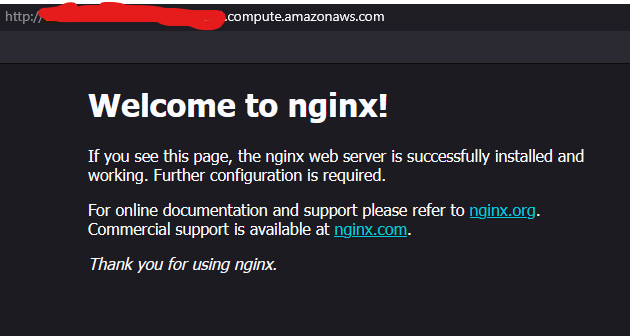
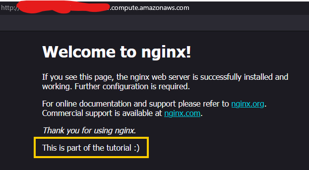
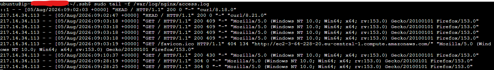
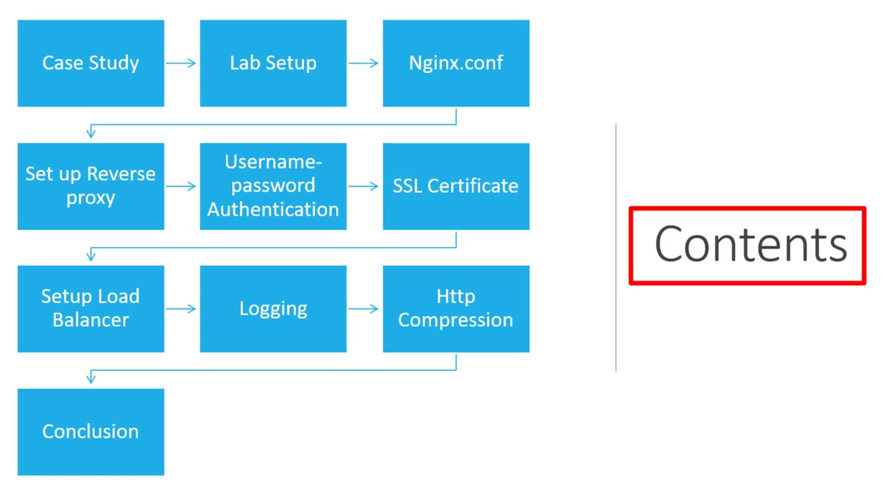
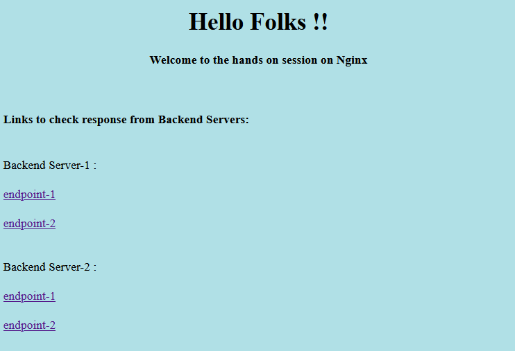

# Intoduction to Web-App Back-End Development

This is my guide for web-app backend development, based on selected courses from:
- the [Meta Back-End Developer Professional Certificate](https://www.coursera.org/programs/deutsche-telekom-learning-program-ddjuh/professional-certificates/meta-back-end-developer) specialization on Coursera
- and the [Backend Developer with Python](https://www.udacity.com/course/backend-developer-with-python--nd0044) nanodegree on Udacity.

From these specializations, I have selected the following topics/courses:

1. [Introduction to Back-End Development](https://www.coursera.org/programs/deutsche-telekom-learning-program-ddjuh/learn/introduction-to-back-end-development)
2. [Introduction to Databases for Back-End Development](https://www.coursera.org/programs/deutsche-telekom-learning-program-ddjuh/learn/intro-to-databases-back-end-development)
3. [Django Web Framework](https://www.coursera.org/programs/deutsche-telekom-learning-program-ddjuh/learn/django-web-framework?authProvider)
4. [APIs](https://www.coursera.org/programs/deutsche-telekom-learning-program-ddjuh/learn/apis)
5. [The Full Stack](https://www.coursera.org/programs/deutsche-telekom-learning-program-ddjuh/learn/the-full-stack?authProvider=deutschetelekom)
6. [Flask SQLAlchemy Data Modelling](https://www.udacity.com/course/sql-and-data-modeling-for-the-web--cd0046)
7. [Software Architecture Patterns](https://www.udacity.com/course/software-architecture-patterns--cd14601)
8. [Implement NGINX Web Servers and Reverse Proxy Solutions](https://www.coursera.org/learn/implement-nginx-web-servers-and-reverse-proxy-solutions)

This module deals with the eighth topic/course: **Implement NGINX Web Servers and Reverse Proxy Solutions**.

Table of Contents:

- [Intoduction to Web-App Back-End Development](#intoduction-to-web-app-back-end-development)
  - [1. Getting Statrted with NGINX Website Deployment](#1-getting-statrted-with-nginx-website-deployment)
    - [Introduction and Objectives](#introduction-and-objectives)
    - [NGINX Fundamentals through Demos](#nginx-fundamentals-through-demos)
      - [Demo Part 1a: Create an AWS EC2 Instance](#demo-part-1a-create-an-aws-ec2-instance)
        - [Preliminary setup](#preliminary-setup)
        - [Step 1: Sign in to AWS](#step-1-sign-in-to-aws)
        - [Step 2: Select an AWS region](#step-2-select-an-aws-region)
        - [Step 3: Open EC2](#step-3-open-ec2)
        - [Step 4: Give the instance a name](#step-4-give-the-instance-a-name)
        - [Step 5: Select the operating system image](#step-5-select-the-operating-system-image)
        - [Step 6: Select the instance type](#step-6-select-the-instance-type)
        - [Step 7: Create or select an EC2 key pair](#step-7-create-or-select-an-ec2-key-pair)
        - [Step 8: Configure network settings](#step-8-configure-network-settings)
        - [Step 9: Review storage](#step-9-review-storage)
        - [Step 10: Launch the instance](#step-10-launch-the-instance)
        - [Step 11: Find the public address](#step-11-find-the-public-address)
        - [Step 12: Connect using SSH](#step-12-connect-using-ssh)
        - [Optional: create an SSH config entry](#optional-create-an-ssh-config-entry)
        - [Note on AWS access keys: Do you need them?](#note-on-aws-access-keys-do-you-need-them)
        - [Cleanup](#cleanup)
        - [What if you cannot log in via SSH?](#what-if-you-cannot-log-in-via-ssh)
      - [Demo Part 1b: Create an Azure VM Instance (extra)](#demo-part-1b-create-an-azure-vm-instance-extra)
        - [Step 1: Sign in to Azure](#step-1-sign-in-to-azure)
        - [Step 2: Understand the resource group](#step-2-understand-the-resource-group)
        - [Step 3: Start creating the VM](#step-3-start-creating-the-vm)
        - [Step 4: Configure the Basics tab](#step-4-configure-the-basics-tab)
        - [Step 5: Configure the administrator account](#step-5-configure-the-administrator-account)
        - [Step 6: Configure inbound ports](#step-6-configure-inbound-ports)
        - [Step 7: Configure disks](#step-7-configure-disks)
        - [Step 8: Configure networking](#step-8-configure-networking)
        - [Step 9: Review and create](#step-9-review-and-create)
        - [Step 10: Restrict SSH to your IP](#step-10-restrict-ssh-to-your-ip)
        - [Step 11: Find the public IP](#step-11-find-the-public-ip)
        - [Step 12: Connect using SSH](#step-12-connect-using-ssh-1)
        - [Azure API credentials: do you need them?](#azure-api-credentials-do-you-need-them)
        - [Cleanup](#cleanup-1)
      - [Demo Part 1c: Install and Launch NGINX](#demo-part-1c-install-and-launch-nginx)
        - [Step 1: Confirm the operating system](#step-1-confirm-the-operating-system)
        - [Step 2: Update the package index](#step-2-update-the-package-index)
        - [Step 3: Install NGINX](#step-3-install-nginx)
        - [Step 4: Check whether NGINX is running](#step-4-check-whether-nginx-is-running)
        - [Step 5: Inspect NGINX's UFW profiles](#step-5-inspect-nginxs-ufw-profiles)
        - [Step 6: Understand the two firewall layers](#step-6-understand-the-two-firewall-layers)
        - [Step 7: Configure UFW safely](#step-7-configure-ufw-safely)
        - [Step 8: Verify that NGINX is listening](#step-8-verify-that-nginx-is-listening)
        - [Step 9: Test NGINX from inside the VM](#step-9-test-nginx-from-inside-the-vm)
        - [Step 10: Test from your own computer](#step-10-test-from-your-own-computer)
        - [Step 11: Locate the default website files](#step-11-locate-the-default-website-files)
        - [Step 12: Locate the main configuration](#step-12-locate-the-main-configuration)
        - [Step 13: Validate configuration before reloading](#step-13-validate-configuration-before-reloading)
        - [Step 14: Inspect logs](#step-14-inspect-logs)
        - [Complete command sequence](#complete-command-sequence)
        - [Troubleshooting](#troubleshooting)
      - [Demo Part 1d: (Optional) Use NGINX via Docker Compose](#demo-part-1d-optional-use-nginx-via-docker-compose)
        - [Step 1: Check Docker Desktop](#step-1-check-docker-desktop)
        - [Step 2: Create the project](#step-2-create-the-project)
        - [Step 3: Create the Dockerfile](#step-3-create-the-dockerfile)
        - [Step 4: Create `compose.yaml`](#step-4-create-composeyaml)
        - [Step 5: Build and start the container](#step-5-build-and-start-the-container)
        - [Step 6: Open the NGINX website](#step-6-open-the-nginx-website)
        - [What about UFW?](#what-about-ufw)
        - [Step 7: Enter the container](#step-7-enter-the-container)
        - [Step 8: Explore the NGINX installation](#step-8-explore-the-nginx-installation)
        - [Step 9: Modify the default welcome page](#step-9-modify-the-default-welcome-page)
        - [Step 10: Modify the NGINX configuration](#step-10-modify-the-nginx-configuration)
        - [Step 11: Inspect the logs](#step-11-inspect-the-logs)
        - [Step 12: Validate persistence](#step-12-validate-persistence)
        - [Step 13: Container, image, and volume persistence](#step-13-container-image-and-volume-persistence)
        - [Step 14: Useful lifecycle commands](#step-14-useful-lifecycle-commands)
      - [Demo Part 2: NGINX Basic Configuration](#demo-part-2-nginx-basic-configuration)
      - [Demo Part 3: Create the Landing Page for the Demo Website](#demo-part-3-create-the-landing-page-for-the-demo-website)
      - [Demo Part 4: Deploy the Landing Page and Basic Management Commands](#demo-part-4-deploy-the-landing-page-and-basic-management-commands)
  - [2. Project Setup and Core NGINX Configuration](#2-project-setup-and-core-nginx-configuration)
    - [Reverse Proxy Introduction and Case Content](#reverse-proxy-introduction-and-case-content)
      - [Contents](#contents)
      - [Case Study](#case-study)
    - [Lab Preparation and Secure Server Access](#lab-preparation-and-secure-server-access)
    - [NGINX Configuration and Static Content Hosting](#nginx-configuration-and-static-content-hosting)
      - [NGINX Configuration: `/etc/nginx/nginx.conf`](#nginx-configuration-etcnginxnginxconf)
      - [Creating a Static Website](#creating-a-static-website)
  - [3. Backend Integration and Reverse Proxy Implementation](#3-backend-integration-and-reverse-proxy-implementation)
    - [Backend Services Creation](#backend-services-creation)
    - [Virtual Hosting and Reverse Proxy Architecture](#virtual-hosting-and-reverse-proxy-architecture)
      - [What are Virtual Hosts and Reverse Proxies?](#what-are-virtual-hosts-and-reverse-proxies)
      - [Creating a Virtual Host](#creating-a-virtual-host)
      - [Reverse Proxy](#reverse-proxy)
  - [4. Security, Load Balancing, and Performance Optimization](#4-security-load-balancing-and-performance-optimization)
    - [Access Control and SSL Security](#access-control-and-ssl-security)
      - [Username-Password Auth](#username-password-auth)
      - [Whitelisting IPs](#whitelisting-ips)
      - [SSL Certificates](#ssl-certificates)
      - [Advanced SSL Certificate Configuration](#advanced-ssl-certificate-configuration)
      - [Final Notes on SSL Certificates](#final-notes-on-ssl-certificates)
    - [Load Balancing Strategies](#load-balancing-strategies)
      - [Simple Load Balancer](#simple-load-balancer)
      - [Server Weights \& Least Connections](#server-weights--least-connections)
      - [Extra: Passive Health Checks](#extra-passive-health-checks)
    - [Monitoring, Optimization, and Project Wrap-Up](#monitoring-optimization-and-project-wrap-up)
      - [Logs](#logs)
      - [HTTP Compression](#http-compression)
      - [Extra: Caching](#extra-caching)
  - [Extra: Notes on Gunicorn / Uvicorn](#extra-notes-on-gunicorn--uvicorn)
    - [Gunicorn](#gunicorn)
      - [Scaling Gunicorn with Nginx](#scaling-gunicorn-with-nginx)
    - [Uvicorn](#uvicorn)
    - [What to use: Gunicorn or Uvicorn?](#what-to-use-gunicorn-or-uvicorn)
  - [Extra: Caddy -- Alternative to NGINX](#extra-caddy----alternative-to-nginx)

## 1. Getting Statrted with NGINX Website Deployment

### Introduction and Objectives

- This tutorial covers deploying an already-built website (HTML, JavaScript, CSS) onto a production server using NGINX (pronounced "engine-x"), an open-source web server and reverse proxy, free on Linux.
- What a web server does: mediates HTTP (hypertext transfer protocol) requests/responses between users and a backend server (e.g. Google), handling many simultaneous, varied requests (images, music, etc.) efficiently and smoothly.
- NGINX architecture:
  - A master process handles privileged operations: reading configuration and binding to the website's allocated ports.
  - Worker processes (helpers) and a cache manager/cache loader handle the rest; the cache loader loads disk cache into memory, and the cache manager manages that disk cache.
  - It is event-driven: sockets listen for incoming events (HTTP requests); workers pick up events based on request type (GET, POST, etc.) and perform the read/write I/O (input/output) against the backend.
  - Goal: handle any volume of traffic efficiently via load balancing and efficient CPU/memory usage.
- NGINX benefits: efficient load balancing and concurrent-connection handling, large community/forum support, proven compatibility with common web applications, smoother and faster site performance, and reverse-proxy capability.
- Hands-on lab plan (5 steps): install NGINX, enable the firewall for NGINX, deploy the demo website, check the NGINX service status, and manage the NGINX process after deployment.


- Diagram walkthrough: users send HTTP/HTTPS requests, which the master routes to workers (Worker 1, 2, 3).
  - Worker 1 and the proxy cache exchange data directly, serving cached responses without hitting the backend.
  - Worker 2 feeds the proxy cache, which is populated and maintained by the cache manager and cache loader.
  - Worker 3 forwards requests onward to the backend resources: web server, application server, Memcached, and other backend services.
- NGINX workers vs. Django: the "workers" in the diagram are NGINX's own worker processes, not Django; each runs an event loop handling many connections concurrently (non-blocking I/O), accepting requests, serving static/cached content directly, and proxying the rest onward.
- Where Django runs: Django never runs inside NGINX. NGINX only serves static files and reverse-proxies dynamic requests to a separate WSGI/ASGI (web/asynchronous server gateway interface) server such as Gunicorn, uWSGI, or Daphne/Uvicorn, which is where Django actually executes. In the diagram, this is the "Application Server"/"Backend" box that Worker 3 forwards to.
- Multiple Django instances: whether several Django backends run is a deployment choice, at two independent levels.
  - Within one app server: Gunicorn/uWSGI can spawn multiple worker processes (like NGINX's own workers) from a single codebase and app-server instance.
  - Across app servers: separate app-server instances (different ports, containers, or machines) can each run their own Gunicorn+Django stack, with NGINX load-balancing across them via an `upstream` block (round-robin, least-connections, etc.) -- covered in the "Load Balancing" topic of section 4.

A typical Django setup looks like this:

```
Internet
   ↓
Nginx
   ↓
Gunicorn / Uvicorn
   ↓
Django
   ↓
PostgreSQL
```

With multiple Django/Gunicorn replicas (Nginx acts as the entry point and load-balances requests between them):

```
                  ┌─ Django/Gunicorn replica 1
Internet -> Nginx ├─ Django/Gunicorn replica 2
                  └─ Django/Gunicorn replica 3
```

See the section [Extra: Notes on Gunicorn / Uvicorn](#extra-notes-on-gunicorn--uvicorn) for more details on how Gunicorn and Uvicorn work with Django.

### NGINX Fundamentals through Demos

#### Demo Part 1a: Create an AWS EC2 Instance

Your notes can mix together three different types of credentials, which is a common source of confusion:

| Credential | Used for |
| --- | --- |
| Cloud-console login | Your AWS account (username, password, MFA) |
| SSH key pair | Logging in to the Linux VM |
| API access credentials | AWS CLI, SDKs, Terraform, scripts |

For this NGINX lab, you need **console access and an SSH key**. You do **not** need an AWS access-key ID and secret access key unless you intend to create the instance using the AWS CLI, Terraform, or an SDK.

##### Preliminary setup

Install an SSH client -- Linux and macOS normally include OpenSSH, and Windows 10/11 PowerShell usually includes it too:

```bash
ssh -V
```

Find your public IP address so you can restrict SSH to it instead of the whole internet: search "what is my IP" in a browser, or run:

```bash
curl -4 ifconfig.me
curl.exe -4 ifconfig.me
```

A single address is written as a CIDR (classless inter-domain routing) block with a `/32` suffix, e.g. `203.xxx.xxx.xxx/32` -- meaning "only this exact address." A residential IP can change; that's the first thing to check if SSH later stops connecting.

##### Step 1: Sign in to AWS

Open the AWS Management Console and sign in: [https://aws.amazon.com](https://aws.amazon.com). For regular work, avoid the account's root user, which has unrestricted control; use or create an IAM (identity and access management) identity with only the permissions EC2 needs, with MFA (multi-factor authentication) enabled, and avoid creating permanent access keys unless you actually need CLI/API access.

To create a specific IAM user for this lab, follow these steps:

```
AWS Console
IAM
    IAM Users
    Create user: ec2-admin
        Enable "Provide user access to the AWS Management Console"
        and set a password (custom password).
    Set permissions: Attach policies directly
        AmazonEC2FullAccess
    Create user
```
Then, in the IAM Users list:

- select the new user (`ec2-admin`)
- go to **Security credentials**
- and enable MFA (virtual or hardware): assign MFA device; get the code instead of the QR code.

We will get a sign-in URL like this: `<IAM-user-name>.signin.aws.amazon.com`.
Alternatively, we can sign in at the general AWS sign-in page and select **IAM user**: [https://aws.amazon.com/console/](https://aws.amazon.com/console/):

```
IAM id: <IAM-id>
IAM user name: ec2-admin
Password: <password>
MFA: <OTP>
``` 

Use this IAM user for the lab instead of the root account.

##### Step 2: Select an AWS region

Pick one region at the top-right of the console and keep using it for the whole tutorial -- resources are region-scoped, so switching regions mid-tutorial makes an instance appear to vanish. For example:

```text
Europe (Frankfurt) -- eu-central-1
```

##### Step 3: Open EC2

Search for **EC2**, then select:

```text
Instances -> Launch instances
```

EC2 (Elastic Compute Cloud) provides virtual machines -- called instances -- on AWS infrastructure.

##### Step 4: Give the instance a name

```text
nginx-tutorial
```

This is stored as an AWS tag; it helps identify the instance but does not become the Linux hostname or public domain name automatically.

##### Step 5: Select the operating system image

Under **Application and OS Images**, select a current LTS (long-term support) Ubuntu release published by Canonical:

```text
Ubuntu Server 24.04 LTS / 26.04 LTS
```

Confirm the architecture (x86-64 vs. Arm). The original demo's Ubuntu 18.04 image is past standard support and should not be used for a new deployment.

##### Step 6: Select the instance type

A small instance is sufficient for this lab:

```text
t3.micro / t2.nano
```

Check instance types here: [Compare instance types](https://eu-central-1.console.aws.amazon.com/ec2/home?region=eu-central-1#LaunchInstances:)

Be careful with `t4g.micro`: it's an Arm processor. NGINX works fine on Arm, but later tutorial software may expect x86-64. Review the price shown in the console -- Free Tier eligibility depends on account, region, instance type, and disk configuration.

##### Step 7: Create or select an EC2 key pair

This is the SSH key pair for the VM -- **not** an AWS API access key. Suggested configuration:

```text
Key pair name: nginx-tutorial-key
Key pair type: ED25519
Private key format: .pem
```

AWS stores the public key and gives you the private key once, which is automatically **downloaded**; protect it. Move it to a safe directory and lock down its permissions:

```bash
mkdir -p ~/.ssh
mv ~/Downloads/nginx-tutorial-key.pem ~/.ssh/
chmod 600 ~/.ssh/nginx-tutorial-key.pem
```

On Windows PowerShell:

```bash
New-Item -ItemType Directory -Force "$HOME\.ssh"
Move-Item "$HOME\Downloads\nginx-tutorial-key.pem" "$HOME\.ssh\"
icacls "$HOME\.ssh\nginx-tutorial-key.pem" /inheritance:r
icacls "$HOME\.ssh\nginx-tutorial-key.pem" /grant:r "$($env:USERNAME):(R)"
```

Never email the private key, commit it to git, bake it into a Docker image, or paste it into source code.

##### Step 8: Configure network settings

Create a security group (AWS's instance-level virtual firewall), e.g. `nginx-tutorial-sg`, with these inbound rules (click on `Add security group rule` for each rule):

| Type | Protocol | Port | Source | Description |
| --- | --- | --- | --- | --- |
| SSH | TCP | 22 | My IP (your `/32`): automatically detected | SSH from my computer |
| HTTP | TCP | 80 | Anywhere-IPv4 (`0.0.0.0/0`) | Public NGINX HTTP |
| HTTPS (optional) | TCP | 443 | Anywhere-IPv4 (`0.0.0.0/0`) | For later TLS work |

If possible, do not open SSH to `0.0.0.0/0` (Anywhere-IPv4) -- that exposes port 22 to the entire internet. HTTP does need to be public for this exercise; add `::/0` too if the instance/VPC (virtual private cloud) uses IPv6.

It might be that you are trying to connect via SSH from a secured/corporate network. In that case, probably the SSH connection explained here won't work. In that case, you can use **EC2 Instance Connect** as an alternative: complete until Step 11, then go to section [What if you cannot log in via SSH?](#what-if-you-cannot-log-in-via-ssh).

##### Step 9: Review storage

The root volume is normally an EBS (elastic block store) volume; the default size is more than enough:

```text
8–16 GiB
```

Check the volume type/size, whether it's deleted on instance termination, and whether encryption is enabled. For a disposable tutorial instance, deleting the root volume on termination is normally appropriate.

##### Step 10: Launch the instance

Review the summary, select **Launch instance**, then **View all instances**, and wait for:

```text
Instance state: Running
Status checks: 2/2 checks passed
```

##### Step 11: Find the public address

Select the instance and note:

```text
Public IPv4 address
Public IPv4 DNS
```

The address can change after stopping/starting the instance unless you assign an Elastic IP; a reboot alone does not change it.

##### Step 12: Connect using SSH

The default username for the official Ubuntu AWS image is `ubuntu`:

```bash
# Log in
ssh -i ~/.ssh/nginx-tutorial-key.pem ubuntu@<public-ip-or-dns>
```

The first connection asks you to trust the server fingerprint (`yes`); SSH then records it in `~/.ssh/known_hosts`.

##### Optional: create an SSH config entry

```sshconfig
Host aws-nginx
    HostName <public-ip>
    User ubuntu
    IdentityFile ~/.ssh/nginx-tutorial-key.pem
```

```bash
ssh aws-nginx
```

##### Note on AWS access keys: Do you need them?

Not for the console-based tutorial above. An access key (`AWS_ACCESS_KEY_ID` / `AWS_SECRET_ACCESS_KEY`) authenticates API/CLI requests, not an SSH session:

| Credential | Used for |
| --- | --- |
| AWS username, password, and MFA | AWS web console |
| EC2 `.pem` private key | SSH into Ubuntu |
| AWS access-key ID and secret | AWS CLI, SDK, or API |

Prefer temporary credentials (SSO/roles) over long-lived IAM access keys:

```bash
aws --version
aws configure sso
aws sts get-caller-identity
```

Only create a permanent access key when a tool explicitly requires it (IAM -> Users -> your user -> Security credentials -> Access keys -> Create access key), then:

```bash
aws configure
```

Credentials are stored in `~/.aws/credentials`, config in `~/.aws/config`. Never embed access keys in application source; for software running **inside EC2**, attach an IAM role to the instance instead.

##### Cleanup

```text
EC2 -> Instances -> select instance -> Instance state -> Terminate instance
```

Also check for leftover Elastic IPs, extra EBS volumes, snapshots, or load balancers that keep incurring cost.

##### What if you cannot log in via SSH?

If you are behind a secured/corporate network, the SSH connection may not work. In that case, you can use **EC2 Instance Connect** as an alternative; that's a browser-based SSH client that works even if your network blocks port 22.

First log in as root or, if you want to use the `ec2-admin` IAM role, attach the `SendSSHPublicKey` policy to it. Then, in the AWS console, navigate to:

```
EC2 -> Instances -> select instance -> Connect -> EC2 Instance Connect
```

#### Demo Part 1b: Create an Azure VM Instance (extra)

Azure uses different terminology, but the architecture is similar:

| AWS | Azure |
| --- | --- |
| EC2 instance | Virtual machine |
| Security group | Network Security Group (NSG) |
| VPC | Virtual Network |
| EBS volume | Managed disk |
| AWS region | Azure region |
| EC2 key pair | SSH key resource or supplied public key |

##### Step 1: Sign in to Azure

Open the Azure portal and sign in with a subscription that has permission to create resources.

##### Step 2: Understand the resource group

Azure places resources inside a resource group, e.g.:

```text
rg-nginx-tutorial
```

The VM, network interface, virtual network, NSG, public IP, and disk can all belong to this group -- so deleting the whole resource group later removes every tutorial resource at once.

##### Step 3: Start creating the VM

```text
Virtual machines -> Create -> Azure virtual machine
```

##### Step 4: Configure the Basics tab

- **Subscription**: the one that should be billed.
- **Resource group**: create new, e.g. `rg-nginx-tutorial`.
- **Virtual machine name**: e.g. `vm-nginx-tutorial`.
- **Region**: a nearby region where the desired size is available, e.g. Spain Central, West Europe, France Central, Germany West Central.
- **Availability options**: "No infrastructure redundancy required" is fine for a one-VM lab.
- **Security type**: use the portal default unless your course requires otherwise.
- **Image**: a current Ubuntu LTS release, e.g. `Ubuntu Server 24.04 LTS`.
- **Architecture**: `x64`, unless you deliberately want Arm.
- **Size**: a small general-purpose VM, e.g. `Standard_B1s` or `Standard_B2s` -- always check the estimated monthly cost.

##### Step 5: Configure the administrator account

```text
Authentication type: SSH public key
```

SSH keys are more secure than password-only auth and are the recommended method for Azure Linux VMs. Choose a username, e.g. `azureuser` (unlike AWS's fixed `ubuntu` user, Azure lets you pick it).

Option A -- generate a new key pair in Azure:

```text
SSH public key source: Generate new key pair
Key pair name: nginx-azure-key
```

Azure offers the private key for download when deployment starts; store and restrict it:

```bash
chmod 600 ~/.ssh/nginx-azure-key.pem
```

Option B -- use your existing SSH public key (often cleaner, since you control the key pair locally):

```bash
ssh-keygen -t ed25519 -f ~/.ssh/id_azure_nginx -C "azure-nginx-tutorial"
cat ~/.ssh/id_azure_nginx.pub
```

On Windows PowerShell:

```bash
Get-Content "$HOME\.ssh\id_azure_nginx.pub"
```

Copy the full public-key line (starting with `ssh-ed25519 ...`) and paste it under:

```text
SSH public key source: Use existing public key
```

Never paste the private key.

##### Step 6: Configure inbound ports

```text
Allow selected ports: SSH (22), HTTP (80)
```

This creates NSG rules for that traffic; the SSH rule is tightened to your own IP in Step 10.

##### Step 7: Configure disks

The default OS disk is normally sufficient (small standard or premium SSD); no separate data disk is needed for this exercise.

##### Step 8: Configure networking

Azure normally creates a virtual network, a subnet, a public IP, a network interface, and an NSG (network security group, containing rules that allow or deny traffic) -- the generated defaults are fine for a tutorial. Check:

```text
Public IP: Enabled
NIC network security group: Basic or Advanced
```

##### Step 9: Review and create

```text
Review + create -> Create
```

Download the private key if Azure generated one, then wait for **Your deployment is complete** and select **Go to resource**.

##### Step 10: Restrict SSH to your IP

```text
VM -> Networking -> Network settings -> Inbound port rules
```

Find the SSH rule and change its source:

```text
Source: IP Addresses
Source IP addresses/CIDR ranges: 203.0.113.24/32
Destination port: 22
Protocol: TCP
Action: Allow
```

Look up your own IP the same way as for AWS (browser search or `curl -4 ifconfig.me`). Keep the HTTP rule's source as `Any` so the site stays publicly reachable.

##### Step 11: Find the public IP

On the VM overview page, copy the **Public IP address**.

##### Step 12: Connect using SSH

```bash
# using a locally generated key
ssh -i ~/.ssh/id_azure_nginx azureuser@<public-ip>

# using a key downloaded from Azure
ssh -i ~/.ssh/nginx-azure-key.pem azureuser@<public-ip>
```

```sshconfig
Host azure-nginx
    HostName <public-ip>
    User azureuser
    IdentityFile ~/.ssh/id_azure_nginx
```

```bash
ssh azure-nginx
```

##### Azure API credentials: do you need them?

Not for portal-based VM creation. For interactive CLI use:

```bash
az login
az account show
az account list --output table
az account set --subscription "<subscription-name-or-id>"
```

For scripts and automation, Azure commonly uses managed identities, service principals, or workload identity federation; for software running inside an Azure VM, prefer a managed identity over storing a client secret on disk.

##### Cleanup

```text
Resource groups -> rg-nginx-tutorial -> Delete resource group
```

This removes the VM and every related resource contained in that group.

#### Demo Part 1c: Install and Launch NGINX

These steps are effectively identical on the AWS and Azure Ubuntu machines. First, connect over SSH:

```bash
ssh aws-nginx
# or
ssh azure-nginx
```

##### Step 1: Confirm the operating system

```bash
cat /etc/os-release
uname -a
# Linux ip-172-31-17-20 7.0.0-1006-aws #6-Ubuntu SMP PREEMPT Tue May 26 12:04:34 UTC 2026 x86_64 GNU/Linux
```

You should see Ubuntu and its version, plus kernel/architecture info.

##### Step 2: Update the package index

```bash
sudo apt update
```

`apt` is Ubuntu's package-management tool; `update` downloads the current package indexes but does not itself upgrade installed packages. `apt upgrade` is the separate step that installs newer versions of what's already installed:

```bash
sudo apt upgrade -y
```

`apt update` is required before installation; for production, review upgrades rather than blindly applying every package change.

##### Step 3: Install NGINX

```bash
sudo apt install nginx -y
```

- `sudo`: run with administrator privileges.
- `apt install`: install a package.
- `nginx`: the package name.
- `-y`: auto-answer yes to the confirmation prompt.

This installs the NGINX binaries, creates its configuration directories, installs a `systemd` service, starts/enables it, and registers UFW (uncomplicated firewall) application profiles.

##### Step 4: Check whether NGINX is running

```bash
sudo systemctl status nginx    # look for: Active: active (running); press q to exit
sudo systemctl is-enabled nginx    # expected: enabled
```

The older `sudo service nginx status` still works, but `systemctl` is the more direct interface to `systemd`. Other useful commands:

```bash
sudo systemctl start nginx
sudo systemctl stop nginx
sudo systemctl restart nginx
sudo systemctl reload nginx
sudo systemctl enable nginx
sudo systemctl disable nginx
```

| Command | Meaning |
| --- | --- |
| `start` | start a stopped service |
| `stop` | stop it |
| `restart` | stop and start it |
| `reload` | reread configuration without a full restart |
| `enable` | start automatically on boot |
| `disable` | do not start automatically on boot |

##### Step 5: Inspect NGINX's UFW profiles

```bash
sudo ufw app list
sudo ufw app info 'Nginx HTTP'
```

| Profile | Ports |
| --- | --- |
| `Nginx HTTP` | TCP 80 |
| `Nginx HTTPS` | TCP 443 |
| `Nginx Full` | TCP 80 and 443 |
| `OpenSSH` | TCP 22 |

##### Step 6: Understand the two firewall layers

```text
Internet
   ↓
AWS Security Group / Azure NSG
   ↓
Ubuntu UFW firewall
   ↓
NGINX
```

Both layers must allow the traffic -- if AWS permits port 80 but UFW blocks it (or vice versa), the site stays unreachable.

##### Step 7: Configure UFW safely

Allow SSH *before* enabling UFW, or you could lock yourself out:

```bash
sudo ufw allow OpenSSH
sudo ufw allow 'Nginx HTTP'
sudo ufw enable    # confirm with "y" -- may disrupt existing SSH connections
sudo ufw status verbose
```

Expected output resembles:

```text
Status: active

To                         Action      From
--                         ------      ----
OpenSSH                    ALLOW       Anywhere
Nginx HTTP                 ALLOW       Anywhere
```

UFW ships disabled by default on many Ubuntu installations, so `sudo ufw allow 'Nginx HTTP'` alone creates a rule without activating the firewall -- check `sudo ufw status` and explicitly `sudo ufw enable` after permitting SSH.

##### Step 8: Verify that NGINX is listening

```bash
sudo ss -ltnp | grep ':80'
```

Look for a line containing `LISTEN ... 0.0.0.0:80 ...` (and possibly `[::]:80`), confirming a process is listening locally on port 80.

##### Step 9: Test NGINX from inside the VM

```bash
curl -I http://localhost
```

Expected response:

```text
HTTP/1.1 200 OK
Server: nginx
```

This proves NGINX is running, listening on port 80, and reachable locally -- it does **not** prove the cloud firewall is correctly configured.

##### Step 10: Test from your own computer

Visit `http://<public-ip>` in a browser -- you should see **Welcome to nginx!** -- or test from your terminal:

```bash
curl -I http://<public-ip>
```



##### Step 11: Locate the default website files

```bash
ls -la /var/www/html  # index.nginx-debian.html
cat /var/www/html/index.nginx-debian.html
```

Extend the default page with a new line:

```bash
sudo vim /var/www/html/index.nginx-debian.html
```

Add: 

```html
<!-- ... -->
<p>This is part of the tutorial :)</p>
```

Save and reload the page in your browser -- you should see the new line appear:



Depending on NGINX's default index ordering, you may need to rename the original page so your new `index.html` takes priority:

```bash
sudo mv /var/www/html/index.nginx-debian.html /var/www/html/index.nginx-debian.html.backup
```

##### Step 12: Locate the main configuration

```text
/etc/nginx/nginx.conf
/etc/nginx/sites-available/
/etc/nginx/sites-enabled/
/var/log/nginx/access.log
/var/log/nginx/error.log
/var/www/html/
```

`nginx.conf` holds global configuration; `sites-available` holds potential site configs; `sites-enabled` holds symlinks to the active ones (see [Demo Part 2](#demo-part-2-nginx-basic-configuration) for the full walkthrough).

```bash
sudo less /etc/nginx/sites-available/default
```

##### Step 13: Validate configuration before reloading

```bash
sudo nginx -t
# nginx: the configuration file /etc/nginx/nginx.conf syntax is ok
# nginx: configuration file /etc/nginx/nginx.conf test is successful
```

A valid result reads `syntax is ok` / `test is successful`. Only then reload -- chaining the two makes the reload conditional on a passing test:

```bash
sudo nginx -t && sudo systemctl reload nginx
```

##### Step 14: Inspect logs

```bash
sudo tail -f /var/log/nginx/access.log    # reload the page in your browser to see a request appear
sudo tail -f /var/log/nginx/error.log
```



Stop following with `Ctrl+C`. These logs are the first place to check for `403`, `404`, `502`, connection resets, or configuration errors.

##### Complete command sequence

```bash
cat /etc/os-release

sudo apt update
sudo apt install nginx -y

sudo systemctl status nginx
sudo systemctl is-enabled nginx

sudo ufw app list
sudo ufw allow OpenSSH
sudo ufw allow 'Nginx HTTP'
sudo ufw enable
sudo ufw status verbose

sudo nginx -t
sudo ss -ltnp | grep ':80'

curl -I http://localhost
```

```bash
# from your local computer
curl -I http://<public-ip>
```

##### Troubleshooting

**SSH times out** -- typically a firewall/network problem, not a bad key: missing port 22 rule, wrong source IP, no public IP, stopped VM, blocked outbound SSH, or UFW not permitting `OpenSSH`.

**`Permission denied (publickey)`** -- wrong private key, wrong username (`ubuntu` on AWS, your chosen admin user on Azure), the matching public key wasn't installed, key-file permissions too open, or a different key pair was selected at launch.

**Browser times out** -- check every layer:

```bash
sudo systemctl status nginx
sudo ss -ltnp | grep ':80'
sudo ufw status
curl -I http://localhost
```

Then verify the AWS security group/Azure NSG allows TCP 80 from the internet.

**Browser says "connection refused"** -- the host was reached but nothing is listening on that port:

```bash
sudo systemctl status nginx
sudo journalctl -u nginx --since "10 minutes ago"
```

**`nginx: configuration file test failed`** -- run `sudo nginx -t`, read the reported file/line, and fix it before reloading.

**Public IP changed** -- AWS/Azure dynamic public IPs can change under some lifecycle operations; for a persistent server use an AWS Elastic IP or an Azure static public IP. For the tutorial, just update your SSH config with the new address.

#### Demo Part 1d: (Optional) Use NGINX via Docker Compose

We can reproduce the EC2/NGINX exercises locally with Docker. One important distinction: with EC2 you enter the virtual machine using `ssh`, but with Docker the normal equivalent is `docker exec`. This setup uses Ubuntu 24.04 and installs NGINX with `apt`, giving you the familiar Ubuntu locations:

```text
/var/www/html
/etc/nginx
/etc/nginx/sites-available
/etc/nginx/sites-enabled
/var/log/nginx
```

Docker volumes will preserve your websites, NGINX configuration, and logs when the container is recreated.

##### Step 1: Check Docker Desktop

```bash
docker version
docker run --rm hello-world
```

##### Step 2: Create the project

```bash
mkdir nginx-docker-tutorial
cd nginx-docker-tutorial
```

The project will contain:

```text
nginx-docker-tutorial/
├── Dockerfile
└── compose.yaml
```

The NGINX files themselves will be stored in Docker-managed volumes.

##### Step 3: Create the Dockerfile

```bash
vim Dockerfile
```

```dockerfile
FROM ubuntu:24.04

ENV DEBIAN_FRONTEND=noninteractive

RUN apt-get update \
    && apt-get install -y \
        nginx \
        vim \
        curl \
        sudo \
        iproute2 \
        procps \
    && rm -rf /var/lib/apt/lists/*

# Create a normal user similar to the "ubuntu" user on EC2.
RUN useradd \
        --create-home \
        --shell /bin/bash \
        student \
    && usermod --append --groups sudo student \
    && echo "student ALL=(ALL) NOPASSWD:ALL" \
        > /etc/sudoers.d/student \
    && chmod 0440 /etc/sudoers.d/student

# Let the student user manage website files without sudo.
RUN chown -R student:student /var/www

EXPOSE 80

# NGINX must stay in the foreground inside a container.
CMD ["nginx", "-g", "daemon off;"]
```

This image gives you:

- Ubuntu 24.04;
- the standard Ubuntu NGINX installation;
- Bash, Vim, and basic diagnostic tools;
- a normal user named `student`;
- passwordless `sudo`, suitable for a local tutorial;
- the standard Ubuntu NGINX directory structure.

##### Step 4: Create `compose.yaml`

```bash
vim compose.yaml
```

```yaml
services:
  nginx:
    build:
      context: .
    container_name: nginx-tutorial
    ports:
      - "8080:80"
    # Named volumes so website content, NGINX config, and logs survive
    # `docker compose down`/`up` and image rebuilds -- without them,
    # anything written inside the container is lost once it's recreated.
    # `docker compose down -v` deletes these volumes; plain `down` keeps them.
    volumes:
      - nginx-www:/var/www
      - nginx-config:/etc/nginx
      - nginx-logs:/var/log/nginx
    restart: unless-stopped

volumes:
  nginx-www:
  nginx-config:
  nginx-logs:
```

The mappings are:

| Docker volume | Container location | Purpose |
| --- | --- | --- |
| `nginx-www` | `/var/www` | Website content |
| `nginx-config` | `/etc/nginx` | Complete NGINX configuration |
| `nginx-logs` | `/var/log/nginx` | Access and error logs |
| Port `8080` | Port `80` | Browser access |

When Docker creates these volumes for the first time, it initializes them with the files already present in the image.

These are **named volumes**, not bind mounts, which is an easy thing to mix up if you're used to volume definitions such as `./html:/usr/share/nginx/html`. The practical difference:

- The `nginx-docker-tutorial` project folder will only ever contain `Dockerfile` and `compose.yaml` -- nothing NGINX-related gets written there. A bind mount (like `./html:/...`) maps a container path directly onto a folder you can browse in Windows; a named volume does not.
- Docker creates and stores `nginx-www`, `nginx-config`, and `nginx-logs` in its own managed storage area -- on Windows with Docker Desktop, that's inside the WSL2 (Windows Subsystem for Linux)/Linux VM Docker runs in, not a folder next to `compose.yaml`. You won't see `/etc/nginx`'s files appear anywhere in Windows Explorer.
- The **volume becomes the persistent, real copy** of that path: once initialized from the image, changes made inside the container to `/etc/nginx`, `/var/www`, or `/var/log/nginx` are written to the volume and survive `docker compose down`/`up` (though not `docker compose down -v`, which deletes the volumes -- see the warning in Step 12).
- To inspect those files from outside the container, use `docker exec` to look from inside (see Step 8), or `docker volume inspect nginx-docker-tutorial_nginx-config` to see the internal path Docker uses -- not something you'd normally open directly from Windows.

##### Step 5: Build and start the container

Run from the project directory:

```bash
cd lab/nginx-docker-tutorial
docker compose up -d --build
```

The first build may take a few minutes because Docker must download Ubuntu and install NGINX. Check that the container is running:

```bash
docker compose ps
```

You should see something similar to:

```text
NAME             STATUS         PORTS
nginx-tutorial   Up             0.0.0.0:8080->80/tcp
```

You can also inspect its logs:

```bash
docker compose logs nginx
```

##### Step 6: Open the NGINX website

Open [http://localhost:8080](http://localhost:8080) -- you should see the default Ubuntu NGINX welcome page. You can also test it from PowerShell:

```bash
curl.exe http://localhost:8080
```

The port mapping means:

```text
Browser localhost:8080
          ↓
Windows port 8080
          ↓
Container port 80
          ↓
NGINX
```

##### What about UFW?

[Demo Part 1c](#demo-part-1c-install-and-launch-nginx) had two firewall layers to configure: the AWS security group/Azure NSG, and Ubuntu's UFW (uncomplicated firewall) inside the VM. This Docker lab intentionally has no UFW step, and that's not an oversight -- there's no equivalent layer to configure here:

- The `ports: - "8080:80"` line in `compose.yaml` **is** the outer firewall layer -- it's what Docker uses to decide whether the container's port 80 is reachable from outside at all. Docker configures the host's own networking (on Windows, inside the WSL2 VM Docker Desktop runs) to implement that mapping; anything not explicitly published stays unreachable, regardless of UFW.
- UFW itself manipulates the Linux kernel's netfilter/iptables rules, which requires the `NET_ADMIN` capability. A plain container like this one (no `cap_add`, no `--privileged`) doesn't have it, so installing and enabling UFW inside the container (`sudo apt-get install ufw && sudo ufw enable`) would typically fail or silently do nothing useful -- it isn't just skipped for simplicity, it largely doesn't work in an unprivileged container.
- So the Docker equivalent of the EC2/Azure two-layer diagram collapses to one layer:

```text
Internet / browser
   ↓
Docker port publishing (ports: "8080:80")
   ↓
NGINX
```

If you specifically want to practice UFW commands for their own sake (not for real network security, since Docker's mapping already gates access), you'd need to add `cap_add: [NET_ADMIN]` to the `nginx` service in `compose.yaml` and install `ufw` in the Dockerfile -- that's beyond the scope of this lab, and not something you'd do in a real containerized deployment.

##### Step 7: Enter the container

The Docker equivalent of entering the EC2 server through SSH is:

```bash
docker exec -it --user student nginx-tutorial bash
```

Your prompt will change to something similar to `student@xxx:/$` -- you are now inside the Ubuntu container. Verify the environment:

```bash
whoami
hostname
cat /etc/os-release
nginx -v
```

Expected user: `student`. Expected operating system: `Ubuntu 24.04`.

##### Step 8: Explore the NGINX installation

Inside the container, inspect the standard Ubuntu NGINX paths:

```bash
ls -la /var/www/html
ls -la /etc/nginx
ls -la /etc/nginx/sites-available
ls -la /etc/nginx/sites-enabled
ls -la /var/log/nginx
```

View the default website, the global configuration, and the default server block:

```bash
cat /var/www/html/index.nginx-debian.html
cat /etc/nginx/nginx.conf
cat /etc/nginx/sites-available/default
```

Inspect the enabled-site symlink:

```bash
ls -la /etc/nginx/sites-enabled
```

It should show that the enabled default site points to `/etc/nginx/sites-available/default`, reproducing the Ubuntu/EC2 structure from the course:

```text
/etc/nginx/sites-available/default
                 ↑
                 │ symbolic link
                 │
/etc/nginx/sites-enabled/default
```

Exit the container with:

```bash
exit
```

##### Step 9: Modify the default welcome page

Enter the container:

```bash
docker exec -it --user student nginx-tutorial bash
```

Open the existing page:

```bash
sudo vim /var/www/html/index.nginx-debian.html
```

Change some visible text, then save it (press `i` to edit, `Esc`, then `:wq` and Enter). Refresh [http://localhost:8080](http://localhost:8080) -- the change should appear immediately, since static HTML changes do not require an NGINX reload.

##### Step 10: Modify the NGINX configuration

Files under `/etc/nginx` are owned by `root`, as they would be on a normal Ubuntu server. Use `sudo` when editing them:

```bash
sudo vim /etc/nginx/sites-available/default
```

Before applying any configuration change, validate it:

```bash
sudo nginx -t
```

A valid configuration produces `syntax is ok` / `test is successful`. Reload NGINX without stopping the container:

```bash
sudo nginx -s reload
```

Alternatively, exit the container and restart it from PowerShell:

```bash
docker compose restart nginx
```

##### Step 11: Inspect the logs

Inside the container, inspect the access log:

```bash
sudo tail -f /var/log/nginx/access.log
```

Refresh [http://localhost:8080](http://localhost:8080), and you should see the requests appear. Stop following the log with `Ctrl+C`. Inspect recent errors:

```bash
sudo tail -n 50 /var/log/nginx/error.log
```

You can also inspect container-level output from PowerShell, optionally following it continuously:

```bash
docker compose logs nginx
docker compose logs -f nginx
```

Press `Ctrl+C` to stop following the output.

##### Step 12: Validate persistence

First, make a recognizable change to the welcome page. Then exit the container and delete it:

```bash
docker compose down
```

Recreate it:

```bash
docker compose up -d
```

Open [http://localhost:8080](http://localhost:8080) -- your changes should remain because the relevant directories are stored in named volumes: `nginx-www`, `nginx-config`, `nginx-logs`. You can list the volumes with:

```bash
docker volume ls
```

Docker Compose will normally give them project-prefixed names resembling:

```text
nginx-docker-tutorial_nginx-www
nginx-docker-tutorial_nginx-config
nginx-docker-tutorial_nginx-logs
```

**Important warning**: `docker compose down` preserves the volumes, but `docker compose down -v` deletes them. Do not use `-v` if you want to preserve your website, configuration, and logs.

##### Step 13: Container, image, and volume persistence

The three concepts serve different purposes:

```text
Dockerfile
    ↓ builds
Ubuntu + NGINX image
    ↓ creates
NGINX container
    ↓ uses
persistent Docker volumes
```

**Image**: contains reproducible system-level dependencies -- Ubuntu, NGINX, Nano, Curl, and the `student` user. Changes to installed software should be added to the `Dockerfile`, followed by `docker compose up -d --build`.

**Container**: the running NGINX environment. Its non-volume filesystem changes are temporary and disappear when the container is replaced -- for example, installing a package manually inside the container (`sudo apt-get install some-package`) is not reliably persistent. Add permanent packages to the `Dockerfile` instead.

**Volumes**: contain persistent runtime data (`/var/www`, `/etc/nginx`, `/var/log/nginx`). Changes made there survive normal container removal and recreation -- they are not literally added to the Docker image, but preserved separately in Docker volumes, which is the appropriate Docker persistence mechanism.

##### Step 14: Useful lifecycle commands

```bash
docker compose start                                       # start the existing container
docker compose stop                                        # stop it without removing it
docker compose restart nginx                                # restart it
docker compose down                                         # stop and remove the container, preserving volumes
docker compose up -d                                        # recreate it
docker compose up -d --build                                # rebuild after changing the Dockerfile
docker exec -it --user student nginx-tutorial bash          # enter as the student user
docker exec -it nginx-tutorial bash                         # enter as root, for troubleshooting
docker exec nginx-tutorial nginx -t                         # validate NGINX from PowerShell
docker exec nginx-tutorial nginx -s reload                  # reload NGINX
```

```bash
# Usage summary
cd path/to/compose.yaml
docker compose up -d
docker exec -it --user student nginx-tutorial bash
sudo tail -f /var/log/nginx/access.log
exit
docker compose down
```

#### Demo Part 2: NGINX Basic Configuration

Part 1 installed NGINX and opened the firewall for it; this lab explores where NGINX keeps its configuration and logs.

Before touching any configuration, it helps to know where NGINX actually stores things, since managing a web server and debugging it later both come down to knowing which file or folder to open. The table below covers the locations that matter for day-to-day work:

| Path | Purpose |
| --- | --- |
| `/var/www/html` | The default web root, holding the built-in "Welcome to nginx!" page served out of the box before any site-specific configuration exists. |
| `/etc/nginx` | The main configuration directory, containing the global config file and the per-site configuration folders described below. |
| `/etc/nginx/sites-available/` | Stores one server-block configuration file per site you might host, whether or not that site is currently active. |
| `/etc/nginx/sites-enabled/` | Holds only the sites NGINX actually serves. A configuration file in `sites-available` takes effect only once it is symlinked into `sites-enabled`. |
| `/etc/nginx/nginx.conf` | The global configuration file. Edits here affect the entire server, not just one site, so changes should be made carefully. |
| `/var/log/nginx/access.log` | Records every incoming request, useful for confirming that traffic is actually reaching the server and seeing what's being requested. |
| `/var/log/nginx/error.log` | Records server errors, and is usually the first place to check when a deployment isn't behaving as expected. |

The default nginx welcome page `/var/www/html/index.nginx-debian.html` has this content:

```html
<!DOCTYPE html>
<html>
<head>
<title>Welcome to nginx!</title>
<style>
html { color-scheme: light dark; }
body { width: 35em; margin: 0 auto;
font-family: Tahoma, Verdana, Arial, sans-serif; }
</style>
</head>
<body>
<h1>Welcome to nginx!</h1>
<p>If you see this page, the nginx web server is successfully installed and
working. Further configuration is required.</p>

<p>For online documentation and support please refer to
<a href="http://nginx.org/">nginx.org</a>.<br/>
Commercial support is available at
<a href="http://nginx.com/">nginx.com</a>.</p>

<p><em>Thank you for using nginx.</em></p>

<p>This is part of the tutorial :)</p>

</body>
</html>
```

These are the default contents of `sites-available` and `sites-enabled`:

```bash
cd /etc/nginx/sites-available
ls -la  # default
cd /etc/nginx/sites-enabled
ls -la  # default -> /etc/nginx/sites-available/default
```

Notes:

- The real configuration file lives only in `sites-available`, e.g. `/etc/nginx/sites-available/demo.com`; that's the only place the actual `server { ... }` content (port, domain, root folder, index file) is stored. 
- `sites-enabled` never holds real files, only symlinks (shortcuts) pointing back into `sites-available`, and NGINX only ever reads from `sites-enabled` -- it ignores `sites-available` directly.
- We need to manually create the link, e.g.:
```bash
# ln -s target linkname 
sudo ln -s /etc/nginx/sites-available/demo.com /etc/nginx/sites-enabled/demo.com
```
- This split is what lets a site be disabled without deleting its configuration: removing the link (`sudo rm /etc/nginx/sites-enabled/demo.com`) leaves the real file in `sites-available` untouched, so re-enabling it later is just re-running that one `ln -s` command.

The `default` site configuration block in `/etc/nginx/sites-available` contains the following:

```conf
##
# You should look at the following URL's in order to grasp a solid understanding
# of Nginx configuration files in order to fully unleash the power of Nginx.
# https://www.nginx.com/resources/wiki/start/
# https://www.nginx.com/resources/wiki/start/topics/tutorials/config_pitfalls/
# https://wiki.debian.org/Nginx/DirectoryStructure
#
# In most cases, administrators will remove this file from sites-enabled/ and
# leave it as reference inside of sites-available where it will continue to be
# updated by the nginx packaging team.
#
# This file will automatically load configuration files provided by other
# applications, such as Drupal or Wordpress. These applications will be made
# available underneath a path with that package name, such as /drupal8.
#
# Please see /usr/share/doc/nginx-doc/examples/ for more detailed examples.
##

# Default server configuration
#
server {
        listen 80 default_server;
        listen [::]:80 default_server;

        # SSL configuration
        #
        # listen 443 ssl default_server;
        # listen [::]:443 ssl default_server;
        #
        # Note: You should disable gzip for SSL traffic.
        # See: https://bugs.debian.org/773332
        #
        # Read up on ssl_ciphers to ensure a secure configuration.
        # See: https://bugs.debian.org/765782
        #
        # Self signed certs generated by the ssl-cert package
        # Don't use them in a production server!
        #
        # include snippets/snakeoil.conf;

        root /var/www/html;

        # Add index.php to the list if you are using PHP
        index index.html index.htm index.nginx-debian.html;

        server_name _;

        location / {
                # First attempt to serve request as file, then
                # as directory, then fall back to displaying a 404.
                try_files $uri $uri/ =404;
        }

        # pass PHP scripts to FastCGI server
        #
        #location ~ \.php$ {
        #       include snippets/fastcgi-php.conf;
        #
        #       # With php-fpm (or other unix sockets):
        #       fastcgi_pass unix:/run/php/php7.4-fpm.sock;
        #       # With php-cgi (or other tcp sockets):
        #       fastcgi_pass 127.0.0.1:9000;
        #}

        # deny access to .htaccess files, if Apache's document root
        # concurs with nginx's one
        #
        #location ~ /\.ht {
        #       deny all;
        #}
}


# Virtual Host configuration for example.com
#
# You can move that to a different file under sites-available/ and symlink that
# to sites-enabled/ to enable it.
#
#server {
#       listen 80;
#       listen [::]:80;
#
#       server_name example.com;
#
#       root /var/www/example.com;
#       index index.html;
#
#       location / {
#               try_files $uri $uri/ =404;
#       }
#}
```

The **global NGINX configuration** file `/etc/nginx/nginx.conf` contains the following:

```conf
user www-data;
worker_processes auto;
pid /run/nginx.pid;
error_log /var/log/nginx/error.log;
include /etc/nginx/modules-enabled/*.conf;

events {
        worker_connections 768;
        # multi_accept on;
}

http {

        ##
        # Basic Settings
        ##

        sendfile on;
        tcp_nopush on;
        types_hash_max_size 2048;
        # server_tokens off;

        # server_names_hash_bucket_size 64;
        # server_name_in_redirect off;

        include /etc/nginx/mime.types;
        default_type application/octet-stream;

        ##
        # SSL Settings
        ##

        ssl_protocols TLSv1 TLSv1.1 TLSv1.2 TLSv1.3; # Dropping SSLv3, ref: POODLE
        ssl_prefer_server_ciphers on;

        ##
        # Logging Settings
        ##

        access_log /var/log/nginx/access.log;

        ##
        # Gzip Settings
        ##

        gzip on;

        # gzip_vary on;
        # gzip_proxied any;
        # gzip_comp_level 6;
        # gzip_buffers 16 8k;
        # gzip_http_version 1.1;
        # gzip_types text/plain text/css application/json application/javascript text/xml application/xml application/xml+rss text/javascript;

        ##
        # Virtual Host Configs
        ##

        include /etc/nginx/conf.d/*.conf;
        include /etc/nginx/sites-enabled/*;
}


#mail {
#       # See sample authentication script at:
#       # http://wiki.nginx.org/ImapAuthenticateWithApachePhpScript
#
#       # auth_http localhost/auth.php;
#       # pop3_capabilities "TOP" "USER";
#       # imap_capabilities "IMAP4rev1" "UIDPLUS";
#
#       server {
#               listen     localhost:110;
#               protocol   pop3;
#               proxy      on;
#       }
#
#       server {
#               listen     localhost:143;
#               protocol   imap;
#               proxy      on;
#       }
#}
```

Notes:

- `access_log` from `/etc/nginx/nginx.conf` configures where the logs are saved.
- Similarly, we can define a `error_log` field pointing to `/var/log/nginx/error.log` nelow `access_log` to configure where error logs are saved.

#### Demo Part 3: Create the Landing Page for the Demo Website

Now we start with a case study or example: We now scaffold a placeholder site (`demo.com`), ready to be wired into this configuration and deployed in the following lab.

First, we create the folder for the new site:

```bash
# -p: create parent directories as needed
sudo mkdir -p /var/www/demo.com/html
sudo chown -R $USER:$USER /var/www/demo.com/html
```

Then, we change the permissions of the newly created folder and create a simple landing page in it:

- Set the site folder's permissions with `chmod`: `755` grants the owner read/write/execute, and group/others read/execute, so NGINX can traverse and serve the folder.
- Create the landing page with `vim`, opening `index.html` directly inside the demo site's web root.
- The page content is intentionally minimal (see below).

```bash
sudo chmod -R 755 /var/www/demo.com
sudo vim /var/www/demo.com/html/index.html
```

```html
<!DOCTYPE html>
<html>
<head>
    <title>Welcome to Demo Site</title>
</head>
<body>
    <h1>Congratulations! You have just hosted a website using the Nginx web server.</h1>
</body>
</html>
```

#### Demo Part 4: Deploy the Landing Page and Basic Management Commands

Goal: wire up the `demo.com` site (created in Part 3, at `/var/www/demo.com/html/index.html`) through NGINX configuration, then reload and verify it:

- Create a server block for the site, based on the existing default one:
  - Copy `/etc/nginx/sites-available/default` to a new file, `/etc/nginx/sites-available/demo.com`, then edit it with `sudo` (editing under `/etc/nginx` requires root):
    - keep `listen 80;`
    - drop the default `server_name`
    - set `root` to the site's web root
    - set `server_name` to the site's domain
    - set `index` to `index.html`

```bash
sudo cp /etc/nginx/sites-available/default /etc/nginx/sites-available/demo.com
sudo vim /etc/nginx/sites-available/demo.com
```

```conf
# /etc/nginx/sites-available/demo.com
server {
    listen 80;
    listen [::]:80;
    root /var/www/demo.com/html;
    index index.html;
    server_name demo.ubuntu.com;

    location / {
        try_files $uri $uri/ =404;
    }
}
```

- Enable the site by symlinking it from `sites-available` into `sites-enabled` (only files present there are actually served), then confirm the symlink exists.
- Remove the default site if you want `demo.com` to be the only one served.

```bash
# Enable the site
sudo ln -s /etc/nginx/sites-available/demo.com /etc/nginx/sites-enabled/
ls -l /etc/nginx/sites-enabled/

# Remove the default site
sudo rm /etc/nginx/sites-enabled/default
sudo rm /etc/nginx/sites-available/default
```

- Modify the `/etc/nginx/nginx.conf`: avoid a "hash bucket" error from added server names: edit `/etc/nginx/nginx.conf` and uncomment the `server_names_hash_bucket_size` directive, which ships commented out by default.
- Validate the configuration syntax, then reload NGINX so the change takes effect; refresh the site in a browser to confirm the landing page now loads.
- Basic service management commands: stop, restart, and enable/disable NGINX's automatic start on boot.


```bash
sudo vim /etc/nginx/nginx.conf
# uncomment: server_names_hash_bucket_size 64;

# Validate configuration syntax and reload NGINX
sudo nginx -t
sudo systemctl restart nginx
# If in Docker, systemctl won't work; use: instead:
sudo nginx -s reload
# ... if it doesnt work, restart the container.

# Watch requests arrive live
tail -f /var/log/nginx/access.log
```

Some Management commands are useful for controlling NGINX:

```bash
# Management commands
sudo systemctl stop nginx
sudo systemctl disable nginx   # don't start automatically on boot
sudo systemctl enable nginx    # start automatically on boot

# ... in Docker:
docker compose stop nginx          # stop the NGINX container
docker compose start nginx         # start an existing container
docker compose restart nginx       # restart it
docker compose down                # stop and remove the project’s containers
docker compose up -d               # create/start them in the background
docker compose ps                  # show status
docker compose logs nginx          # show NGINX logs
docker compose logs -f nginx       # follow logs
```

## 2. Project Setup and Core NGINX Configuration

### Reverse Proxy Introduction and Case Content

#### Contents

- NGINX is the most widely adopted web server, but this course goes beyond serving files: it also covers using NGINX as a reverse proxy, a static-content cache, a load balancer, and an SSL (secure sockets layer) termination point.
- The course follows a case-study format: a single problem statement is introduced first, then each following section solves one part of it.
  - Lab setup uses an AWS (Amazon Web Services) free-tier account, since the exercises need at least three virtual machines.
  - NGINX configuration fundamentals: `nginx.conf` parameters, the master process versus worker processes, how the PID (process ID) is created, and where logs are configured.
  - Reverse proxy: configuring one across the three virtual machines as part of the case study.
  - Basic authentication: prompting for a username/password directly at the NGINX layer before a user can access the site.
  - SSL certificates: what they are and how they're applied to secure the site.
  - Load balancers: the concept, and the load-balancer types NGINX supports.
  - Logging: setting up and customizing logs, and the log types NGINX offers.
  - HTTP compression: the mechanisms available for compressing static content.
  - The final section validates the complete solution against the original case-study problem statement.



#### Case Study

Company XYZ wants to launch its website with NGINX in the web layer. The web must satisfy: 

- act as a reverse proxy,
- provide load balancing,
- enforce basic authentication (username/password),
- have an SSL certificate configured in its configuration file,
- redirect port-80 (HTTP) requests to port 443 (HTTPS),
- and have logging enabled and properly available.

### Lab Preparation and Secure Server Access

The server creation and NGINX install/verification here are the same process already covered in detail in [Demo Part 1a: Create an AWS EC2 Instance](#demo-part-1a-create-an-aws-ec2-instance) and [Demo Part 1c: Install and Launch NGINX](#demo-part-1c-install-and-launch-nginx) -- see those sections for the full walkthrough. The **only real differences here**:

- Launch **three** EC2 instances instead of one, from the same Free Tier Ubuntu AMI (Amazon machine image) and security group, naming them `nginx`, `backend-1`, and `backend-2` -- `nginx` will receive requests and route them to the two backend machines.
- Only the `nginx` instance needs NGINX installed and the HTTP/HTTPS inbound rules; the two backend instances just need to be reachable (SSH in, `sudo apt-get update`) since they'll host the actual backend app in a later section.
- On Windows, the narration uses MobaXterm or PuTTY as the SSH client instead of a native `ssh` command, but the effect is identical to `ssh -i key.pem ubuntu@<public-ip>` from Demo Part 1a.

Rather than provisioning three real EC2 instances, the local lab in this repo reproduces the same three-node topology with Docker Compose: an `nginx` service in the reverse-proxy role, and two bare `backend-1`/`backend-2` services standing in for the backend machines -- matching the "just launched and updated" state at this point in the course, with no backend application installed yet. See [lab/nginx-three-node-docker-tutorial](./lab/nginx-three-node-docker-tutorial).

To keep disk usage low across three containers, the lab uses a single multi-stage `Dockerfile` instead of one per node: a shared `base` stage (Ubuntu 24.04 plus the `student` user) is built once, and both the `nginx-node` and `backend-node` stages build on top of it, so that common layer isn't duplicated. The `backend-node` stage installs nothing beyond the base, and `backend-2` reuses the exact image built for `backend-1` (via `image: nginx-lab-backend` with no separate `build:`) instead of rebuilding it, so all three containers ultimately share the same handful of image layers on disk -- only `nginx-node` adds its own extra layer for NGINX, installed with `--no-install-recommends` to skip docs/GeoIP extras it doesn't need.

```bash
# Useful commands for the three-node lab
cd lab/nginx-three-node-docker-tutorial
docker compose up -d --build
docker compose ps
docker compose down

curl http://localhost:8080  # nginx node responds

docker exec -it --user student nginx bash
docker exec -it --user student backend-1 bash
docker exec -it --user student backend-2 bash
```

### NGINX Configuration and Static Content Hosting

#### NGINX Configuration: `/etc/nginx/nginx.conf`

Let's launch the 3-node lab and explore the NGINX configuration in the `nginx` container. 

```bash
# Useful commands for the three-node lab
cd lab/nginx-three-node-docker-tutorial
docker compose up -d --build

docker exec -it --user student nginx bash
cat /etc/nginx/nginx.conf
```

The `/etc/nginx/nginx.conf` file content is the following:

```conf
user www-data;
worker_processes auto;
pid /run/nginx.pid;
error_log /var/log/nginx/error.log;
include /etc/nginx/modules-enabled/*.conf;

events {
        worker_connections 768;
        # multi_accept on;
}

http {

        ##
        # Basic Settings
        ##

        sendfile on;
        tcp_nopush on;
        tcp_nodelay on;
        keepalive_timeout 65;
        types_hash_max_size 2048;
        # server_tokens off;

        # server_names_hash_bucket_size 64;
        # server_name_in_redirect off;

        include /etc/nginx/mime.types;
        default_type application/octet-stream;

        ##
        # SSL Settings
        ##

        ssl_protocols TLSv1 TLSv1.1 TLSv1.2 TLSv1.3; # Dropping SSLv3, ref: POODLE
        ssl_prefer_server_ciphers on;

        ##
        # Logging Settings
        ##

        access_log /var/log/nginx/access.log;

        ##
        # Gzip Settings
        ##

        gzip on;

        # gzip_vary on;
        # gzip_proxied any;
        # gzip_comp_level 6;
        # gzip_buffers 16 8k;
        # gzip_http_version 1.1;
        # gzip_types text/plain text/css application/json application/javascript text/xml application/xml application/xml+rss text/javascript;

        ##
        # Virtual Host Configs
        ##

        include /etc/nginx/conf.d/*.conf;
        include /etc/nginx/sites-enabled/*;
}


#mail {
#       # See sample authentication script at:
#       # http://wiki.nginx.org/ImapAuthenticateWithApachePhpScript
#
#       # auth_http localhost/auth.php;
#       # pop3_capabilities "TOP" "USER";
#       # imap_capabilities "IMAP4rev1" "UIDPLUS";
#
#       server {
#               listen     localhost:110;
#               protocol   pop3;
#               proxy      on;
#       }
#
#       server {
#               listen     localhost:143;
#               protocol   imap;
#               proxy      on;
#       }
#}
```

NGINX runs two kinds of process: 

- a single **master process**, which reads `nginx.conf` and launches a number of worker processes,
- and the **worker processes** themselves, which actually accept connections and answer client requests.

The recommended worker count matches the number of CPU cores available (`cat /proc/cpuinfo` to check), which is exactly what `worker_processes auto;` does automatically instead of hardcoding a number.

`nginx.conf` is organized into contexts -- blocks like `events`, `http`, and `mail` that scope the directives inside them -- and rather than writing every site's configuration directly into this file, NGINX conventionally `include`s separate per-site files from `conf.d/` and `sites-enabled/` (see [Demo Part 2](#demo-part-2-nginx-basic-configuration)), keeping the global file short and any single site's config easy to find when debugging.

Whenever this file is edited, run `sudo nginx -t` to check syntax before reloading -- a broken config applied via reload can take the whole site down.

Explanation of the most important directives in `nginx.conf`:

| Line / directive | Explanation |
| --- | --- |
| `user www-data;` | The OS user NGINX's worker processes run as; the master process itself can stay privileged (e.g. to bind to port 80), while workers drop to this less-privileged account. |
| `worker_processes auto;` | How many worker processes to launch; `auto` matches the number of CPU cores rather than a fixed value. |
| `pid /run/nginx.pid;` | File path where the master process writes its PID (process ID), used by service-management tools to control NGINX. |
| `error_log /var/log/nginx/error.log;` | Global error log path, recording problems like a site being unreachable or the service failing to start. |
| `include /etc/nginx/modules-enabled/*.conf;` | Loads any dynamically enabled NGINX modules before the rest of the configuration is processed. |
| `events { ... }` | The `events` context: a top-level block (alongside `http` and `mail`) that sets global options for how each worker handles connections. |
| `worker_connections 768;` | Inside `events`: the maximum number of simultaneous connections one worker process can hold open. |
| `http { ... }` | The `http` context: holds the majority of the configuration, defining everything about handling HTTP/HTTPS connections. |
| `sendfile on;` | Lets the kernel copy file data straight to the network socket, avoiding extra userspace copies when serving static files. |
| `tcp_nopush on;` | Sends response headers and the start of a file together in one packet where possible, working alongside `sendfile`. |
| `tcp_nodelay on;` | Disables Nagle's algorithm so small packets (typical of keep-alive HTTP responses) are sent immediately instead of being buffered, reducing latency. |
| `keepalive_timeout 65;` | How many seconds an idle persistent (keep-alive) connection stays open waiting for another request before NGINX closes it. |
| `types_hash_max_size 2048;` | Tuning value for the internal hash table NGINX builds from `mime.types`, trading memory for faster lookups. |
| `# server_tokens off;` | Commented out by default; when enabled, hides the NGINX version number from response headers and error pages (minor hardening). |
| `# server_names_hash_bucket_size 64;` | Commented out by default; sizes the hash table of virtual host names -- needs uncommenting once you add enough/long `server_name`s to trigger a hash-bucket error (done in [Demo Part 4](#demo-part-4-deploy-the-landing-page-and-basic-management-commands)). |
| `include /etc/nginx/mime.types;` | Loads the MIME (multipurpose internet mail extensions) type map, associating file extensions (`.html`, `.css`, etc.) with content types so the browser knows how to handle what it receives -- confirmable with `curl -I <url>`. |
| `default_type application/octet-stream;` | Fallback content type applied when a served file's extension isn't listed in `mime.types`; browsers treat `octet-stream` responses as generic downloads rather than trying to render them. |
| `ssl_protocols TLSv1 TLSv1.1 TLSv1.2 TLSv1.3;` | Restricts which TLS (transport layer security) versions are accepted, deliberately dropping the obsolete, vulnerable SSLv3 (POODLE). |
| `ssl_prefer_server_ciphers on;` | During the TLS handshake, prefer the server's cipher order over the client's. |
| `access_log /var/log/nginx/access.log;` | Logs every request NGINX serves (client address, request line, status, bytes sent, referrer, user agent); the log's format is customizable via a `log_format` directive. |
| `gzip on;` | Enables HTTP compression of responses; the `gzip_*` tuning directives below it are commented out, left at their defaults. |
| `include /etc/nginx/conf.d/*.conf;` and `include /etc/nginx/sites-enabled/*;` | Pull in per-site/virtual-host configuration files instead of writing them into `nginx.conf` directly. |
| `mail { ... }` | A separate top-level context, sibling to `http` and `events` -- see below. |

The `mail` block is unrelated to serving websites: it configures NGINX as a mail proxy, sitting in front of real POP3 (post office protocol), IMAP (internet message access protocol), or SMTP (simple mail transfer protocol) servers and authenticating clients (e.g. via an HTTP script referenced by `auth_http`) before proxying their connection through, similar to how NGINX proxies HTTP requests to a backend web server. It ships commented out because most installations only use NGINX as a web server or reverse proxy; enabling it means uncommenting the block, pointing `auth_http` at a real authentication endpoint, and defining one `server { listen ...; protocol ...; proxy on; }` block per mail protocol being proxied.


#### Creating a Static Website

We build the case study's actual website as a static HTML page, served from the `nginx` server, that links out to the two backend servers created earlier.

- Each backend server exposes two API endpoints, so the page lists four links total: backend-1's endpoint-1/endpoint-2 and backend-2's endpoint-1/endpoint-2. In this Docker lab, those addresses are already known -- backend-1 and backend-2 publish port 3000 to the host as `3001`/`3002` respectively (see [Backend Services Creation](#backend-services-creation)) -- so the links point at `http://localhost:3001/`, `http://localhost:3001/test`, `http://localhost:3002/`, and `http://localhost:3002/testing`.
- We create the file directly on the `nginx` server.

Note: the [`compose.yaml`](./lab/nginx-three-node-docker-tutorial/compose.yaml) file mounts the local folder [`lab/nginx-three-node-docker-tutorial/nginx-html/`](./lab/nginx-three-node-docker-tutorial/nginx-html/) already into the container at `/home/student/nginx-html`.

```bash
cd lab/nginx-three-node-docker-tutorial
docker compose up -d --build

docker exec -it --user student nginx bash

# This is not really necessary, since the folder is already mounted, but for clarity:
mkdir ~/nginx-html
cd ~/nginx-html
vim static.html
```

[`static.html`](./lab/nginx-three-node-docker-tutorial/nginx-html/static.html):

```html
<html>
<head>
    <title>Test Website</title>
</head>

<body style="background-color:powderblue;">

    <center><h1>Hello Folks !!</h1></center>

    <center><b>Welcome to the hands on session on Nginx</b></center>
    <br>
    <br>
    <h4>Links to check response from Backend Servers:</h4>
    <br>
    Backend Server-1 :
    <br>
    <br>
    <a href="http://localhost:3001/">endpoint-1</a>
    <br>
    <br>
    <a href="http://localhost:3001/test">endpoint-2</a>
    <br>
    <br>
    <br>
    Backend Server-2 :
    <br>
    <br>
    <a href="http://localhost:3002/">endpoint-1</a>
    <br>
    <br>
    <a href="http://localhost:3002/testing">endpoint-2</a>
    <br>

</body>
</html>
```

## 3. Backend Integration and Reverse Proxy Implementation

### Backend Services Creation

Each backend server gets a small API with two endpoints (matching the four links on the static page):

- backend-1 answers on `/` and `/test`,
- backend-2 on `/` and `/testing`,
- both listening on port 3000.

The course builds these with Node.js/Express; this repo uses Python/FastAPI instead.

Docker arrangement: `python3`, `pip`, and `fastapi[standard]` (which includes Uvicorn) are installed in the shared backend image at build time, rather than by hand over SSH -- see the `backend-node` stage in [Dockerfile](./lab/nginx-three-node-docker-tutorial/Dockerfile).

Each app's `main.py` lives on the host,

- in [backend-1-app/](./lab/nginx-three-node-docker-tutorial/backend-1-app/main.py)
- and [backend-2-app/](./lab/nginx-three-node-docker-tutorial/backend-2-app/main.py)

and is bind-mounted to `~/backend_app` inside its respective container -- editing `main.py` on the host takes effect immediately, since the container runs Uvicorn with `--reload`. Since both containers share the identical backend image, only the mounted app code tells them apart.

Just like the course opens port 3000 in the backend's AWS security group so the API is reachable directly, `compose.yaml` publishes each container's port 3000 to a distinct host port (`3001` for backend-1, `3002` for backend-2, since both can't claim the same host port).

The [`Dockerfile`](./lab/nginx-three-node-docker-tutorial/Dockerfile) finishes the backend stage with:

```dockerfile
WORKDIR /home/student/backend_app
EXPOSE 3000
CMD ["uvicorn", "main:app", "--host", "0.0.0.0", "--port", "3000", "--reload"]
```

Which is equivalent to running this command inside the container:

```bash
cd /home/student/backend_app  # the working directory where main.py lives
uvicorn main:app --host 0.0.0.0 --port 3000 --reload
```

```python
# backend-1-app/main.py
from fastapi import FastAPI
from fastapi.responses import HTMLResponse

app = FastAPI()

@app.get("/", response_class=HTMLResponse)
def endpoint_1():
    return "<h2>This is the response coming from Backend-Server-1: endpoint-1</h2>"

@app.get("/test", response_class=HTMLResponse)
def endpoint_2():
    return "<h2>This is the response coming from Backend-Server-1: endpoint-2</h2>"
```

```python
# backend-2-app/main.py
from fastapi import FastAPI
from fastapi.responses import HTMLResponse

app = FastAPI()

@app.get("/", response_class=HTMLResponse)
def endpoint_1():
    return "<h2>This is the response coming from Backend-Server-2: endpoint-1</h2>"

@app.get("/testing", response_class=HTMLResponse)
def endpoint_2():
    return "<h2>This is the response coming from Backend-Server-2: endpoint-2</h2>"
```

```bash
docker compose up -d --build
curl http://localhost:3001/  # Backend-Server-1: endpoint-1
curl http://localhost:3001/test  # Backend-Server-1: endpoint-2
curl http://localhost:3002/  # Backend-Server-2: endpoint-1
curl http://localhost:3002/testing  # Backend-Server-2: endpoint-2
```

### Virtual Hosting and Reverse Proxy Architecture

#### What are Virtual Hosts and Reverse Proxies?

A single physical server or VPS can host several websites and applications. NGINX distinguishes between them using **virtual hosts**, which NGINX implements as **server blocks**.

For example:

```nginx
server {
    listen 80;
    server_name example.com www.example.com;

    root /var/www/example.com/html;
    index index.html;
}

server {
    listen 80;
    server_name shop.example.com;

    root /var/www/shop/html;
    index index.html;
}
```

Both websites use the same server and port `80`. When a request arrives, NGINX examines its HTTP `Host` header:

```http
Host: shop.example.com
```

It then selects the `server` block whose `server_name` matches that hostname.

The relevant terminology is:

* **Physical host:** the actual VPS or machine running NGINX.
* **Virtual host:** a website or application hosted on that machine.
* **Server block:** the NGINX configuration construct that implements a virtual host.

On Ubuntu and Debian, virtual-host configuration files are commonly organized as follows:

```text
/etc/nginx/sites-available/example.com
/etc/nginx/sites-enabled/example.com
```

The file in `sites-enabled` is usually a symbolic link to the corresponding file in `sites-available`. This is an Ubuntu/Debian convention rather than a fundamental NGINX requirement.

A virtual host can serve static files directly, but it can also operate as a **reverse proxy**.

A reverse proxy is a server that sits in front of one or more backend applications. It receives requests from users and forwards them to the appropriate internal backend.

For a Django application, the request flow might be:


For example, the browser requests:

```text
https://app.example.com/bookings
```

NGINX receives the request and forwards it internally to Gunicorn:

```nginx
server {
    listen 443 ssl;
    server_name app.example.com;

    location / {
        proxy_pass http://127.0.0.1:8000;
    }
}
```

The user communicates only with `app.example.com`. The internal backend address and port, such as `127.0.0.1:8000`, are not exposed directly.

It is called a **reverse proxy** because it represents the server side:

* A **forward proxy** represents clients when they access external services.
* A **reverse proxy** represents backend services when external clients access them.

NGINX can use different virtual hosts to route different domains to different applications:

```nginx
server {
    listen 80;
    server_name app.example.com;

    location / {
        proxy_pass http://127.0.0.1:8000;
    }
}

server {
    listen 80;
    server_name grafana.example.com;

    location / {
        proxy_pass http://127.0.0.1:3000;
    }
}
```

In this example:

| Requested domain      | Backend selected by NGINX |
| --------------------- | ------------------------- |
| `app.example.com`     | `127.0.0.1:8000`          |
| `grafana.example.com` | `127.0.0.1:3000`          |

As a reverse proxy, NGINX commonly handles:

* HTTPS certificates and encryption
* Routing domains to different applications
* Serving static files efficiently
* Load balancing between multiple application instances
* Hiding internal services and ports
* Compression and caching
* Request limits and security rules

In short, the **virtual host determines which domain NGINX is handling**, while the **reverse proxy forwards the request to the appropriate backend application**.

#### Creating a Virtual Host

In NGINX

- A **virtual host** is defined by a `server` block (`nginx.conf`), which specifies the domain name and port to listen on, as well as the root directory for static files or the backend to proxy requests to. So basically it is a mapping to an HTML file.
- A **reverse proxy** is defined by a `location` block inside the `server` block (`nginx.conf`), which specifies the backend server to forward requests to using the `proxy_pass` directive. So basically it is a mapping to a service represented by a URL.

In this section, a virtual host is created, i.e., a second website is hosted on the same NGINX server. To do this, we modify the `nginx` container in [lab/nginx-three-node-docker-tutorial](./lab/nginx-three-node-docker-tutorial).

The Ubuntu NGINX package already ships a default site as `/etc/nginx/sites-enabled/default`. We remove that symlink first.

```bash
cd lab/nginx-three-node-docker-tutorial
docker compose up -d --build

docker exec -it --user student nginx bash

# Remove the default site symlink
sudo rm /etc/nginx/sites-enabled/default
```

Create/Add a new `/etc/nginx/conf.d/site.conf` file defining two server blocks instead of one, so the same NGINX hosts two sites:

- one on port 80 serving `static.html` (the page from [Creating a Static Website](#creating-a-static-website)),
- one on port 3000 serving a new `secondhost.html`.

Instead of creating these three files, I mount them from the host into the container with `compose.yaml` so they can be edited on the host and take effect immediately inside the container.

In `/etc/nginx/conf.d/site.conf` both blocks point `root` at the same directory; only the `index` file differs.


```nginx
# lab/nginx-three-node-docker-tutorial/virtual-host-html/conf.d/virtual.conf
server {
    listen 80;
    server_name localhost;

    location / {
        root /home/student/html;
        index static.html;
    }
}

server {
    listen 3000;
    server_name localhost;

    location / {
        root /home/student/html;
        index secondhost.html;
    }
}
```

The first host `virtual-host-html/static.html` is the same file already created under `nginx-html/static.html`. The second host `virtual-host-html/secondhost.html` is a new file; both are mounted at `/home/student/html`. Here is the content of `secondhost.html`:

```html
<!-- lab/nginx-three-node-docker-tutorial/virtual-host-html/secondhost.html -->
<html>
<head>
    <title>Second Host</title>
</head>
<body>
    <h1>This is our secondhost</h1>
</body>
</html>
```

If we edit the files manually, we need to validate the configuration and reload NGINX after any change:

```bash
# docker exec -it --user student nginx bash
sudo nginx -t && sudo nginx -s reload
```

Recall that `compose.yaml` mounts the conf file and html folder into the `nginx` service at the same target paths used by the reverse-proxy setup below (`/etc/nginx/conf.d/site.conf` and `/home/student/html`), so only one of the two can be active -- mounting both to the same path is an error Docker itself will refuse to start, which is what keeps them from silently conflicting. To use this virtual-host setup, the `virtual-host-html` lines in `compose.yaml` must be the uncommented ones, and the `reverse-proxy-html` lines commented out:

```yaml
    volumes:
      # ...existing volumes...
      - ./virtual-host-html/conf.d/virtual.conf:/etc/nginx/conf.d/site.conf
      - ./virtual-host-html:/home/student/html
      # - ./reverse-proxy-html/conf.d/reverse-proxy.conf:/etc/nginx/conf.d/site.conf
      # - ./reverse-proxy-html:/home/student/html
    ports:
      - "8080:80"
      - "3000:3000"
```

Usage:

```bash
docker compose up -d --build
curl http://localhost:8080/    # static.html
curl http://localhost:3000/    # secondhost.html
```




#### Reverse Proxy

With the infrastructure from the previous videos in place, this one wires it up as an actual reverse proxy rather than a plain virtual host. As covered in [What are Virtual Hosts and Reverse Proxies?](#what-are-virtual-hosts-and-reverse-proxies), a reverse proxy sits between the client and the application servers: every request and response passes through NGINX, the client only ever talks to NGINX, and the backend servers are never exposed to the outside world directly, which is also a meaningful security boundary (backend servers can stay off any public network entirely).

We replace `virtual-host-html/conf.d/virtual.conf`'s two server blocks with a single one in a new file, `reverse-proxy-html/conf.d/reverse-proxy.conf`, mounted to the same `/etc/nginx/conf.d/site.conf` target path -- so this setup and the virtual-host one from the previous section stay mutually exclusive via the same `compose.yaml` comment/uncomment toggle described there. The `/` location still serves `static.html` as before, but four more `location` blocks are added, one per backend API endpoint, each using `proxy_pass` instead of a `root`/`index` pair -- there's nothing local to serve, only a request to forward. The course looks up each backend's private IP from the AWS console and hardcodes it into `proxy_pass`; here, `backend-1`/`backend-2` are used directly as the proxy targets, since Docker's embedded DNS on the `lab-net` network resolves those container names automatically -- no IP to look up, and nothing to update if a container restarts with a different address.

```nginx
# lab/nginx-three-node-docker-tutorial/reverse-proxy-html/conf.d/reverse-proxy.conf
server {
    listen 80;
    server_name localhost;

    location / {
        root /home/student/html;
        index static.html;
    }

    location /Backend1end1 {
        proxy_pass http://backend-1:3000/;
    }

    location /Backend1end2 {
        proxy_pass http://backend-1:3000/test;
    }

    location /Backend2end1 {
        proxy_pass http://backend-2:3000/;
    }

    location /Backend2end2 {
        proxy_pass http://backend-2:3000/testing;
    }
}
```

`static.html`'s four links are updated to point at these new proxy paths instead of the direct backend ports (`3001`/`3002`) used in [Creating a Static Website](#creating-a-static-website) -- since NGINX now forwards them internally, a relative path is enough, with no host or port to hardcode:

```html
<!-- lab/nginx-three-node-docker-tutorial/reverse-proxy-html/static.html (excerpt) -->
<a href="/Backend1end1">endpoint-1</a>
<a href="/Backend1end2">endpoint-2</a>
<a href="/Backend2end1">endpoint-1</a>
<a href="/Backend2end2">endpoint-2</a>
```

To activate this setup, the `reverse-proxy-html` lines in `compose.yaml` must be the uncommented pair, with the `virtual-host-html` ones commented out (the reverse order from the previous section):

```yaml
    volumes:
      # ...existing volumes...
      - ./reverse-proxy-html/conf.d/reverse-proxy.conf:/etc/nginx/conf.d/site.conf
      - ./reverse-proxy-html:/home/student/html
      # - ./virtual-host-html/conf.d/virtual.conf:/etc/nginx/conf.d/site.conf
      # - ./virtual-host-html:/home/student/html
```

Validating and reloading after any manual edit works the same as before:

```bash
docker exec -it --user student nginx bash
sudo nginx -t && sudo nginx -s reload
```

Usage -- opening the page in a browser and clicking each link now round-trips through NGINX to the corresponding backend:

```bash
docker compose up -d --build
curl http://localhost:8080/                # static.html
curl http://localhost:8080/Backend1end1    # proxied to backend-1, "/"
curl http://localhost:8080/Backend1end2    # proxied to backend-1, "/test"
curl http://localhost:8080/Backend2end1    # proxied to backend-2, "/"
curl http://localhost:8080/Backend2end2    # proxied to backend-2, "/testing"
```

## 4. Security, Load Balancing, and Performance Optimization

This section uses [`lab/nginx-security-load-balancing-optimization/`](./lab/nginx-security-load-balancing-optimization/).

To launch the lab, run the following commands:

```bash
# Go to next lab folder
cd lab/nginx-security-load-balancing-optimization

# Build and launch the lab
docker compose up -d --build

# Enter the NGINX container to check the configuration and logs, if desired
docker exec -it --user student nginx bash

# Check the static page and each backend endpoint through the reverse proxy
curl http://localhost:8080/                # static.html
curl http://localhost:8080/Backend1end1    # proxied to backend-1, "/"
curl http://localhost:8080/Backend1end2    # proxied to backend-1, "/test"
curl http://localhost:8080/Backend2end1    # proxied to backend-2, "/"
curl http://localhost:8080/Backend2end2    # proxied to backend-2, "/testing"

# Shutdown the lab when done
docker compose down
```

### Access Control and SSL Security

#### Username-Password Auth

- NGINX supports HTTP basic authentication (username/password) to protect specific locations, such as admin or configuration pages, or to restrict access by IP range.
- Two directives enable it inside a `location` (or `server`) block:
  - `auth_basic`: takes a string label shown in the browser's login prompt (any name, e.g. `"basic auth"`).
  - `auth_basic_user_file`: points to the file holding the username/password entries.
- The password file is created with the `htpasswd` utility, part of the Apache2 utilities package (`apache2-utils` on Debian/Ubuntu, `httpd-tools` on CentOS).
  - Install it, then run `htpasswd -c <path> <username>` to create the file and add the first user; the `-c` flag creates the file.
  - Passwords are stored hashed (commonly base64-based crypt formats), not in plain text.
- After editing the config and creating the password file:
  - Validate the config syntax (`nginx -t`) before reloading.
  - Restart/reload NGINX for the change to take effect.
  - Requesting the protected location now prompts for the configured username and password.
- Security caveat: basic auth alone is not safe for production over plain HTTP, since credentials travel base64-encoded (not encrypted) and can be intercepted and decoded easily.
  - Always pair basic auth with SSL/TLS so credentials are transmitted encrypted.
- Usually, authentication is handled by the application itself (Django, FastAPI, etc.) rather than NGINX, but basic auth is a simple option for static pages or admin endpoints.
- `auth_basic` is inherited by nested `location` blocks, so a sub-location can opt back out with `auth_basic off;` instead of repeating/removing the parent directives.
  - Alternatively, just omit `auth_basic`/`auth_basic_user_file` from a location that was never meant to inherit auth.
- Persistence across container restarts: containers are ephemeral, so a password file written under an un-mounted path (e.g. `/home/student/html/.users`) is lost the next time the container is recreated.
  - This lab's `compose.yaml` already mounts `/etc/nginx` as the named volume `nginx-config`, so pointing `auth_basic_user_file` at a path under `/etc/nginx` (e.g. `/etc/nginx/.htpasswd`) makes the credentials survive `docker compose down`/`up` and image rebuilds.
  - `docker compose down -v` removes named volumes too, which wipes the password file along with everything else.

Modification of `/etc/nginx/conf.d/reverse-proxy.conf` to add basic auth to the `/` location:

```conf
server {
    listen 80;
    server_name localhost;

    location / {
        root /home/student/html;
        index static.html;
        # /etc/nginx is backed by the "nginx-config" named volume, so this
        # file survives container recreation (but not `docker compose down -v`).
        auth_basic "Basic Auth";
        auth_basic_user_file /etc/nginx/.htpasswd;
    }

    # Sub-location opts back out of the inherited basic auth.
    location /public/ {
        auth_basic off;
    }

    location /Backend1end1 {
        proxy_pass http://backend-1:3000/;
    }

    # ...
```

Commands to create the password file and add a user:

```bash
# Enter the NGINX container
docker exec -it --user student nginx bash

# htpasswd (from apache2-utils) is preinstalled in the nginx-node image,
# so no manual install step is needed here.

# Create the password file and add the "admin" user (-c creates the file).
sudo htpasswd -c /etc/nginx/.htpasswd admin
# 1234

# Check base64-encoded password entry in the file.
cat /etc/nginx/.htpasswd

# Validate config syntax, then reload/restart NGINX.
sudo nginx -t
sudo service nginx restart
```

To test:

```bash
# Browser: visit http://localhost:8080/ and enter the username/password when prompted.

# Curl: use the -u flag to pass credentials.
curl -u <username>:<password> http://localhost:8080/
```

#### Whitelisting IPs

- IP whitelisting is another access-control approach, separate from username/password [basic auth](#username-password-auth): restrict a location to specific client IPs instead of (or alongside) credentials.
- Implemented with `allow`/`deny` directives inside a `location` (or `server`) block:
  - `allow <ip-or-cidr>;` permits that address or IP range; both single IPs and CIDR ranges work (IPv4 and IPv6).
  - `deny all;` blocks everyone else. Rules are evaluated top-to-bottom, so `allow` lines must come before the closing `deny all;`.
  - Only IP addresses/ranges are valid arguments -- a hostname like `localhost` fails config validation.
- After editing the config, validate syntax (`nginx -t`) and reload/restart NGINX, same as with basic auth.
- Effect: requests from an allowed IP reach the location normally; requests from any other IP get `403 Forbidden`.
  - A `502 Bad Gateway` from an allowed IP means the upstream backend app itself isn't running -- unrelated to the whitelist rule.
- Different locations can mix mechanisms in the same config, e.g. one location IP-restricted (such as an `/admin` path in production) while others stay open or use basic auth.
- For many IPs, avoid hardcoding each one directly in the location block: use the `include` directive to pull the `allow`/`deny` rules from a separate file.
  - Keeps the main config clean; adding a new IP (e.g. onboarding an employee) becomes an edit to the included file, then a config reload.
  - As with the password file, store the included file under a path backed by a persisted volume (`/etc/nginx/...` in this lab's `nginx-config` volume) so it survives container recreation.

```conf
location /Backend1end1 {
    # Only requests from this IP range can reach the backend-1 endpoint;
    # everyone else gets 403 Forbidden.
    allow 203.xxx.xxx.xxx/24;
    deny all;

    proxy_pass http://backend-1:3000/;
}

# For many IPs, keep the allow/deny rules in a separate, persisted file
# instead of hardcoding them here:
location /admin {
    include /etc/nginx/whitelist.conf;
    deny all;
    # ...
}
```

```conf
# /etc/nginx/whitelist.conf
allow 203.xxx.xxx.xx1;
allow 203.xxx.xxx.xx2;
# ... one line per allowed IP or range
```

#### SSL Certificates

- SSL (secure socket layer) is the encryption protocol that secures a connection between a browser and a server: it authenticates the site's identity via a certificate and encrypts the data exchanged, so it can't be read or tampered with in transit.
  - TLS (transport layer security) is the modern successor to SSL; "SSL" is still used colloquially/commercially for both, but the protocol actually in use today is TLS.
  - HTTPS is not a separate encryption scheme -- it's plain HTTP run over that SSL/TLS-encrypted channel. A "SSL certificate" is what enables the TLS handshake and proves the server's identity; HTTPS is the visible result in the browser.
  - SSL/TLS isn't HTTP-specific -- the same protocol secures other traffic too (e.g. FTPS, SMTPS).
- Enabling HTTPS on NGINX has two parts:
  - generating/configuring a certificate (covered here),
  - and redirecting port 80 (HTTP) requests to port 443 (HTTPS), covered separately.
- Certificates are domain-specific, so a registered domain is required (purchasable from providers such as AWS or GoDaddy); the demo uses `learncloud.xyz`.
- Manual NGINX configuration is required; we edit in the virtual host the NGINX configuration file (e.g. `conf.d/virtual.conf`):
  - Add a `server` block listening on port 443, with `server_name` set to the domain (instead of `localhost`) and a test `location /` returning a `200` response.
  - Enabling SSL on that block needs the `listen ... ssl;` parameter plus `ssl_certificate <path-to-cert>;` and `ssl_certificate_key <path-to-key>;`, pointing at the certificate and its private key.
- Certificates can be obtained for free with Certbot [https://certbot.eff.org/](https://certbot.eff.org/): the EFF's (Electronic Frontier Foundation) client) or purchased directly from a certificate authority/domain provider.
  - We need to select the web server (NGINX) and the OS (Ubuntu) on the Certbot site to get the correct installation instructions. Follow the instructions to install Certbot.
  - Installation creates `/etc/letsencrypt`, where issued certificates are stored.
  - Certbot supports two approaches:
    - automatic: `sudo certbot --nginx` issues the certificate and edits the NGINX config for you.
    - manual: issues only the certificate, leaving the config untouched.
  - The automatic flow prompts for an email address, agreement to the terms of service, optionally sharing the email with the EFF, and the domain(s) to secure.
  - After issuing the certificate, Certbot offers to auto-redirect HTTP to HTTPS or make no further config changes; choosing "no redirect" is safer when the server block was already hand-configured, since the automatic redirect can conflict with existing settings.
  - The certificate and chain are saved at `/etc/letsencrypt/live/<domain>/fullchain.pem`, with the private key alongside as `privkey.pem`.

```conf
# Block added to conf.d/virtual.conf for SSL/TLS support on port 443
server {
    listen 443 ssl;
    server_name learncloud.xyz;

    ssl_certificate     /etc/letsencrypt/live/learncloud.xyz/fullchain.pem;
    ssl_certificate_key /etc/letsencrypt/live/learncloud.xyz/privkey.pem;

    location / {
        return 200 "Hello, folks";
    }
}
```

```bash
# Install Certbot (Ubuntu) and its NGINX plugin
# https://certbot.eff.org/
# ...

# Generate a certificate and let Certbot edit the NGINX config automatically
sudo certbot --nginx
# Prompts: email address -> agree to terms of service -> (optional) share email with the EFF -> select domain(s)
# When asked about redirecting HTTP to HTTPS, choose "No redirect" to avoid touching an already-customized config.

# Certificate and key are saved at:
# /etc/letsencrypt/live/learncloud.xyz/fullchain.pem
# /etc/letsencrypt/live/learncloud.xyz/privkey.pem
```

#### Advanced SSL Certificate Configuration

- After running Certbot, `virtual.conf` already has an auto-generated port 443 `server` block with `ssl_certificate` and `ssl_certificate_key` paths, plus an optional `ssl_dhparam` line (a Diffie-Hellman parameters file that strengthens the TLS key exchange); the demo keeps only the certificate and key, commenting out the `dhparam` line, though enabling it is also valid.
- Running `nginx -t` at this point warns that the `ssl` directive (`ssl on;`) is deprecated -- Certbot's generated config still uses the older syntax -- so it's replaced with the current form, `listen 443 ssl;`.
- After `sudo service nginx restart`, a `curl https://learncloud.xyz` request returns the expected `Hello, folks` response, confirming the certificate works end-to-end.
- Enforcing HTTPS-only access needs two further changes to `virtual.conf`:
  - Move every existing `location` block (reverse proxy, basic auth, IP whitelist, etc.) from the port 80 `server` block into the port 443 (SSL) `server` block, so all routes are served only over HTTPS.
  - Add a new, minimal port 80 `server` block whose only job is to redirect: `return 301 https://<domain>$request_uri;`, so any plain HTTP request is redirected (status code 301, permanent redirect) to the same path over HTTPS.
- After validating (`nginx -t`) and restarting NGINX, both a `curl` to the HTTPS domain and a browser visit succeed: the browser shows a secure/valid-certificate padlock, and the HTTP-to-HTTPS redirect (together with any configured basic auth) works end-to-end.

```conf
server {
    listen 443 ssl;
    server_name learncloud.xyz;

    ssl_certificate     /etc/letsencrypt/live/learncloud.xyz/fullchain.pem;
    ssl_certificate_key /etc/letsencrypt/live/learncloud.xyz/privkey.pem;
    # ssl_dhparam /etc/letsencrypt/ssl-dhparams.pem;  # optional: strengthens key exchange

    # All location blocks (reverse proxy, basic auth, IP whitelist, ...) now live here.
    location / {
        return 200 "Hello, folks";
    }
}

server {
    listen 80;
    server_name learncloud.xyz;

    # Redirect every plain HTTP request to HTTPS, keeping the original path/query.
    return 301 https://learncloud.xyz$request_uri;
}
```

#### Final Notes on SSL Certificates

- DNS must already resolve before requesting a certificate: the domain (e.g. `learncloud.xyz`) needs an A/AAAA record pointing at the server's public IP, otherwise Certbot's HTTP-01 challenge fails.
- Ports 80 and 443 must be reachable from the internet (open in the firewall/security group, e.g. the AWS EC2 security group from the earlier demo), both for the Certbot challenge and for serving HTTPS traffic afterward.
- Let's Encrypt certificates expire every 90 days:
  - Certbot normally installs a systemd timer/cron job that runs `certbot renew` automatically, so renewal doesn't need to be triggered manually.
  - [https://certbot.eff.org/](https://certbot.eff.org/) documents how to set up and verify this automatic renewal, including testing it with `sudo certbot renew --dry-run`.
- This Certbot flow needs a real internet-facing host with a public IP, like the EC2/Azure VM from the earlier demo sections -- it doesn't apply to the isolated three-node Docker Compose lab used elsewhere in this chapter, since a local container has no public IP or real domain to validate against.

### Load Balancing Strategies

#### Simple Load Balancer

- A load balancer is software/hardware that distributes incoming traffic across two or more backend servers; NGINX can act as a reverse proxy that also load balances, which increases an application's capacity and reliability.
- NGINX supports three load-balancing methods:
  - round robin (the default, used here),
  - weighted (`server ... weight=N;`),
  - least connections (`least_conn;`).
- Demo scenario: `backend-1`'s endpoint 1 and `backend-2`'s endpoint 1 are treated as replicas in a high-availability (HA) setup, so requests to a new `/lb` path should be balanced between the two. Implemented in [lab/nginx-security-load-balancing-optimization](./lab/nginx-security-load-balancing-optimization).
- Configuration, in `nginx-server/conf.d/reverse-proxy.conf`:
  - An `upstream` block (named e.g. `endpoints`) lists the backend servers to balance between via `server <host>:<port>;` entries.
    - `server` entries take a host:port, not a path -- appending a trailing `/` there is invalid and causes an "invalid host in upstream" syntax error at `nginx -t`.
  - A new `location /lb` block then uses `proxy_pass`, pointing at the upstream's name (e.g. `http://endpoints/`) instead of a literal backend IP/port.
  - `static.html` gets a new link pointing at `/lb` so the round-robin behavior can be tested from the browser.
- Round robin is NGINX's default load-balancing method whenever an `upstream` lists multiple servers without a method directive: each new request is handed to the next server in the list.
  - In a single-worker NGINX, this alternates strictly (1st request to server 1, 2nd to server 2, 3rd back to server 1, and so on). With the default `worker_processes auto;` (one worker per CPU core), each worker keeps its **own** round-robin counter -- they don't share state -- so consecutive requests can land on different workers and the observed order looks clustered (e.g. `1,1,1,1,1,1,2,1,2,1`) rather than strictly alternating, though it still balances out over enough requests.

```conf
# lab/nginx-security-load-balancing-optimization/nginx-server/conf.d/reverse-proxy.conf
upstream endpoints {
    server backend-1:3000;
    server backend-2:3000;
}

server {
    listen 80;
    server_name localhost;

    location / {
        root /home/student/html;
        index static.html;
    }

    location /Backend1end1 {
        proxy_pass http://backend-1:3000/;
    }

    location /Backend2end1 {
        proxy_pass http://backend-2:3000/;
    }

    # New load-balancing location
    location /lb {
        proxy_pass http://endpoints/;
    }
}
```

```html
<!-- lab/nginx-security-load-balancing-optimization/nginx-server/static.html (excerpt) -->
<a href="/lb">load-balancer (between 1st endpoints of the two Backend servers)</a>
```

Tests and results:

```bash
cd lab/nginx-security-load-balancing-optimization
docker compose up -d
docker exec nginx nginx -t

# Linux
for i in $(seq 1 10); do curl -s http://localhost:8080/lb; echo; done
# Powershell
1..10 | ForEach-Object { curl.exe -s http://localhost:8080/lb; "" }
```

```text
nginx: the configuration file /etc/nginx/nginx.conf syntax is ok
nginx: configuration file /etc/nginx/nginx.conf test is successful

<h2>This is the response coming from Backend-Server-2: endpoint-1</h2>
<h2>This is the response coming from Backend-Server-1: endpoint-1</h2>
<h2>This is the response coming from Backend-Server-2: endpoint-1</h2>
<h2>This is the response coming from Backend-Server-1: endpoint-1</h2>
<h2>This is the response coming from Backend-Server-2: endpoint-1</h2>
<h2>This is the response coming from Backend-Server-1: endpoint-1</h2>
<h2>This is the response coming from Backend-Server-2: endpoint-1</h2>
<h2>This is the response coming from Backend-Server-1: endpoint-1</h2>
<h2>This is the response coming from Backend-Server-2: endpoint-1</h2>
<h2>This is the response coming from Backend-Server-1: endpoint-1</h2>
```

#### Server Weights & Least Connections

- Plain round robin only fits when the backend servers being balanced have equal resources (e.g. both have 2 GB of RAM); if one server is bigger than the other (e.g. server 1 has 1 GB of RAM, server 2 has 4 GB), splitting requests evenly is unfair -- the bigger server should handle more of them.
- Server weights fix this: add `weight=N;` to a `server` entry in the `upstream` block; a server without an explicit weight defaults to `weight=1`.
  - Example: `server-2` (the bigger machine) gets `weight=3`, `server-1` keeps the default `weight=1`. Requests to `/lb` are then split roughly 3:1 in `server-2`'s favor -- in the demo, refreshing the browser repeatedly showed the 1st request going to `server-1`, then three in a row to `server-2`, then back to `server-1`, matching that ratio.
  - As with any config change: save, validate (`nginx -t`), and restart/reload NGINX before testing.
- Least connections is an alternative to weighting: instead of a fixed ratio, NGINX tracks each backend's current number of active connections and sends each new request to whichever server has the fewest -- e.g. if server 1 is handling ~20 requests and server 2 ~40, the next request goes to server 1. Enabled with the `least_conn;` directive inside the `upstream` block, no weights required.


```conf
# lab/nginx-security-load-balancing-optimization/nginx-server/conf.d/reverse-proxy.conf
# Option A: weighted round robin:
# backend-2 gets ~3x the requests of backend-1.
upstream endpoints {
    server backend-1:3000;  # no weight given -> defaults to weight=1
    server backend-2:3000 weight=3;
}

# Option B: least connections -- each request goes to whichever backend
# currently has the fewest active connections; no weights involved.
upstream endpoints {
    least_conn;
    server backend-1:3000;
    server backend-2:3000;
}
```

#### Extra: Passive Health Checks

- NGINX supports
  - active health checks (proactively probing backends on a timer)
  - and passive health checks (reacting to failed requests as they actually happen).
- Active checks are an NGINX Plus (paid) feature only; passive checks are available in the open-source/community edition. See the [official NGINX documentation](https://docs.nginx.com/nginx/admin-guide/load-balancer/http-health-check/) for full configuration details.
- Passive checks are configured per `server` entry inside the `upstream` block, with two parameters:
  - `max_fails=N` -- number of failed attempts to reach that server, within `fail_timeout`, before NGINX marks it "down" (default: `1`).
  - `fail_timeout=<time>` -- both the window in which those failures must occur, and how long the server then stays marked "down" and gets skipped for new requests (default: `10s`).
- While a server is down, NGINX doesn't just error out: by default (`proxy_next_upstream error timeout;`) a request that fails to reach one backend is transparently retried against the next one in the `upstream` block, so the client never sees the failure -- only the response gets slower for the requests that had to fail over.
- Since each NGINX worker process keeps its own independent view of which servers are marked down (workers don't share state, same as with round robin, see [Simple Load Balancer](#simple-load-balancer)), a stopped backend isn't cut off instantly everywhere -- each worker only stops trying it after that worker itself accumulates `max_fails` failures.
- Implemented and tested in [lab/nginx-security-load-balancing-optimization](./lab/nginx-security-load-balancing-optimization), added to the same `upstream endpoints` block used by [Simple Load Balancer](#simple-load-balancer):

```nginx
# lab/nginx-security-load-balancing-optimization/nginx-server/conf.d/reverse-proxy.conf
upstream endpoints {
    server backend-1:3000 max_fails=2 fail_timeout=10s;
    server backend-2:3000 max_fails=2 fail_timeout=10s;
}
```

Tests and results -- simulate an outage by stopping `backend-2`, confirm `/lb` keeps responding (failover), inspect the error log for the passive check kicking in, then restart `backend-2` and confirm it rejoins the pool once `fail_timeout` elapses:

```bash
cd lab/nginx-security-load-balancing-optimization
docker exec nginx nginx -t && docker exec nginx nginx -s reload

docker compose stop backend-2
for i in $(seq 1 40); do curl -s -o /dev/null http://localhost:8080/lb; done   # all succeed via failover
docker exec nginx cat /var/log/nginx/error.log

docker compose start backend-2
sleep 12   # let fail_timeout expire
for i in $(seq 1 20); do curl -s http://localhost:8080/lb; echo; done | sort | uniq -c
```

```text
2026/08/10 14:55:39 [error] 49#49: *117 connect() failed (113: No route to host) while connecting to upstream, client: 172.31.0.1, server: localhost, request: "GET /lb HTTP/1.1", upstream: "http://172.31.0.4:3000/", host: "localhost:8080"
2026/08/10 14:55:43 [error] 49#49: *122 connect() failed (113: No route to host) while connecting to upstream, client: 172.31.0.1, server: localhost, request: "GET /lb HTTP/1.1", upstream: "http://172.31.0.4:3000/", host: "localhost:8080"
2026/08/10 14:55:47 [error] 50#50: *151 connect() failed (113: No route to host) while connecting to upstream, client: 172.31.0.1, server: localhost, request: "GET /lb HTTP/1.1", upstream: "http://172.31.0.4:3000/", host: "localhost:8080"
2026/08/10 14:55:50 [error] 50#50: *156 connect() failed (113: No route to host) while connecting to upstream, client: 172.31.0.1, server: localhost, request: "GET /lb HTTP/1.1", upstream: "http://172.31.0.4:3000/", host: "localhost:8080"
2026/08/10 14:55:54 [error] 52#52: *185 connect() failed (113: No route to host) while connecting to upstream, client: 172.31.0.1, server: localhost, request: "GET /lb HTTP/1.1", upstream: "http://172.31.0.4:3000/", host: "localhost:8080"

     10 <h2>This is the response coming from Backend-Server-1: endpoint-1</h2>
     10 <h2>This is the response coming from Backend-Server-2: endpoint-1</h2>
```

- Despite 40 requests while `backend-2` was down, only 5 failures were logged (one or two per worker process that happened to pick `backend-2` before marking it down) -- and all 40 `curl` calls still got a `200` response, confirming the failover was transparent to the client.
- `connect() failed (113: No route to host)` rather than "connection refused" because stopping the container removes it from the Docker network entirely, unlike a crashed-but-still-running process.
- After the restart and the 12s wait (past the 10s `fail_timeout`), traffic to `/lb` is split evenly again between `backend-1` and `backend-2`, confirming NGINX retried and re-admitted the recovered server.

### Monitoring, Optimization, and Project Wrap-Up

#### Logs

Hello guys, welcome back. In this section, we learn about the locks available with Nginx, how they are configured, how the locations can be configured, how they can be customized and the different options available with Nginx locks. Let's log into our Nginx server. So we are in the Nginx console. Let's move over to our configuration file. Let's first check the configuration file. If you remember, there is one main configuration file that's known by the name Nginx.com. Let's open it. If you remember, we studied two types of locks available in Nginx. So if you remember, there are two kinds of locks that we studied there in Nginx.com section. So in Nginx, we have two locks. One is access lock. Another one is error lock. This is the error lock and the other one is the access lock. So as the name suggests, access lock includes the logging information when someone is trying to hit the Nginx server. So like from which mode it's hitting the Nginx server, then what kind of request it's making, what kind of API request it is like a get request or a put request and what type of code it is getting in response. So all those things comprises this access lock. While the error log comprises of the errors related to the Nginx working. So suppose when you have done some kind of Nginx configuration change and there is some error coming and you are not able to find it out, just go to this error log and you will easily find out like what's the actual problem is. Apart from this, any other issue related to Nginx working can be easily find it here. So it's up to us like how we want to configure this access lock. If you can see here by default, the Nginx locks are found in this var log Nginx in this directory by the name access.log. And while the error log is found in this var log Nginx directory with the name as error.log. Well, the formats for these logs are, you know, predefined. We have the option to change the log format of the access log, but we cannot change the log format of error log because the errors related to Nginx can't be customized while the access log totally depends on the type of need that we want. So the log format that's provided here is actually the access log, log format. So we'll start as there will be a remote address, like then what will be the user, the time, the request, what's the HTTP status, what's the byte, I mean, like how many bytes are sent, then other useful stuff. So there may be situations like you just need only the remote address and the time only, and you need not to have all those things while there may be some requirement when you just need only the HTTP status code and you just need to, you know, send the log to some other place. So it is good to just customize this log format as per our need. Let's go to these log directories and check like how these log flows. Let's move to this directory var log that's Nginx. So we can easily find out two types of logs. One is this access.log. Another one is this error.log. Let's first open this access.log. Let's do tail minus app access.log. If you can see here, there are multiple logs available. Thus, you can say the last 10 logs are available. Just take any one log and analyze it. So it's simply telling like what's the IP from it was accessed the username that we provided by, you know, logging into the static web page, date, the time, the zone, and the type of request, like what are the different requests that we made, the status code, the HTTP status code actually, and then where it was redirected, what's the browser and the different things done. Let's analyze a fresh log here. Let's pick the Nginx IP here and we'll open the static web page here. So it's asking for username and password. I have entered it. So the website is now open. Let's check what are the logs that we received. So it's like some request has come till this tab, we have not provided any username and password, and it was simply requesting for a get request. Then when we supply it, so we have logged in into the browser, you can check like by the name admin, we have logged in. Now let's check another logs that are coming when we are trying to hit another IP. Let's try to hit this endpoint 2. So we are getting the response. Let's go back to a console. And we can easily check like there was one request being done that is get slash backend 1 endpoint 2. If you remember, in one of the lectures for this backend server 1 endpoint 1, we configured whitelisting and we placed some random IP there. So it will be like we won't be able to access that page from my PC. Let's try to hit it. It's giving 403 forbidden. Let's go to our console. So it said 403. That means the web page has not been accessed because the access was denied. Let's check one more endpoint. So it's giving the appropriate response. And we're getting HTTP 200 code. So that's it for access log. Let's check what's there in the error logs. Let's do tail minus F error dot log. So if you can see here, there are multiple logs available here. It's in their pre customized format. This is the log type. That's it's like we're getting some error. That's like when a connection was refused when we were trying to access some server. Let's do some changes. Well, this error log won't get affected whenever there is any sort of issue with the backend servers. This log will only get populated only when we have some issue with the Nginx. Changes with the Nginx.conf file. And let's try to restart the server and we'll come here and check like what's the error that it's giving. So let's go back to the config file slash etc. Nginx.conf.d. Then we need to open this sudo nano virtual.conf. Let's do one thing. We'll just remove this closing code. Just remove this closing code. Save the file. Syntax is failing. Let's restart the Nginx server in it. Sudo service Nginx restart. I've done so it's failing because the control process excited with error code. Let's go and check what's the error code. So when I'm trying to you know read these websites, it's not accessible just because our Nginx is not working properly. Let's check the error log. It's in cd slash or log Nginx. Let's do tail to error log. Open it. So this is so two things it's showing. The first one is like there is a log of emergency type. Well that means there is some problem in the line 17 of the virtual.conf. So any error related with the Nginx configuration it's working will be displayed here. Well I think that's enough for you know on the logging part and this is almost everything related to logging.

#### HTTP Compression


#### Extra: Caching


## Extra: Notes on Gunicorn / Uvicorn

**Gunicorn and Uvicorn run the Python web application.** Nginx does not execute Django or FastAPI code itself. The request flow is typically:

```text
Browser -> Nginx -> Gunicorn/Uvicorn -> Django/FastAPI
```

### Gunicorn

**Gunicorn** is mainly a **WSGI application server**: It is a standard interface that connects a Python web server such as Gunicorn with a Python web framework such as Django:

- WSGI: Web Server Gateway Interface
- It starts several Python worker processes and sends HTTP requests to your Django application.
- It is a common choice for traditional Django applications.
- Gunicorn receives the HTTP request, converts it into the WSGI format, and calls Django. Django returns a WSGI response, and Gunicorn converts it back into an HTTP response.

Here's how to run Gunicorn with 3 workers:

```bash
# Each worker has a complete Django backend running
# This requires having all the data in an external DB (SQL, S3, etc), no in-memory data
gunicorn myproject.wsgi:application --workers 3
```

Here's what `myproject/wsgi.py` could contain:

```python
import os
from django.core.wsgi import get_wsgi_application

os.environ.setdefault("DJANGO_SETTINGS_MODULE", "myproject.settings")

# myproject.wsgi: Python module
# application: WSGI application object inside that module
application = get_wsgi_application()
```

We can scale up/down the number of workers online, without the need to restart the server:

```bash
# Get the Guinicorn master process PID
pgrep -f "gunicorn.*myproject.wsgi"

# Scale up/down
kill -TTIN <master_pid>  # add one worker
kill -TTOU <master_pid>  # remove one worker

# Reload the configuration gracefully
kill -HUP <master_pid>
```

#### Scaling Gunicorn with Nginx

- Besides adding more workers inside one Gunicorn process (vertical scaling on a single machine), we can run several separate Gunicorn/Django replicas -- each its own container or pod -- and have Nginx load-balance across them (horizontal scaling); this also adds redundancy if one replica crashes or is being redeployed.

```
                  ┌─ Django/Gunicorn replica 1
Internet -> Nginx ├─ Django/Gunicorn replica 2
                  └─ Django/Gunicorn replica 3
```

- Nginx side: define an `upstream` group listing each replica's address, then point `proxy_pass` at that group; Nginx distributes requests round-robin by default (other options: `least_conn`, `ip_hash`, weighted, etc.).

```nginx
upstream django_app {
    server app1:8000;
    server app2:8000;
    server app3:8000;
}

server {
    listen 80;
    server_name example.com;

    location / {
        proxy_pass http://django_app;
        proxy_set_header Host $host;
        proxy_set_header X-Real-IP $remote_addr;
    }
}
```

- Docker Compose: scale the Gunicorn service to multiple containers with `--scale`; since replicas share one service name, point Nginx's `upstream` at that service name instead of individual container names -- Docker's embedded DNS resolves it to all healthy replicas.

```bash
docker compose up --scale web=3 -d
```

```yaml
# docker-compose.yml (excerpt)
services:
  web:
    build: .
    command: gunicorn myproject.wsgi:application --bind 0.0.0.0:8000
    expose:
      - "8000"
  nginx:
    image: nginx:latest
    volumes:
      - ./nginx.conf:/etc/nginx/conf.d/default.conf
    ports:
      - "80:80"
    depends_on:
      - web
```

```nginx
# nginx.conf (excerpt) -- "web" resolves to all scaled replicas via Docker's embedded DNS
upstream django_app {
    server web:8000;
}
```

- Kubernetes: set `replicas` on the Gunicorn/Django `Deployment` and put a `Service` in front of it; the Service load-balances across all matching pods automatically, so Nginx (or an Nginx Ingress controller) only needs to point at the Service, not at individual pods. A `HorizontalPodAutoscaler` can adjust `replicas` automatically based on load.

```yaml
apiVersion: apps/v1
kind: Deployment
metadata:
  name: django-gunicorn
spec:
  replicas: 3
  selector:
    matchLabels:
      app: django-gunicorn
  template:
    metadata:
      labels:
        app: django-gunicorn
    spec:
      containers:
        - name: gunicorn
          image: myproject:latest
          command: ["gunicorn", "myproject.wsgi:application", "--bind", "0.0.0.0:8000"]
          ports:
            - containerPort: 8000
---
apiVersion: v1
kind: Service
metadata:
  name: django-gunicorn-svc
spec:
  selector:
    app: django-gunicorn
  ports:
    - port: 8000
      targetPort: 8000
```

```bash
kubectl scale deployment django-gunicorn --replicas=5
kubectl autoscale deployment django-gunicorn --cpu-percent=70 --min=3 --max=10
```


### Uvicorn

**Uvicorn** is an **ASGI server** (Asynchronous Server Gateway Interface). It supports asynchronous features such as:

* WebSockets: A WebSocket creates a persistent, bidirectional connection; examples include chat apps, live notifications, and real-time dashboards.
* Long-lived connections: Some requests remain open for seconds, minutes, or longer; examples include streaming data, server-sent events, and long-polling.
* Async Django views: usually Django views are synchronous, but Django supports async views that can wait for I/O operations.
* FastAPI and Starlette: These frameworks are built on ASGI and support async features natively; examples include real-time APIs, many simultaneous network requests, etc.

```bash
uvicorn myproject.asgi:application --host 0.0.0.0 --port 8000
```

Gunicorn or Uvicorn can receive HTTP traffic directly, but Nginx is usually placed in front because it is better at:

* HTTPS certificates
* Serving static and media files
* Handling slow clients
* Compression
* Request-size limits
* Reverse proxying
* Load balancing

### What to use: Gunicorn or Uvicorn?

A production Django setup might be:

```text
Internet
   ↓
Nginx :443
   ↓
Gunicorn :8000
   ↓
Django
```

For a normal Django app, **Gunicorn is usually enough**. For WebSockets or substantial async functionality, use **Uvicorn**, often directly or through Gunicorn with Uvicorn workers:

```bash
gunicorn myproject.asgi:application \
  -k uvicorn.workers.UvicornWorker \
  --workers 3
```

## Extra: Caddy -- Alternative to NGINX


